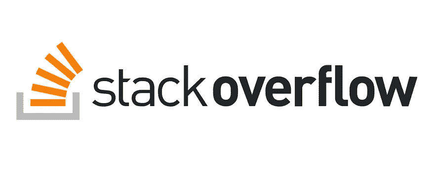
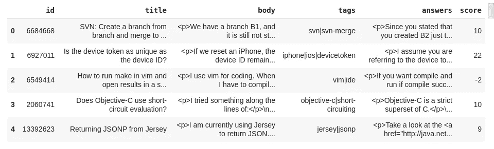
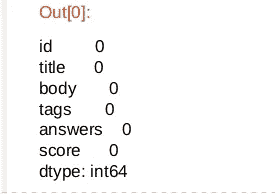
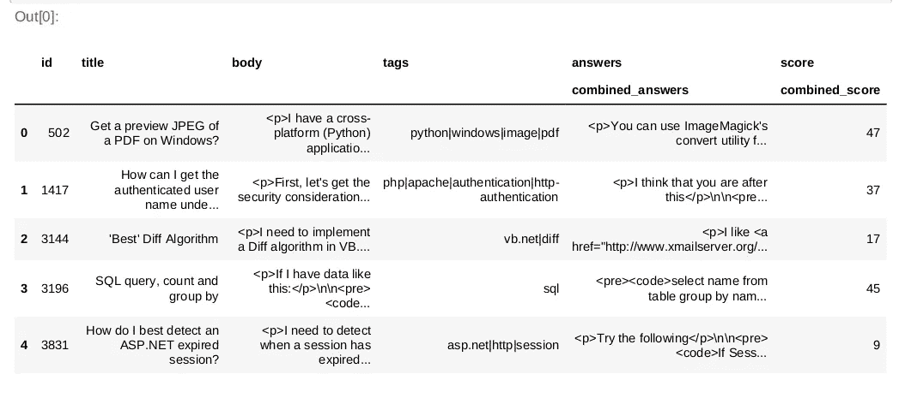
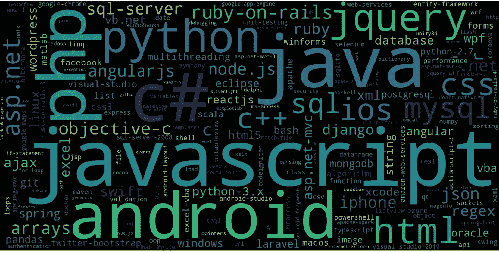
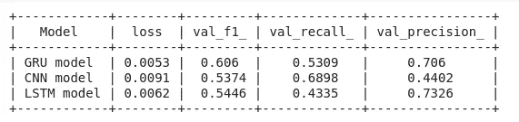
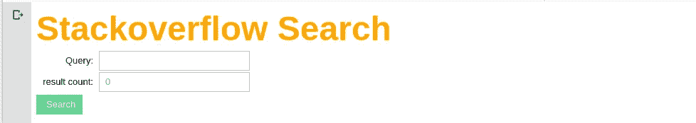
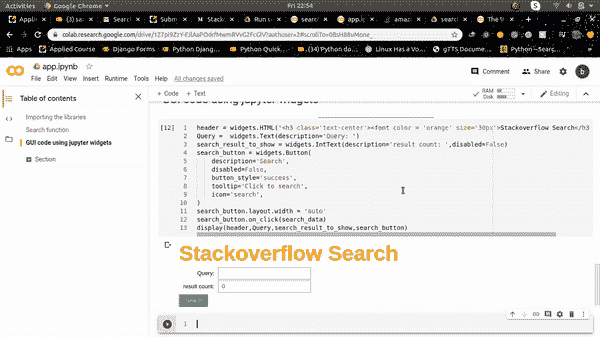

# 基于堆栈流的语义搜索引擎

> 原文：<https://medium.com/analytics-vidhya/stackoverflow-based-semantic-search-engine-139e2b2e8860?source=collection_archive---------7----------------------->



如果你曾经写过代码，那么你一定很熟悉 StackOverflow。对于那些不熟悉这个的人，StackOverflow 为程序员提供了一个最大的 QA 平台。用户提出问题/疑问，他们的程序员同事试图以最有帮助的方式提供解决方案。答案越好，得到的票数就越高，这也提高了用户的声誉。

鉴于它的受欢迎程度，可以肯定地说有大量的数据，然而，如此庞大的信息量也使得寻找解决方案变得困难。但并不是大程序员知道编程，因为他们知道如何用合适的关键词优化你的搜索查询。但是对于一个初来乍到的人来说，事情并没有那么简单。因此，一个最佳的搜索引擎是必要的导航通过这个烂摊子。

# 索引

1.  任务
2.  商业问题
3.  ML 问题
4.  方法
5.  数据
6.  库导入
7.  数据分析和处理
8.  标签预测模型
9.  创建搜索管道
10.  改进的范围
11.  参考

# 1.任务

我们的目标是让平台真正理解用户试图搜索的内容，然后基于此返回最相似的结果。我需要收集 Stack Overflow 上发布的问题和答案。因此，我需要以下内容:

*   标题
*   问题主体
*   这个问题的答案
*   为每个答案投票

# 2.商业问题

StackOverflow 拥有大量的信息，因此很难找到想要的解决方案。对于编程老手和其他有经验的专业人士来说，这并不是什么大问题，因为他们知道获得适当答案所需的正确关键字。然而，对于一个初级程序员来说，这是一个很大的问题。例如，如果他需要学习“如何使用 Python 制作服务器”，他不太可能在搜索框中使用“Django”或“Flask”这两个词。因此，需要一个最佳的搜索引擎。

# 3.ML 问题

我们必须建立一个基于语义的搜索引擎，使用 StackOverflow 数据进行搜索。

## 性能指标

我使用微 f1_score 作为我的标签预测模型的度量，因为它是多标签分类模型，微 f1_score 是一个很好的选择度量

## 限制

因为它是一个搜索引擎，延迟应该很低。

# 4.方法

*   首先，我将从[](https://www.kaggle.com/stackoverflow/stackoverflow)*获取数据，并对其进行一些预处理和特征工程。*
*   *然后我训练一个深度学习模型来预测输入查询的标签，这样我就知道输入查询属于哪个类别，我的度量将是 micro f1_score。在这里，我也使用 w2vec 模型进行矢量化，因为我使用余弦相似度以及投票数和对答案的情感极性来选择投票最多的积极响应，为了实现这一点，我想将我的查询表示到向量空间中。*
*   *最后，我将创建一个小的 UI 来获取输入，当用户输入新的查询时，我将首先处理它，然后从它预测标记，之后过滤与预测的标记相关的主 StackOverflow 数据。这样做之后，我将把我的搜索和嵌入限制在仅过滤数据的语料库，并基于相似性以及大多数投票和积极的情绪。我将结果返回给用户。*

# *5.数据*

*我将使用这个[*https://www.kaggle.com/stackoverflow/stackoverflow*](https://www.kaggle.com/stackoverflow/stackoverflow)数据集。我包含了堆栈溢出内容的档案，包括
帖子、投票、标签和徽章。该数据集被更新以反映互联网档案上的堆栈溢出内容。*

*   *我将使用 bq_helper，它是一个助手类，用来执行只读的 BigQuery 任务。参考:[*https://www . ka ggle . com/sohire/introduction-to-the-bq-helper-package*](https://www.kaggle.com/sohier/introduction-to-the-bq-helper-package)*
*   *在 Stackoverflow 数据库中有许多表，但是我们只需要关注 posts_questions 和 posts_answers。*

# *6.库导入*

## *获取数据*

**

*来自 Google BigQuery 的原始数据*

## *观察*

*基本上，这个查询连接两个表(*stack overflow . post _ questions*和*stack overflow . posts _ answers*)并收集 10000000 个问题所需的数据。因此，每行包含一个问题和一个答案。(**注** : *可能存在问题相同但答案唯一的行*)。*

# *7.数据分析和处理*

## *缺失值检查*

```
*original_data.isna().sum()*
```

**

*缺失值输出*

## *观察*

*   *很高兴看到数据集中没有丢失值。*
*   *因此不需要数据插补。*

## *检查数据中的重复项(如果有)*

```
*original_data.duplicated().any()
--------------------------------
True*
```

*如上所述，数据集可能包含具有相同问题但唯一答案的行。我们希望将所有这些不同的行合并为一行，同时汇总每个答案的投票并合并所有答案。*

**

*合并具有相同问题的行后的数据*

*现在，既然我们已经准备好了原始数据，我们就可以开始清理和预处理这些原始文本数据了。我正在做一些基本的文本处理，包括以下步骤:*

*   *文本的标记化*
*   *将标记转换为小写*
*   *从标记列表中删除标点符号*
*   *从标记列表中移除停用字词*
*   *代码字符串的标记化*

*如果您仔细观察数据集，您会发现问题和答案的原始文本是与 HTML 标记一起给出的，它最初是用 HTML 标记显示在 StackOverflow 上的。这些通常是指' *p'* 标签、 *'h1-h6'* 标签和'*代码'*标签。所以我的方法如下:*

*   *我构建了一个新的专栏，叫做“post_corpus ”,将标题、问题主体和所有答案结合起来*
*   *我把标题加在问题正文的前面*
*   *我使用“代码”部分来提取一些特征。*
*   *我通过在'[https://stackoverflow.com/questions/'](https://stackoverflow.com/questions/')后面添加问题 id 来构建每个问题的 URL*
*   *我使用开源的 **Textblob 库**为情感构建了 2 个特征*

*每篇文章都有不同数量的标签。为了缩小更精确模型的选择范围，我决定用 100 个最常见的标签。计划是只过滤包含至少一个 most _ common _ tags 的数据。*

*预处理步骤中的最后一项任务如下:*

*   *我为“processed_title”创建了一个单独的列，因为我想保留原始标题，因为我想在最终输出中提供原始标题。*
*   *我也在规范数字“分数”*
*   *我还为“代码”创建了一个单独的列，因为我想将它用于标记预测*

# *8.标签预测模型*

## *导入库*

## *仅过滤掉最常见的标签*

*尽管我们在数据预处理步骤中过滤掉了许多标签，但是仍然存在许多“杂散”标签，与其他标签成千上万次的出现相比，这些标签可能只出现一次或两次。这增加了地面真实数据的维度，这对于我们的模型是不期望的。*

*因此，我根据出现的次数提取了前 1000 个标签。最后，我修改了标签数据，只包括这 1000 个标签中的一个标签，以获得更好的模型准确性。*

**

## *使用 Word2Vec 训练单词嵌入*

*为了让我们的模型理解原始文本数据，我们需要对它进行矢量化，单词包和 TF-IDF 是非常常见的矢量化方法。然而，由于我将使用一个人工神经网络作为我的模型，BOW 和 TFIDF 的稀疏特性会带来一个问题。因此，我决定选择单词嵌入，这是一种密集的向量表示，因此非常适合我们的神经网络。*

*人们在 StackOverflow 上交谈的方式是非常技术性的，他们使用非常特定的词汇，因此使用预先训练的单词嵌入不是一个好主意，因为他们是在普通英语文本上训练的，无法理解我们词汇中单词之间的关系。因此，我决定使用 Word2Vec 从头开始训练一个单词嵌入模型。*

*因此经过成功的训练，我们得到了以下结果:*

```
*Terms most similar to "python"
[('python3', 0.6342744827270508), ('perl', 0.5586778521537781), ('bash', 0.5048258304595947), ('python36', 0.4876842796802521),
('pyhton', 0.482374906539917), ('python27', 0.4808519780635834), ('lua', 0.4791009724140167), ('ruby', 0.4676322937011719), ('py
thon2', 0.46161943674087524), ('matlab', 0.46039116382598877)]
--------------------------------------------------------------------
Terms most similar to "Node"
[('nodes', 0.6288038492202759), ('firstnode', 0.5410162210464478), ('nodetext', 0.5174486041069031), ('new_node', 0.51485019922
25647), ('node1', 0.5093669891357422), ('nodedata', 0.4883999228477478), ('newnode', 0.481780469417572), ('nodename', 0.4755
1754117012024), ('node2', 0.4689573049545288), ('node3', 0.45593389868736267)]
--------------------------------------------------------------------
Terms most similar to "java"
[('scala', 0.4836808145046234), ('groovy', 0.46810388565063477), ('c', 0.4596169888973236), ('python', 0.44173622131347656), ('jd
k7', 0.4374290406703949), ('kotlin', 0.4267594814300537), ('jdk', 0.42633625864982605), ('eclipse', 0.4209193289279938), ('netbea
n', 0.41293397545814514), ('jdk6', 0.40997016429901123)]
--------------------------------------------------------------------
Terms most similar to "server"
[('sever', 0.6860402822494507), ('client', 0.666864812374115), ('webserver', 0.5926132798194885), ('servers', 0.5850958824157715
), ('machine', 0.5267062187194824), ('service', 0.5109481811523438), ('remote', 0.5007282495498657), ('backend', 0.49881637096
40503), ('remotely', 0.4766204357147217), ('locally', 0.47090765833854675)]*
```

## *训练神经模型*

*准备用于训练模型的数据包括:*

1.  *一键编码数据*
2.  *分成训练和测试数据*
3.  *标记化和填充*
4.  *创建嵌入矩阵*

*在拆分之前，我合并了 post_corpus 和 code 列，因为我想包含问题的代码部分，还因为我还包含了可用于预测标记的信息。*

*我在这里训练三个模型，分别是 GRU、CNN 和 LSTM，基于这三个模型的 f1_micro、recall_micro 和 precission _ micro 结果，我选择了最终的模型*

## *模型 1*

## *模型 2*

## *模型 3*

## *模型比较*

**

*模型比较*

## *观察*

*   *我训练了三个神经网络模型，一个基于 GRU，一个基于 CNN，一个基于 LSTM。*
*   *GRU 模型具有最佳的召回率、精确度和 f1 值，所以我选择了这个模型。*

# *9.创建搜索管道*

*到目前为止，我们已经训练了将预测用户的输入搜索查询的标签的模型。*

*现在，在这一节中，我将向您展示我们将如何使用这个预测标签以及其他简单但有用的余弦相似性技巧来获得输入搜索查询的最相似结果。*

*要知道这两个句子有多相似，我们可以找出它们之间的距离。为了能够计算这样的距离，句子必须属于同一个向量空间。这是通过句子嵌入来完成的。*

## *观察*

*   *首先，我加载数据、训练模型、标题嵌入和 W2Vec 模型。*
*   *然后，我定义了必要的功能，如损失、评估指标、矢量化等。*
*   *之后我计算了数据中所有标题的 TFIDF。*
*   *在这之后，我定义了一个名为“searchresult”的函数，它接受两个参数，一个是输入搜索字符串，另一个是输出中返回的搜索结果的编号。*
*   *在函数内部，我正在处理输入搜索查询，之后，我正在预测标签，一旦标签被预测，我就将主数据过滤为仅具有预测标签的数据，我还在计算输入查询的 TFIDF，之后，我在计算输入搜索查询和所有过滤的数据标题的余弦相似性。*
*   *在计算余弦相似性后，我将输入搜索的总得分、情感极性和 TFIDF 乘以适当的权重相加。*
*   *最后，我将返回我希望在搜索输出中显示的所需内容的字典。*

## *搜索引擎的 GUI*

*作为一个搜索引擎应该看起来像一个搜索栏，而不是像一个暴露的代码，所以在这一节中，我会教你我如何建立，所以用户不必挖掘代码来输入查询。*

*您可以在下面找到 GUI 的代码:*

**

*搜索引擎 GUI*

*对于 GUI，我使用了 ipywidgets，这是一个非常简单的 GUI，没有任何花哨的东西，它包含标题、两个输入框和一个搜索按钮。*

*   *我从文本框中读取了两个输入字符串搜索查询和要打印的结果数。*
*   *之后，我使用名为 preprocess_text 的函数对输入查询进行预处理，我在 utils 笔记本中编写了这个函数，以使项目更加有组织。*
*   *preprocess_text 返回给我一个经过处理的文本，然后我将这个经过处理的文本和要打印的结果数作为“searchresult”方法的一个参数，我在一个名为 search.ipynb 的单独的笔记本中定义了这个方法，上面解释的操作发生了，并得到了最相似的结果*
*   *然后我把它作为搜索结果显示出来*

*你可以在下面的视频块中看到搜索引擎的演示:*

**

*搜索引擎演示视频*

# *10.改进的范围*

*由于每个模型都有改进的余地，这个项目也有，你可以自由地做改变，尝试一些不同架构的其他模型来改善搜索结果。*

# *11.参考*

*   *[https://www . applied ai course . com/course/11/applied-machine-learning-online-course](https://www.appliedaicourse.com/course/11/applied-machine-learning-online-course)*
*   *[T3【https://www.kaggle.com/stackoverflow/stackoverflow】T5](https://www.kaggle.com/stackoverflow/stackoverflow)*
*   *[*https://www . ka ggle . com/sohire/introduction-to-the-bq-helper-package*](https://www.kaggle.com/sohier/introduction-to-the-bq-helper-package)*
*   *[https://machine learning mastery . com/develop-word-embeddings-python-gensim/](https://machinelearningmastery.com/develop-word-embeddings-python-gensim/)*
*   *[https://www . ka ggle . com/pierremegret/gensim-word 2 vec-tutorial](https://www.kaggle.com/pierremegret/gensim-word2vec-tutorial)*

***你可以在 LinkedIn 上联系我**
[https://www.linkedin.com/in/vashistnarayan-singh/](https://www.linkedin.com/in/vashistnarayan-singh/)*