# StackOverflow 开发者调查

> 原文：<https://medium.com/analytics-vidhya/stackoverflow-developer-survey-10d1a5a62fef?source=collection_archive---------11----------------------->

## 分析数据

## 从 SO 调查中收集信息

*形象承蒙* [*所以*](https://insights.stackoverflow.com/survey/2019)

StackOverflow 每年都会进行一项调查，调查用户对教育、编程语言以及“GIF”发音偏好等话题的看法。

这项调查提供了一个信息宝库，可以显示职业道路和技能的趋势。这对人才获取和在线教育行业的公司尤其有用，他们可以帮助回答以下问题:

> 根据我的技能，哪个行业最适合工作？
> 
> 转行需要掌握哪些新技能？
> 
> 我是在泡沫中还是可以协商更高的薪水？

我们将分析调查结果，看能否收集到有用的信息

# 理解数据

自 2011 年[起，StackOverflow 一直在进行这些调查。我们将从来自](https://insights.stackoverflow.com/survey) [2017](https://www.kaggle.com/stackoverflow/so-survey-2017) 的数据集开始，以了解哪些数据可用于我们的分析。

zip 文件由模式 csv 和调查结果 csv 组成，模式 CSV 以宽格式陈述调查问题。

该模式显示，使用`Respondent` 作为主键来识别响应，并且在调查中有 153 个问题。这些问题可以大致分为以下几组:

*   **个人信息、学历、公司和工作经历**
*   **评估潜在工作时需要注意的事情(15 问)**

回答范围从*根本不重要*到*非常重要*

*   **招聘时需要注意的事情(10 问)**

回答范围从*根本不重要*到*非常重要*

*   **对当前工作岗位的满意度(5 问)**

回答范围从*完全不满意*到*非常满意*

*   **工作中使用的设备和编程语言**
*   **在当前组织中的影响力(12 个问题)**

从*毫无影响*到*我是最终决策者*不等的回答

*   **StackOverflow 用法(19 问)**
*   **对调查的反馈(4 个问题)**

有些调查问题允许不止一个选择。这些被表示为由`;`分隔的字符串。

约 51，000 人参加了调查。

# 受访者的概况如何？

受访者主要来自美国、印度和西欧(英国、德国)

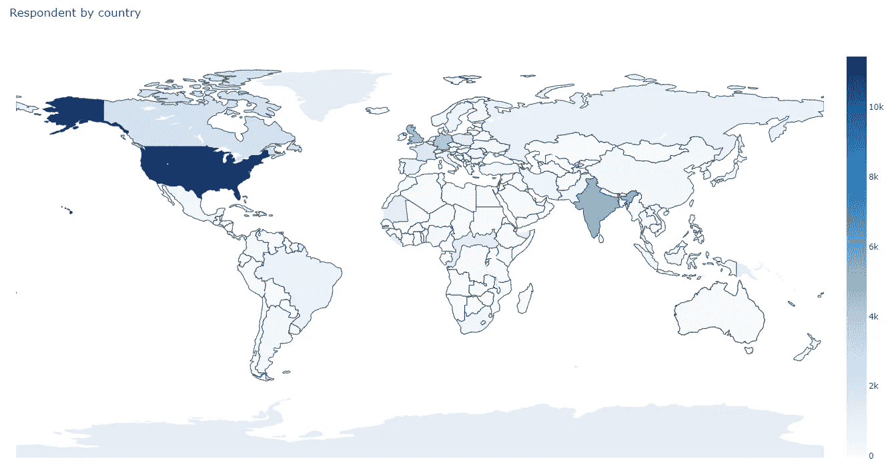

他们来自哪里？

> 在调查中，女性不到 10%

大多数受访者都是全职的专业开发人员。我们从多年的编码经验中看到了一个完整的范围，尽管大多数人只有不到 5 年的编码经验。

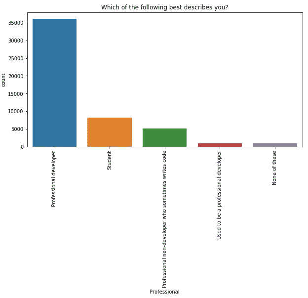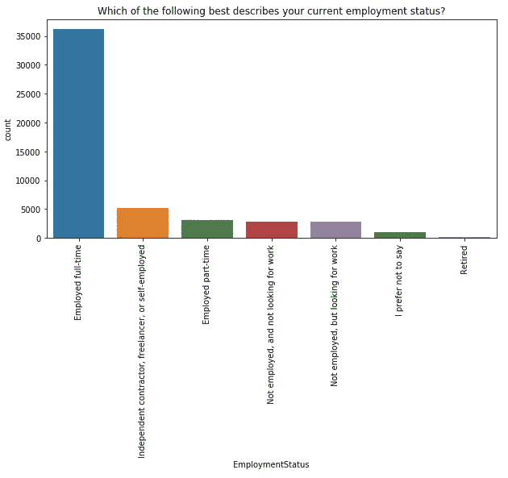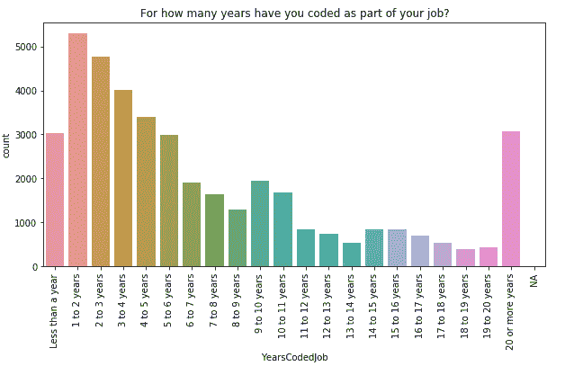

# 谁在寻找新的机会？

大多数受访者要么对新机会持开放态度，要么正在积极寻找新工作。

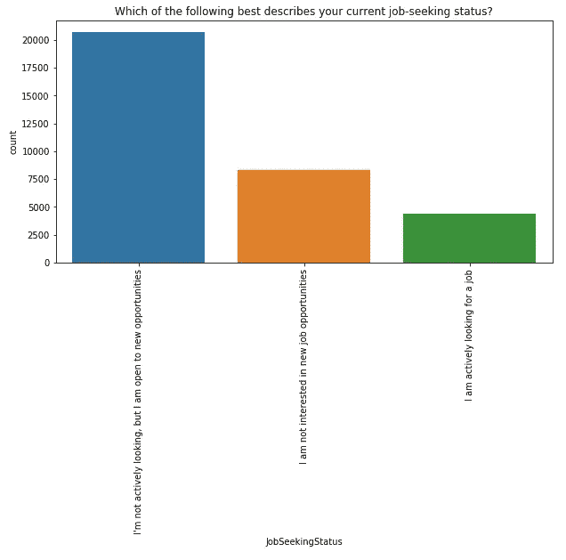

对目前的工作感到满意，但对机会持开放态度

## 他们在这方面花了多少时间？

有趣的是，积极找工作的人似乎和那些被动接受机会的人花的时间一样多。

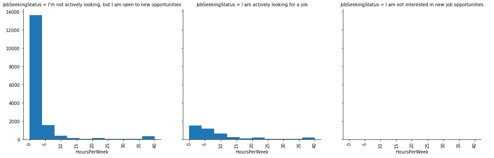

## 薪水是促使人们找新工作的一个因素吗？

总的来说，人们觉得他们在这个部门的工资太低。为了证明这一点，值得更详细地探索(也许与其他调查和统计一起)。对于那些对现状感到满意的人来说，这种偏见并不存在。

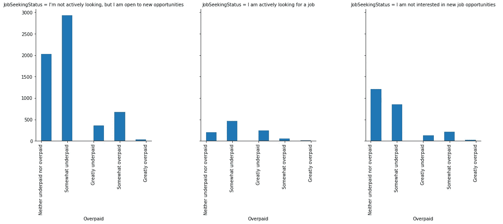

## 他们是如何宣传自己的？

超过 50%的人说他们不在网上保存任何形式的简历。即使对于那些正在积极找工作的人来说也是如此。

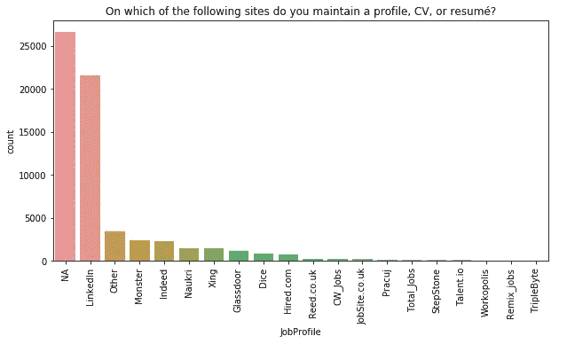

超过 50%的人不在网上保存简历

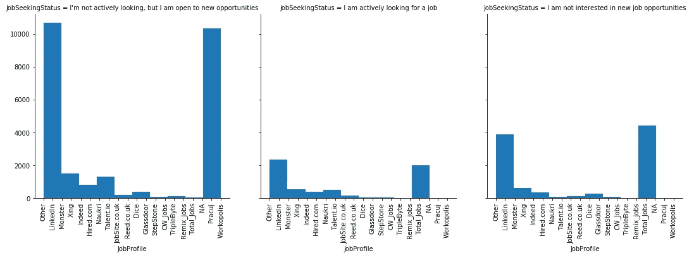

## 他们渴望做什么？

在调查中，受访者被要求选择他们更喜欢的编程语言，并允许超过一分。在这里，我们汇总结果来检测相关性。

比较他们目前使用的语言和他们希望使用的语言，我们看到 Python 有潜力成为下一个大事件。

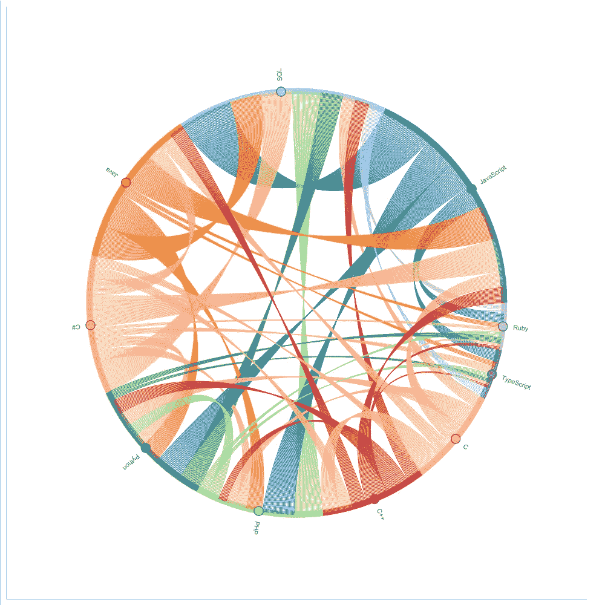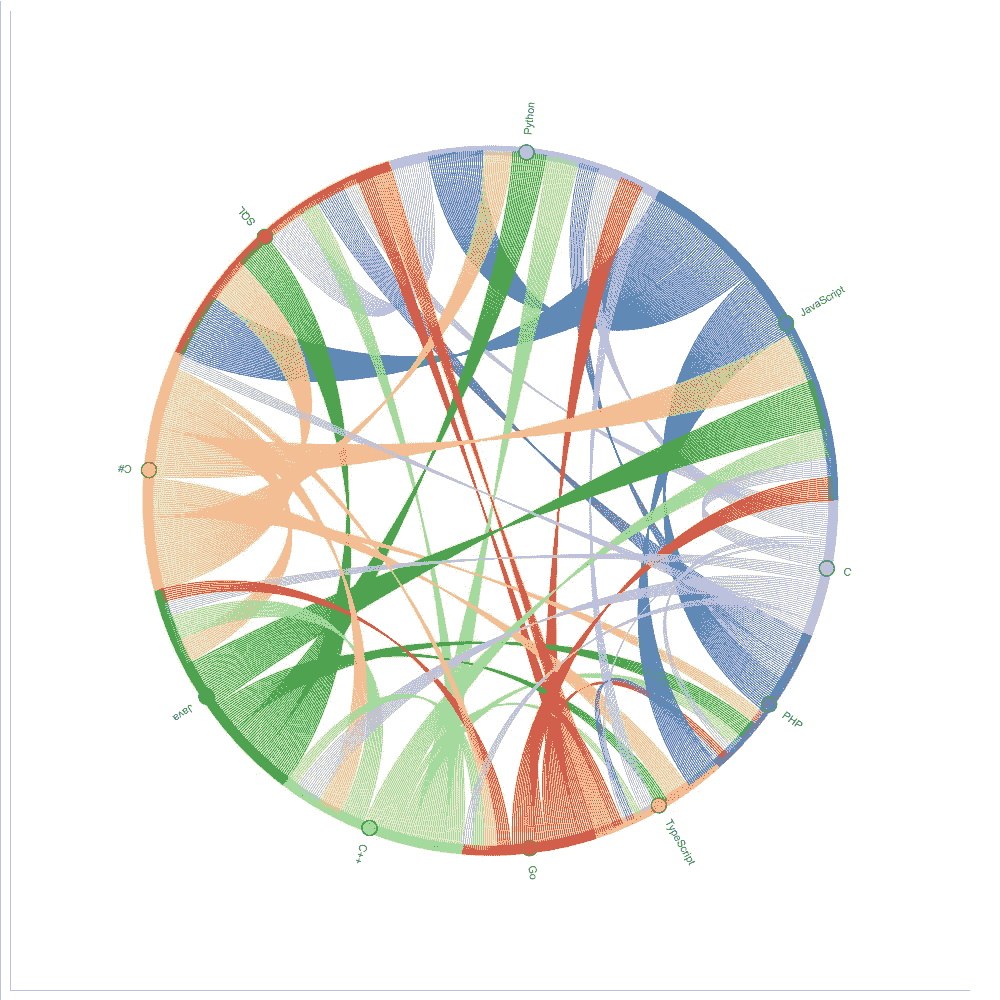

当前使用的前 10 种语言(左)，希望使用的语言(右)

# 结论

该分析是一年的快照，旨在展示使用公开可用的数据可以做些什么。我们可以总结如下:

1.  人们可能需要恢复建筑服务
2.  许多人想转而使用 Python，阻止他们的可能是缺乏技能或工作中的限制

如果我们能够分析完整的调查系列，它可能会提供一个更丰富的模式。

## 码基数

此分析的代码可以在[这里](https://github.com/PavanKB/stackoverflow_survey)找到