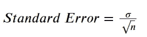
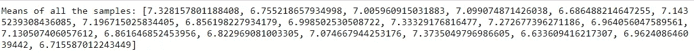
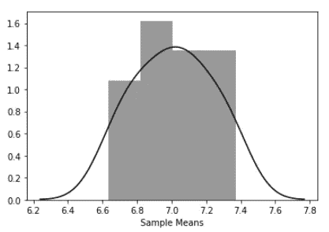
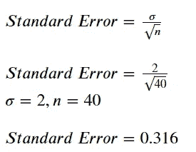

# 标准错误—从零开始的清晰直觉

> 原文：<https://medium.com/analytics-vidhya/standard-error-a-clear-intuition-from-scratch-dedc81727d82?source=collection_archive---------9----------------------->

这是最重要的概念，当谈到推理统计。有很多误解和不太直观的解释，这一统计概念，因为许多资源可在互联网上，在每一个资源，这是不同的解释。在这个故事中，让我们从零开始理解关于**标准错误**的清晰直觉

在理解这些概念之前，让我们回顾一下推理统计学的基本概念。

## 人口

我们希望从中得出见解的数据。这是我们的目标数据，这是我们要对其执行任何实验的全部数据。

## 样品

它只是人口中的一部分，我们可以对它进行任何实验。在现实世界中，我们使用样本是因为获得总体是困难的。

很好。让我们通过一个场景来清楚地了解这一点。

假设你经营一个提供电影评级的网站。最近上映了一部新电影，你想知道这部电影的整体评级。你必须从每一个看过那部电影的人那里收集收视率，这是我们的人口，而且几乎不可能从每一个看过那部电影的人那里要求收视率。但我们并没有浪费时间和资源从所有看过那部电影的人那里收集收视率，而是随机从 179 名看过那部电影的人那里收集了收视率，并将其作为那部电影的总体收视率。这是我们的样本，很容易找到，而且它概括了总体情况。

推断统计学就是用一个样本找到关于一个群体的推断。在这个每个领域的数据量都呈指数级增长的时代，收集全部数据是一项艰巨的任务，因此，样本被用来取代总体数据。

现在我们来讨论一下标准错误。

## 标准误差

标准差是推断统计的一部分，通常被误解为描述性统计的标准差。

**标准差**告诉你每个数据点距离其平均值的距离。

**标准差**为统计量的*抽样分布*的标准差。

好了，现在什么是抽样分布？

为了得到关于总体的更一般化的推论，我们随机地收集更多的样本。每个样本都有其平均值(平均值)和标准差。所有样本的均值分布称为均值的**抽样分布**，类似地，样本的标准差分布称为标准差的**抽样分布。**

作者形象

上面的公式就是抽样分布的标准差**和均值的标准差。其中分子 *(sigma)* 为总体标准差， *n* 为抽样分布中考虑的样本量。**

让我们用一个例子来理解这个标准误差的概念。

我们有 20 个随机数据样本，样本大小为 40，与标准偏差为 2 的电影评级的总体数据相关。让我们找出样本的抽样分布和标准误差。

计算所有样本的平均值，并绘制平均值的分布图。

所有 20 个样本的平均值

均值的抽样分布

这叫做均值的抽样分布。现在抽样分布的标准偏差就是我们的标准误差。

标准误差定义了样本均值偏离抽样分布均值的程度。

## 为什么标准误差是推断统计学中的一个关键因素？

我们讨论过推断统计学就是利用样本对总体进行推断。

有一个概念叫做**中心极限定理**，它有助于了解标准误差的重要性。

## 中心极限定理

它指出，不管总体的分布如何，总体均值的抽样分布总是正态分布，如果抽样分布很大，则抽样分布的均值等于总体的均值。

让我们回到电影分级的例子。我们有 20 个大小为 40 的样本，我们已经有了样本分布，现在计算样本分布的平均值。如果样本量很大，这个平均值大约等于总体的平均值。

> 抽样分布的平均值是 7.01

在标准误差的定义中，我们已经讨论过标准误差是抽样分布的标准偏差。让我们通过计算抽样分布的标准偏差来计算抽样分布的标准误差，

通过计算抽样分布的标准偏差，我们将获得样本偏离平均值的诀窍。

> 标准误差的主要本质是知道**一个样本统计值偏离总体参数**多少。这是了解样本统计的准确性的一个指标。

主要目标是选择具有最小标准误差的样本，因为它更能代表总体。如果样本是总体的精确代表，那么标准误差将为零。

可以通过增加样本量来减少标准误差。正如我们在公式中看到的，我们在分母中有样本大小 *n* ，因此随着样本大小的增加，标准误差会自动降低。

标准误差有助于选择最能代表总体的完美样本。