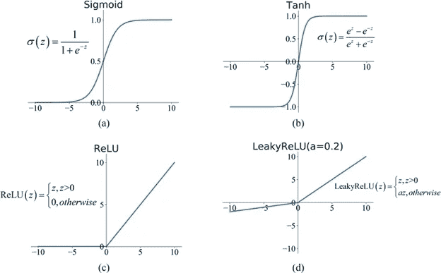

# 标准神经网络

> 原文：<https://medium.com/analytics-vidhya/standard-neural-network-78174d7608f2?source=collection_archive---------32----------------------->

希望你喜欢我的上一篇博客，现在清楚了神经网络基础的概念。如果比不上你可以 [**这里读一下**](/analytics-vidhya/basic-of-neural-network-956b8f190f3a) 。在本文中，我们将介绍标准的神经网络，并试图借助一个例子来理解它。我们还将讨论一种有趣的迁移学习方法。但让我们从神经网络的重要组成部分之一——激活功能开始。

# **激活功能**

激活函数是决定神经网络输出的数学方程。现实生活中的问题有复杂的关系，所以为了理解这些复杂的关系，我们使用激活函数。有 3 种类型的激活功能

1.二元阶跃函数

2.线性激活函数

3.非线性激活函数

如您所见，现实生活中存在复杂的关系，因此它们与参数之间存在非线性关系，因此让我们来看几个常用的非线性激活函数

**Softmax 函数:**该函数生成一个范围在 0 和 1 之间的输出，概率之和等于 1。Softmax 函数表示如下:

在行业中，你会看到人们普遍使用这些激活功能。

# **神经网络方法论**

让我们一步一步地看看，神经网络是如何工作的，并试着理解它的结构。

**步骤 1 初始化参数/定义超参数:**这些参数的初始值并不重要，因为神经网络可以从任何地方开始。因此，模型的随机初始化是一种常见的做法。所以随机地给你的参数赋值(比如权重 wi 和偏差 b)。

**第 2 步正向传播:**在下一步中，将输入传递到您的神经网络中，并预测输出。这被称为正向传播，因为我们正向移动，即输入- >隐藏层- >输出

**步骤 3 计算成本/损失函数:**现在我们有两个输出，实际输出和预测输出。成本函数不过是这两个值的差。对于成本函数，人们一般采用绝对误差或绝对误差的平方和。

**第 4 步反向传播:**在这一步，我们将计算神经网络的梯度，顾名思义，我们将向后移动，即输出- >隐藏层- >输入。为了计算梯度，我们将使用偏导数，如果你数学不好也不用担心，因为我们有预定义的函数来计算所有这些，你的系统会处理的。

**步骤 5 更新参数:**在这一步中，我们将使用从反向传播步骤获得的梯度来更新我们的参数。有一个更新参数的通用规则，称为增量规则。以下是更新其中一个参数(即重量)的示例。

新权重=旧权重-导数*学习率

现在重复步骤 2 到步骤 5。我们将重复这些步骤，直到我们的成本函数变得小于预定义的值，或者我们达到了我们先前定义的最大迭代次数。

**第六步** **预测**:现在我们的神经网络已经准备好行动了。使用神经网络来预测所需的输出。

现在让我们看看流程图，以便更清楚地理解它。

标准神经网络流程图

# **例子**

我们用图像分类的一个热门问题来理解一下。我们想建立一个神经网络，可以对图像进行分类，不管它是不是猫。我们从建立一个 L 层的神经网络开始。假设我们有 10 万张图片来训练我们的神经网络。

首先，我们将所有图像分解成向量，这样我们就可以将图像传递给输入参数。例如，我们有一个尺寸为 64*64*3 的图像。所以我们将它展平成一个长度为 12288(=64*64*3)的一维向量。然后将这个向量作为输入传递给我们的神经网络。

**第一步:**我们将随机**初始化参数。**

**步骤 2 正向传播:**然后我们将使用公式 z = ∑ (wi * xi ) + b 计算 z0 到 z(n-1)，然后将其传递给 ReLU 激活函数以计算 a0 到 a(n-1)，然后该隐藏层的输出被传递作为下一个隐藏层的输入。我们必须重复 L-1 次。然后在第 l 个隐藏层中，我们将再次计算该层的 z0，然后应用 sigmoid 激活函数来获得输出。(看上图可以更清楚的理解)。如果 sigmoid 函数的输出大于 0.5，那么神经网络的输出(即预测)将是 1(猫)，如果不是，那么它将是 0(不是猫)。

**步骤 3 计算成本/损失函数:**在对所有训练集进行预测之后。我们将计算成本函数。

**步骤 4 反向传播:**然后我们将计算梯度

**步骤 5 更新参数:**我们现在将使用 delta 规则更新所有参数。

现在让我们迭代步骤 2 到步骤 5(假设 2500 次)来训练我们的神经网络。

恭喜，现在我们的神经网络已经训练好了，可以更准确地预测图像中是否有猫。

现在，如果你理解了这个概念，那么用 python 或任何其他平台为神经网络创建一个代码是一件容易的事情。我建议在创建任何神经网络时使用“TensorFlow ”,因为其中已经定义了很多函数。人们还在他们的模型中使用他人建立的神经网络进行更好的预测。让我们看看它是如何工作的。

# **迁移学习**

这是人们在数据科学领域使用的一个非常著名的概念。众所周知，建立一个神经网络不仅需要大量的训练数据集，而且需要耗费大量的时间和计算成本。如果你缺少这些中的任何一个，那么你的神经网络的性能将会很低。为了解决这个问题，迁移学习应运而生。在图像识别中，通过使用迁移学习，神经网络工作得相当好。它不仅减少了计算成本和时间，而且精度也很好。在这方面，我们从一个类似的训练有素的神经网络中学习，并将其应用于您的神经网络。

我们用一个例子来理解一下。让我们以上面的猫的图像分类为例，假设你只有一个 1000 张图像的数据集来训练。如果你只使用这些图像来训练你的神经网络，那么模型的准确性将会很低。所以你要做的是搜索其他训练有素的图像分类神经网络，并在你的神经网络中使用它们。

比方说，你有一个训练有素的 10 个隐藏层的神经网络，它可以分类图像是否有狗。所以你要用这个神经网络，固定输入层和前八个隐藏层的参数和超参数。然后用你的 1000 张图片来训练 2 个隐藏层和输出层。这里你将只改变这 3 层的参数。训练好你的神经网络后，你就可以对一幅图像是否有猫进行分类。这就是迁移学习，将一个模型的学习运用到另一个模型中。这是训练你的神经网络的一种非常有效的方法