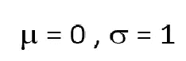
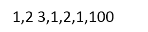
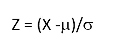
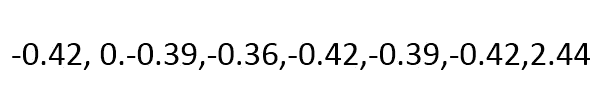
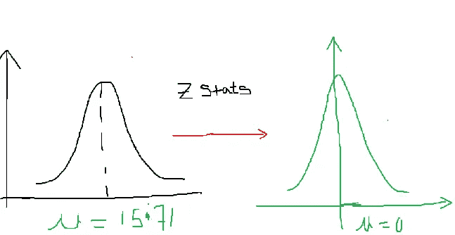
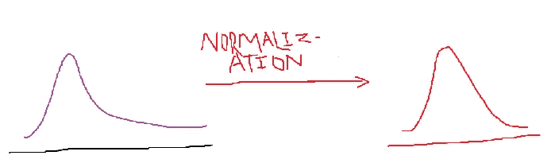
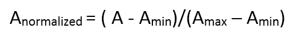

# 标准化和规范化解释

> 原文：<https://medium.com/analytics-vidhya/standardization-and-normalization-explained-1ea0bbbf8d65?source=collection_archive---------16----------------------->


来源:- [感染控制今日](https://www.google.com/search?q=standardization&sxsrf=ALeKk02saaHapJXwg80TKZUMAd-zFF_rPQ:1601142827483&source=lnms&tbm=isch&sa=X&ved=2ahUKEwjR0d3rsYfsAhWb8XMBHegdC_UQ_AUoAnoECBkQBA&biw=1366&bih=625)

# 标准化

> 什么是标准化为什么它很重要？

假设你在印度以 50，000 英镑的价格购买了一台笔记本电脑，过了一段时间，你的兄弟从加拿大以 950 加元(1C。D=50/-)给你。您想要比较这两笔交易，因为您必须将笔记本电脑的价格转换为单一货币(卢比或加元)。现在；

您购买的笔记本电脑价格=50，000/-

你哥哥给你带来的笔记本电脑的价格=50 X 950=47，500/-

现在，通过将笔记本电脑的价格转换成单一货币，你就可以判断出是谁花了多少钱。在统计学中，这个过程被称为标准化。我们需要它，这样我们就可以把不同的数据单位转换成一个单一的单位，以便从中得出推论。

> 我们如何定义标准化？

它也被称为标准正态分布。标准化的必要条件是:



如果均值为零，标准差为一，则称任何分布为标准正态分布。这可以在 z 统计的帮助下完成。

假设我们有一个数据集；



对于上给定数据集，我们将得到均值=15.71 和标准差=34.41。在 z 统计的帮助下，我们将在零和标准差处移动均值。1 处的偏差。



对上述数据集(每个数据点)应用 z 统计公式，我们将获得:



因此，我们将获得均值和标准差分别为 0 和 1。

> 绘画作品



# 正常化

> 为什么应该在数据集中进行规范化？

作为机器学习工程师，我们应该拥有正态分布的数据集，以便更好、更高效地建模。标准化的主要任务是将歪斜的曲线转换成钟形曲线。它用于两个或更多特征的缩放。让我们举一个例子来更精确地理解。

假设你的大学一直根据考试成绩发奖。让一些学生在 CGPA 中取得了分数，一些学生在数字中取得了分数。因此，在这种情况下，大学管理部门将不得不面对挑战，但有一个人站出来，告诉管理部门将评分方案按比例降低，然后分配奖金。统计中的这种缩放过程被称为标准化。

在归一化中，不同特征的值在[0，1]的范围内缩小。

> 绘画作品



归一化是通过缩放过程将非钟形曲线转换成钟形曲线的过程。

> 制定



*Amax 和 Amin 是特征值的最大值和最小值*

> python 中的标准化和规范化

标准化代码:

```
from sklearn.preprocessing import StandardScaler
scaler=StandardScaler()
scaler.fit(df["age'])  #applying the scaling operation
df["Standardize-data"]=scaler.transform(df["age']) #transformation of given column 
```

标准化代码:

```
# data normalization with sklearnfrom
 sklearn.preprocessing import MinMaxScaler # fit scaler on training datanorm = MinMaxScaler().fit(X_train) # transform training dataX_train_norm = norm.transform(X_train) # transform testing dataabsX_test_norm = norm.transform(X_test)
```