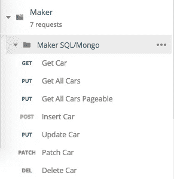
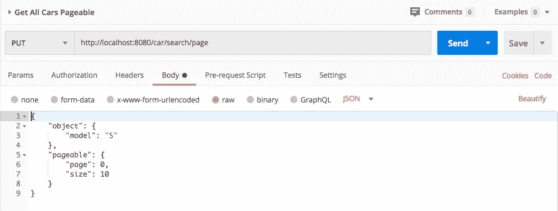

# 使用 Maker 项目标准化 Spring Boot 应用程序

> 原文：<https://medium.com/analytics-vidhya/standardizing-spring-boot-applications-with-maker-project-449d906917fd?source=collection_archive---------27----------------------->

每天都在构建许多标准框架，但是，如果您停下来思考一下，您的应用程序在大多数情况下都不是标准化的。我现在摸你了吗？:)


模式模式模式。

看看这个形状，现在想想设计师是怎么做的。你知道吗？嗯，当我是设计师的时候，我做一个标准的形状，把笔记本在 Ctrl + C 和 Ctrl + V 上踢很多次就做成了！

想到这，我做了[创客项目](https://github.com/gustavovitor/maker)。有了这个项目，你可以使用 Spring Boot 加速 Restful API 的开发。

## Maker 上的标准形状在哪里？

我认为你在职业生涯中已经制作了很多 API，而且(如果这些 API 是使用 MVC 模式构建的)这些 API 有很多 CRUDs，**服务**与**仓库**和**实体**一起工作，所有东西都通过 **RestController** 暴露在 web 上。您每次都构建这些 API，并且每次您编写存储库、服务和控制器时，您的控制器内的相同代码在所有 API 中调用您的服务方法。**真的吗？！**

请改变页面，为你的 API 考虑标准模式！

例如，您的 API 需要为 web 公开一个关于您客户的 CRUD 资源，冷却这方面的一切正常工作，您编写您的实体、您的存储库和您的控制器，在您的服务中实现业务规则，在您的实体上制定您的 JPA 规则，非常好，工作完成了，但是您损失了**45–60 分钟**来做这些，**时间就是金钱兄弟！**

使用 [Maker Project](https://github.com/gustavovitor/maker) 您可以创建您的模式，并在**10–20 分钟**内转换这 45–60 分钟，使用 plus！

让我给你举个例子吧！

通常用 Spring Data JPA 创建你的实体，好吗？

```
@Data
@Entity
class Car {
    @Id
    @GeneratedValue(strategy = GenerationType.IDENTITY)
    private Long id;

    private String model; 
}
```

太棒了，现在，创建您的存储库，但是现在，扩展 RepositoryMaker 而不是 JpaRepository。

```
public interface CarRepository extends RepositoryMaker<Car, Long> {}
```

**为什么？RepositoryMaker** 为我们实现了 Spring Boot 规范执行器，有了它，你可以在 iterables Spring Boot 默认的存储库中进行查询，例如， *findAll()* 方法。

很好，现在，制造者需要这个类的一个规范，才能很好地工作。

```
public class CarSpecification extends SpecificationBase<Car> {

    public CarSpecification(Car car) throws ReflectionException {
        super(car);
    }

    @Override
    public Predicate toPredicate(Root<Car> root, CriteriaQuery<?> criteriaQuery, CriteriaBuilder criteriaBuilder) {
        List<Predicate> predicates = new ArrayList<>();

        if (nonNull(getObject().getModel())) {
            predicates.add(criteriaBuilder.like(root.get("model"), "%" + getObject().getModel() + "%"));
        }

        return criteriaBuilder.and(predicates.toArray(new Predicate[predicates.size()]));
    }
}
```

看看方法 *toPredicate()，*这个方法是在 Spring Data 在你的数据库上运行 *findAll()* 之前调用的，再看看， **root，criteriaQuery 和 criteriaBuilder！你可以用这个兄弟去月球！**

在这里，使用 Maker，您可以创建和构建您的查询，而不需要使用 JPQL。

非常酷。现在，为您的实体创建一个服务。

```
@Service
public class CarService extends ServiceMaker<CarRepository, Car, Long, Car, CarSpecification> {}
```

**停！**好了，现在是蛋糕上的樱桃了。**服务商**为我们制作了一个你的 CRUD 的标准化方法，(就像 [Redhat Panache](https://developers.redhat.com/courses/quarkus/panache/) 做的那样)，在**服务商**上使用我们有这样的方法:

1.  findAllPageable() —调用存储库并返回实体的 Spring Boot 标准页面。
2.  *findAll() —调用存储库并返回您的实体列表。*
3.  *findById() —通过 Id 查找您的实体。*
4.  *beforeInsert() —用于业务规则，在此实现您的 RuntimeException，并为 API 异常处理程序创建另一个模式。*
5.  *insert() —调用存储库插入方法。*
6.  *beforeUpdate() —用于业务规则，与 beforeInsert()的行为相同。*
7.  *update() —复制对象的所有属性并保存，并在存储库上使用 save 方法。*
8.  *beforePatch() —用于业务规则，与 beforeInsert()的行为相同。*
9.  *patch() —将复制对象的非空属性发送到储存库并使用储存方法。*
10.  *beforeDelete() —用于业务规则，与 beforeInsert()的行为相同。*
11.  *delete() —使用存储库的删除方法删除实体。*

每一个方法都有一个标准的实现。之前的*方法专门用于业务规则实现。*

你现在能看见了吗？现在，时间从 30 分钟减少到 8-10 分钟，开发人员可以将时间集中在业务逻辑上，而不是冗长的代码上。

所以，我们现在需要一个控制器，好吗？

```
@RestController
@RequestMapping("/car")
public class CarResource extends ResourceMaker<CarService, Car, Long, Car> {}
```

像服务一样简单。使用服务模式，为什么控制器不能是 soo 模式？

**ResourceMaker** 用 **ServiceMaker 创造的模式为我们所有人打电话，**厉害吧？

制作者为我们制作了这样的 API 调用:



ResourceMaker 生成的 Maker 调用。

使用 CRUD 需要的所有方法。为什么**【获取所有汽车】****【获取所有汽车可分页】**使用 PUT HTTP 动词？

这些方法接收两个对象来工作，SpecificationObject，在做搜索之前实现的和(在可分页方法上)可分页的对象，这样:



ResourceMaker 搜索可分页请求。

Soo，为了简化实现和简化“框架”的可用性，我们需要用这些信息来安森体。

春季安全预授权规则呢？

如果您使用 Spring Security 和它的简单预授权，Maker 拥有 **SecurityResourceMaker** 这个 Maker 您可以覆盖关于预授权角色权限的方法。今天，制造者与角色一起工作。

## 我可以用吗？

是啊！每个人都可以使用该项目，我正在四个项目的生产环境中使用它，我希望在未来的更多项目中使用它，Maker 在 API 上制作了我需要的一切，并制作了一个标准化的 API，我可以在前端创建另一个模式来使用它，并减少更多的开发时间。

创客项目链接:【https://github.com/gustavovitor/maker 

一个活生生的例子:【https://github.com/gustavovitor/maker-example】T4

MongoDB 示例(Maker Mongo 使用 QueryDsl 代替规范):[https://github . com/Gustavo vitor/Maker-example/tree/Maker-Mongo](https://github.com/gustavovitor/maker-example/tree/maker-mongo)

再见！