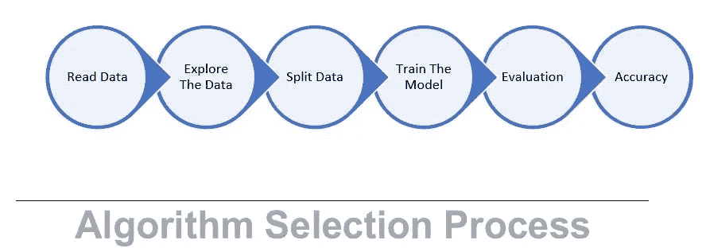
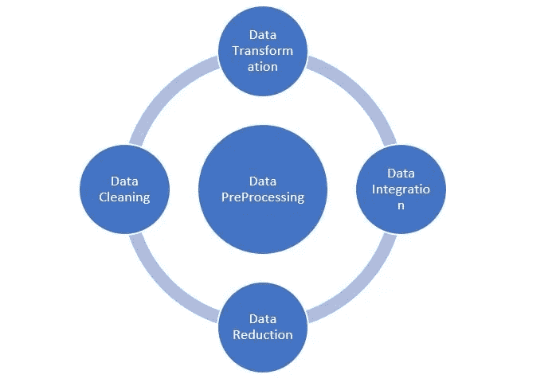
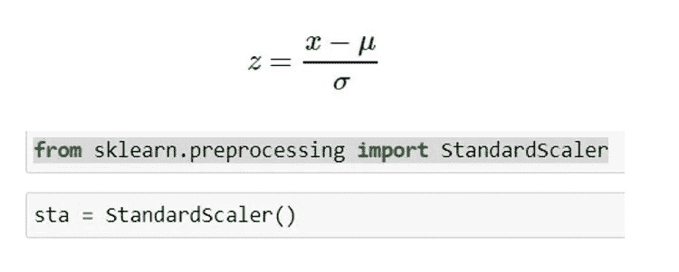
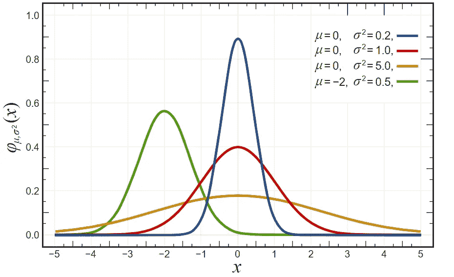
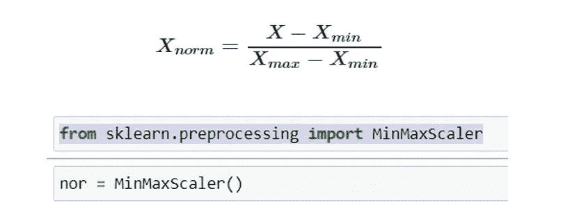

# 用代码和图形进行标准缩放和标准化

> 原文：<https://medium.com/analytics-vidhya/standardscaler-and-normalization-with-code-and-graph-ba220025c054?source=collection_archive---------7----------------------->

**算法选择过程:**下面是算法选择过程，我们首先读取数据，然后通过各种技术探索数据，一旦数据准备好，我们就将数据分成两部分，训练数据和测试数据。我们使用训练数据训练模型，并根据测试数据评估模型。最后我们验证每个模型的准确性，并选择最准确的模型用于生产

**数据预处理:**以下是在将数据输入模型之前对数据进行预处理的技术。在数据转换中，我们有特征缩放。在特征缩放中，我们将重点关注 StandardScaler 和 MinMaxScaler 或归一化。

**特征缩放—为什么要缩放、标准化或规范化？**

当特征处于相对相似的规模和/或接近正态分布时，许多机器学习算法执行得更好或收敛得更快。这种算法族的例子包括:

线性和逻辑回归

最近的邻居

神经网络

具有径向偏向核函数的支持向量机

主成分分析

线性判别分析

应用特征缩放的目标是确保特征处于几乎相同的比例上，以便每个特征同等重要，并使其更容易被大多数 ML 算法处理。

**标准化:** [标准缩放器](https://scikit-learn.org/stable/modules/generated/sklearn.preprocessing.StandardScaler.html)通过减去平均值然后缩放至单位方差来标准化特征。单位方差是指所有值除以标准偏差。在数据遵循高斯分布(或正态分布)的情况下，标准化会很有帮助。然而，这并不一定是真的。此外，与标准化不同，标准化没有边界范围。因此，即使您的数据中有异常值，它们也不会受到标准化的影响。

其中，μ是平均值，σ是平均值的标准差；样本的标准分数(也称为 z 分数)计算如下:

StandardScaler 产生标准差等于 1 的分布。方差也等于 1，因为方差=标准差的平方。而 1 的平方= 1。

StandardScaler 使分布的平均值为 0。大约 68%的值将位于-1 和 1 之间。

深度学习算法通常要求零均值和单位方差。回归型算法也受益于小样本的正态分布数据。

StandardScaler 会扭曲特征值之间的相对距离

钟形曲线或高斯分布或正态分布

**归一化:**当您知道数据的分布不符合高斯分布时，可以使用归一化。这在不假设任何数据分布的算法中很有用，例如 K-最近邻和神经网络。MinMaxScaler 返回的特征的默认范围是 0 到 1。注意，MinMaxScaler 不会降低异常值的重要性。

MinMaxScaler 保留原始分布的形状。它不会有意义地改变嵌入在原始数据中的信息。每个要素值之间的相对间距保持不变。MinMaxScaler 是一个很好的起点，除非您知道您希望您的要素具有正态分布或希望异常值具有较小的影响。

【https://youtu.be/AxtB2qvGup4】YouTube 链接用 Python 语言实现以上——

****代码:**代码为 Github→[https://Github . com/amitupadhyay 6/My-Python/blob/master/Standard % 20 scaler % 20 vs % 20 normalization . ipynb](https://github.com/amitupadhyay6/My-Python/blob/master/Standard%20Scaler%20vs%20Normalization.ipynb)**