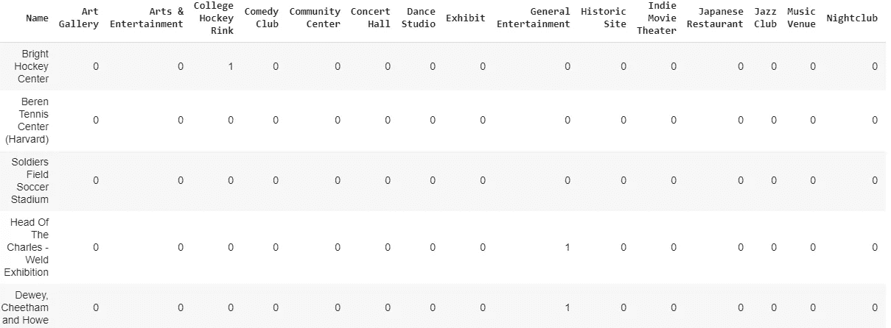

# 斯坦福大学 vs 哈佛大学

> 原文：<https://medium.com/analytics-vidhya/stanford-university-vs-harvard-b37c95760a9f?source=collection_archive---------10----------------------->

# **简介:**

假设一个人申请就读斯坦福大学和哈佛大学。然后他/她被两个人都接受了。由于他们是最好的大学之一，他/她感到困惑。另一方面，大学周围的艺术和娱乐场所对他/她来说至关重要。

# **数据:**

为了解决这个问题，我用谷歌搜索大学的地址，并通过地理图书馆检索它们的地理坐标。之后，我使用 Foursquare API 收集两所大学周围的艺术和娱乐场所的数据。

# **方法论:**

我从这个[链接](https://developer.foursquare.com/docs/resources/categories)中找到场地类别，并从 Foursquare 中检索数据。很有用。所以，我把这些数据转换成熊猫数据帧。

**哈佛大学数据框架**

**斯坦福大学数据框架**

# **分析:**

通过使用叶地图库，我精确定位了两所大学的比赛场地。

**哈佛大学场馆叶图**

**斯坦福场馆叶图**

此外，我通过条形图将类别分组来演示它们。

为了进一步分析，我对数据帧应用了一键编码和 k 均值聚类。

**哈佛大学的一键编码**

**斯坦福大学的一键编码**

接下来，我为集群创建一个叶子地图。

**哈佛大学星团叶图**

**斯坦福大学星团叶图**

在比较两所大学的场地时，我合并了数据帧的分类栏。随后，我注意到他们之间的相似和不同之处，以及分组酒吧试点。

# **结果:**

综上所述，斯坦福大学的场馆比哈佛大学多，种类也多。

# **结论:**

由于艺术和娱乐场所对他/她来说非常重要，而斯坦福大学有更多的艺术和娱乐场所，他/她会更喜欢斯坦福大学。

# **限制:**

*   比较只是基于艺术和娱乐场所。
*   我只是用 Foursquare API 收集数据。

你可以在这里找到完整代码。