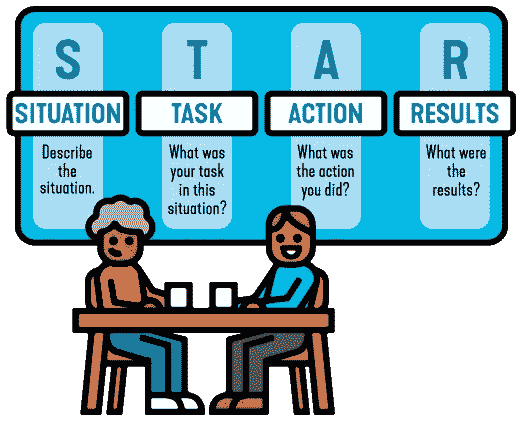

# 明星面试技巧

> 原文：<https://medium.com/analytics-vidhya/star-interview-technique-cc8d609f651e?source=collection_archive---------17----------------------->

在求职阶段，一个矛盾的时刻(*幸福又紧张*)是与招聘经理预约面试，这也是你一直热切期待的职位！！你是否能顺利完成整个过程是另一个时代的另一个故事。面试是艺术的一部分，也是科学的一部分。艺术部分要求展现个性、热情和兴趣。科学部分？需要研究过程和参与者，然后制定战略。因此，如何向招聘经理展示自己最好的一面非常重要。

当你听到面试官说，通常以这样的短语开头:

“描述一个……”
“告诉我一次……”
“分享一个……情况的例子。”
“当……”时你会做什么
“你曾经……”
“给我举个例子……”

这种基于情境的问题通常会让你绞尽脑汁去寻找某样东西，最终会说出任何东西。但是这里有一个好消息:有一种策略可以用来为这些可怕的问题找到更有趣的答案:明星面试法。

# 明星面试方法是什么？

*   **情景** —设置场景并提供一些背景——什么？在哪里？什么时候？
*   **任务**——解释你面临的挑战或你努力的目标。
*   **行动** —你采取了哪些步骤来实现目标？
*   **结果** —你行动的积极结果是什么？

无论你选择什么样的例子，都要确保它们尽可能与你面试的工作密切相关。

这里有一个更加清晰的例子。

> 面试官说:你能告诉我们你衡量一个失败的 KPI 的时候吗？你做了什么，你是如何与企业沟通的？

*   **情况—** KPI 故障:数据库常驻内存—所有数据库进程使用的物理内存。
*   **任务—** 数据库中运行的线程在分析当前系统负载时会很有帮助。
    分析连接到数据库的会话有助于识别哪些应用程序或哪些用户当前连接到您的系统，以及他们在 SQL 执行方面正在做什么。
    分析数据库中当前运行的最关键语句可以帮助您确定性能低下、CPU 瓶颈或内存不足情况的根本原因。
    分析数据库中当前缓存的所有语句可以帮助您识别语句哈希。
*   **动作** —通过限制每台主机执行单个语句所使用的内存量，可以防止数据库被不受控制的查询过度使用内存，*。
    为了避免不必要的取消语句，您可以应用“*语句内存限制阈值*”。如果已经设置了该参数的值，则仅当当前数据库使用的内存超过语句内存限制阈值时，才考虑语句内存限制。*
*   **结果** —对组织的业务目标和策略的影响，以及与这些目标相关的优先级、风险和问题。
    报告中改进的可视化演示。

你也可以看看常见的行为面试问题，并尝试使用 STAR 技术回答每个问题。

明星面试过程一开始可能会有点让人不知所措，这就是为什么给自己充足的时间准备是如此重要。然而，通过练习，以这种方式回答基于能力的问题将成为你的第二天性，当面试的压力来临时，你会感觉舒服得多。