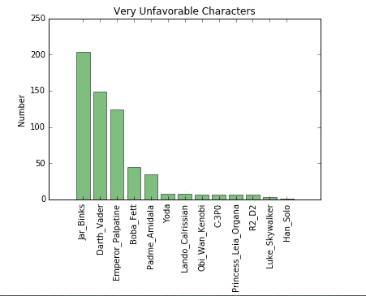

# 星球大战调查——为初学者清理、探索数据集

> 原文：<https://medium.com/analytics-vidhya/star-wars-survey-cleaning-exploring-data-set-for-beginners-cf2be950feaa?source=collection_archive---------9----------------------->

[张家瑜](https://unsplash.com/@danielkcheung?utm_source=medium&utm_medium=referral)在 [Unsplash](https://unsplash.com?utm_source=medium&utm_medium=referral) 上的照片

538 的一个团队在 Survey Monkey 上调查了《星球大战》粉丝，收集了 800 多份回复。数据集可以在这里找到。[https://github . com/fivethirtyeight/data/tree/master/star-wars-survey](https://github.com/fivethirtyeight/data/tree/master/star-wars-survey)

让我们看看在这里我们能找到什么见解。

数据集有一些字符不在 Python 的默认编码“UTF-8”中，因此我们需要使用编码“ISO-8859–1”。点击此处了解更多关于编码差异的信息。

 [## UTF-8 和 ISO-8859-1 有什么区别？

### 感谢贡献一个堆栈溢出的答案！请务必回答问题。提供详细信息并分享…

stackoverflow.com](https://stackoverflow.com/questions/7048745/what-is-the-difference-between-utf-8-and-iso-8859-1) 

数据有几个与回答者相关的列，如 RespondentID(生成的唯一 ID)、性别、年龄、家庭收入、教育、位置。

它有这样的问题—`Have you seen any of the 6 films in the Star Wars franchise?``Do you consider yourself to be a fan of the Star Wars film franchise?`—`Yes/No can be answer`

这两列目前都是字符串类型，因为它们包含的主要值是`Yes`和`No`。我们可以通过将每一列转换为只有值`True`、`False`和`NaN`的布尔值来使数据更容易分析。我们可以在熊猫身上使用矢量化方法‘地图’。[https://pandas . pydata . org/pandas-docs/stable/reference/API/pandas。Series.map.html](https://pandas.pydata.org/pandas-docs/stable/reference/api/pandas.Series.map.html)

接下来的六列代表一个复选框问题。回答者在回答问题时勾选了一系列方框`Which of the following Star Wars films have you seen? Please select all that apply.`

该问题的列有:

*   `Which of the following Star Wars films have you seen? Please select all that apply.` -被调查人是否看到`Star Wars: Episode I The Phantom Menace`。
*   `Unnamed: 4` -被调查人是否看到`Star Wars: Episode II Attack of the Clones`。
*   `Unnamed: 5`——被告是否看到`Star Wars: Episode III Revenge of the Sixth`。
*   `Unnamed: 6`——被调查人是否看到`Star Wars: Episode IV A New Hope`。
*   `Unnamed: 7` -被调查人是否看到`Star Wars: Episode V The Empire Strikes Back`。
*   `Unnamed: 8` -被调查人是否看到`Star Wars: Episode VI Return of the Jedi`。

对于这些列中的每一列，如果单元格中的值是电影的名称，这意味着回答者看过这部电影。如果值是`NaN`，回答者要么没回答，要么没看电影。我们假设他们没有看这部电影。

我们需要将这些列中的每一列都转换为布尔值，然后将该列重命名为更直观的名称。除了需要在映射字典中包含电影标题和`NaN`之外，我们可以用与前面相同的方式转换这些值。

我们还需要将这些列重命名为更直观的名称

接下来的六栏要求回答者按照最不喜欢到最喜欢的顺序排列*星球大战*电影。`1`表示这部电影最受欢迎，`6`表示最不受欢迎。以下各列可以包含值`1`、`2`、`3`、`4`、`5`、`6`或`NaN`:

*   `Please rank the Star Wars films in order of preference with 1 being your favorite film in the franchise and 6 being your least favorite film.` -受访者有多喜欢`Star Wars: Episode I The Phantom Menace`
*   `Unnamed: 10` -受访者有多喜欢`Star Wars: Episode II Attack of the Clones`
*   `Unnamed: 11` -受访者有多喜欢`Star Wars: Episode III Revenge of the Sixth`
*   `Unnamed: 12` -受访者有多喜欢`Star Wars: Episode IV A New Hope`
*   `Unnamed: 13` -受访者有多喜欢`Star Wars: Episode V The Empire Strikes Back`
*   `Unnamed: 14` -受访者有多喜欢`Star Wars: Episode VI Return of the Jedi`

但是，我们需要将每一列转换为数字类型，然后重命名这些列，以便我们可以更容易地分辨它们代表什么。

我们可以用[熊猫做数字转换。data frame . astype()](http://pandas.pydata.org/pandas-docs/stable/generated/pandas.DataFrame.astype.html)data frames 上的方法。在这种情况下，我们可以使用如下所示的代码:

星球大战[star_wars.columns[9:15]] =星球大战[star_wars.columns[9:15]]。astype(浮点型)

我们可以通过使用[熊猫对每个排名列取平均值来找到排名最高的电影。DataFrame 上的 DataFrame.mean()](http://pandas.pydata.org/pandas-docs/stable/generated/pandas.DataFrame.mean.html) 方法。

> 观察-我们可以看到前三栏比其他三栏长，我们可以得出结论，最初的剧集比后来的剧集排名更高。

让我们分析一下观看剧集的总人数。

> 观察—我们可以看到前三栏比其他三栏长，我们可以得出结论，第一集的观看次数比后面几集多，这也支持了我们的第一个观察。

让我们看看受访者的年龄。

> 观察——受访者的年龄没有太大的明显差异。

第 15-29 栏是关于对角色有利或不利的评价。我们将重命名这些列以使其更有意义。

让我们看看下面的问题——

*   受访者最喜欢哪个角色？
*   受访者最不喜欢哪个角色？
*   哪个角色最有争议(喜恶分裂)？

我们将创建一个字典，并保存值“非常有利”的 value_counts()。

我们将绘制计数图，以查看哪个角色最受欢迎、最不受欢迎以及中立。

**韩独唱最受宠角色**

**最不喜欢罐子眨眼**

**关于波巴·费特的人物塑造，中立意见最多**

丘比特笔记本放在[https://github.com/indgoddess/StarWarsSurvey](https://github.com/indgoddess/StarWarsSurvey)