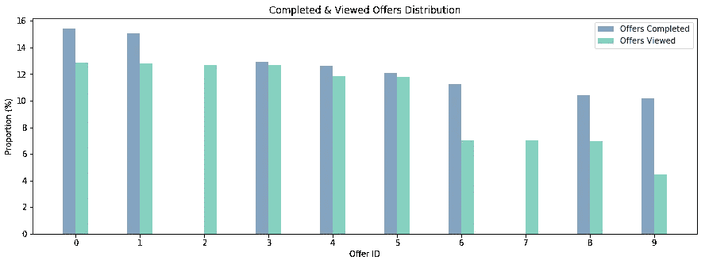

# 星巴克顾客分析和最佳优惠

> 原文：<https://medium.com/analytics-vidhya/starbucks-customers-analysis-and-best-offers-f2b1ef762071?source=collection_archive---------7----------------------->

## 星巴克数据科学挑战


[黑克吕](https://unsplash.com/@darke?utm_source=medium&utm_medium=referral)在 [Unsplash](https://unsplash.com?utm_source=medium&utm_medium=referral) 上拍照

# 介绍

今天，我将看看星巴克为数据科学项目向 Udacity 提供的一些数据集。

我认为观察并试图了解参加星巴克奖励计划的顾客的人口统计会很有趣。以及建立一个预测模型，在此基础上提供将是成功的或有效的。

> **有效报价**是指**被客户查看并完成**的报价。

数据清理部分将不会在本文中解释，但它们可以在 Github [资源库](https://github.com/adhamelkhouly/starbucks_promotions)中找到。

# 一.数据集:

数据包含在三个文件中:

*   portfolio . JSON——包含要约 id 和关于每个要约的元数据(期限、类型等)。)
*   profile.json —每个客户的人口统计数据
*   transcript.json 记录交易、收到的报价、查看的报价和完成的报价

以下是文件中每个变量的模式和解释:

**portfolio.json**

*   id(字符串)—优惠 id
*   offer_type (string) —优惠的类型，如 BOGO、折扣、信息
*   难度(int) —完成报价所需的最低花费
*   奖励(int) —为完成一项提议而给予的奖励
*   duration(int)-报价开放的时间，以天为单位
*   频道(字符串列表)

**profile.json**

*   年龄(整数)—客户的年龄
*   成为会员日期(整数)—客户创建应用程序帐户的日期
*   性别(str) —客户的性别(请注意，有些条目包含“O”代表其他，而不是 M 或 F)
*   id (str) —客户 id
*   收入(浮动)—客户的收入

**抄本. json**

*   事件(str) —记录描述(即交易、收到的报价、查看的报价、完成的报价)
*   人员(字符串)—客户 id
*   时间(整数)—测试开始后的时间，以小时为单位。数据开始于时间 t=0
*   value —(字符串字典)—报价 id 或交易金额，具体取决于记录

# 二。探索性数据分析

## 1.发送的报价


发出的报价有三种类型:BOGO(买一送一)、信息和折扣。

我们可以看到折扣优惠是星巴克提供的最少的，为 20%。而另外两个同样为 40%。信息提供不需要用户方的动作，而另外两个则需要。

## 2.客户的年龄、收入和性别分布

这里有一些非常有趣的发现，我将试图争论和解释。


最简单的一个是性别分布，其中大多数奖励顾客往往是男性，约占 58%，女性次之，约占 40%，其他性别占 2%。

接下来的两个图将被同时分析。


有趣的是，大多数星巴克的奖励顾客都在 50-59 岁年龄段(我个人认为应该在 20-39 岁之间！).然而，如果我们看看上面的图表，我们可以看到每个年龄组的收入水平也在增加。

因此，这里的解释实际上可以是**随着收入的增加(往往随着年龄的增长)，客户加入了奖励计划。**

## 3.客户收到的报价分布


星巴克一共发出了 10 个优惠，可以看出是平均分布的。

这一点在以后尤其重要，这样我们的预测模型就不会偏向任何一个特定的报价，仅仅因为它发出的更多。

## 4.已完成和已查看的报价

如上所述，数据集中的要约事件有三种类型。现在，我们来看看查看/点击报价与完成交易之间的关系。



我们可以注意到它们是高度相关的。**高度完整的报价也是那些被高度关注的报价。**

报价 2 和 7 是例外，因为它们是信息性报价，技术上不能完成，只能查看。

# 三。线性回归模型

我首先构建了一个初步模型，试图查看某些系数权重，以及客户会花更多钱的**指标。**


让我们关注一般特征，而不是具体的产品特征。客户会增加支出的三个**最强积极指标是**(按降序排列):

1.  收到的折扣数量
2.  女性
3.  收到的信息报价


另一方面，用户会增加支出的三个**最强烈的负面指标是:**

1.  男性性别
2.  年
3.  收到的报价总数

有趣的是，总结一下:

1.  女性顾客比男性顾客愿意在星巴克产品上花费更多。
2.  折扣优惠与客户支出密切相关。
3.  最近注册的会员不太可能花费更多。
4.  如果顾客收到更多的优惠，他们更有可能在产品上花更少的钱。

# 四。分类预测模型

如前所述，这些预测模型的目标是**根据某个客户的人口统计数据**预测向其发出的报价是否有效。

如简介中所述，当顾客查看并完成要约时，要约被假定为**有效**。

## 1.朴素分类器

我从构建一个简单的分类器开始，它假设所有的报价都是有效的，并以下列指标结束:

```
Precision: 0.4216387505658669
Recall: 1.0
f1-score: 0.5931728442236658
Misclassfication Rate: 0.578361249434133
```

错误分类率约为 58%，这意味着它有 60%的时间是错误的。和预期一样，f1 分数也在 60%左右，非常接近抛硬币。

简单的分类器作为比较性能的基础案例。

## 2.逻辑回归分类器

接下来，我想我应该转向线性分类器，知道数据中存在一些非线性。

结果如下:

```
Best parameters for model are:
 {'penalty': 'l1', 'C': 1.0}
              precision    recall  f1-score   support

           0       0.79      0.77      0.78      6322
           1       0.70      0.73      0.72      4723

   micro avg       0.75      0.75      0.75     11045
   macro avg       0.75      0.75      0.75     11045
weighted avg       0.75      0.75      0.75     11045

True Positives: 3456
True Negatives:4851
False Positives: 1471
False Negatives: 1267
Classification Error:  0.2478949751018561
Sensitivity:  0.7317383019267415
```

尽管该模型是一个线性模型，但它仍然有一个相当低的分类误差，约为 25%。f1-sore 为 0.75。

这意味着一个能够处理非线性决策边界的模型会表现得更好，这是下一步的工作。

## 3.随机森林分类器

接下来，我继续测试 RFC，正如预期的那样，与线性模型相比，它确实提供了更好的结果。

```
Best parameters for model are:
 {'n_estimators': 200, 'min_samples_split': 10, 'min_samples_leaf': 4, 'max_features': 'auto', 'max_depth': 8}
              precision    recall  f1-score   support

           0       0.79      0.80      0.79      6307
           1       0.73      0.71      0.72      4738

   micro avg       0.76      0.76      0.76     11045
   macro avg       0.76      0.76      0.76     11045
weighted avg       0.76      0.76      0.76     11045

True Positives: 3382
True Negatives:5047
False Positives: 1260
False Negatives: 1356
Classification Error:  0.23684925305568127
Sensitivity:  0.7138032925284931
```

分类误差降低到 23.7%，f1 值达到 0.76。

然而，所有这些都是通过 [RandomizedSearchCV](https://scikit-learn.org/stable/modules/generated/sklearn.model_selection.RandomizedSearchCV.html) 完成的，它挑选了一个随机的参数组合并对它们进行测试，而不是穷举测试。

以下结果是通过网格搜索( [GridSearchCV](https://scikit-learn.org/stable/modules/generated/sklearn.model_selection.GridSearchCV.html) )获得的，这是一次彻底的搜索，并且再次对模型进行了改进。

```
Best parameters for model are:
 {'max_depth': 9, 'max_features': 'sqrt', 'min_samples_leaf': 4, 'min_samples_split': 2, 'n_estimators': 150}
              precision    recall  f1-score   support

           0       0.79      0.81      0.80      6304
           1       0.74      0.71      0.72      4741

   micro avg       0.77      0.77      0.77     11045
   macro avg       0.76      0.76      0.76     11045
weighted avg       0.77      0.77      0.77     11045

True Positives: 3363
True Negatives:5119
FalsePositives: 1185
False Negatives: 1378
Classification Error:  0.232050701674966
Sensitivity:  0.7093440202488926
```

**分类误差进一步降低到 23.2%，f1 值提高到 0.77。**

下图显示了在对要约是否有效进行分类时，哪些特征更为重要:


# 动词 （verb 的缩写）结论

最困难的挑战实际上是数据清理以及报价、交易和客户信息的组合。一旦所有这些特征都在单个数据帧中表现出来，接下来的分析就更容易了。

在将所有数据放在一起之后，我们继续创建一个基础案例来进行比较(朴素分类器)。然后我们用了一个线性模型和一个非线性模型。

然后，我们查看了功能权重，试图了解哪些优惠往往做得更好。

这一分析得出的结论是:

1.  女性顾客往往比其他顾客花费更多。
2.  折扣优惠导致更多的客户支出
3.  优惠最重要的特征如下:
    a .难度
    b .持续时间
    c .回报
    这表明优惠往往因其自身的属性而有效，而不是与特定的客户群体相关联。然而，年龄和收入也排在第六和第七位。
4.  令人惊讶的是，提供信息往往是最有效的。
5.  社交媒体作为一种渠道，往往比其他渠道更成功。值得记住的是，所有的报价都是通过电子邮件发送的，因此，很难理解它的实际效果。

要获得更多技术和深入的分析，以及查看所有数据争论的步骤，请访问 Github [库](https://github.com/adhamelkhouly/starbucks_promotions)。