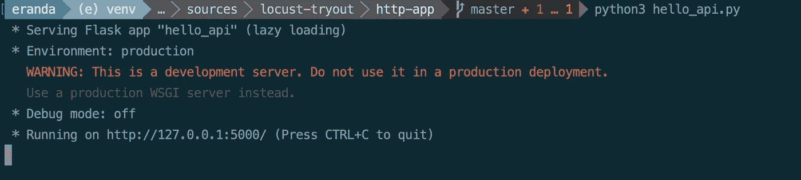
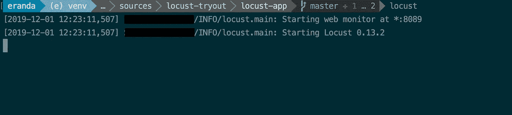
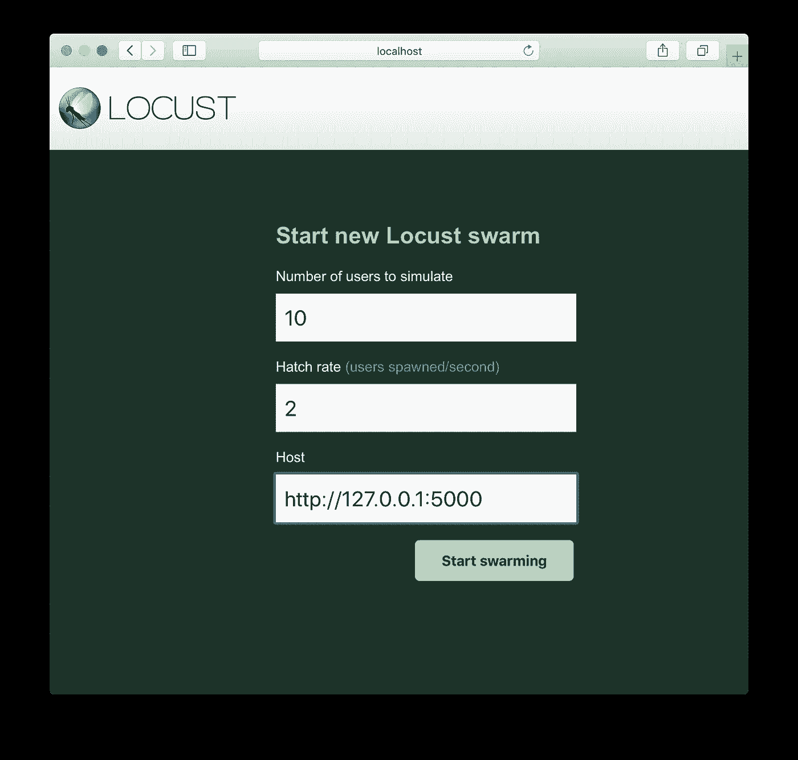
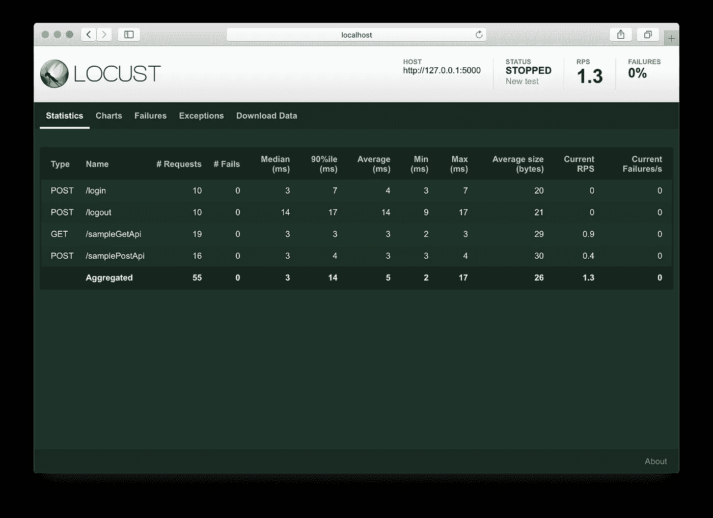
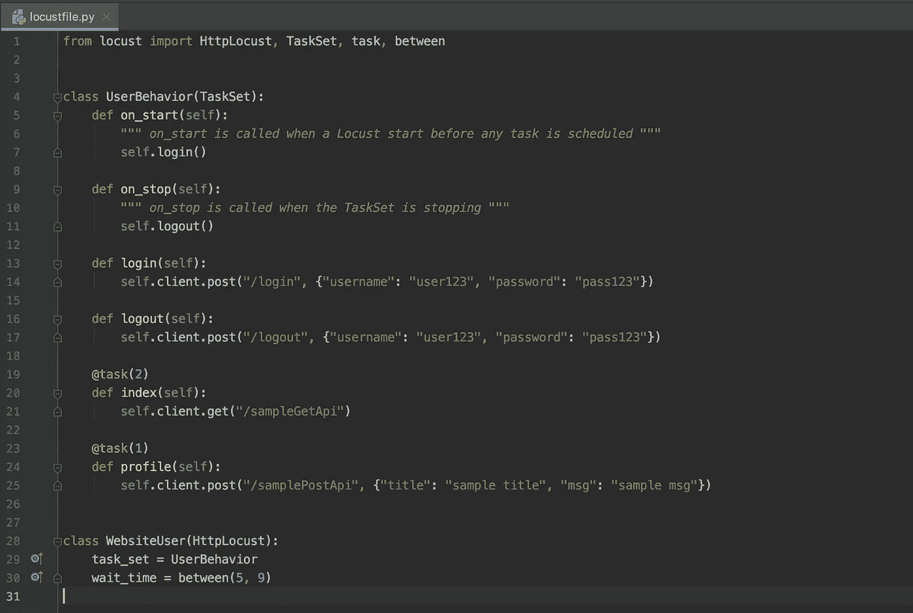
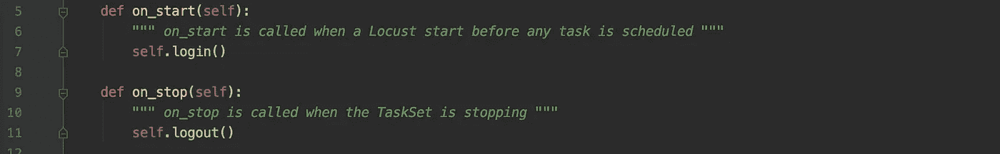
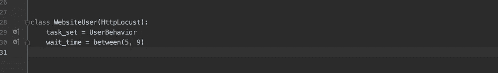

# 从蝗虫开始负载测试…

> 原文：<https://medium.com/analytics-vidhya/start-load-testing-with-locust-2600b65c22b5?source=collection_archive---------7----------------------->

# 介绍

JMeter 是我进行负载测试的工具，尤其是在 HTTP API 开发期间。但是我在配置它时总是有困难，也许是因为缺乏配置灵活性，也许它不是那么简单。

Locust 是替代负载测试，它没有 JMeter 成熟，但是它解决了 JMeter 的一些基本问题。Locust 基本上是一个基于 Python 的框架，与 JMeter 配置相反，用户需要编写代码来完成工作。作为一名开发人员，我更喜欢**编码而不是配置**，因为它提供了更多的灵活性，并且学习一点 Python 也不会有什么坏处(如果你还不熟悉的话)；)同样蝗虫测试可以**轻松扩展**来演示并发用户。关于 JMeter 和 Locust 的详细对比，可以参考这里[1]

# 看蝗虫在行动

Locust 是一个基于 Python 的框架，所以您需要在您的机器上安装 Python。我将在这个例子中使用 Python3，您可以在这里找到安装 python3 的指南[2]

如果你正在使用 MacOSx，它可能已经有 Python3 了，用下面的命令验证它。

```
python3 --version
```

## REST API 示例

我们需要一个样本 HTTP API 来测试蝗虫。因为我们在这个例子中使用 Python，所以我将使用 Python Flask 框架来创建一个简单的 HTTP API。但是您可以使用任何您已经熟悉的方法来创建一个带有简单 HTTP API 的应用程序。

我将为每个应用程序创建两个基于 Python 的**虚拟环境**(REST API 和 Locust ),这将帮助我们将每个项目所需的所有可执行文件保存在一个隔离的环境中。因为我们使用的是 Python3，所以它内嵌了 venv 支持。

你可以在这里找到我为这个演示创建的简单的 REST API[3 ],通过下面的步骤你可以启动它。

将 HTTP API 演示为四个 API

*   [发布]:/登录
*   [发布]:/注销
*   [GET]: /sampleGetApi
*   [POST]: /samplePostApi

1.  创建虚拟环境[4]

导航到([3])*http-app*目录并运行以下命令，(这将在当前位置创建一个新目录 *venv*

```
$ python3 -m venv venv
```

2.激活虚拟环境

```
$ source venv/bin/activate
```

在 Windows 中

```
$ venv\Scripts\activate
```

3.将烧瓶安装到 venv 中

```
$ pip3 install flask
```

4.运行应用程序

```
$ python3 hello_api.py
```

这将在 http://127.0.0.1:5000/上启动 HTTP 应用程序



*   仅供参考:您可以随时使用以下命令从 venv 中存在，

```
$ deactivate
```

## 奔跑的蝗虫

现在我们可以在我们创建的 REST API 上运行蝗虫负载测试。我将首先解释演示步骤，然后浏览代码。

1.  为蝗虫创建一个虚拟环境

导航到([3])locust*-app*目录并运行以下命令，(这将在当前位置创建一个新目录 *venv*

```
$ python3 -m venv venv
```

2.激活虚拟环境

```
$ source venv/bin/activate
```

在 Windows 中

```
$ venv\Scripts\activate
```

3.将蝗虫安装到 venv 中

```
$ pip3 install locustio
```

4.运行应用程序(默认命令)

```
$ locust
```

如果文件名不是 *locustfile.py* ，可以这样运行，

```
$ locust -f locust_files/my_locust_file.py
```

这将如下启动 locust 服务器，



5.在浏览器中打开 Locust 控制面板(http://localhost:8089)

您可以提供以下输入。Host 是我们正在其上尝试负载测试的 HTTP 端点。为此，我将使用我在上一步中创建的端点。



6.开始蜂拥而上

单击该按钮后，负载测试将启动，过一会儿您可以停止它。在下面的结果页面中，您可以看到，登录和注销 Api 被调用了 10 次(每个用户一次)，sampleGetApi 被调用的次数多于 samplePostApi。



**蝗虫代码**

如果你打开 *locustfile.py，*它会是这样的。这只是 Locust 快速入门示例[6]的一个略微更新的版本



我将在这里讨论几个要点。更多信息可以参考[6]、[7]。

1.  **用户行为**类和**网站用户**类

UserBehavior 是 TaskSet 的一个子类，包含用户完成的动作，而 WebsiteUser 是 Locust 的一个子类，配置 Locust 测试。

2.启动和停止

正如注释中提到的，on_start 和 on_stop 方法将由每个线程分别在开始和结束时调用。



3.`**@task**`注释

这将指定每个用户应该(迭代地)完成的每个动作，传递到注释中的数字给出了每个任务的权重。它将确保一个任务比其他任务执行得更多。

4.`**@seq_task(n)**`注释

默认情况下，任务以随机顺序执行。使用这个注释，您可以给任务执行下一个命令。

5.**任务设置**和**等待时间**

task_set 定义在执行中使用哪组任务(TaskSet 的子类), wait_time 定义两次任务执行之间的等待时间。



这就是我打算在这篇文章中介绍的全部内容，你可以参考 Locust 文档[6]了解所有其他很酷的特性。愉快的负载测试。

>>献给我见过的最好的 QA 女孩[迪尔沙尼](https://medium.com/u/6ad23f43fbc0?source=post_page-----2600b65c22b5--------------------------------) :) < <

# 参考

[1].[https://www . blaze meter . com/blog/jmeter-vs-locust-which-one-should-you-choose/](https://www.blazemeter.com/blog/jmeter-vs-locust-which-one-should-you-choose/)

[2].[https://realpython.com/installing-python/](https://realpython.com/installing-python/)

[3].[https://github . com/erandacr/locust-try out/tree/master/http-app](https://github.com/erandacr/locust-tryout/tree/master/http-app)

[4].[https://blog . miguelgrinberg . com/post/the-flask-mega-tutorial-part-I-hello-world](https://blog.miguelgrinberg.com/post/the-flask-mega-tutorial-part-i-hello-world)

[5].[https://github . com/erandacr/locust-try out/tree/master/locust-app](https://github.com/erandacr/locust-tryout/tree/master/locust-app)

[6].【https://docs.locust.io/en/stable/quickstart.html 

[7].[https://medium . com/@ linh 22 Jan/load-test-with-locust-37 C4 f 85 ee 2 FB](/@linh22jan/load-test-with-locust-37c4f85ee2fb)