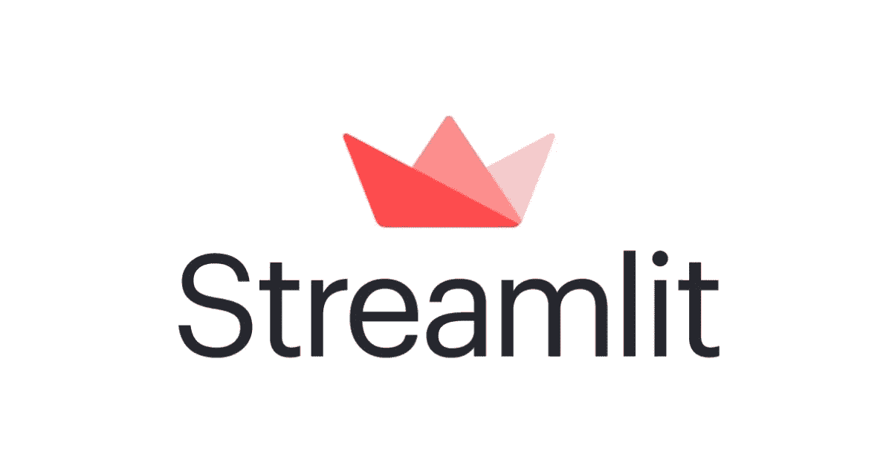

# 从 Streamlit 开始(初学者方法)

> 原文：<https://medium.com/analytics-vidhya/start-off-with-streamlit-beginners-approach-94954ff8083a?source=collection_archive---------8----------------------->



treamlit 是一个开源的应用程序框架**，也就是说**是数据科学家和**机器学习工程师**在几个小时内创建漂亮、高性能应用程序的最简单方法！

在这篇博客结束时，你将会对使用 Streamlit 构建一个基本的 streamlit **web 应用程序**感到舒适。


让我用我将要处理的数据集向大家介绍一下，如何在 streamlit 上构建一个基本的 web 应用程序。

所考虑的数据集是从 **Kaggle** 中提取的鸢尾数据集，它包括三种鸢尾，每种有 50 个样本，以及每种花的一些属性。一种花与另外两种花是线性可分的，但是另外两种花彼此不是线性可分的。该数据集的链接如下。

[](https://www.kaggle.com/arshid/iris-flower-dataset) [## 鸢尾花数据集

### 用于多类分类的鸢尾花数据集。

www.kaggle.com](https://www.kaggle.com/arshid/iris-flower-dataset) 

我将训练这个数据集，使用简单的逻辑回归技术(不太强调训练部分)，并将模型保存为 **Pickle** 文件。代码请参考博客末尾给出的 GitHub 链接。

在开始构建 streamlit 应用程序之前，请确保您已经安装了 streamlit，如果没有，请在各自的终端中输入以下命令。

```
$ pip install streamlit
```

现在，让我们开始吧！

我们将开始调用重要的库，这些库将用于构建您的第一个 streamlit 应用程序，并导入我们的 Iris 分类模型，之前保存为**(。pkl)** 文件中的一个名为“模型”的变量，使用 **pickle** 。

```
import streamlit as st
import pandas as pd
import pickle
#from PIL import Imagemodel = pickle.load(open('IRIS-model.pkl', 'rb'))
```

导入 **PIL** 库是可选的，因为它用于在我们的 web 应用程序中导入图像，但是推荐这样导入，只是因为它使我们的应用程序更美观。

现在，我们将为我们的应用程序提供一个标题，并导入一个图像，使我们的应用程序看起来更好:)

```
st.header("Iris Classification:")image = Image.open('image.png')
st.image(image, use_column_width=True,format='PNG')st.write("Please insert values, to get Iris class prediction")
```

好了，到了重要的部分，是时候从我们的用户那里获取特征值作为输入，基于这些输入，我们的虹膜分类模型将分别预测虹膜花的类别，Streamlit 为我们提供了接受文本框形式的输入以及滑块选项的精彩选项，在这里，我们将使用滑块选项，这使得用户更容易插入值。

我们将分别接受每个特征值如**萼片长度**和**宽度**，以及**花瓣长度**和**宽度**，使用滑块选项定义用户可以选择的值之间的范围，并将这些值存储在一个名为" data "的变量中，显示为:

```
SepalLengthCm = st.slider('SepalLengthCm:', 2.0, 6.0)
SepalWidthCm = st.slider('SepalWidthCm:', 0.0, 5.0)
PetalLengthCm = st.slider('PetalLengthCm',0.0, 3.0)
PetalWidthCm = st.slider('PetalWidthCm:', 0.0, 2.0)data = {'SepalLengthCm': SepalLengthCm,
        'SepalWidthCm': SepalWidthCm,
        'PetalLengthCm': PetalLengthCm,
        'PetalWidthCm': PetalWidthCm}
```

我们收集的数据需要转换成一个**数据帧**，然后使用它进行预测，可以这样做:

```
features = pd.DataFrame(data, index=[0])
```

现在，是时候向我们的分类器模型提供这些输入了，它将最终预测鸢尾花的**类别**，作为输出！

```
pred_proba = model.predict_proba(features)
#or
prediction = model.predict(features)
```

在这里，“ **predict_proba** 命令，将基本上以我们的模型预测的每个类别的概率百分比的形式给出预测，或者您可以只使用“ **predict** ”来简单地预测类别。

我们已经完成了模型预测，除了向我们的用户展示结果，这可以通过，

```
st.subheader('Prediction Percentages:') st.write('**Probablity of Iris Class being Iris-setosa is ( in % )**:',pred_proba[0][0]*100)st.write('**Probablity of Isis Class being Iris-versicolor is ( in % )**:',pred_proba[0][1]*100)st.write('**Probablity of Isis Class being Iris-virginica ( in % )**:',pred_proba[0][2]*100)
```

最后，我们完成了基本 Streamlit **Web 应用程序**的编码，

现在执行以下步骤，打开您的 Web 应用程序，它将在您的本地服务器**上呈现。**

1.  打开您的终端，并激活虚拟环境(如果有)。
2.  更改保存 Web 应用程序 python 文件的目录。
3.  执行命令" **streamlit run app.py** "在本地服务器上呈现您的应用程序！

```
$ activate YourVirtualenvironment$ cd Your/saved/file$ streamlit run app.py
```

**恭喜你！**，您已经创建了自己的 Streamlit 应用程序！，您的应用程序可能会像这样，


**另外**，建议阅读 streamlit 的官方文档，并尝试新事物，以便探索 Streamlit 提供的更多漂亮功能！

**应用程序的 GitHub 链接**:

[](https://github.com/GauravSahani1417/Blog-Starting-off-with-Streamlit-Beginner-s-Approach-) [## gauravsahani 1417/Blog ----以流畅的方式开始----初学者的方法

### 这些内容参考了我的博客——用 streamlit(初学者方法)开始，其中我已经演示了…

github.com](https://github.com/GauravSahani1417/Blog-Starting-off-with-Streamlit-Beginner-s-Approach-) 

请留下一张 **Upvote！**，如果你真的喜欢这个解释，以及真诚的评论，请改进！，这促使我想出更多这样的博客:)

**在 Linkedin 上与我联系:**

[](https://www.linkedin.com/in/gaurav-sahani-6177a7179/) [## 印度马哈拉施特拉邦塔那塔那理工学院

### 查看高拉夫·萨哈尼在全球最大的职业社区 LinkedIn 上的个人资料。高拉夫有两个工作列在他们的…

www.linkedin.com](https://www.linkedin.com/in/gaurav-sahani-6177a7179/) 

非常感谢！