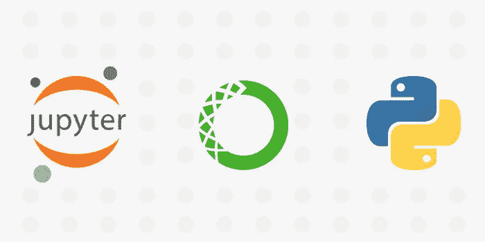
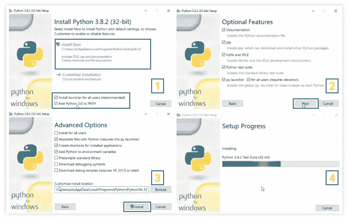
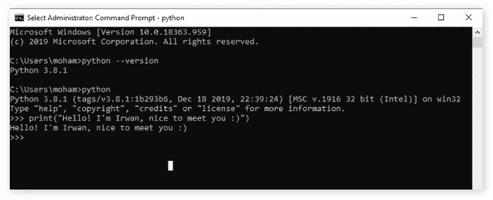
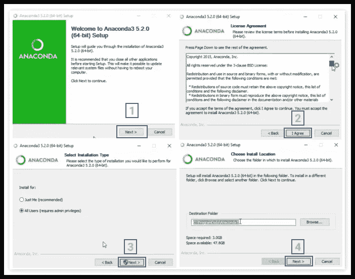
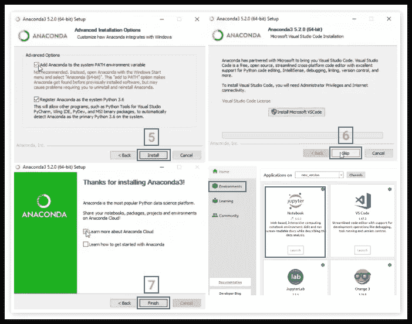
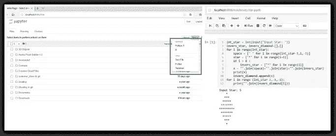

# 在 Windows 10 (64 位)上开始玩 Python 和 Jupyter 笔记本

> 原文：<https://medium.com/analytics-vidhya/start-playing-with-python-and-jupyter-notebook-on-windows-10-64-bit-8dea959c920e?source=collection_archive---------9----------------------->



或者对数据科学感兴趣的你一定知道这个软件:Python，Anaconda 和 Jupyter Notebook。通常这个软件是在我们离线工作时使用的。等等！你要知道这个软件运行的时候会占用大量的硬盘空间和 RAM。所以如果你想学习 python 但是你的电脑规格不够好(RAM 小于 4 GB，HDD 小于 500 GB)，我建议你使用 colab.research.google.com 的*，因为它是在线的或者你可以安装较小尺寸的 Miniconda。回到主题，在这个故事中，我只想谈谈 python，jupyter，anaconda 以及如何安装它们。我们开始吧*

大多数初学者会问，“我们为什么要安装 Anaconda？我们可以通过安装 python 软件来开始编写 python 代码，对吗？所以我们不再需要蟒蛇了。”如果你的程序非常简单，这是可以的，但在你的数据科学项目中，你会使用多少个包呢？你会一个一个的安装包吗？你确定你能处理好将来使用各种库的问题吗？花点时间。Anaconda 是用于科学计算的 Python 和 R 编程语言的免费开源发行版。它附带了一个软件包 conda 和环境管理器。在真实的项目中，我们使用它来安装、卸载和更新项目环境中的包，这使得我们的工作更容易完成。你准备好安装它了吗？在这里下载 [***python***](https://www.python.org/downloads/) 和[***anaconda***](https://www.anaconda.com/products/individual)*。*

## ***安装 Python***

**

*   *下载 python 文件后，双击该文件并选择*立即安装*作为默认设置。不要忘记检查列表*将 Python 3.8 添加到路径*(也可以在环境变量中手动设置)。*
*   *在*可选功能*中点击下一步。*
*   **高级选项，*如果您想更改文件的安装位置，只需在*自定义安装位置*上选择位置，然后点击安装。*
*   **等待安装过程完成*。您的 Python 现在可以使用了。*

*但是请等待，确保您已经将 python 文件添加到您的*系统变量路径*中，打开 cmd 并键入下面的代码以查看您的 python 版本。*

```
*python --version*
```

**

*您也可以使用这个命令行安装 Jupyter，但是让我们在下一条指令中开始安装 anaconda。*

```
*python -m pip install jupyter*
```

## ***安装 Anaconda***

**

*   *双击 anaconda 文件开始安装，然后单击 next。*
*   **许可协议*，点击我同意。*
*   **选择安装类型*，可以选择*只是我*或者*所有用户*然后点击下一步。*
*   **选择安装位置*，然后点击下一步。(注意你的硬盘可用空间，因为默认安装需要 3GB 的硬盘空间。当您尝试安装其他 python 库时，空间会增加(取决于其库的大小)。*

**

*   **高级安装选项*，只需勾选列出两个或其中一个(根据您的需要)然后点击安装。*
*   **微软 VSCode* ，如果不想安装该软件，跳过本次安装。*
*   *你的蟒蛇已经安装好了，是时候试试我们的蟒蛇了。前往起点并找到蟒蛇。双击运行它。*

**

*   *现在选择 Jupyter 笔记本，然后点击启动，等待我们打开本地服务器。注意:当我们可以安装和卸载我们的软件包库时，环境是一个菜单。*
*   *点击*新建*并选择 *Python 3* ，你现在可以开始你的第一个 Python 项目了。*

*通过创建如上图所示的*菱形开始*来开始你的第一个 python 项目，你可以使用我的代码片段或者自己制作。编码不需要死记硬背，但是需要每天练习。快乐的编码伙计们😄*

## *结论*

*本教程提供了如何在 Windows 上安装 Python 和 Anaconda 以及如何处理常见安装问题的快速指南。如果你想了解更多关于 python 的基础知识，就在这个 [***链接***](https://github.com/irwanafandi24/Basic-Python-Programming) 中访问我的 python 基础备忘单。如果你对教程有任何问题或想法，欢迎在下面的评论中或通过[***Twitter***](https://twitter.com/Irwan_Afandi)联系。*