# 用最清晰的推荐管道开始推荐任何东西

> 原文：<https://medium.com/analytics-vidhya/start-recommending-anything-with-the-most-lucid-recommendation-pipeline-4d7f55b5fdc2?source=collection_archive---------15----------------------->

苏珊·尹在 [Unsplash](https://unsplash.com?utm_source=medium&utm_medium=referral) 上的照片

作为一个个体，我们不能否决或否认推荐技术的流行和主导地位，以及它在塑造我们日常生活方式方面的不可思议的影响。他们全神贯注于我们通过智能手机、平板电脑、个人电脑等设备与互联网进行的几乎所有形式的数字互动。现在，拥有多年收集的大量数据资料库的大型企业和公司巨头是市场上主要的强大参与者。他们成功地挖掘和利用了典型推荐系统中蕴含的巨大商业潜力，以及它如何在我们的一切决策过程中发挥重要作用。从像网飞这样的点播视频流媒体服务提供商到像亚马逊这样的电子商务巨头，都在通过完善移动直播推荐系统赚取数十亿美元。

我敢打赌，您现在已经相当确信，在咖啡和笔记本电脑的舒适环境中，学习设计、开发和部署一个简单而有效的推荐系统这一并不复杂的艺术的重要性。该文章进一步阐明了在构建推荐系统时采用的最清晰的方法和策略，该推荐系统基于观众的兴趣的相似性和与其他电影的相似性向观众推荐预期的电影。这是一个实际用例的完美范例，它可能会与你的电影观看体验相呼应，从而激励你在更长的任期内保留所获得的技能。

注:数据集和完整的 [github 源代码](https://github.com/Shashank545/Recommendation-System-ML-)可以在这里[访问。](https://github.com/Shashank545/Recommendation-System-ML-)

# **突出设计步骤**

1.  导入标准库和合并各种数据集。

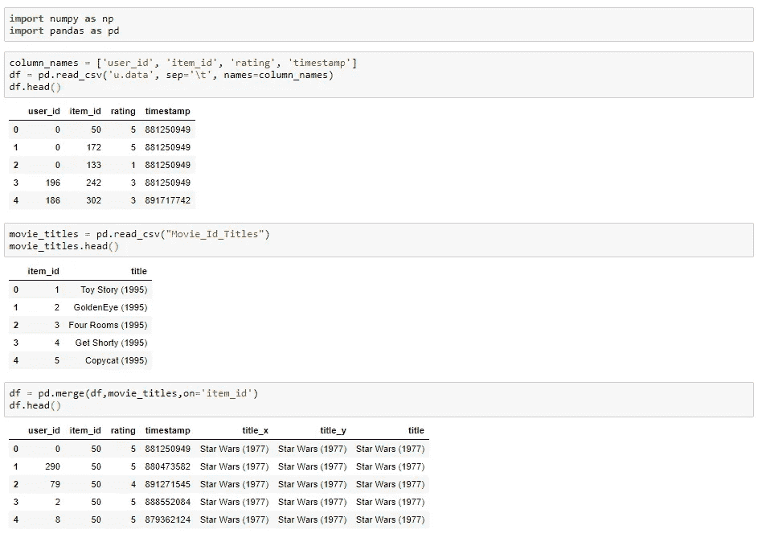

2.导入数据可视化模块和功能增强。

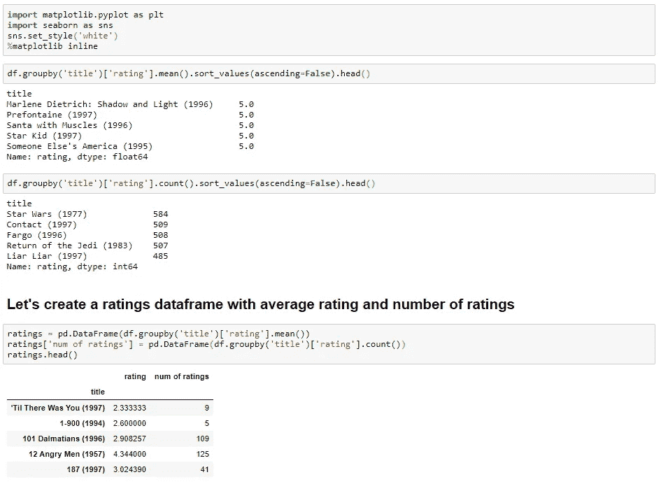

3.EDA(探索性数据分析)，带有“*评级数量*”和“*评级*”的直方图。

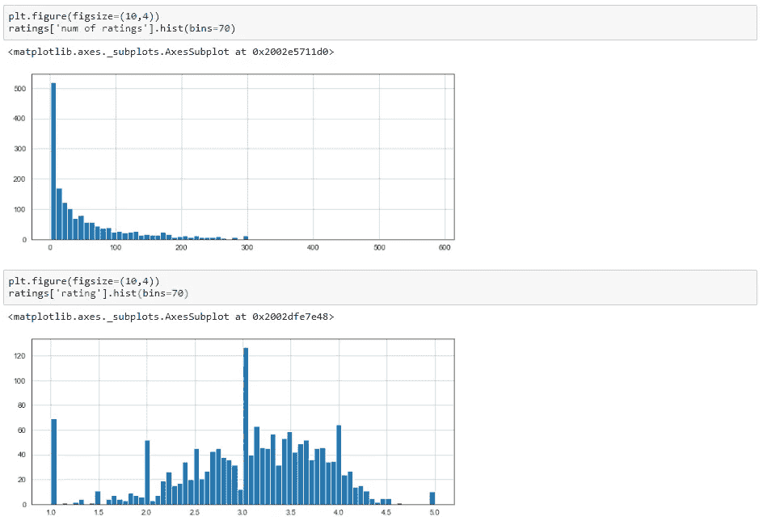

4.EDA，带有"*额定值数量* " v/s " *额定值*"的接头图。

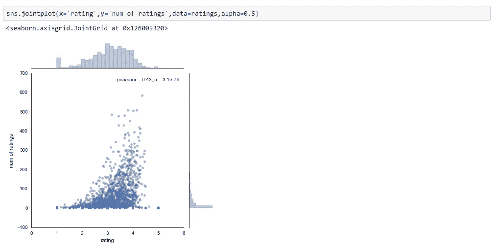

5.让我们创建一个矩阵，在一个轴上有用户 id，在另一个轴上有电影标题。每个单元格将包含用户对该电影的评价。注意会有很多南值，因为大部分人没看过大部分电影。

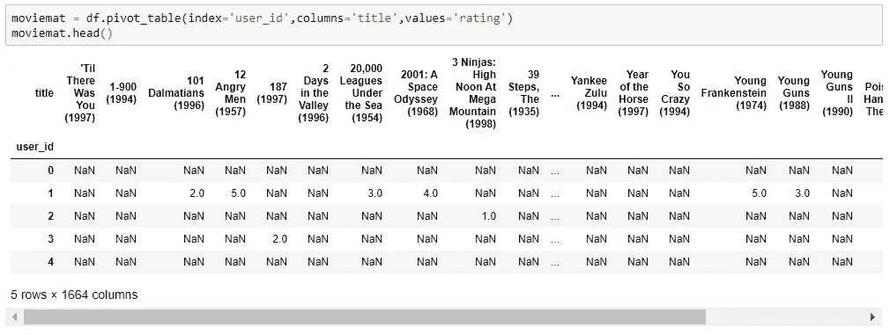

6.收视率最高的电影。

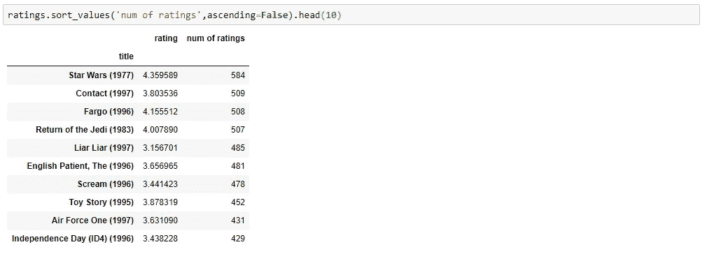

7.让我们选择两部电影: ***《星球大战》*** ，一部科幻电影和 ***骗子骗子*** ，一部喜剧，并为这两部电影抢占用户评级。

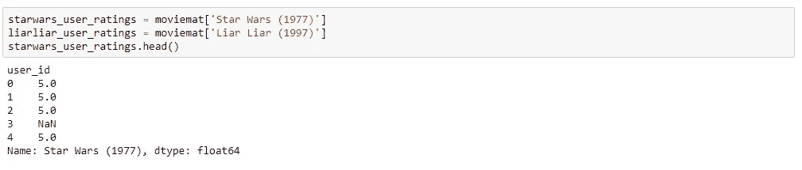

8.然后我们可以使用 ***corrwith()*** 方法来获得两个熊猫序列之间的相关性。

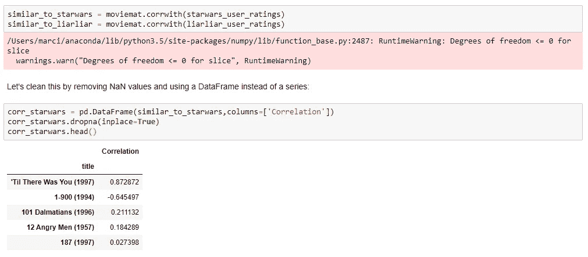

9.现在，如果我们通过相关性对数据帧进行排序，我们应该会得到最相似的电影，但是请注意，我们会得到一些没有实际意义的结果。这是因为有很多电影只有同时看了 ***《星球大战》*** (当时是最受欢迎的电影)的用户才看了一遍。

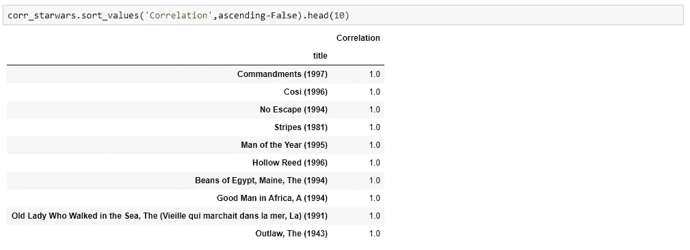

10.让我们通过过滤掉少于 100 条评论的电影来解决这个问题(这个值是根据前面的直方图选择的)。现在对值进行排序，注意标题是如何变得更有意义的。

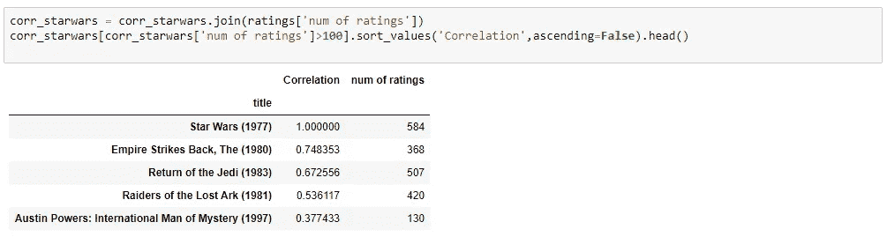

11.现在同样为喜剧 ***骗子骗子。***

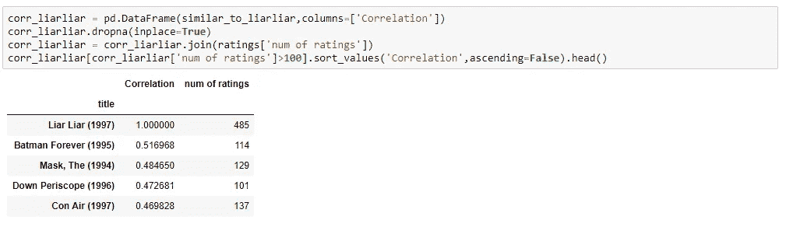

上面的结果没有显示一个详尽的列表，因为我们已经使用了 *head()* 。但是，您也可以将结果导出到任何文件类型中进行存储或进行实时网站渲染。根据应用需求，结果可以在用户使用的平台或设备之间进行转换和级联。

# **结论**

我真诚地希望我对上面提到的不同分析步骤的清晰列举能够吸引机器学习和数据科学社区的学习者和爱好者。请随意重复这些步骤并尝试一下。下周请继续关注一种更精确的推荐系统的高级方法。