# 机器学习项目的入门框架

> 原文：<https://medium.com/analytics-vidhya/starter-framework-for-machine-learning-projects-e443c4f774e6?source=collection_archive---------15----------------------->


在这篇文章中，我将展示某种用于机器学习项目的框架。正如你可能知道的，机器学习通常是从数据中提取知识。因此，大多数机器学习项目将依赖于来自特定领域的数据集合，称为**数据集**，我们正在研究某个问题，以建立适合它的预测模型。这个模型应该遵循一定的步骤来完成它的目的，在下面的部分中，我将实际地介绍一个关于执行统计学习或构建机器学习模型的主要步骤的简化说明。我假设解释项目是在*Jupiter*Notebook(*IPython*)内部用 *Python* 编程语言实现的，依赖于使用 *Numpy* 、Pandas 和 S *cikit-Learn* 包。

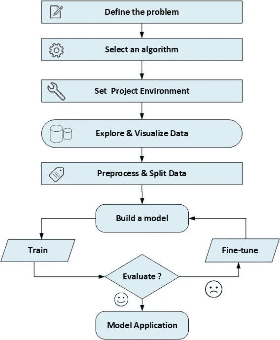

使用机器学习项目的简化框架

## 问题陈述

为了构建更好的模型，您应该清楚地定义您试图解决的问题，包括您将用来实现所需解决方案的策略。我选择了一个简单的鸢尾物种分类应用程序，其中我们将创建一个简单的机器学习模型，该模型可用于通过识别与每个鸢尾相关的一些测量值来区分一些鸢尾花的物种，例如花瓣的长度和宽度以及萼片的长度和宽度，所有这些都以厘米为单位。我们将依靠专家们先前鉴定测量的一组数据，他们已经将这些花分类为种类 *stosa* 、 *versicolor* 或 *virginica* 。我们的任务是建立一个可以从这些测量中学习的模型，这样我们就可以为新的虹膜预测物种


## 算法选择

根据所研究问题的性质和特征，我们需要选择适合于解决它的算法和技术。因为我们有测量结果，我们知道虹膜的正确种类，这是一个**监督学习问题**。在这个问题中，我们要预测几个选项中的一个(鸢尾的种类)。这是一个分类问题的例子。可能的输出(不同种类的鸢尾)被称为类。数据集中的每一个虹膜都属于三类中的一类，所以这个问题是一个三类分类问题。单个数据点(虹膜)的期望输出是这种花的种类。对于一个特定的数据点，其所属的物种称为其标签或类别。

## 项目准备

为了开始处理我们项目的数据，我们将首先导入我们在实现中需要的功能，如 *Python* 库，设置我们的环境以允许我们完成我们的任务以及成功加载我们的数据集:

然后我们开始将我们的数据集加载到一个*熊猫*数据帧中。这里将使用的数据是 *Iris* 数据集，这是机器学习和统计中的经典数据集。它包含在数据集模块内的 *scikit-learn* 中。

输出将如下所示

```
**features**: ['sepal length (cm)', 'sepal width (cm)', 'petal length (cm)', 'petal width (cm)']
**target categories**: ['setosa' 'versicolor' 'virginica']
**Shape of data**: (150, 4)
```

isis flowers 的数据包含萼片长度、萼片宽度、花瓣长度和花瓣宽度的数值测量，并存储为 ***Numpy 数组*** ，因此我们将其转换为 pandas **数据帧。**

> **注意**:这里我们使用的是 **Sci-kit Learn** 库自带的内置数据集，但实际上，数据集通常以 **csv** 文件的形式出现，所以我们可以使用类似下面注释代码的代码:
> 
> *# my file = ' my filename . CSV '*
> *# full _ data = PD . read _ CSV(my file，千位= '，'，delimiter = '；'，encoding='latin1 '，na_values="n/a")*

然后，我们开始将数据集加载到熊猫数据框架中。这里将使用的数据是 Iris 数据集，这是机器学习和统计中的经典数据集。它包含在 sci kit-数据集学习模块中。

```
**from** **sklearn.datasets** **import** load_iris
iris=load_iris()
*#printing feature names*
print('features: **%s**'%iris['feature_names'])
*#printing species of iris*
print('target categories: **%s**'%iris['target_names'])
*#iris data shape*
print("Shape of data: **{}**".format(iris['data'].shape))
```

输出将如下所示

```
**features**: ['sepal length (cm)', 'sepal width (cm)', 'petal length (cm)', 'petal width (cm)']
**target categories**: ['setosa' 'versicolor' 'virginica']
**Shape of data**: (150, 4)
```

isis flowers 的数据包含萼片长度、萼片宽度、花瓣长度和花瓣宽度的数字测量值，并存储为`NumPy array`，因此要将其转换为`pandas DataFrame`，我们将编写以下代码:

```
full_data=pd.DataFrame(iris['data'],columns=iris['feature_names'])
full_data['Classification']=iris['target']
full_data['Classification']=full_data['Classification'].apply(**lambda** x: iris['target_names'][x])
```

# 数据探索

在建立机器学习模型之前，我们必须首先分析我们用于解决问题的数据集，并且总是期望我们评估可能需要预处理的常见问题。因此，在继续我们的模型实现之前，数据探索是一项必要的工作。这是通过显示数据的快速样本、描述数据的类型、了解数据的形状或维度，并且如果需要，具有与加载的数据集相关的基本统计数据和信息来实现的。以及探索输入特征和关于可能需要解决的数据的任何异常或有趣的品质。数据探索可让您更深入地了解数据集，包括数据集模式、值分布、缺失值和分类要素的基数。

为了开始研究由 iris 对象表示的数据集，该对象由 load_iris()返回并存储在 mydata*pandas*data frame 中，我们可以使用。**头**()功能。

```
display(full_data.head())
```

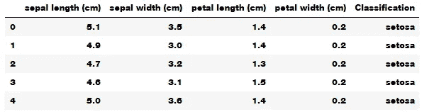

> 要显示有关数据结构的更多信息:
> 
> 完整数据。**信息**()或完整数据。**数据类型**

要检查数据集中是否存在任何空值，请执行以下操作:

```
full_data.**isnull**().**sum**()
```

或者使用以下函数来获取有关这些空值的更多详细信息:

从上面的数据集样本中，我们可以看到数据集包含了 150 种不同花卉的测量数据。每个单独的项目称为**示例**，机器学习中的实例或样本，它们的属性(5 列)称为**特征** (4 个特征和一列是每个实例或示例的`Target`或类)。数据阵列的形状是样本数乘以特征数。这是 s *cikit-learn* 中的约定，我们的数据将始终被假定为这种形状。

下面是对数据集中包含的特性和类的详细解释:-

*   **萼片长度**:表示指定鸢尾花的萼片长度，单位为厘米。
*   **萼片宽度**:表示指定鸢尾花的萼片宽度，单位为厘米。
*   **花瓣长度**:表示指定鸢尾花的花瓣长度，单位为厘米。
*   **花瓣宽度**:表示指定鸢尾花的花瓣宽度，单位为厘米。

为了显示新数据集的统计数据，我们可以使用:

```
full_data.describe()
```

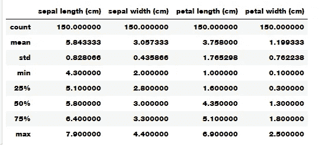

您可以比较最小值和最大值，看看缩放比例是否较大，以及是否需要缩放数字要素。

由于我们对鸢尾花的分类感兴趣，即我们只观察基于给定测量或特征的每朵花的类别或标签，我们可以从该数据集中移除`Classification`特征，并将其存储为自己的独立变量`Labels`。我们将使用这些标签作为我们的预测目标。下面的代码将删除作为数据集特征的`Classification`，并将其存储在`Labels`中。

```
Labels = full_data['Classification']
mydata = full_data.**drop**('Classification', axis = 1)**display**(mydata.**head**())**display**(Labels.**head**())
```

从数据框中删除的`Classification`特征。注意，数据(鸢尾花数据)和`Labels`(鸢尾花的标签或分类)现在是成对的。这意味着任何鸢尾花`mydata.**loc**[*i*]`，他们有一个分类或标签`Labels**[***i***]**`。

通过删除与特定提供条件不匹配的元素来过滤输入数据。下面的函数将一个数据列表作为输入，并返回一个过滤后的列表，如下面的代码所示

```
**def** filter_data(data, conditionField,conditionOperation,conditionValue):
    *"""*
 *Remove elements that do not match the condition provided.*
 *Takes a data list as input and returns a filtered list.*
 *Conditions passed as separte parameresfor the field,operation and value.*

 *"""*

    *#field, op, value = condition.split(" ") # Example: ["field == 'value'", 'field < 18']*
    field, op, value = conditionField,conditionOperation,conditionValue

    *# convert value into number or strip excess quotes if string*
    **try**:
        value = float(value)
    **except**:
        value = value.strip("**\'\"**")

    *# get booleans for filtering*
    **if** op == ">":
        matches = data[field] > value
    **elif** op == "<":
        matches = data[field] < value
    **elif** op == ">=":
        matches = data[field] >= value
    **elif** op == "<=":
        matches = data[field] <= value
    **elif** op == "==":
        matches = data[field] == value
    **elif** op == "!=":
        matches = data[field] != value
    **else**: *# catch invalid operation codes*
        **raise** **Exception**("Invalid comparison operator. Only >, <, >=, <=, ==, != allowed.")

    *# filter data and outcomes*
    data = data[matches].reset_index(drop = **True**)
    **return** data
```

例如，我们可以过滤我们的数据，使其成为属性`sepal width (cm)`小于`3`的所有花卉的列表，如下所示

```
filtered_data=filter_data(mydata, 'sepal width (cm)','<','3')
display(filtered_data.head())
```

# 数据可视化

在建立机器学习模型之前，查看我们的数据以更多地了解构成它的各种组件之间的关系是一个好主意。检查我们的数据是发现异常和特性的好方法。例如，也许你的一些虹膜是用英寸而不是厘米来测量的。在现实世界中，数据不一致和意外测量是非常常见的。检查数据的最好方法之一是对我们的数据进行可视化。我们可以使用 python `**matplotlib**` 库或`**seaborn**` 库来绘制和可视化数据，使用不同类型的图，如*条形图*、*箱线图*、*散点图*等。

下面的函数显示了我们数据中任意单个属性的`*Bar graph*`

```
**def** BarGraph(theData,target,attributeName):
    xValues = np.unique(target)
    yValues=[]
    **for** label **in** xValues:
        yValues.append(theData.loc[target==label, attributeName].idxmax())
    plt.bar(xValues,yValues)
    plt.xticks(xValues, target)
    plt.title(attributeName) 
    plt.show()
```

下面的代码通过显示`sepal length (cm)`的条形图来测试上述功能。

```
BarGraph(mydata,Labels,'sepal length (cm)')
```

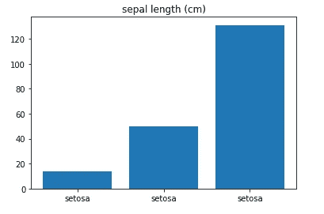

此外，我们可以使用以下函数同时显示多个条形图:

```
**def** BarGraphs(theData,target,attributeNamesList,graphsTitle='Attributes Classifications'):
    xValues = np.unique(target)
    fig, ax = plt.subplots(nrows=int(len(attributeNamesList)/2), ncols=2,figsize=(16, 8))
    k=0
    **for** row **in** ax:
        **for** col **in** row:
            yValues=[]
            **for** label **in** xValues:
                yValues.append(theData.loc[target==label, attributeNamesList[k]].idxmax()) 
            col.set_title(attributeNamesList[k])
            *#col.set(xlabel=" x Label", ylabel=' y Label')*
            col.bar(xValues,yValues)
            k=k+1
    fig.suptitle(graphsTitle)    
    plt.show()
```

示例:

```
BarGraphs(mydata,Labels,['sepal length (cm)','sepal width (cm)','petal length (cm)','petal width (cm)'])
```

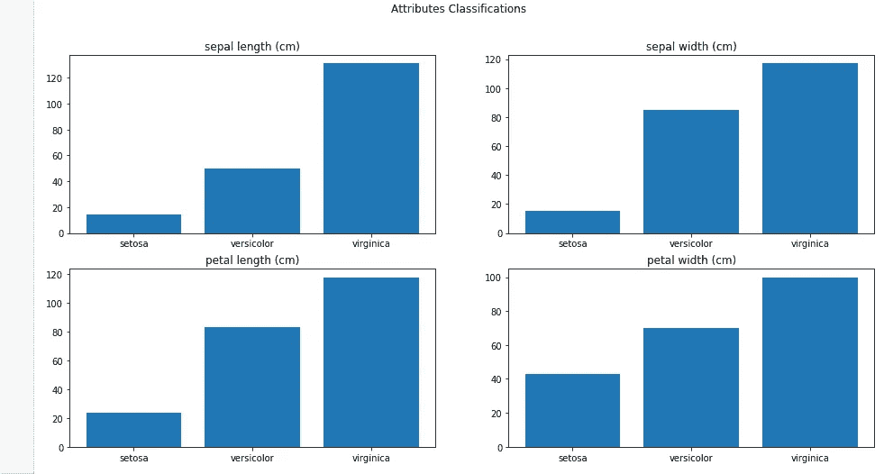

可视化数据集中的值分布，有助于更好地理解数据集中的属性分布，以检查该分布的性质是正态分布还是均匀分布，这可以通过以下方式完成

```
**def** Distribution(theData,datacolumn,type='value'):
    **if** type=='value':
        print("Distribution for **{}** ".format(datacolumn))
        theData[datacolumn].value_counts().plot(kind='bar')
    **elif** type=='normal':
        attr_mean=theData[datacolumn].mean() *# Mean of the attribute values*
        attr_std_dev=full_data[datacolumn].std() *# Standard Deviation of the attribute values*
        ndist=np.random.normal(attr_mean, attr_std_dev, 100)
        norm_ax = sns.distplot(ndist, kde=**False** )
        plt.show()
        plt.close()
    **elif** type=='uniform':
        udist = np.random.uniform(-1,0,1000)
        uniform_ax = sns.distplot(udist, kde=**False** )
        plt.show()    
    **elif** type=='hist':
        theData[datacolumn].hist()
```

为了测试`Classification`属性的可视化值分布，我们可以写:-

```
Distribution(full_data, 'Classification') 
```

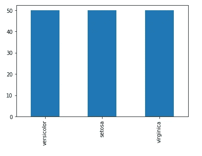

另一个可视化示例是显示某个属性的直方图，我们使用以下内容:

```
Distribution(full_data, 'sepal length (cm)',type='hist')
```

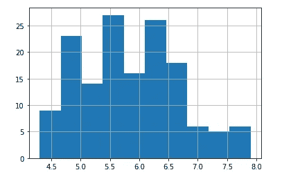

```
sns.**distplot**(full_data['sepal length (cm)'])
```

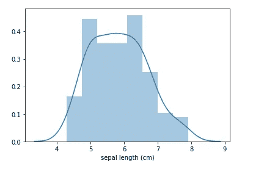

看来属性`sepal length (cm)`具有正态分布。

为了探究这些特性是如何相互关联的，我们可以使用 *seaborn* 库中的`**heatmap**` 。我们可以看到，萼片长度和萼片宽度特征彼此略有关联。

```
plt.**figure**(figsize=(10,11))
sns.**heatmap**(mydata.corr(),annot=**True**)
plt.**plot**()
```

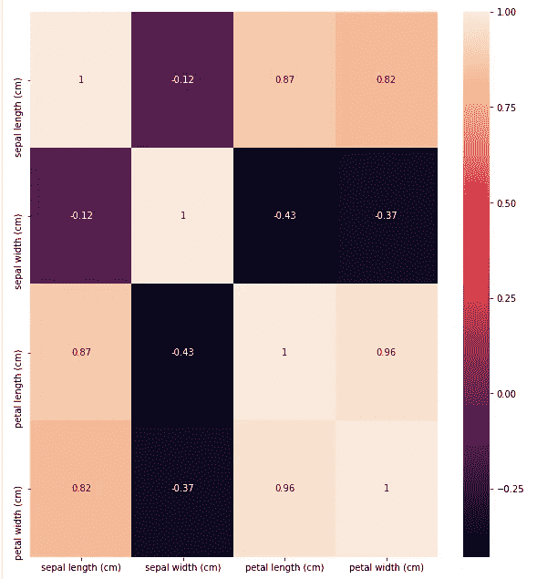

为了观察数据集中特征之间的关系，我们可以使用**散点图**。数据的*散点图*沿 x 轴放置一个特征，沿 y 轴放置另一个特征，并为每个数据点绘制一个点。对于如何根据萼片长度宽度特征分布我们的数据的散点图，我们可以使用下面的代码:

```
sns.**FacetGrid**(full_data,hue="Classification").**map**(plt.scatter,"sepal length (cm)","sepal width (cm)").**add_legend**()
plt.**show**()
```

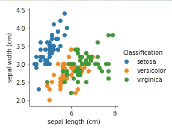

为了绘制具有三个以上特征的数据集，我们可以使用一个`pair plot`，它查看所有可能的特征对。如果你有少量的特性，比如我们这里的四个，这是很合理的。但是，您应该记住，配对图不会一次显示所有要素的相互作用，因此以这种方式进行可视化时，数据的一些有趣方面可能不会显示出来。我们可以使用 *seaborn* 库中的`**pairplot**`函数，如下所示:

```
sns.**pairplot**(mydata)
```

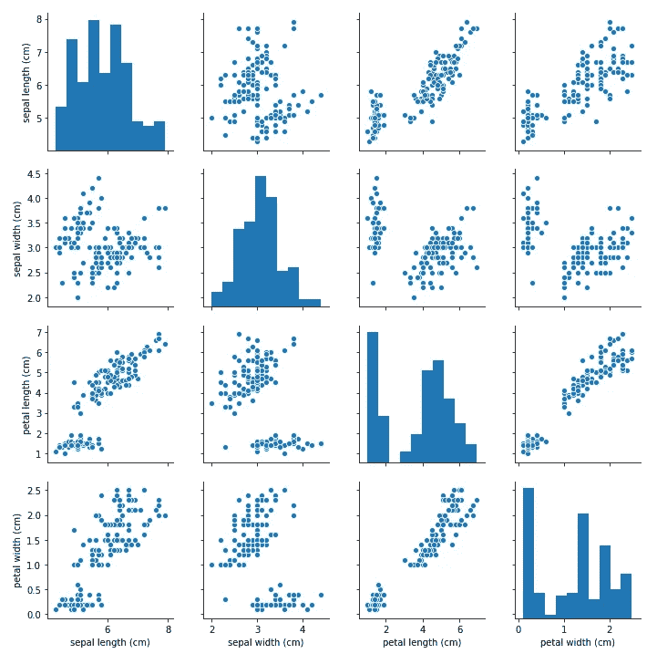

另一种做散点图的方法是使用`pandas`库中`plotting`模块中的`scatter matrix`。下面的代码从数据帧中创建了一个散点图，颜色将根据类别或标签而定

```
**from** **pandas.plotting** **import** scatter_matrix
colors = list()
palette = {0: "red", 1: "green", 2: "blue"}
**for** c **in** np.nditer(iris.target): colors.append(palette[int(c)])
grr = scatter_matrix(mydata, alpha=0.3,figsize=(10, 10), diagonal='hist', color=colors, marker='o', grid=**True**)
```

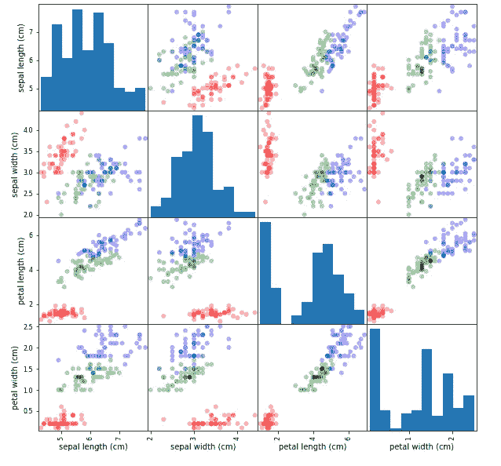

从图中，我们可以看到，使用萼片和花瓣测量，这三个类别似乎被相对很好地分开。这意味着机器学习模型将有可能学会将它们分开。

为了显示物种的长度和宽度的密度，我们可以使用所有输入变量的`**violin plot**`来表示物种的输出变量。

```
plt.figure(figsize=(12,10))
plt.subplot(2,2,1)
sns.**violinplot**(x="Classification",y="sepal length (cm)",data=full_data)
plt.subplot(2,2,2)
sns.**violinplot**(x="Classification",y="sepal width (cm)",data=full_data)
plt.subplot(2,2,3)
sns.**violinplot**(x="Classification",y="petal length (cm)",data=full_data)
plt.subplot(2,2,4)
sns.**violinplot**(x="Classification",y="petal width (cm)",data=full_data)
```

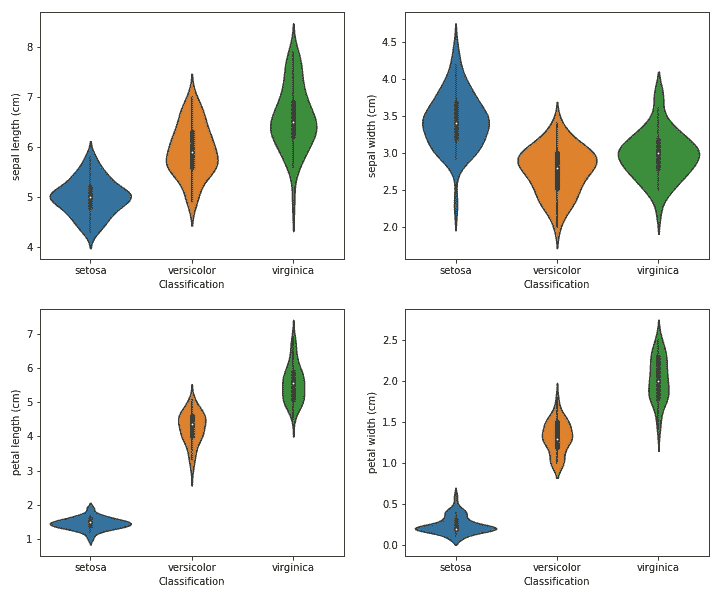

`**thinner** part denotes that there is **less density**`反之`**fatter** part conveys **higher density**`。

同样，我们可以使用`**boxplot**` 来查看*分类特征* `Classification`如何与所有其他输入一起分布，并检查异常值变量

```
plt.figure(figsize=(12,10))
plt.subplot(2,2,1)
sns.**boxplot**(x="Classification",y="sepal length (cm)",data=full_data)
plt.subplot(2,2,2)
sns.**boxplot**(x="Classification",y="sepal width (cm)",data=full_data)
plt.subplot(2,2,3)
sns.**boxplot**(x="Classification",y="petal length (cm)",data=full_data)
plt.subplot(2,2,4)
sns.**boxplot**(x="Classification",y="petal width (cm)",data=full_data)
```

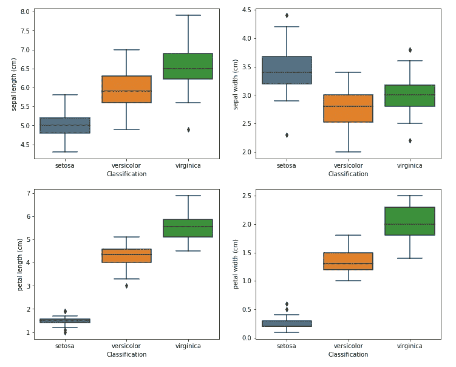

要检查基数:

```
**def** count_unique_values(theData, categorical_columns_list):
    cats = theData[categorical_columns_list]
    rValue = pd.DataFrame({'cardinality': cats.nunique()})
    **return** rValue
```

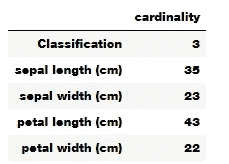

# 将数据集拆分为训练和测试数据

我们不能使用我们用来建立模型的相同数据来评估它。这是因为我们的模型总是可以简单地记住整个训练集，因此总是可以预测训练集中任何点的正确标签。这个`remembering`并没有向我们表明我们的模型是否会很好地推广，即它是否也会在新数据上表现良好。因此，在使用可以从看不见的数据中进行预测的机器学习模型之前，我们应该有一些方法来知道它实际上是否有效。因此，我们需要将带标签的数据分成两部分。其中一部分数据用于构建我们的机器学习模型，被称为`training data`或`**training set**`。其余的数据将用于衡量模型的效果；这被称为`test data`，或`**test set**`。

`*scikit-learn*`包含一个函数*打乱*数据集，*为您拆分*数据集:函数`**train_test_split**`。该函数提取数据中的 **75** %的行作为`training set`，以及该数据的相应标签。剩余的 **25** %的数据，连同剩余的标签，被声明为`test set`。

在`scikit-learn`中，数据通常用大写的 X 表示，而标签用小写的 y 表示。这是受数学中的标准公式 f(x)=y 的启发，其中 X 是函数的输入，y 是输出。遵循更多的数学惯例，我们使用大写的 X，因为数据是二维数组(一个矩阵)，小写的 y，因为目标是一维数组(一个向量)。让我们对我们的数据调用 train_test_split，并使用以下代码分配输出

```
**from** **sklearn.model_selection** **import** train_test_split
X_train, X_test, y_train, y_test = **train_test_split**(mydata,Labels, random_state=0)print("X_train shape: **{}**".format(X_train.**shape**))
print("y_train shape: **{}**".format(y_train.**shape**))
print("X_test shape: **{}**".format(X_test.**shape**))
print("y_test shape: **{}**".format(y_test.**shape**))
```

在进行分割之前，train_test_split 函数使用伪随机数发生器对数据集进行洗牌。如果我们只是将最后 25%的数据作为测试集，所有的数据点都将具有标签 2，因为数据点是按标签排序的(参见前面显示的 iris['target']的输出)。使用只包含三个类中的一个的测试集并不能告诉我们我们的模型概括得有多好，所以我们打乱我们的数据以确保测试数据包含来自所有类的数据。为了确保多次运行相同的函数都会得到相同的输出，我们使用 random_state 参数为伪随机数生成器提供了一个固定的种子。这将使结果确定，所以这条线将总是有相同的结果。train_test_split 函数的输出是 X_train、X_test、y_train 和 y_test，它们都是 NumPy 数组。X_train 包含数据集的 75%的行，X_test 包含剩余的 25%

# 建立模型

现在我们可以开始构建实际的机器学习模型了。在 *scikit-learn* 中有许多我们可以使用的分类算法。这里我们会用一个`**k-nearest neighbors classifier**`，很容易理解。构建该模型仅包括存储训练集。为了预测新的数据点，该算法会在训练集中找到最接近新点的点。然后，它将该训练点的标签分配给新的数据点。

`k-nearest neighbors`中的`k`表示我们可以在训练中考虑任意固定数量的 k 个邻居(例如，最近的三个或五个邻居)，而不是只使用与新数据点最近的邻居。然后，我们可以使用这些邻居中的多数类进行预测。为了简化，我们将只使用一个邻居。

`*scikit-learn*`中所有的机器学习模型都是在自己的类中实现的，这些类叫做估计器类。`k-nearest neighbors classification algorithm`在`neighbors`模块的`**KNeighborsClassifier** class`中实现。在使用这个模型之前，我们需要将这个类实例化为一个对象。这时我们将设置模型的任何参数。KNeighbor sClassifier 最重要的参数是`number of neighbors`，我们将它设置为 1:

```
**from** **sklearn.neighbors** **import** KNeighborsClassifier
knn = **KNeighborsClassifier**(n_neighbors=1)
```

*knn* 对象封装了将用于从训练数据构建模型的算法，以及对新数据点进行预测的算法。它还将保存算法从训练数据中提取的信息。在 **KNeighborsClassifier** 的情况下，它将只存储训练集。为了在训练集上构建模型，我们调用 knn 对象的`fit`方法，该方法将包含训练数据的 *NumPy* 数组`X_train`和相应训练标签的 *NumPy* 数组`y_train`作为参数:

```
knn.**fit**(X_train, y_train)
```

`**fit**`方法返回 knn 对象本身(并就地修改它)，因此我们得到了分类器的字符串表示。该表示向我们展示了在创建模型时使用了哪些参数。几乎所有的都是默认值，但是你也可以找到 n_neighbors=1，这是我们传递的参数。scikit-learn 中的大多数模型都有许多参数，但其中大多数要么是速度优化，要么是用于非常特殊的用例。您不必担心这个表示中显示的其他参数。打印 scikit-learn 模型可以产生很长的字符串，但是不要被这些吓倒。因此，我们不会显示 fit 的输出，因为它不包含任何新信息。

我们现在可以使用这个模型对我们可能不知道正确标签的新数据进行预测。想象一下，我们在野外发现一种鸢尾，萼片长 5 厘米，萼片宽 2.9 厘米，花瓣长 1 厘米，花瓣宽 0.2 厘米。这是哪种鸢尾？我们可以将这些数据放入一个 NumPy 数组中，同样通过计算形状来实现，即样本数(1)乘以特征数(4):

```
X_new = np.**array**([[5, 2.9, 1, 0.2]])
**print**("X_new.**shape**: **{}**".format(X_new.shape))
```

> 请注意，我们将这一朵花的测量结果放入一个二维 NumPy 数组中的一行，因为 scikit-learn 总是希望数据是二维数组。

为了进行预测，我们调用 knn 对象的**预测**方法:

```
prediction = knn.**predict**(X_new)
print("Prediction: **{}**".format(prediction))
```

我们的模型预测这种新的鸢尾属于`setosa`类或标签或物种。但是我们如何知道我们是否可以信任我们的模型呢？我们不知道这个样本的正确物种，这就是建立模型的全部意义！

# 模型评估

对于任何项目，我们都需要明确定义我们将用来衡量模型性能或项目结果的指标或计算，即，为了衡量我们预测的性能，我们需要一个指标来根据给定示例的真实分类对我们的预测进行评分。这些计算和度量应该基于问题和问题域的特征进行调整。在机器学习分类模型中，我们通常使用各种性能测量指标。从通常应用于分类问题的度量中，我们可以提到`**Accuracy** (A)`、`**Precision** (P)`、`**Recall** (R)`和`**F1-Score**`，...等等。

[分类性能指标](https://developers.google.com/machine-learning/crash-course/classification/true-false-positive-negative)

# 准确(性)

`Accuracy`或者分类率衡量分类器正确的频率，它被定义为我们的模型正确预测的比例。准确度分数通过以下公式计算:

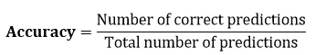

为了知道我们的预测有多准确，我们将计算我们对他们的诊断预测正确的情况的比例。下面的代码将创建我们的`**GetAccuracy**()`函数，该函数计算*准确度分数*。

**示例:***在前五朵花中，如果我们预测它们都是列表`predictions = ['setosa','versicolor','versicolor','setosa','setosa']`，那么我们预期我们预测的准确性如下:-

```
*# Test the 'accuracy_score' function*
predictions = ['setosa','versicolor','versicolor','setosa','setosa']
print(GetAccuracy(Labels[:5], predictions))Predictions have an accuracy of 60.00%.
```

同样作为第二个例子，我们可以假设我们数据集中的所有花都被预测为`setosa`。所以，下面的代码将总是预测我们数据集中的所有花都是`setosa`。

```
**def** predictions_example(data):
    predictions = []
    **for** flower **in** data:
        *# Predict the survival of 'passenger'*
        predictions.append('setosa')

    *# Return our predictions*
    **return** pd.Series(predictions)*# Make the predictions*
predictions = predictions_example(Labels)
```

*   要知道预测所有的花都具有`setosa`的种类有多准确？下面的代码显示了这个预测的准确性。

```
print(GetAccuracy(Labels, predictions))Predictions have an accuracy of 33.33%.
```

# 混淆矩阵

在统计`classification`的情况下，我们可以使用所谓的`confusion matrix`，也称为`error matrix`。混淆矩阵被认为是对分类问题预测结果的总结。正确和错误预测的数量用计数值汇总，并按每个类别细分。这是混乱矩阵的关键。混淆矩阵显示了分类模型在进行预测时被混淆的方式。它不仅让我们洞察到分类器所犯的错误，更重要的是，让我们洞察到所犯错误的类型。

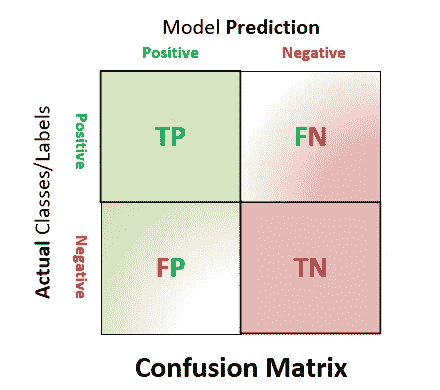

一个`confusion matrix`被构造成一个表格，通常用于描述一个`classification`模型(或“分类器”)在一组真实/真实/实际值已知的测试数据上的性能。它们是根据`Positive classes`和`Negative Classes`来定义的，前者是`positive`的观察值(例如:胸部 x 光图像指示存在肺炎)，后者是`not positive`的观察值(例如:胸部 x 光图像指示不存在肺炎，即正常)。要使用混淆矩阵计算性能指标，我们应该计算以下四个值:-

*   **真阳性** ( `**TP**`):观测值为`positive`，预测为`positive`。
*   **误报** ( `**FP**`):是`negative`的观测值，但被预测`positive` ( *类型 1 错误*)。
*   **真阴性** ( `**TN**`):观测值为`negative`，预测为`negative`。
*   **假阴性** ( `**FN**`):是`positive`的观测值，但被预测`negative` ( *类型 2 误差*)。

`**True**` 此处表示正确分类为阳性或阴性的病例，而`**False**` 表示错误分类为阳性或阴性的病例。

监督学习算法中通常使用的混淆矩阵(在非监督学习中，它通常被称为匹配矩阵),大多数性能指标都是从混淆矩阵中计算出来的。因此，如果我们考虑`**accuracy**` 得分，那么它将使用混淆矩阵计算为((TP+TN)/total)，如下所示:

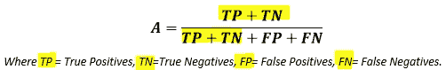

假设两种误差的成本相等，这种精度测量存在问题。根据问题的不同，99%的准确率可以是优秀、良好、一般、差或糟糕。如果我们数据集中的类都具有相似的大小，这可能是一个合理的初始度量。

# 精确

`Precision`反映了报告的实际病例/类别的比例(即阳性鉴定的比例实际上是正确的)。它是通过将正确分类的正例总数除以预测的正例总数(TP/预测的是)来计算的，如下所示

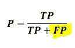

精度用于预测是，并测量其正确的频率。高精度表示标记为正的示例确实是正的(少量 FP)。

# 回忆

我们可以将`Recall`定义为分类器发现的真实类别的比例(TP/Actual Yes)，即实际阳性的比例被正确识别。它有时被称为`Sensitivity`，是正确分类的正例总数除以正例总数的比值，计算如下

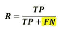

当它实际上是肯定的时候，使用回忆，并且测量分类器预测肯定的频率。它被称为`Sensitivity`或`True Positive Rate(TPR)`。高召回率表示类别被正确识别(少量 FN)。敏感度是一种度量，它告诉我们在数据集中的所有阳性病例中，有多少被算法成功识别，即真阳性。换句话说，它测量准确识别的阳性病例的比例。你可以认为高度敏感的测试有利于排除阴性。如果有人在高灵敏度算法上得到否定的结果，很可能他们没有得到肯定的结果，因为高灵敏度算法的假阴性很低。

> **注意:-**
> 
> **高召回**，**低精度**:这意味着大部分阳性样本被正确识别(低 FN)但有大量的假阳性。
> 
> **低回忆**，**高精度**:这表明我们错过了很多正面的例子(高 FN)，但是那些我们预测为正面的确实是正面的(低 FP)

# f1-分数

因为我们有两个度量(精确度和召回率),所以有一个度量来代表这两者是有帮助的。我们计算一个 F-measure，它使用`Harmonic Mean`代替算术平均值，因为它更多地惩罚了极值。F-Measure 总是更接近精度或召回率的较小值。`F1-Score`是测试准确度的度量，并且用精确度和召回率(精确度和召回率之间的调和平均值)来表示，它可以被认为是同等地惩罚假阴性和假阳性的度量，但是通过它们对完整集的反向分数贡献来加权，以考虑大的类别号层次。它计算如下:-

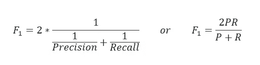

# 脱落(假阳性率)

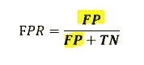

它在实际上是否定的时候使用，并测量分类器预测是的频率。I 计算为(FP/实际数量)

# 特征

特异性测量数据集中的所有阴性病例，其中有多少被算法成功识别，即真阴性。换句话说，它测量准确识别的阴性病例的比例。你可以认为非常具体的测试有利于否定裁决。如果某人在高度特定的测试中有阳性结果，那么他们很可能是阳性的，因为高度特定的算法具有较低的假阳性。它也被称为`True Negative Rate`，当它实际上是否定的时候使用，因此它测量分类器预测否定的频率

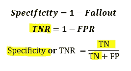

为了尝试计算我们之前提到的评估指标，这就是我们之前创建的测试集出现的地方。这些数据没有被用来建立模型，但是我们确实知道测试集中每个虹膜的正确种类。因此，我们可以对测试数据中的每个虹膜进行预测，并与其标签(已知物种)进行比较。使用以下代码:

```
y_pred = knn.**predict**(X_test)
**print**("Test set predictions:**\n** **{}**".**format**(y_pred))Test set predictions:
 ['virginica' 'versicolor' 'setosa' 'virginica' 'setosa' 'virginica'
 'setosa' 'versicolor' 'versicolor' 'versicolor' 'virginica' 'versicolor'
 'versicolor' 'versicolor' 'versicolor' 'setosa' 'versicolor' 'versicolor'
 'setosa' 'setosa' 'virginica' 'versicolor' 'setosa' 'setosa' 'virginica'
 'setosa' 'setosa' 'versicolor' 'versicolor' 'setosa' 'virginica'
 'versicolor' 'setosa' 'virginica' 'virginica' 'versicolor' 'setosa'
 'virginica']
```

我们可以通过计算**精确度**来衡量模型的效果，精确度是预测到正确物种的花的比例:

```
print(**GetAccuracy**(y_test, y_pred))Predictions have an accuracy of 97.37%.
```

我们也可以使用 knn 对象的`score`方法，它将为我们计算测试集**的准确性**:

```
print("Test set score: **{:.2f}**".format(knn.score(X_test, y_test)))Test set score: 0.97
```

对于这个模型，测试集**的准确度**约为 0.97，这意味着我们对测试集中 97%的虹膜做出了正确的预测。在一些数学假设下，这意味着对于新的虹膜，我们可以预期我们的模型在 97%的时候是正确的。对于我们的应用程序来说，这种高水平的准确性意味着我们的模型足够值得信赖。在大多数情况下，我们已经建立的初始模型被微调以提高其性能，我们一次又一次地重新评估它以获得最终接受的应用模型。

现在，让我们使用`*SciKit-Learn*`来创建我们的`Confusion Matrix,`并计算性能评估指标:

```
**from** **sklearn.metrics** **import** confusion_matrix 
**from** **sklearn.metrics** **import** accuracy_score 
**from** **sklearn.metrics** **import** classification_report 
**import** **itertools**CM = **confusion_matrix**(y_test, y_pred)print ('Confusion Matrix :')
print(CM)Confusion Matrix :
[[13  0  0]
 [ 0 15  1]
 [ 0  0  9]]print ('Accuracy Score :',accuracy_score(y_test, y_pred) )Accuracy Score : 0.9736842105263158print ('Report : ')
print(**classification_report**(y_test, y_pred))**Report** : 
              **precision    recall  f1-score**   support setosa       1.00      1.00      1.00        13
  versicolor       1.00      0.94      0.97        16
   virginica       0.90      1.00      0.95         9 accuracy                           0.97        38
   macro avg       0.97      0.98      0.97        38
weighted avg       0.98      0.97      0.97        38
```

要绘制混淆矩阵:

**def**plot _ Confusion _ matrix(cm，classes，normalize= **False** ，title= '混淆矩阵'，cmap = PLT . cm . blues):
*" " "*
*该函数打印并绘制混淆矩阵。可以通过设置“normalize=True”来应用规范化。*
 ***if**normalize:
cm = cm . astype(' float ')/cm . sum(axis = 1)[:，np.newaxis]
print("规格化的混淆矩阵")
**else** :
print('混淆矩阵，无规格化')*

```
 *print(cm) plt.imshow(cm, interpolation='nearest', cmap=cmap)
    plt.title(title)
    plt.colorbar()
    tick_marks = np.arange(len(classes))
    plt.xticks(tick_marks, classes, rotation=45)
    plt.yticks(tick_marks, classes) fmt = '.2f' **if** normalize **else** 'd'
    thresh = cm.max() / 2.
    **for** i, j **in** itertools.product(range(cm.shape[0]), range(cm.shape[1])):
        plt.text(j, i, format(cm[i, j], fmt),
                 horizontalalignment="center",
                 color="white" **if** cm[i, j] > thresh **else** "black") plt.ylabel('True label')
    plt.xlabel('Predicted label')
    plt.tight_layout()*# Plot confusion matrix*
plt.figure()
plot_confusion_matrix(CM, classes=iris['target_names'], title='Confusion matrix, without normalization',normalize=**True**)
plt.show()*
```

*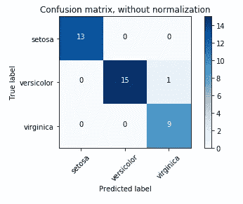*

# *结论*

*让我们在这里总结一下我们的故事。我们从问题陈述和算法选择开始，通过使用花的物理测量来制定预测特定花属于哪种鸢尾的任务，然后我们准备我们的项目并加载相关的数据集。我们使用一个由专家用正确的物种进行注释的测量数据集来建立我们的模型，使这成为一个监督学习任务(三类分类问题)。之后，我们开始探索和可视化数据以了解它，然后将我们的数据分为训练集和测试集，以构建我们的模型，并通过训练和测试来拟合它。简单地说，我们可以将构建机器学习应用程序的基本步骤总结如下*

*   *定义问题*
*   *描述解决方案并选择算法*
*   *准备项目环境*
*   *探索和可视化数据*
*   *准备数据并将其拆分*
*   *建立并训练一个初始模型*
*   *评估和微调*
*   *构建最终模型并对其进行评估*
*   *将最终模型应用于看不见的数据*

*最后，请注意，`**fit**`、`**predict**`和`**score**`、**、**方法是 *scikit-learn* 中监督模型的公共接口，借助本章介绍的概念，您可以将这些模型应用于许多机器学习任务。*