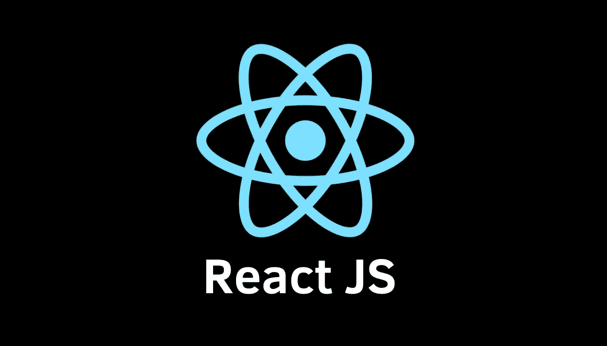

# 启动新的 ReactJS 应用程序并设置环境

> 原文：<https://medium.com/analytics-vidhya/starting-a-new-reactjs-app-and-setting-up-the-environment-308e55974207?source=collection_archive---------22----------------------->

# 首先，了解基础知识

React 是一个伟大的框架来建立网站，并为你的工作做好准备！这是一个由脸书设计的超级流行的框架，它使得组织你的代码和布局可重用的 JavaScript 变得容易！这可能有点让人摸不着头脑，但是一旦开发者同意了，你的生活就会变得容易得多。一旦你花了一些时间在 React 上，折腾组件，道具，在状态中保存数据，使用 Redux 和 JSX 的商店都将成为你的第二天性！ReactJS 的最终目的是**向用户展示 HTML 并处理交互**。

# 让我们创建一个新的 ReactJS 应用程序！

要开始，我们所要做的就是打开我们选择的代码编辑器，直接进入终端。一旦我们选择了项目文件夹(你想要保存文件的地方)，我们就可以开始了。我个人也会准备好你最喜欢的浏览器，因为你会在编码时实时更新它！

在终端中，我们需要下载一些节点包，为此有几种不同的方式。旧的方法是用 npm 安装，但是我建议在创建时使用 npx 路径，因为它省去了初始化的一个步骤！

下面是启动新 ReactJS 应用程序的代码:

> npx 创建-反应-应用 myapp

这是我们输入终端的内容。npx 是使用 npm 的新方法，它代表**节点包管理器**。这里的“myapp”将是您想要为您的项目使用的任何名称。这里不要使用空格，甚至不要使用大小写字母——只用一个词就可以了(保持简单！).

一旦完成，请确保我们 **cd** 进入我们的新应用程序！这通常是许多新 React 开发人员感到恼火的地方——“我只是制作了应用程序；为什么启动不了？”因为我们使用了一个项目文件夹来制作它，所以我们实际上必须让自己*进入*这个项目。

一旦进入项目本身，我们就可以启动它了！

# 启动 React 应用程序

为了启动 ReactJS 应用程序，我们再次在终端中键入一个命令:

> npm 开始

这将在一个**本地主机**上启动 ReactJS 应用程序，或者一个我们只能看到的离线托管站点。这允许我们在编码时实时更新和修改它！它应该在 localhost:3000 上，除非另一个本地主机正在您的机器上运行，它可能会转到 localhost:3001、3002 等…

> **注意:**要停止我们的 localhost，而在终端按“control + c”

当您启动 ReactJS 应用程序并弹出本地主机时，您将看到一个带有 React 徽标和几个单词的网站打开。这是**内置的功能，用于向用户显示他们的本地主机正在运行**。但是，我们想要做的是去掉这些预制的代码，这样我们就可以从头开始我们的项目了！

要做到这一点，我们需要知道启动 app 时带入了哪些文件，要删除哪些文件，要替换哪些文件。

# 要删除和重新制作哪些文件

我们将有多个文件夹出现后，我们创建我们的反应应用程序。它们如下:

**src** —代表*源文件夹*。这是我们放源代码的地方。

**public** —这包含了我们所有不同的*静态文件*。静态文件是我们不变的 HTML 文件，我们的图像文件等等。

**节点模块** —这对于项目来说有不同的依赖关系，这是*我们几乎永远不会触及的*。

**package.json** —这个*从所有不同的依赖项*中配置我们的项目。你将在这里做大量的数据控制工作！

**package-lock.json** —记录了我们安装的*包的确切版本。*

README.md —这是项目的自述文件；它将*包含说明(由您编写！)在我们创造的东西上*。

**。git ignore**——这将 git 应该忽略的*文件和文件夹*放在一起，同时我们改变我们的代码库。

从头开始，**删除 src 文件夹** ( *中的所有内容，但不删除文件夹本身！*)这样我们就可以自己做 app 了。一旦发生这种情况，我们在本地主机上看到的所有内容都应该是空白的。现在，我们创建一个 index.js 文件放在我们的 src 文件夹中，我们将在这里创建我们的应用程序！

# 最后，我们将设置一个非常简单的 React 应用程序

要设置我们的 ReactJS 应用程序，我们需要**导入文件**，制作**功能组件**(我们将在另一篇博客中讨论基于类的组件)，并让我们的 **DOM 呈现**。

要导入，请在 index.js 文件的顶部写入以下内容:

> 从“React”导入 React；
> 
> 从“react-dom”导入 ReactDOM

这两行将导入必要的 react 库，以确保我们确实在 ReactJS 应用程序中使用它(嗯，我们需要它！).

为了启动一个功能组件，我们在 index.js 文件中的 imports 下添加了以下代码:

> const App = () => {
> 
> 返回
> 
> Hello world；
> 
> };

例如，简单地用名称“App”来制作箭头函数。在箭头函数中，看起来我们做了一些 HTML(什么？？)但实际上这只是 JSX 的！这是用 React 制作的独特的 JavaScript，看起来像 HTML，使我们的生活变得非常非常容易。我们将在后面的文章中深入讨论基于功能/类的组件和 JSX。从这里开始让应用程序运行！

为了呈现我们的应用程序，我们最后将这段代码添加到 index.js 文件的底部:

> ReactDOM.render(
> 
> <app>，document . query selector(“# root”)</app>
> 
> );

这使我们的 ReactJS 应用程序呈现到 DOM(文档对象模型)，并接收我们的应用程序组件和查询从我们的文档中选择根(当我们在 public 文件夹中创建 react 应用程序时下载的)。这看起来有点复杂，但是当你开发一个新的应用程序时，这将成为你的第二天性，不会有太多的麻烦。

# 干得好！

现在我们可以在本地主机中看到，它显示“hello world ”,就像我们在函数组件返回的

中看到的一样！如果你懂一些 HTML，试试 JSX，写一些不同的东西。恭喜你。您不仅启动了一个 ReactJS 应用程序，还为自己创建了一个 scratch index.js 文件，并导入和渲染了正确的文件！现在，当我们在 React 中扩展我们的知识时，我们只需要发挥我们的创造力和组织能力。保持下去！