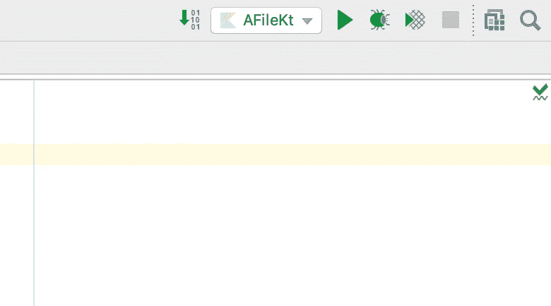

# 编程的第一步开始 Kotlin 编程。

> 原文：<https://medium.com/analytics-vidhya/starting-kotlin-programming-6cabbcf005e1?source=collection_archive---------20----------------------->


你好，

令人惊讶的是，你对学习和编写 Kotlin 程序感兴趣，这就是为什么这篇文章是为你写的。它着重于让你开始编写 kotlin 程序的基础知识。

## Kotlin 编程语言是关于什么的？

简单来说，Kotlin 是一种程序员友好的编程语言，语法直观，易于理解。它用于构建 Android 应用程序，可用于构建服务器端应用程序、跨平台应用程序和一系列其他有趣的东西。近来它越来越受欢迎，所以弄脏你的手也未尝不可。

## 如何入门…

1.  给你买台电脑💻
2.  在此安装 Java 开发工具包(JDK)👇🏽[*https://www . Oracle . com/tech network/Java/Java se/downloads/index . html*](https://www.oracle.com/technetwork/java/javase/downloads/index.html)
3.  在此安装 IntelliJ IDE👉🏽[*https://www.jetbrains.com/idea/download/*](https://www.jetbrains.com/idea/download/)
4.  按照安装步骤操作，当安装完成，您的 IntelliJ IDE 准备就绪时，继续。否则，请寻求安装帮助/获取可以运行 Kotlin 程序的 IDE。
5.  打开 IntelliJ 应用程序后，您应该会看到如下所示的对话框。


新打开的 IntelliJ 应用程序。

## 创建新项目。

*   点击`Create New Project`
*   选择`Kotlin`、`Kotlin/JVM`
*   输入项目的标题(可以是任何内容)
*   点击`Finish`按钮。


在 images 中创建新项目。

## 创建新文件。

*   单击 Finish 按钮后，您应该会看到这样一个窗口。👇🏽


新创建的 IntelliJ Kotlin 项目的图像。

*   在上图中，右键点击了`src`文件夹，接着是`New`，然后是`Kotlin File/Class`。单击后，您应该会看到一个对话框，要求您命名想要创建的文件类型。选取“文件”，然后给文件命名。


*   最后，您已经创建了您的文件，在我们的例子中是`aFile.kt`,此时我们可以开始了。


aFile.kt 是我们创建的 Kotlin 文件的名称。

## 编写您的第一个程序😊

复制粘贴，或者如果你喜欢打字🤷🏼‍♂️…，我把下面的内容写到你创建的科特林文件中。(P.S .把你的名字换成我的。)

```
**fun** main(){
    *println*(**"Hello, It's Simi!"**)
}
```

这是你的第一个科特林程序！！！简单对吗？

## 看到结果了！

有两种方法可以解决这个问题:

1.  进入`Menu`->-`Run` ->，点击`Run…`
2.  单击您在 IDE 中看到的播放按钮。



你应该看看这个


你猜怎么着？你已经告诉计算机打印出你的名字了！！！！它做到了！！！

你一定想知道那些`fun` `main()`和`println()`是什么意思，别担心，我们会保护你的…

## 简单来说:

`fun`:用于为要写入的代码创建一个包围。用专业术语来说，叫做一个[功能](https://www.tutorialspoint.com/computer_programming/computer_programming_functions.htm)。

`main`:科特林计划的切入点。

`println`:用于将东西打印到控制台或显示程序输出。

正如您所料，编写 Kotlin 代码的内容远不止这些，但是万岁！！你已经开始用科特林编程了！请继续关注科特林的更多课程🤗不要忘记写下你的评论，给一些掌声👍

*所有课程的完整源代码可以在这个 repo 中找到:*[*https://github . com/simi-aluko/baby-steps-to-programming-in-kotlin*](https://github.com/simi-aluko/baby-steps-to-programming-in-kotlin)