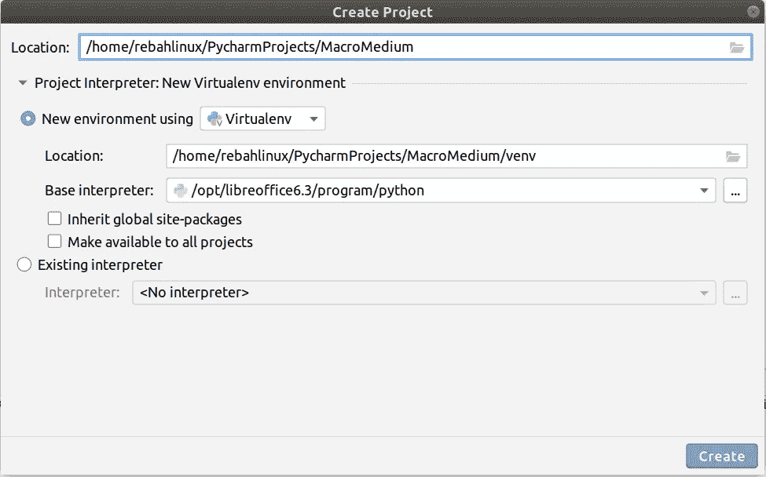

# 使用 Python 启动 libre office—使用 Python 在 OpenOffice/LibreOffice 中进行宏编程[EN]-2

> 原文：<https://medium.com/analytics-vidhya/starting-libreoffice-with-python-macro-programming-in-openoffice-libreoffice-with-using-10310f9e69f1?source=collection_archive---------0----------------------->


大家好，我已经有一段时间没有写这个系列的第二篇文章了，因为我因为考试有点忙。现在该继续了:)

在本文中，我将解释如何用 Python 打开 LibreOffice 并连接到我们打开的 Office。我们将为此编写一个函数。

从现在开始，我将在我的文章中使用 PyCharm 作为集成开发环境(IDE)。我建议你使用它。要设置我们的 IDE，首先，让我们在 PyCharm 中创建一个项目，我们将在其中编写宏。



创建项目时，让我们创建一个新的虚拟环境，如屏幕截图所示。作为 Python 基础解释器，我们还是选择 LibreOffice 自带的 Python 解释器吧。我在以前的文章中解释了在哪里可以找到这个解释器。

```
Error: standard python 'venv' module not found
```

***注意*** *:如果创建项目后遇到这样的错误，请用默认的 base 解释器重新创建项目。然后在项目设置中编辑解释器，用 LibreOffice 的 Python 解释器替换默认解释器。*

现在让我们用。py 扩展名。如果您的操作系统是 Windows，您应该将下面的代码块添加到函数的开头。如果您不使用 Windows，则不能添加它。

```
import sys
import os

if sys.platform == 'win32':
    #This is required in order to make pyuno usable with the default python interpreter under windows
    #Some environment variables must be modified

    #get the install path from registry
    import _winreg
    # try with OpenOffice, LibreOffice on W7
    for _key in [# OpenOffice 3.3
                 "SOFTWARE\\OpenOffice.org\\UNO\\InstallPath",
                 # LibreOffice 3.4.5 on W7
                 "SOFTWARE\\Wow6432Node\\LibreOffice\\UNO\\InstallPath"]:
        try:
            value = _winreg.QueryValue(_winreg.HKEY_LOCAL_MACHINE, _key)
        except Exception as detail:
            _errMess = "%s" % detail
        else:
            break   # first existing key will do
    install_folder = '\\'.join(value.split('\\')[:-1]) # 'C:\\Program Files\\OpenOffice.org 3'

    #modify the environment variables
    os.environ['URE_BOOTSTRAP'] = 'vnd.sun.star.pathname:{0}\\program\\fundamental.ini'.format(install_folder)
    os.environ['UNO_PATH'] = install_folder+'\\program\\'

    sys.path.append(install_folder+'\\Basis\\program')
    sys.path.append(install_folder+'\\program')

    paths = ''
    for path in ("\\URE\\bin;", "\\Basis\\program;", "'\\program;"):
        paths += install_folder + path
    os.environ['PATH'] =  paths+ os.environ['PATH']
```

在 Windows 上，Python 在运行 UNO 时遇到了问题。这段代码解决了这个问题。

现在让我们定义我们的主要功能。

```
**import** os
**import** shutil
**import** subprocess
**import** tempfile
**import** time
**import** uno
**import** uuid
**from** com.sun.star.connection **import** NoConnectException **def** start_libreoffice():
    *# This depends on your LibreOffice installation location.* sofficePath = **'/opt/libreoffice6.3/program/soffice'** tempDir = tempfile.mkdtemp()

    *# Restore cached profile if available* userProfile = tempDir + **'/profile'** cacheDir = os.getenv(**'XDG_CACHE_DIR'**, os.environ[**'HOME'**] + **'/.cache'**) + **'/lo_profile_cache'** **if** os.path.isdir(cacheDir):
        shutil.copytree(cacheDir, userProfile)
        profileCached = **True
    else**:
        os.mkdir(userProfile)
        profileCached = **False***# Launch the LibreOffice server* pipeName = uuid.uuid4().hex
    args = [
        sofficePath,
        **'-env:UserInstallation=file://'** + userProfile,
        **'--pidfile='** + tempDir + **'/soffice.pid'**,
        **'--accept=pipe,name='** + pipeName + **';urp;'**,
        **'--norestore'**,
        **'--invisible'**]
    sofficeEnvironment = os.environ
    sofficeEnvironment[**'TMPDIR'**] = tempDir
    subprocess.Popen(args, env=sofficeEnvironment, preexec_fn=os.setsid) *# Open connection to server* **for** i **in** range(100):
        **try**:
            localContext = uno.getComponentContext()
            resolver = localContext.ServiceManager.createInstanceWithContext(**"com.sun.star.bridge.UnoUrlResolver"**,localContext)         
            context = resolver.resolve(**"uno:pipe,name=%s;urp;StarOffice.ComponentContext"** % pipeName)
            **break
        except** NoConnectException:
            time.sleep(0.1)
            **if** i == 99:
                **raise** *# Cache profile if required* **if not** profileCached:
        shutil.copytree(userProfile, cacheDir)
    return_list = [context.ServiceManager.createInstanceWithContext(**"com.sun.star.frame.Desktop"**,context), context]
    **return** return_list
```

在这个函数中，您必须将 sofficePath 变量更改为 LibreOffice 的安装位置。我在第一篇文章中解释过。

如果我们在这一点上没有问题，那么当我们调用这个函数时，应该在后台打开 soffice。调用该函数后，您可以在任务管理器的运行进程中看到名为 Soffice.bin 的应用程序。

我们定义的函数返回一个列表作为结果。如果愿意，可以简单地返回名为 context 的变量，并用这个对象定义 return_list 的第一个变量。但我觉得如上定义更有用。

要查看更高级的例子，您可以查看我为这个博客系列创建的知识库。

[](https://github.com/rebahozkoc/libreofficepythonmacros) [## GitHub-rebahozkoc/libre office Python macros:libre office Python 宏示例

### LibreOffice Python Macros 是一个处理 LibreOffice 文档的项目。项目是用 Python 写的。它有…

github.com](https://github.com/rebahozkoc/libreofficepythonmacros) 

在我的下一篇文章中，我将解释如何用我们返回的对象打开一个新文档或一个现有文档。再见:)

创建本系列文章时，我会参考以下重要资源:

[](https://muhammetkara.com/) [## 穆罕默德·卡拉

muhammetkara.com](https://muhammetkara.com/)  [## 哦，床单！— oosheet 1.3 文档

### OOSheet 是一个 Python 模块，用于操作 LibreOffice 电子表格文档和创建宏。使用 Python，您可以…

oosheet.readthedocs.io](https://oosheet.readthedocs.io/en/stable/)  [## www.pitonyak.org/oo.php

### Andrew Pitonyak 我的 OpenOffice.org 宏文档(更新于美国东部时间 2015 年 6 月 12 日 11:19:53 PM)包含许多示例。这个…

www.pitonyak.org](http://www.pitonyak.org/oo.php)