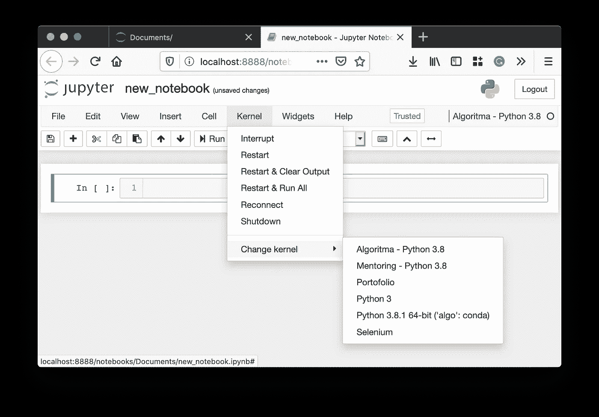
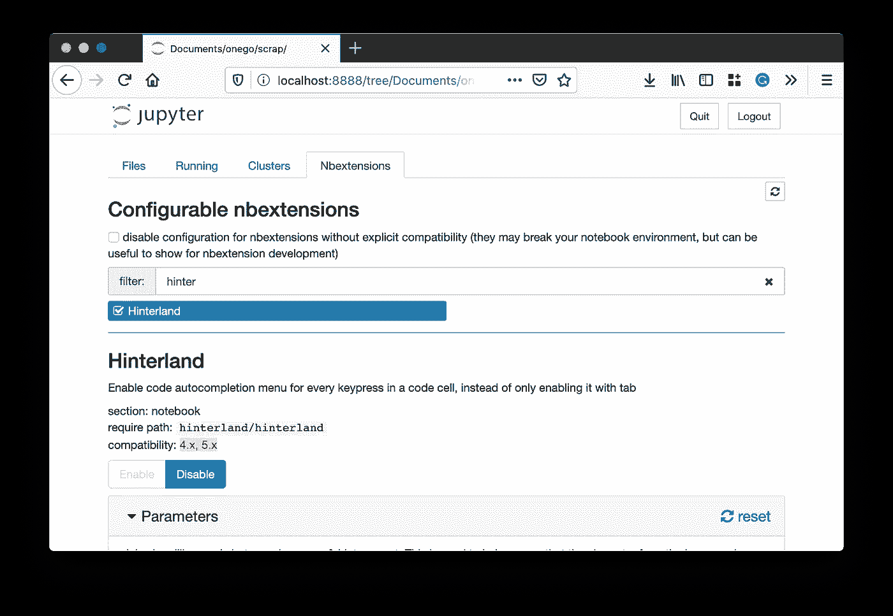
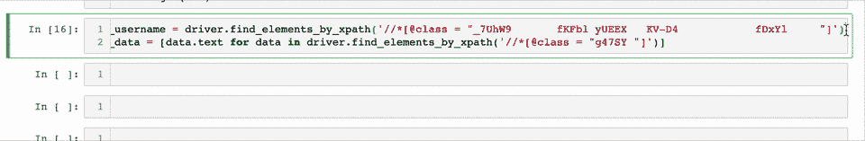
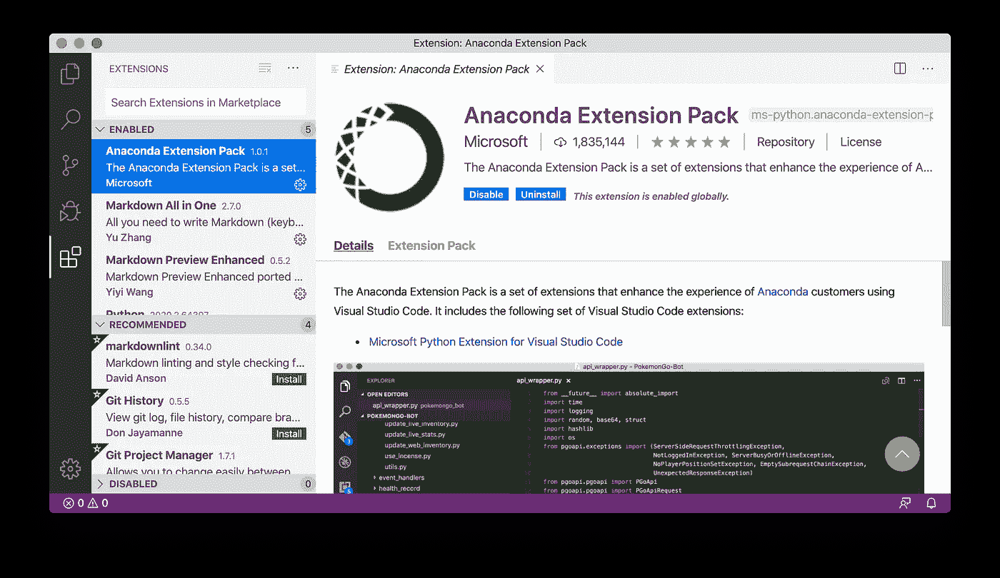

# 在 conda 环境中开始您的 Python 数据科学项目

> 原文：<https://medium.com/analytics-vidhya/starting-python-data-science-project-on-conda-environment-c19221baa985?source=collection_archive---------12----------------------->

## 关于使用 conda 和 pip 完成第一个 python 数据科学项目的一些技巧

图片由 [anaconda](https://twitter.com/anacondainc) 在 [twitter](https://twitter.com/anacondainc/status/746040175315189760) 上发布

我是数据科学的新手。在寻找我现在状态的路上，我经历了艰难的过程。本文包含了我第一次进入 anaconda 环境时获得的一些经验。

# 1.将 Anaconda 添加到路径

如果您是 windows 用户，必须将 Anaconda 设置为 python 的默认路径，除非您不打算这样做。同时使用两个不同的终端(anaconda 提示符和命令提示符)感觉怪怪的。通过将 Anaconda 添加到 PATH，您可以在命令提示符下调用任何 conda 命令。这也将减少使用另一个 IDE(如 pycharm 或 vscode)时不可读 python 路径的可能性。

# 2.总是在新环境中安装 pip

大多数人仍然不知道康达和皮普之间有什么不同。安装 pip 似乎更容易，大多数时候，我发现几乎每个教程都使用 pip。当您使用`conda create -n <new_env_name>`创建一个空环境，然后在这个新环境上执行`pip install <package>`时，问题就来了。该软件包将被**安装在** `base`环境中，而不是新的环境中。

默认情况下，在 conda 中安装新环境不会安装自己的 pip。因此，您计算机上的 pip 路径仍然是`base`使用的路径。在使用 Anaconda 几个月后，我意识到了这一点。太可惜了哈哈。然而，如果你指定了一个类似于`conda create -n <new_env_name> python=3.8.*`的 python 版本，或者使用`conda create -n <new_env_name> pip`显式安装`pip`，那么它将会安装`pip`(与`base`的路径不同)。

# 3.在 Jupyter 笔记本中安装 ipykernel 在内核之间切换

base jupyter 笔记本上可用的内核列表

我曾经用硬方法改变内核:关闭笔记本电脑，改变环境，重新启动笔记本电脑。然而，由于 ipykernel 安装在我想要的每个环境中，我可以从 jupyter notebook 切换到它，而不用关闭它。请参见下面的代码来安装 ipykernel

# 4.尝试使用腹地，即使它很烂

默认不安装`Nbextensions`带来的腹地。可以用`pip install jupyter_contrib_nbextensions`安装。如果你已经安装了`Nbextensions`，找到`Hinterland`，点击启用。

当我第一次学习编码时，激活`hinterland`帮了我很大的忙，尤其是当我不记得对象内部复杂的方法名时。在这一点上，`hinterland`是好的。

然而，这种扩展有一个缺点。自动完成功能经常会误导用户，而不是给出建议。在下面的例子中，我试图键入。text "来提取`selenium`驱动元素的值。看看`hinterland`给了我什么？当我输入“tex”时，一个“texte”单词会自动完成。糟透

Vscode 的`Pylint`在其`Python`扩展中要好得多。

# 5.尝试使用 VSCode

自 2015 年首次推出以来，Visual Studio 代码(通常称为 vscode)在开发人员社区中获得了巨大的欢迎。过去三年的堆栈溢出开发者调查( [2017、](https://insights.stackoverflow.com/survey/2017#technology-_-most-popular-developer-environments-by-occupation) [2018](https://insights.stackoverflow.com/survey/2018#development-environments-and-tools) 、 [2019](https://insights.stackoverflow.com/survey/2019#development-environments-and-tools) )显示，vscode 受到喜爱，并在上次调查中达到所有受访者的 50%以上。

它排名第一不是没有原因的。如果你是数据科学或编程的新手，试着用它来适应世界上“共同的”工作环境。为了在 VScode 中运行`jupyter notebook`，需要安装`Python`和`Anaconda Extension Pack`扩展。

老实说，比起 jupyter 笔记本，我更喜欢 vscode。这个决定是在我体验了更好的 python 林挺和推荐、同一个 IDE 上的多个控制台以及 git 集成之后做出的。我来自普通编程社区，所以我的观点非常偏颇。但这是我在寻找最舒适的 IDE，用于所有任务的结果。

让我向您快速回顾一下 vscode 与 jupyter 笔记本的对比

vscode 和 jupyter notebook 都可以很容易地改变内核/环境。然而，默认情况下，vscode 不需要安装`ipykernel`,因为它能够直接为您打开的每个文件更改 python 路径。

Jupyter notebook 拥有 Nbextensions，从“笔记本”的角度来看，比 vscode 更好。它有目录表，细胞分裂，隐藏，测验等。但是，如果你不是一个真正的整洁的作家，更关注集成或通用目的，vscode 提供了更多的扩展。

在 jupyter 笔记本中打开新笔记本速度更快。发生这种情况是因为每次 vscode 打开新的笔记本时，你需要指定(可以自动指定)python 环境来运行笔记本。因此，我经常花更多的时间来选择和连接我的笔记本和 vscode 中的内核。

我希望这篇文章能帮助你更熟悉康达数据科学的工作环境。如果你是新来的，我也经历过你的处境。只是不要放弃学习。

*学习应该是很难的。所以让你的意志更坚强。*