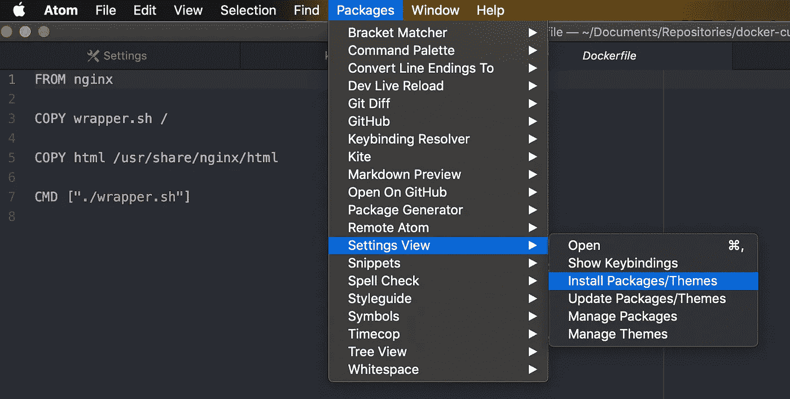
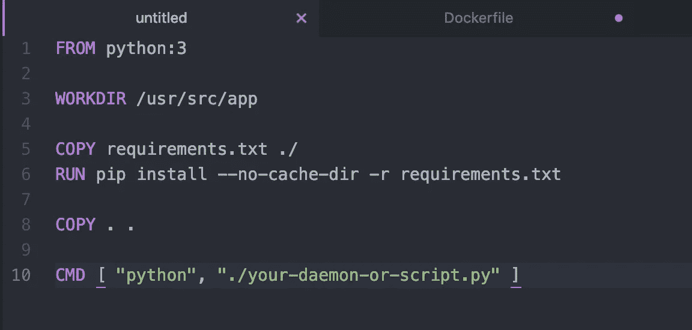
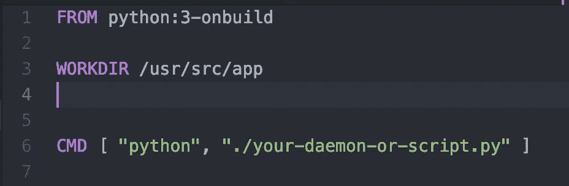
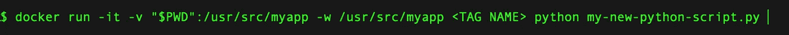
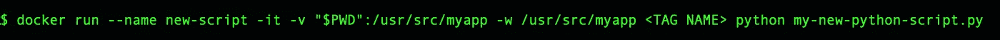

# 从 Docker 开始

> 原文：<https://medium.com/analytics-vidhya/starting-with-docker-bfd74021d5c7?source=collection_archive---------9----------------------->

一个 Docker 帖子已经永远在我的待办事项列表上了:现在是时候了！

照片由 [Nilantha Ilangamuwa](https://unsplash.com/@ilangamuwa?utm_source=medium&utm_medium=referral) 在 [Unsplash](https://unsplash.com?utm_source=medium&utm_medium=referral) 上拍摄

## 为什么是 Docker 呢？

*   如果你曾经不得不使用一个虚拟的*机器*，你就会知道它们有多慢多重——它们占据了太多的空间！Docker 更快更轻！
*   如果您曾经在您的本地机器虚拟环境(您的代码在其中工作)和将它部署到其他地方(甚至是*与*相同的环境)之间遇到过问题，在那里它突然不再工作了，Docker 可以提供一个工作空间，它在您的本地机器上运行将与在远程机器上运行完全相同，因为它实际上是同一个“机器”！变量更少，故障排除更简单。

使用`Dockerfile`文件中的指令，Docker 将您的环境——库、任何依赖项、环境变量和配置文件等——和*代码* *一起*打包成一个`image`,您可以与任何人共享。然后他们可以在他们的机器上`run`图像，无论你发送给他们什么都可以工作！💥

## 那么，我们如何开始？

1.  创建一个码头中心账户:[https://hub.docker.com](https://hub.docker.com)
2.  从 docker hub 下载 docker。
3.  下载完成后(如果你用的是 Mac 的话，会被拖到应用程序中)，点击它，等待 docker 启动(需要一些时间)。启动后，docker 符号应该会出现在电池和 wifi 符号旁边的状态栏顶部。
4.  打开一个终端，从任何目录中键入`docker run hello-world`，它将从 Docker Hub 获取 Hello World 映像，构建它，并打印一条消息。或者，更简单地说，你也可以只输入`docker info`,你就会得到你机器上所有 Docker 信息的打印结果😁
5.  希望这行得通！

## 一些可以尝试的事情:

**探索你正在做的事情—**

*   `docker images`查看您有哪些图像。目前可能没有。
*   `docker ps`或`docker ps -a`查看哪些容器是或曾经是活动的。如果你什么都没有，做`docker run busybox`然后再试`docker ps -a`。您应该会看到新的一行。记下`<IMAGE>`图像名称，以及`<CONTAINER ID>`、`<STATUS>`和`<NAMES>`，因为这些可以在命令行中引用，以执行诸如删除、停止或运行特定的操作。

**跑步—**

*   `docker run <IMAGE>`启动 docker 容器并在其中运行您的程序。
*   如果你没有要运行的图像，试试`docker run busybox`，它会在你的机器上显示，然后搜索 [Docker Hub](https://hub.docker.com) 找到它，下载它，并在一个容器中运行它。您还可以使用`docker pull <IMAGE>`从 Docker Hub 获取图像。你可以在[中心点击](https://hub.docker.com/search?&q=)查看更多图片。
*   `docker run -it <IMAGE> sh`运行图像，并打开一个 shell 以便可以直接与容器交互。如果容器已经在运行，执行`docker exec -it <CONTAINER ID> sh`在容器中得到一个 shell 提示。

**停止并移除 docker 物件—**

*   `docker stop <CONTAINER ID>`以优雅的方式停止容器运行。但是容器仍然存在，所以在某个时候你需要移除它。
*   `docker system prune -a` ***删除你机器上的每个图像和每个容器！*** 😱然而，在执行这个请求之前，*会要求*确认，这很好🎉
*   更明智的`rm`命令包括:`docker rm <CONTAINER ID>`删除特定的容器，`docker container prune`仅删除停止的容器，`docker rmi`删除图像。
*   提示:在输入<container id="">时，你只需要输入前几个值，它就会知道你指的是哪一个。✨</container>
*   有关移除图像、容器和卷的更多信息，请查看数字海洋的[这篇文章。](https://www.digitalocean.com/community/tutorials/how-to-remove-docker-images-containers-and-volumes)
*   `docker -h`查看还有哪些命令可用。

## **制作自己的<形象>**

为了创建你自己的图像，你需要打一个 order 文件。如果您当前的文本编辑器还没有安装语法荧光笔，安装语法荧光笔会有助于提高可读性。我使用 Atom，有几个 Docker 语法高亮器可供安装👍要在 Atom 中找到它们，打开 Atom，选择`Packages`->-`Settings View`->-`Install Packages/Themes`，然后在搜索栏中键入类似`Docker highlighter`的内容。

如何在 Atom 文本编辑器中安装附加包？可以帮助安装一个 Docker 语法荧光笔。上面的代码显示了 Dockerfile 语法高亮显示。

## `Dockerfile`

这是指令文件。通常，我们将 Dockerfile 建立在一个已经存在的映像上，这样我们就不必从头开始构建映像。例如，如果您想在您的容器中运行 python 代码，那么您可以将您的 docker 文件基于一个[现有的 python 映像](https://hub.docker.com/_/python/)。为此，第一行将是`FROM <IMAGE>`，其中`<IMAGE>`是预先存在的图像。下面的截图显示了一个基于[官方 Python3 图片](https://hub.docker.com/_/python/)的 Dockerfile。

从如何在 Docker Hub 上使用 [Python 映像的示例中复制到 Atom 中的示例 Docker 文件的屏幕截图](https://hub.docker.com/_/python/?tab=description)

**第 1 行:**标签`:3`指定使用哪个版本的图像。对于 python 2 版本，这也可以读作`FROM python:2`。对于所有不同的版本或标签，请查看 python Docker Hub 页面上的[支持的标签。](https://hub.docker.com/_/python/)

**第 3 行:**指定容器的工作目录`WORKDIR`

**第 5 行&第 6 行:**将`reqiuirements.txt`从本地机器上的当前目录复制到`WORDKDIR`容器中，然后`RUN`安装文件中列出的所有库。

**第 8 行:**所有内容都从本地机器上的当前目录复制到容器中的`WORKDIR`

**第 10 行:**`CMD`命令在新容器中启动 python 脚本💥

**提示！**用`FROM python:3-onbuild`写更少的行，这将包括复制文件部分和来自`requirements.txt`的需求的安装。上面的 Dockerfile 文件变成:

最后，构建映像，共享并运行:

*   `docker build -t <TAG NAME> .`将从这个 docker 文件构建图像，给它一个对你有意义的`-t`标记名。`.`表示 Dockerfile 文件是当前位置。
*   `docker run -it <TAG NAME>`将在`-i`交互模式下运行新图像。

如果您想使用 Docker Hub 或其他地方的图像，而不需要额外的库或环境变量等，并使用它运行一个脚本，该怎么办？一定要写 Dockerfile，建立新形象吗？

相反，我们可以运行下面的命令来启动一个直接基于图像`<TAG NAME>`的容器，比如官方的 python 图像，并在其中运行脚本`my-new-python-script.py`:

运行不包含在映像构建中的脚本的命令

*   `docker run -it`和以前一样，在脚本所在的目录下运行。
*   `-v "$PWD":/usr/src/myapp`将本地目录——或`-v`卷——直接挂载到容器，这意味着所需的脚本必须在当前的本地目录中。
*   `-w /usr/src/myapp`定义工作目录。即使在构建映像的 Dockerfile 文件中指定了`WORKDIR`，这也是必要的。
*   `<TAG NAME> python my-new-python-script.py`正在指定要使用的图像，然后调用 python 脚本。

如果您想从同一个映像运行几个容器，并且不想使用随机生成的容器名，可以用标志`--name`指定一个容器名。

命令来运行不包含在映像构建中的脚本，并将容器命名为“new-script”

在上面的终端代码中，容器被命名为“new-script ”,所以我知道哪个脚本在那个容器中运行。然而，容器名必须是唯一的，记住这一点。

目前就这些。要记的东西太多了，很容易让人不知所措。一些方便的资源包括:

*   命令行参考[https://docs . docker . com/engine/reference/command line/docker/](https://docs.docker.com/engine/reference/commandline/docker/)
*   码头工人自己的课程【https://docker-curriculum.com 

现在，不要忘记清理你退出的容器！！！👋