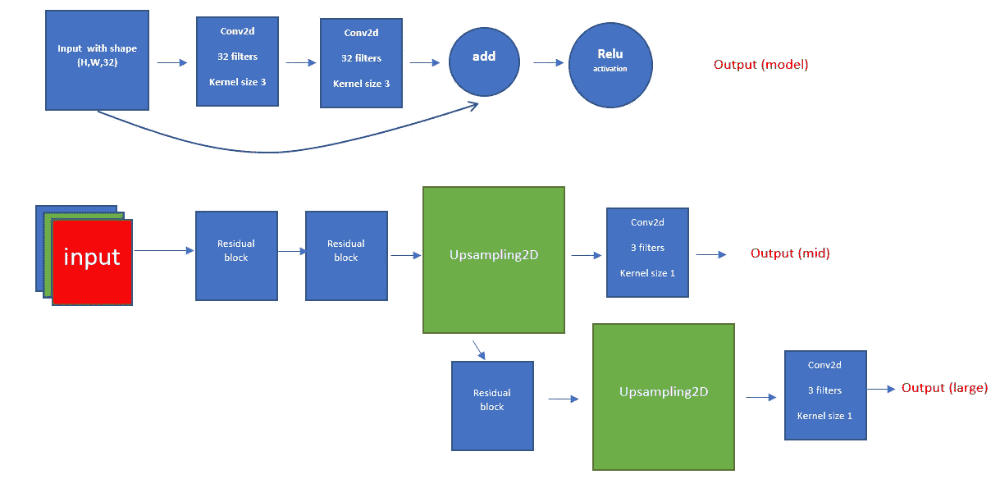

# 超分辨率入门

> 原文：<https://medium.com/analytics-vidhya/starting-with-super-resolution-26573b9cfcb7?source=collection_archive---------31----------------------->

在这篇文章中，我将基于 PASCAL-VOC 2007 数据集总结我使用[超分辨率](https://en.wikipedia.org/wiki/Super-resolution_imaging)任务的简短经验。在本次会议期间，我尝试了几种不同型号的超分辨率图像，从 72*72*3 到 144*144*3，再到 288*288*3。

这个任务首先需要的是获取数据集，我使用了[ka ggle](https://www.kaggle.com/)预装的数据集。
因为我训练了不同的模型，并且有大量的数据，所以在整个工作中，我使用了数据生成器来加载图像并调整它们的大小。

## 用于加载图像的数据生成器

```
import cv2
import osimage_dir = '../input/pascal-voc-2007/voctrainval_06-nov-2007/VOCdevkit/VOC2007/JPEGImages'def load_images_iter(amount = 64,start_pos = 0, end_pos = 5011):
  ans = []
  all_im = os.listdir(image_dir)
  all_im.sort()
  print (len(all_im))
  while (True):
    for idx,img_path in enumerate(all_im[start_pos:end_pos]):
      if (len(ans) !=0 and len(ans)%amount == 0):
        ret = ans
        ans = []
        yield ret
      ans.append(cv2.imread(image_dir+"/"+img_path))
```

这里的排序函数不是强制性的。我使用它是因为我使用生成器不仅是为了训练和验证模型，也是为了查看模型结果。因此，我需要确保我一直在看相同的图片，所以 sort 函数保证了这一点。

我为不同的用途创造了几种不同的发电机。这是一个训练集生成器的例子(数据被分割，前 1000 张图片用于验证，其余的用于训练)。为了调整图片的大小，我使用了 CV2 的调整大小功能。

## 列车数据发生器

生成器返回一个元组，第一个值是 train，第二个值是 output21 的另一个元组，输出 2 个预期结果。

```
def train_generator_2(batch=64, tar1_size=144, tar2_size=288 , train_size=72):
  collect_train = []
  collect_target_1 = []
  collect_target_2 = []
  while True:
      file_gen = load_images_iter(amount=batch, start_pos = 
                          1000)#first 1000 images are for validation
      imgs = []
      while (True):
        try:
          imgs = next(file_gen)
        except:
          break
        for idx,img in enumerate(imgs): 
          if (len(collect_train)!=0 and
                  len(collect_train)%batch == 0):
            ans_train = np.asarray(collect_train,dtype=np.float)
            ans_target_1 = 
              np.asarray(collect_target_1,dtype=np.float)
            ans_target_2 = 
              np.asarray(collect_target_2,dtype=np.float)
            collect_train = []
            collect_target_1 = []
            collect_target_2 = []
            yield (ans_train, (ans_target_1,ans_target_2))
          collect_train.append(cv2.resize(img,
                              (train_size,train_size))/255.0)
          collect_target_1.append(cv2.resize(img,
                                 (tar1_size,tar1_size))/255.0)
          collect_target_2.append(cv2.resize(img,
                                 (tar2_size,tar2_size))/255.0)
```

与任何机器学习和深度学习工作一样，我从一些数据探索开始。我们有 5011 张不同尺寸的图片。这些照片之间没有共同的动机，也没有任何明显的相似之处。以下是一些不同尺寸的样本图片:


不同尺寸的图像(72*72、144*144、288*288)

对于这个任务中的所有模型，我使用 MSE 作为损失函数，PSNR 作为度量。
模型的损耗由 2 个输出损耗平均组合而成。每个输出都有自己的 [PSNR](https://en.wikipedia.org/wiki/Peak_signal-to-noise_ratio) 度量。

```
from keras import backend as K
import mathdef PSNR(y_true, y_pred):
    max_pixel = 1.0
    return 10.0 * (1.0 / math.log(10)) * K.log((max_pixel ** 2) / (K.mean(K.square(y_pred - y_true))))
```

# **第一款**

因此，我要讨论的第一个模型是一个基本模型，它有两个输出，用于两个不同大小的图像(144*144*3，288*288*3)。


第一模型结构

从这个结构中，我们可以看到，为了得到所需的尺寸，我们需要保持原始的输入高度和宽度尺寸。所以对于卷积层，我使用了填充。

```
inp = Input((72,72,3))
x = Conv2D(64,(3,3), activation = 'relu', padding = 'same')(inp)
x = Conv2D(64,(3,3), activation = 'relu', padding = 'same')(x)
x = UpSampling2D(size=(2,2))(x)
x = Conv2D(3,(1,1), activation = 'relu', padding = 'same')(x)

model1 = Model(inputs = inp ,outputs = x)
```


第一模型损失

该模型非常简单，因此从图中可以看出，收敛速度非常快。

因此，乍一看，我们似乎从损失函数中得到了很好的结果，但如果我们仔细看看这些图像，就会发现它们讲述了一个不同的故事。

在下图中:
右边的两幅图像是尺寸缩小到 144*144 和 288*288 的图像。
左边的两幅图像是具有各自尺寸的模型预测。


缩小图像与第一个模型预测

我们在这里可以看到，虽然损失是好的，但我们实际上仍然得到相当糟糕的结果。


第一模型 PSNR 图

如果我们看一下 PSNR 图，我们看到它在 21 附近收敛，这显然不是一个好结果。此外，我们需要记住，高 PSNR 并不能保证图像对人眼来说是好的，这只是一个辅助指标，帮助我们更好地了解模型的好坏。

# 第二个模型

在这个模型中，我试图用残差块来代替卷积层。



模型结构

这种模型结构给我们的模型增加了更多的参数，所以它可能会帮助我们改进我们得到的结果。


第二模型损失& PSNR 图

这里我们可以看到，像以前一样，我们在 2 个时期后收敛，损失稍微好一点，PSNR 也是如此。但这是否意味着我们也有更好的图像？


图像尺寸 288*288 的第一模型预测与第二模型预测

我会说，对于 144*144 大小的图像，我们没有得到任何改善。


图像尺寸 288*288 的第一模型预测与第二模型预测

对于 288*288 的图片，我们得到明显更好的结果。
如果我们查看上一个时期的模型结果以获得更大的图像，我们可以看到损耗差为 ***0.005*** ，PSNR 差为 ***0.2998*** 。我会认为这种差别太小，不会有任何影响，但显然，我错了。

# 第三种模式

该模型使用 [ATROUS](https://towardsdatascience.com/types-of-convolutions-in-deep-learning-717013397f4d) 卷积代替上述残差块。这个模型有两倍多的参数..


第三模型结构

在这个模型中，我尝试了一点损失权重来改善我的结果。起初，我认为给第一个输出(144*144 图像)更多的权重将有助于改进模型，但经过一些调整后，我发现实际上相反是正确的，并将权重设置为***【0.3，0.7】***。
我最初的直觉是，如果我们改善得更快，较小的图像会更容易改善，但显然我错了。我假设给第二个输出更大的权重有助于改善两个输出的结果，因为模型的第一层属于两个输出，这有助于更快地为第二个图像设置它们，并且无意中也有助于第一个输出的结果。

首先，当查看该模型的损失和 PSNR 时，我看不到结果有任何显著改善，实际上第二个输出的 PSNR 下降了一点点。
这是否意味着照片会一样？


第二模型预测 144*144 对第三模型预测 144*144

我们可以看到这个模型对 144*144 的图像做了一点改进。


很难决定这个模型对 288*288 图像的预测。预测看起来几乎一样，除了一些小细节不同，而且不总是更好，那么谁做得更好呢？—让每个人自己决定。

# 第四种模式

在这个模型中，我使用了另一个预训练的模型作为我的模型的特征提取器。我决定用 EfficiNetB4 型号。


第四模型结构

这个模型不在 Keras 中，所以我必须从另一个库中安装它。我只用了模型的第一块。由于连接层，我们需要保持两个连接层的大小相同。为了实现这一点，我使用了上采样来匹配卷积层的大小。我不想训练 EfficiNet 模型，所以我冻结了这个模型的权重..

```
import efficientnet.keras as efn 

efn = efn.EfficientNetB4(include_top = False, input_shape = (None,None,3))my_efn = Model(inputs = efn.input, outputs = efn.get_layer("block1a_activation").output)
my_efn.trainable = False
for layer in efn.layers:
  my_efn.trainable = False
```

这个模型实际上比以前的模型有更少的参数。这会影响模型结果吗？**是**

这可以在模型损耗和 PSNR 以及图像中看到


第四模型损失& PSNR 图

损失略高于以前的型号。
这款车型 PSNR 减半。


第四模型预测

我们可以看到这个模型并没有得到正确的结果。EfficiNetB4 权重和少量参数的组合导致结果很糟糕。
所以我一次又一次地尝试改进这个模型，直到我得到合理的结果。

我做的第一个改变是在 EfficiNet 结果的上采样后添加一个卷积层，因为**在没有卷积的情况下使用上采样是一个糟糕的做法**，然而这并没有解决问题。

之后，我添加了更多的卷积，得到了一个类似这样的模型:


与第三个模型权重相比，在这里，我使用的损失权重是***【0.65，0.35】***它们产生了更好的结果。我认为这是因为第二个输出有 4 个卷积层，而第一个输出只有 2 个。


我们可以看到，144*144 和 288*88 图像的预测是相同的。这是通过使用**参数数量的一半**来实现的。

## 这里能学到什么？

特征提取器模型不仅仅是一个现成的解决方案，它需要重新思考模型架构。使用它可以显著减少模型所需的参数数量，从而减少训练时间。
此外，这让我认为，如果我们匹配先前的参数数量，我们可以获得更好的结果。

# 第五种模式

最后一个模型实际上应该与第四个模型相同，只是使用深度来分隔层，而不是上采样。我使用了之前模型的最终版本，只是用深度到空间层替换了上采样层。

## 如何使用深度来分隔图层(代码示例)

```
Lambda(lambda x:depth_to_space(x,2))
```


我们可以看到，对于 144*144 和 288*288，第五种模型的预测更好。这让我得出结论，使用深度到空间的上采样提高了超分辨率结果。

# **结论**

## 决赛成绩


在这里，我们可以看到模型的改进，但我还远远没有达到原始图像的效果。

在这个过程中，我学到了很多关于超分辨率的知识，并看到即使相对简单的模型也能产生一些合理的结果，但没有真正好的结果，我假设更大更深的模型可能会改善结果。
我注意到从 MSE 或 PSNR 等不同的值来理解图像质量的难度。

我已经看到，使用预先训练的网络可以是一个强大的工具，但它并不总是现成的解决方案，需要一些调整。

此外，我还看到了全卷积网络的威力，它如何帮助避免定义输入大小，并允许在同一网络中使用不同大小的输入。

[笔记本在卡格尔](https://www.kaggle.com/arielamsel/assignment3-super-resolution)