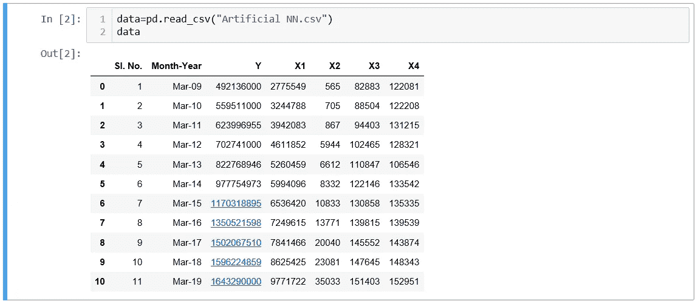
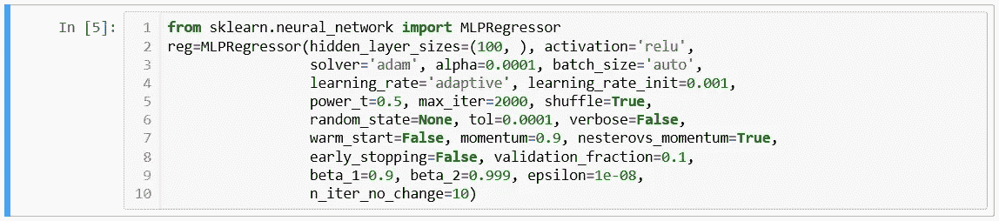
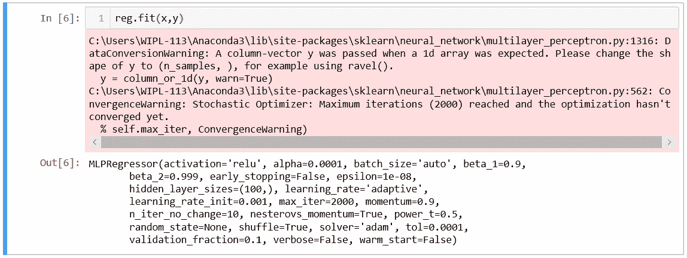
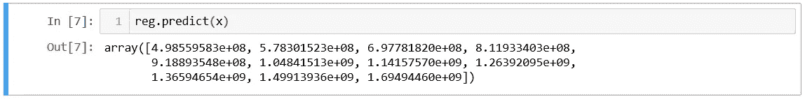

# 印度的金融包容性状况:深度学习 Python 方式的人工智能

> 原文：<https://medium.com/analytics-vidhya/state-of-financial-inclusion-in-india-a-deep-learning-ai-with-python-way-3b77d82ab000?source=collection_archive---------16----------------------->

查尔斯·福尔舍尔在 [Unsplash](https://unsplash.com?utm_source=medium&utm_medium=referral) 上的照片

**金融普惠及相关实体**

世界银行[将金融普惠](https://www.worldbank.org/en/topic/financialinclusion/overview)定义为个人和企业能够以负责任和可持续的方式获得满足其需求的有用且负担得起的金融产品和服务——交易、支付、储蓄、信贷和保险。多年来，金融普惠一直是世界各地各发展中国家的主要发展目标之一。[全球 Findex 调查](https://globalfindex.worldbank.org/)提供了大多数发展中国家金融包容性相关数据的整体视图。

Findex 的调查进一步表明，在过去几年里，没有银行账户的人获得金融服务的情况有了显著改善，这主要是由于各国政府采取了各种举措(如印度的 PMJDY 计划)。然而，根据比尔&梅林达盖茨基金会( **BMGF** )，全球约[17 亿人](https://www.gatesfoundation.org/what-we-do/global-growth-and-opportunity/financial-services-for-the-poor)仍被排除在正规金融服务之外，如储蓄、支付、保险和信贷(全球 Findex 数据)。

由于大多数发展中国家仍然发现发展举措在执行层面存在重大挑战，因此，制定实现金融普惠目标的国家级战略框架至关重要。金融普惠联盟( **AFI** )认为其大多数[成员国](https://www.afi-global.org/members/)参见[国家金融普惠战略](https://www.afi-global.org/policy-areas/financial-inclusion-strategy)对于建立一个战略框架以促进金融普惠领域的政策改革至关重要。

**印度的金融普惠**

在印度，2005 年 4 月，时任印度储备银行行长的[年度政策声明](https://www.rbi.org.in/scripts/BS_ViewMonetaryCreditPolicy.aspx?Id=2217)中首次使用了“金融普惠”一词。因此，印度政府和印度储备银行[采取了多项举措](https://en.wikipedia.org/wiki/Financial_inclusion#Financial_inclusion_in_India)来实现金融普惠的目标。最近，印度政府推出的 **PMJDY** 计划在为数百万人提供金融服务方面产生了突破性的影响。

**回归模型、变量、数据和变量的相关性**

在统计建模中，[回归分析](https://en.wikipedia.org/wiki/Regression_analysis)是一组统计过程，用于估计因变量与一个或多个自变量之间的关系。在这种情况下，四个独立变量用于回归模型。

根据 CGAP 扶贫咨询小组的 I-SIP 工具包，在正规金融机构拥有账户的成年人的比例是获得金融服务的一个可衡量的指标。我们模型中的因变量将是印度[指定商业银行](https://rbidocs.rbi.org.in/rdocs/content/pdfs/08BANKLISH08102018_A1.pdf)的储蓄银行账户数量。这个数据是从储备银行的数据库中获得的。

同样，根据欧洲小额信贷平台(**e-MFP**)[最近进行的一项调查，中小企业融资](https://www.findevgateway.org/library/financial-inclusion-compass-2019)是金融普惠最重要的五个新关注领域之一。由于为企业融资是金融普惠的一个组成部分，银行提供的信贷总量是我们模型的第一个独立变量。银行贷款(以克罗计)数据来自储备银行的[数据库](https://dbie.rbi.org.in/DBIE/dbie.rbi?site=statistics)。

与准入类似，[金融服务](https://www.cgap.org/blog/how-useful-usage-measuring-financial-inclusions-impact)和产品的使用是决定一个国家金融体系成熟程度的重要因素。支付和交易被视为[使用度量](http://blogs.worldbank.org/allaboutfinance/3-ways-advance-usage-and-drive-impact-financial-inclusion)的形式。因此，支付量(以 10 万卢比计)是我们模型中的下一个独立变量。这一数据是从储备银行的数据库中获得的。

获得金融服务还取决于附近正规金融机构的数量。所以，印度商业银行的数量是我们模型的第三个自变量。这个数据是从储备银行的[数据库](https://dbie.rbi.org.in/DBIE/dbie.rbi?site=publications#!4)中获得的。

最后，[人与人之间没有良好的金融素养](https://www.rbi.org.in/scripts/PublicationDraftReports.aspx?ID=675)，很难实现金融普惠的目标。金融素养取决于任何国家人口的普遍素养。识字率取决于完成大学入学考试的人数。这取决于该国中学的数量。我们模型的第四个也是最后一个独立变量是印度的中学数量。这一[数据](http://www.mospi.gov.in/sites/default/files/statistical_year_book_india_2015/Table%2029.1_1.xls)来自印度政府统计和计划执行部。

**人工神经网络和 scikit-learn**

人工神经网络(ANN)是一种信息处理模型，由大量高度[互联的处理元素(神经元)组成，同时](https://en.wikipedia.org/wiki/Artificial_neural_network)工作以解决特定问题。人工神经网络的工作原理类似于人脑处理信息的方式。

[Scikit-learn](https://scikit-learn.org/stable/) 是一个针对 [Python](https://www.python.org/about/apps/) 编程语言的免费软件机器学习库。这个库包含许多用于机器学习和统计建模的有效工具。scikit-learn 的人工神经网络框架的[mlprepressor](https://scikit-learn.org/stable/modules/generated/sklearn.neural_network.MLPRegressor.html)类实现了一个[多层感知器(MLP)](https://en.wikipedia.org/wiki/Multilayer_perceptron) ，它使用反向传播进行训练，在输出层没有[激活函数](https://towardsdatascience.com/activation-functions-and-its-types-which-is-better-a9a5310cc8f)。输出是一组连续的值。

MLPRegressor 迭代训练。在每个时间步，计算[损失函数](https://towardsdatascience.com/understanding-different-loss-functions-for-neural-networks-dd1ed0274718)相对于模型参数的偏导数，以更新参数。它还可以将[正则项](https://towardsdatascience.com/regularization-techniques-for-neural-networks-e55f295f2866)添加到损失函数中，该损失函数缩小模型参数以防止[过拟合](https://towardsdatascience.com/preventing-deep-neural-network-from-overfitting-953458db800a)。

该模型使用 [LBFGS](https://en.wikipedia.org/wiki/Limited-memory_BFGS) 或随机梯度下降( [SGD](https://en.wikipedia.org/wiki/Stochastic_gradient_descent) )来优化平方损失。

MLPRegressor 还支持多输出回归。

**Python 程序和神经网络模型**

NumPy 是用 Python 进行科学计算的基础包。它是一个通用的数组处理包。NumPy 还提供了大量高级数学函数来操作数组。Pandas 是一个开源库，为 Python 编程语言提供了[易用的数据结构和数据分析工具](https://pandas.pydata.org/)。在加载神经网络包之前，加载这两个库用于数据处理。

我们看到因变量是 Y(储蓄银行账户数)。四个独立变量是 X1(以克罗为单位的银行贷款)、X2(以 10 万卢比为单位的支付额)、X3(印度商业银行的数量)、X4(印度中学的数量)。对于第四个独立变量 X4，数据只提供到 2016 年 3 月。2017 年、2018 年和 2019 年的数据是以同比增长 1.03%计算的(2016 年同比增长)。

有各种[参数](https://scikit-learn.org/stable/modules/generated/sklearn.neural_network.MLPRegressor.html)如[隐层](https://towardsdatascience.com/beginners-ask-how-many-hidden-layers-neurons-to-use-in-artificial-neural-networks-51466afa0d3e)中的神经元数量、激活函数、学习速率、随机状态等。要使 MLPRegressor 类工作，必须对其进行初始化。在这种情况下，该类的所有功能都由[对象](https://www.w3schools.com/python/python_classes.asp)‘reg’使用。

之后，因变量和四个自变量都被拟合到神经网络模型中。

一旦变量适合模型，我们就可以使用自变量的值来预测因变量的相应值。之后，我们可以用原始值检查预测值，看看我们的模型有多好。可以调整参数值来查看预测是否变得更好。

**模型的局限性和增强方式**

数据集中只有 11 个数据点，很难将其分成[个训练集和](https://towardsdatascience.com/train-test-split-and-cross-validation-in-python-80b61beca4b6)个测试集。有了[大型数据集](https://statswithcats.wordpress.com/2010/07/11/30-samples-standard-suggestion-or-superstition/)(至少 30 个数据点)，我们可以将数据集分成训练集和测试集。之后，我们可以使用 scikit-learn 的 [r2-score 包](https://scikit-learn.org/stable/modules/generated/sklearn.metrics.r2_score.html)检查我们模型的 [R 平方](https://en.wikipedia.org/wiki/Coefficient_of_determination)值(如果有多个自变量，则为[调整后的 R 平方](https://www.investopedia.com/ask/answers/012615/whats-difference-between-rsquared-and-adjusted-rsquared.asp)值)。

其他工具如 [Minitab](https://www.minitab.com/en-us/) 或 [IBM SPSS](https://www.ibm.com/in-en/analytics/spss-statistics-software) 可以帮助我们找到我们模型的 R 平方值；然而，对于我们目前拥有的样本数量较少的模型，在应用统计建模技术之前，检查数据点是否满足[正态条件](https://en.wikipedia.org/wiki/Normality_test)非常重要。

[R 平方值接近“1”](https://blog.minitab.com/blog/adventures-in-statistics-2/regression-analysis-how-do-i-interpret-r-squared-and-assess-the-goodness-of-fit)意味着该模型是一个好模型，能够进行预测。