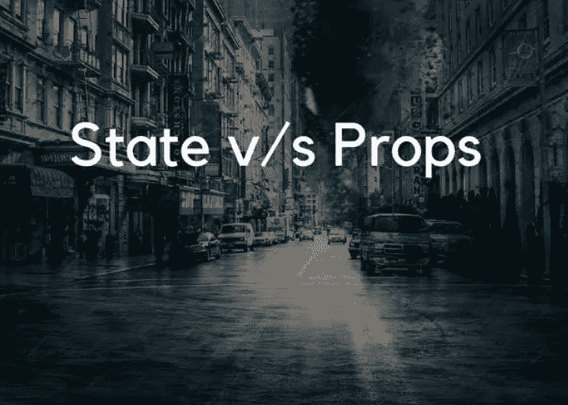
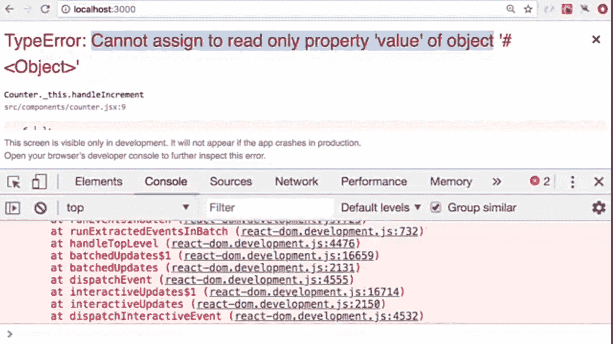
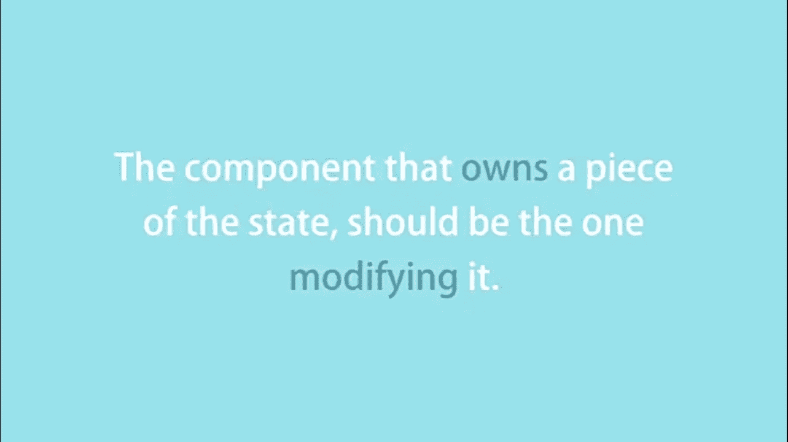

# 状态 vs 道具:剖析概念[React JS]

> 原文：<https://medium.com/analytics-vidhya/state-vs-props-dissecting-the-concepts-react-js-8110e489a20?source=collection_archive---------32----------------------->



**状态和道具！！！**

人们通常会对组件的状态和道具感到困惑.....包括我自己。
是的，状态和道具有点类似。但是他们之间有一些显著的不同。
它们是什么？
一起来看看吧！
对了，我是 Agbejule Kehinde Favour。
现在回到我们的话题。

# 状态 vs 道具

# 它们是关于什么的？

**状态**是在组件内部管理的东西，可以随着时间而改变。

它包括组件的私有或本地数据。

因此，一个组件的本地状态对其他组件是完全不可见的。

但是**属性**包含了给组件的数据。

假设它是组件的属性。

# 修改特性

不能修改组件的属性。
**这是因为它是只读输入。**

如果你试着给它赋值，你会得到这个。



是啊，我们不想那样，不是吗？

另一方面，可以修改组件的状态。
**但有一条坚实的规则附于此。**

> ***这是一个组件不能访问另一个组件的状态，更谈不上修改它。***



***除此之外，我的建议是，如果你的组件中有一段数据仍然会随着时间的推移而被修改，那么这段数据应该被输入到组件的状态中，而不是作为一个道具输入。***

# 组件总是需要状态吗？

有时，组件可能不需要状态。它可以从它的道具中获得所有的数据(可能是因为不需要修改任何东西)

# 说了这么多，我给你举个例子。

假设您的应用程序中有一个带有标题和用户名的导航栏组件。
你想在应用程序的不同组件中使用导航条组件，所以你在那个组件中渲染它。

如果你想知道更多关于我正在谈论的信息，看看这篇文章

[](/analytics-vidhya/i-never-understood-react-components-f7916a24e549) [## 我从来不明白反应组件

### 直到有人这样解释

medium.com](/analytics-vidhya/i-never-understood-react-components-f7916a24e549) 

**回到我的解释**

当你完成渲染，它出现在你的浏览器上，然后你说；

> “问题解决了”。

但是假设你想在那个组件的导航条上有一个不同的标题。

你是做什么的？
可能创建另一个导航条组件？那会相当有压力和混乱。

这就是道具的用武之地。

> 顺便说一句:道具可以是任何东西。在这个例子中，它是一个字符串，但是它们也可以是数字、数组、对象、函数等。

```
function Navbar(props) { return ( <div>
        {props.title}
      </div>
      </div>
         {props.username}
      </div>
    )}
```

**去结构化道具**

```
function Navbar({title,username}) {return ( <div>
        {title}
      </div>
      </div>
         {username}
      </div>
    )}
```

它会被渲染成这样；

```
<Navbar title="title 2" />
```

然后你就可以通过 props 定制导航条组件了。

## 警告

不能像我前面说的(**修改特性**)一样改道具

你不能在试图修改道具的地方使用这段代码

```
function Navbar(props) { props.title = "greet"
    return (
      <div>
       {props.title}
      </div>
  )
}
```

**并为国家。**
假设您希望在用户每次登录时更改用户名。
在这种情况下，您必须在状态中输入它才能修改数据。

# 结论

状态中的数据由其组件私有控制。

***该状态可以看作是组件*** 的暂时记忆

**而**

道具可以被称为组件的属性，它可以用来定制组件。

> 现在你用新的眼光看待这些概念了吗？

说到这里，我希望这对你有所帮助。
你可以放下你的评论。你可以留一些👏👏👏如果有。
也帮助一个人找到这个价值。
喜欢这个想要更多价值的可以关注我。非常感谢您的宝贵时间！
Agbejule Kehinde 青睐。
祝你们平安！