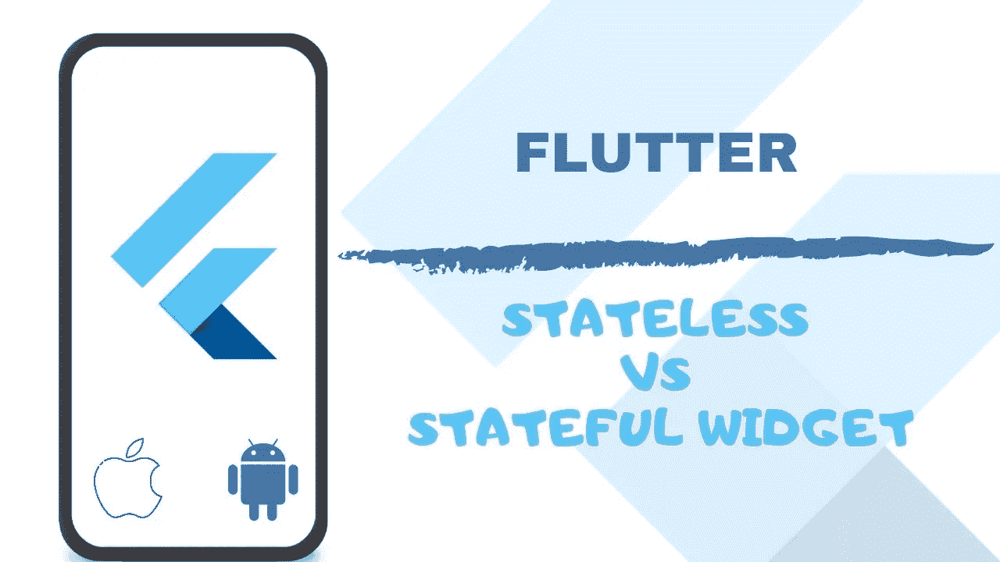
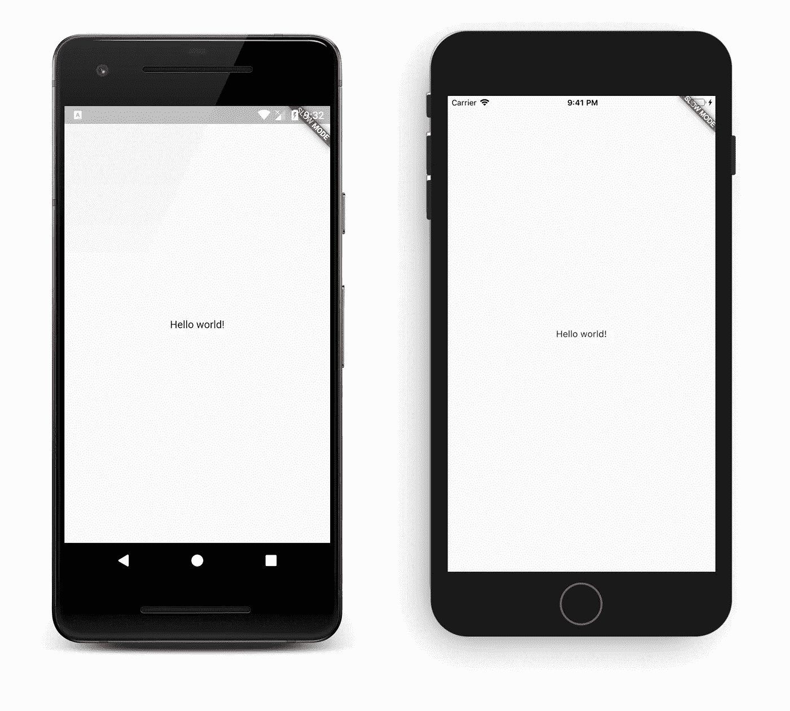

# 有状态小部件 vs 无状态小部件

> 原文：<https://medium.com/analytics-vidhya/statefulwidget-vs-statelesswidget-in-flutter-d38765fa5a76?source=collection_archive---------8----------------------->



# 无状态小部件

无状态窗口小部件是指这样的窗口小部件，当您更新绑定到它的任何值时，您希望创建一个不需要动态更改的 UI。例如，如果您想制作一个标题不需要动态更改的按钮，那么您可以为按钮创建一个单独的小部件作为无状态小部件。

顾名思义，无状态小部件是不可变的。

无状态小部件保持不变，即使用户与它们交互。这种小部件没有状态，所以它们不能根据一个内部状态而改变。它们只能对更高的小部件变化做出反应。

无状态窗口小部件不能在应用运行时改变它们的状态，这意味着当应用运行时窗口小部件不能被重绘。

让我们从传统的“Hello World”示例开始

```
import 'package:flutter/material.dart';void main() => runApp(MyHome()); class MyHome extends StatelessWidget {const MyHome({Key key}) : super(key: key);@overrideWidget build(BuildContext context) {return MaterialApp(home: Scaffold(appBar: AppBar(title: Text("Stateless Widget Demo",)),body: Center(child: Text("Hello World,"),), ), );} }
```



# 有状态小部件

有状态窗口小部件与无状态窗口小部件正好相反。这意味着当您想要根据用户与它的交互方式动态地改变某些东西时，您可以使用有状态小部件。例如，如果您想在单击按钮时更改应用程序的背景颜色，在这种情况下，您可以使用有状态小部件。

有状态小部件可以包含另一个无状态小部件，反之亦然。

```
class MyHomePage extends StatefulWidget {*@override*_MyHomePageState createState() => _MyHomePageState();}class _MyHomePageState extends State<MyHomePage> {*@override*Widget build(BuildContext context) {return MaterialApp(home: Scaffold(appBar: AppBar(title: Text("Stateless Widget Demo",)),body: Center(child: Text("Hello World,"),), ), );}
```

# 有状态小部件生命周期

生命周期有以下简化的步骤:

*   创建状态()
*   已安装==真
*   initState()
*   didChangeDependencies()
*   构建()
*   didUpdateWidget()
*   setState()
*   停用()
*   处置()
*   已安装==假

一言以蔽之:执行。

tldr 的适应是状态对象看起来是永久的，然而 StatefulWidgets(和所有的 Widget 子类)在设置改变时被丢弃和重新构建。对 Flutter 来说，修改一个非永久性的小玩意是非常经济的。

由于 State 不会在每次重构时不堪重负，它会避开代价高昂的计算，并在每次逐行重构时获取 states 属性、getters、setters 等等。

重要的是这是允许颤振活动存在的东西。因为状态不会被丢弃，所以它可以根据信息的变化不断地修改它的小部件，并且在需要时，假设有任何变化。

> **createState()**

当 Flutter 被告知要创建一个 **StatefulWidget** 时，它会立即调用 **createState()** 。这种技术必须存在。偶尔一个 StatefulWidget 应该比这个更混乱。

```
class MyHomePage extends StatefulWidget {
  @override
  _MyHomePageState createState() => new _MyHomePageState();
}
```

> **挂载为真**

当 **createState** 成为 State 类时，一个 **buildContext** 被分配给该状态。

一个 **BuildContext** 是小部件树中设置这个小部件的位置，这个位置非常混乱。这里有一个更长的澄清。

所有小部件都有一个 bool this.mounted 属性。当 buildContext 被指定时，它变成 the。当小部件被卸载时调用 setState 是一个错误。

提示:当您所在州的策略调用 setState()时，该属性很有价值，但不清楚何时或多久会调用该技术。也许它是由一股清新的溪流带来的。在调用 setState()之前，可以利用 if (mounted) {…来确保状态存在。

> **initState()**

这是创建小部件时调用的第一个方法(当然是在类构造函数之后。)

`**initState**`被调用一次**且只有一次**。它还必须调用`super.initState()`。

这种`@override`方法的最佳时机是:

为创建的小部件实例初始化依赖于特定 BuildContext 的数据。初始化依赖于树中此小部件“父”的属性。

订阅 Streams、ChangeNotifiers 或任何其他可能更改此小部件上的数据的对象。

```
@override
initState() {
  super.initState();
  // Add listeners to this class
  cartItemStream.listen((data) {
    _updateWidget(data);
  });
}
```

> **didChangeDependencies()**

第一次构建小部件时，在`initState`之后立即调用 didChangeDependencies 方法。

每当这个小部件*依赖于来自*的数据的对象被调用时，它也会被调用。例如，如果它依赖于 InheritedWidget，则更新。

`build`是不是**总是在`didChangeDependencies`被调用之后**才被调用，所以这个很少需要。然而，这个方法是你必须调用的第一个变化`BuildContext.inheritFromWidgetOfExactType`。这实际上会使这个状态“监听”它从其继承数据的小部件上的变化。

文档还建议，如果您需要在 InheritedWidget 更新时进行网络调用(或任何其他昂贵的操作),这可能会很有用。

> **build()**

它是必需的，`@override`并且必须返回一个`Widget`。

> **didUpdateWidget**

如果父窗口小部件改变了，必须重新构建这个窗口小部件(因为它需要给它不同的数据)，但是它是用同一个`runtimeType`重新构建的，那么这个方法被调用。

这是因为 Flutter 正在重用寿命较长的`state`。在这种情况下，需要再次初始化一些数据，就像在`initState()`中一样。

如果状态的`build()`方法依赖于一个流或其他可以改变的对象，那么在`didUpdateWidget()`中取消订阅旧对象并重新订阅新实例。

在这之后，Flutter 总是调用`build()`，因此任何后续的对`setState`的调用都是多余的。

```
@override
void didUpdateWidget(Widget oldWidget) {
  if (oldWidget.importantProperty != widget.importantProperty) {
    _init();
  }
}
```

> **setState()**

' **setState** ()'方法经常被 Flutter 框架本身和开发人员调用。

它用来通知框架“数据已经改变”，这个`build context`处的小部件应该被重建。

`setState()`接受一个**不能异步**的回调。正是因为这个原因，它可以根据需要经常被调用，因为重画成本很低:-)

```
void updateProfile(String name) {
 setState(() => this.name = name);
}
```

> **停用()**

**取消激活**()’在`State`从树中移除时被调用，*但在当前帧变化完成前可能会被重新插入*。这种方法的存在基本上是因为`State`对象可以从树中的一点移动到另一点。

> **dispose()**

**dispose**()’在`State`对象被移除时被调用，这是永久的。

这个方法是取消订阅和取消所有动画，流等。

> **已安装是假的**

`state`对象永远不能重新挂载，调用`setState()`时会抛出一个错误。

# 你如何能有所贡献？

*   在 [Twitter](https://twitter.com/jayeshpatel1995) 或 [Linkedin](https://in.linkedin.com/in/jayeshpansheriya) 或 [Instagram](https://www.instagram.com/jay_pansheriya) 上与我联系。
*   跟着我上 [Github](https://github.com/jayeshpansheriya) 。

# 表示你的支持

如果你喜欢阅读这篇文章，请点击下面的按钮。你鼓掌越多，就越能激励我写得更好！