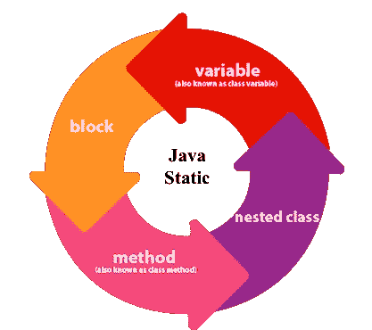
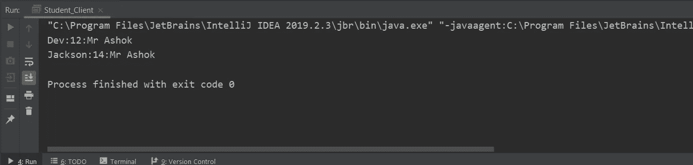
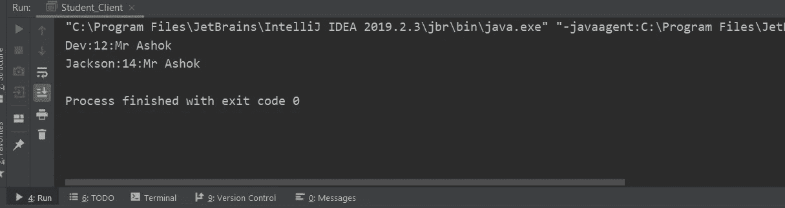
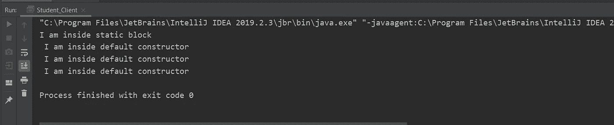

# JAVA 中的静态关键字指南

> 原文：<https://medium.com/analytics-vidhya/static-keyword-in-java-6d9cb56b8253?source=collection_archive---------10----------------------->



在本文中，我们将了解 Java 中的静态关键字。静态关键字可能会让初学者和专业人士感到困惑。我们将了解以下主题-

使用了静态关键字-

1.  带有变量
2.  使用方法/功能
3.  静态块

# 带变量的静态关键字

与变量一起使用的 static 关键字意味着该类中的变量不是特定于对象的，但现在是特定于类的。简而言之，如果一个对象的静态变量的值改变了，那么属于该类的所有其他对象的值也会改变。

让我们用一个例子来理解这一点

我们将创建一个学生班级，包括-

1.  字符串名称
2.  年龄
3.  弦乐老师。

现在所有学生的年龄和名字都不同了，但是老师对他们都是一样的。所以我们会用**静态字符串老师初始化老师。**

```
public class Student {
    int age;
    String name;
    static String teacher;
}
class Student_Client{
    public static void main(String[] args) {
        Student s1=new Student();
        s1.age=12;
        s1.name="Dev";
        Student.teacher ="Mr Ashok";
        Student s2=new Student();
        s2.age=14;
        s2.name="Jackson";
        //No initialization of teacher for student s2

        System.out.println(s1.name+":"+s1.age+":"+s1.teacher);
        System.out.println(s2.name+":"+s2.age+":"+s2.teacher);
    }
}
```

这里我们为 s1 初始化了教师，但没有为 s2 初始化。然而，我们将为两个学生打印教师。



我们可以清楚地看到，尽管教师仅针对学生 s1 进行了初始化，但教师针对两个学生都进行了打印。

因为静态变量是特定于类的，所以没有必要声明一个对象来访问静态变量。

```
public class Student {
    int age;
    String name;
    static String teacher="Mr Ashok";
}
class Student_Client{
    public static void main(String[] args) {
        Student s1=new Student();
        s1.age=12;
        s1.name="Dev"; Student s2=new Student();
        s2.age=14;
        s2.name="Jackson";

        System.out.println(s1.name+":"+s1.age+":"+Student.teacher);
        System.out.println(s2.name+":"+s2.age+":"+Student.teacher);// Accessing teachers using class Student class instead of objects }
}
```

我稍微编辑了一下前面的代码，并在类本身中初始化了教师。另外，我在打印教师时没有使用对象 s1 和 s2，而是使用了学生类本身。



我们可以观察到老师被分配给这两个学生。

# 带有方法/函数的静态关键字

如果我们使用一个静态关键字和一个函数，意思是-

1.  该函数只能访问静态变量。
2.  不能在那个函数中使用**这个**关键字。

如果我们不在函数中使用静态关键字，就意味着-

1.  该函数可以访问静态和非静态变量。
2.  我们可以在那个函数中使用**这个**关键字。

# 静态块

静态块是一种特殊类型的块，我们可以在类内部使用。使用静态块的好处是，如果我们把静态组件放在块中，那么它们只被加载一次。

让我们用一个例子来理解这一点

```
public class Student {
    int age;
    String name;
    static String teacher;
    static {
        System.out.println("I am inside static block");
    }
    public Student(){
        System.out.println(" I am inside default constructor");
    }
}
class Student_Client{
    public static void main(String[] args) {
        Student s1=new Student();
        Student s2=new Student();
        Student s3=new Student();

    }
}
```

这里，我们在 Student 类中创建了默认的构造函数和静态块。我们还创建了三个对象 s1、s2 和 s3。我们将运行以下代码



我们可以清楚地看到，自从我们创建了三个对象 s1、s2 和 s3 以来，**“我在静态块内部”**只打印了一次，而**“我在默认构造函数内部”**打印了三次。

这是因为静态块只在第一次调用该类时加载一次。

**我希望你们喜欢这篇文章。请在这里订阅更多精彩的文章，并请给出一个👏如果你觉得这篇文章信息丰富。**

很快我会发表文章-

1.  方法重载
2.  方法覆盖