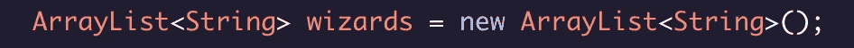

# Java 中的静态类型与动态语言的比较

> 原文：<https://medium.com/analytics-vidhya/static-typing-in-java-compared-to-dynamic-languages-1e408fc5bc9f?source=collection_archive---------31----------------------->

我学的前两种编程语言是 Javascript 和 Ruby。因此，当我开始学习 Java 时，我熟悉了面向对象编程和 Ruby 的类继承。另外，Java 的语法类似于 Javascript，所以我有了一个好的起点。例如，Java 中的条件语句和循环看起来和 Javascript 中的一样。

Java/Javascript 条件语句

Java 也有熟悉的数据类型(整型、字符串型、布尔型)，但是我们必须更加关注 Java 中的数据类型。

# 静态打字

Java 要求程序员指定变量的数据类型，并且该数据类型不能改变。这不同于我使用 Javascript 和 Ruby 的经验，它们的变量可以是它们想要的任何数据类型。当在 Javascript 中声明一个变量时，我们会使用`const`或`let`来表示我们正在创建一个新变量。在 Java 中，当我们指定变量的数据类型时，我们发出创建新变量的信号。

在 Java 中创建变量时，我们用`int`表示整数，`String`表示字符串，`char`表示字符，`boolean`表示布尔值。如果我们试图对一个变量使用错误的数据类型，就会导致 Java 的编译时错误。以下内容会破坏我们的代码:

类似于为变量指定数据类型，我们也需要为方法的参数和返回值指定数据类型。

# 方法参数和返回值的数据类型

当我们在 Java 类中创建一个方法时，我们必须指定一个返回类型。这对于静态类型语言来说很常见。如果我们创建一个方法，我们不希望它返回任何东西，我们需要指定“void”作为返回类型。当声明一个方法时，我们首先提供 access 关键字，它告诉我们这个方法在哪里可用。现在我们将使用关键字`public`。接下来我们可以指定我们的返回类型。假设我们正在创建一个名为“addTwo”的方法，该方法碰巧将两个整数相加，我们希望该方法返回总和。在这种情况下，我们返回的总和也是一个整数，所以我们将返回类型声明为`int`。在返回类型之后，我们用括号命名我们的方法。对于我们的方法，我们将在方法中加入两个参数。在 Java 中，我们需要为方法期望的每个参数指定数据类型。在我们的括号内，我们将在每个参数的名称前包含`int`。下面是我们的“addTwo”方法的完整外观:

注意“public”之后的返回值如何匹配“sum”的数据类型

# 数组和数组列表

## 数组

首先，在 Java 中数组不是直接给我们的。它们就像鱼子酱或保健品一样是奢侈品。因此我们必须进口它们。我的朋友 George Costanza 是一名进出口商，他向我展示了我们在访问数组的程序中包含的一行漂亮的代码:`import java.util.Arrays;`。

在 Java 中创建和使用数组不像在 Javascript 或 Ruby 中那样直观和宽容。首先，我们需要从一开始就准确地知道我们的数组将容纳多少元素。其次，我们数组的元素必须是相同的数据类型。一旦我们有了这些信息，我们可以用两种方法之一来创建一个数组。两种方式都是一样的。第一个词将是数组元素的数据类型，类似于任何其他变量的声明方式，但是在创建数组时，该数据类型后面紧跟着方括号，然后是空格，最后是变量名。总之，创建一个变量名为“stringArray”的字符串数组将像这样开始`String[] stringArray`。这是我们两条道路的分歧之处。如果我们想在创建时分配数组的所有元素，我们可以将变量 equal 分配给包含数组元素的花括号，以逗号分隔的顺序。创建我们的“stringArray”可能如下所示:

如果我们在创建数组时不知道要在数组中包含哪些向导，我们可以创建一个特定大小的数组，并在以后分配数组索引。这一次，我们将变量设置为具有特定长度的特定数据类型的数组的新实例。仍然使用我们的向导阵列，它看起来像这样:

在这两种情况下，我们都可以使用类似于 Javascript 或 Ruby 的括号符号来分配和重新分配数组元素。

## 数组列表

有时我们需要大小可变的数据结构。当我们需要可以添加或删除元素的数组时，我们调用数组列表。它们就像数组，但是有更多的特性。我们以类似的方式导入它们。

我们创建数组列表的语法和数组有点不同。我们不是从数据类型开始，而是从单词“ArrayList”开始，后跟“<>”，数据类型在箭头之间。这里要小心，因为箭头之间的数据类型与我们之前看到的数据类型不太一样。“String”数据类型看起来是一样的，但是其余的是不同的。我们写`<Integer>`，而不是`<int>`。我们写的是`<Char>`，而不是`<char>`。`<Double>`表示双精度，而`<Boolean>`表示布尔值。尖括号内的数据类型之后是变量名，我们将其设置为数组列表的一个新实例。总的来说，该语句如下所示:

现在我们可以像这样给这个数组列表添加元素:`wizards.add("Harry Potter");`。这改变了数组列表的大小。我们可以使用元素的索引或者想要移除的元素的值来移除数组中的元素。有了数组列表，我们就不能再用括号符号来设置或获取某些元素了。我们必须使用 ArrayList 方法“get”和“set”。我们将想要访问的索引传递给“get”，并将索引和新值都传递给“set”。下面是在我们的“向导”数组列表中重新分配第一个元素的样子:

还有许多其他的 ArrayList 方法可以查看:

 [## 数组列表(Java 平台 SE 8)

### 这个类的 andlistIterator 方法返回的迭代器是快速失败的:如果列表在结构上被修改…

docs.oracle.com](https://docs.oracle.com/javase/8/docs/api/java/util/ArrayList.html) 

这些就是我必须习惯 Java 的巨大差异。除此之外，Java 的类和继承与 Ruby 非常相似。每个文件名必须包含相应的同名类。

在编写 Java 程序时，我建议记住一些快速的东西或放在手边，包括任何正在运行的类都需要的一行代码。

# 主要方法

当你运行一个文件时，它的类需要一个`main()`方法，有很多部分。下面是 main 方法的标准语法:

这个确切的结构将让你开始。当你开始钻研 Java 时，你会学到这些部分的作用，但是现在你只需要相信你需要这些单词中的每一个。

# 打印到控制台

检查某些代码是否如您所愿的最好方法之一是打印到控制台。在 Javascript 中，这看起来像`console.log();`。在 Java 中，我们写`System.out.println();`。同样，知道我们为什么需要这行代码的每一部分并不重要。开始时，我们可以相信它会在运行时打印出括号内的内容。

第一语言总是最难的。当你开始学习新的语言时，主要的差异会像拇指疼痛一样突出，这些领域将是你想要关注的，直到它们变得熟悉。