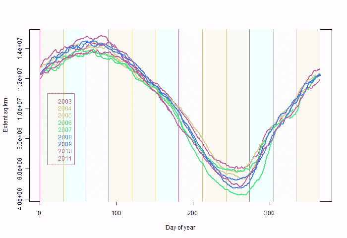
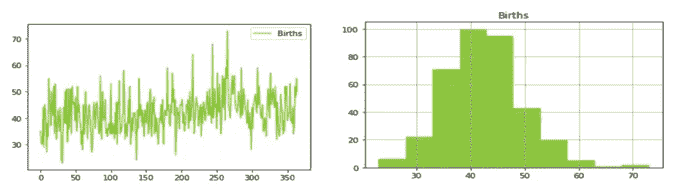
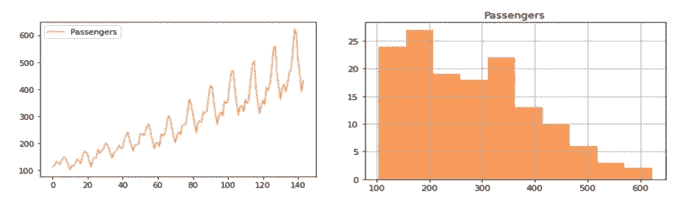
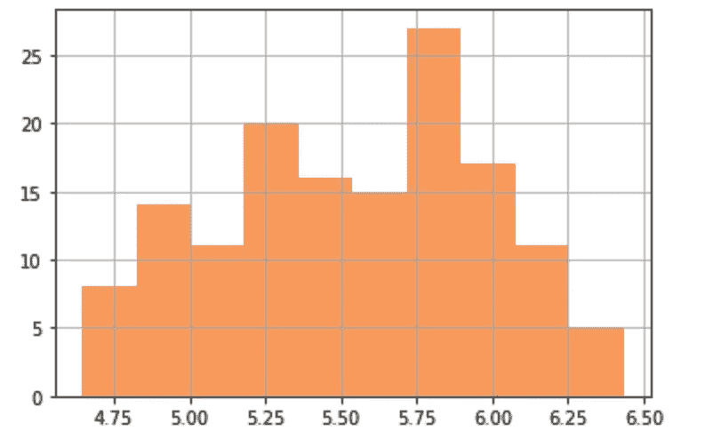
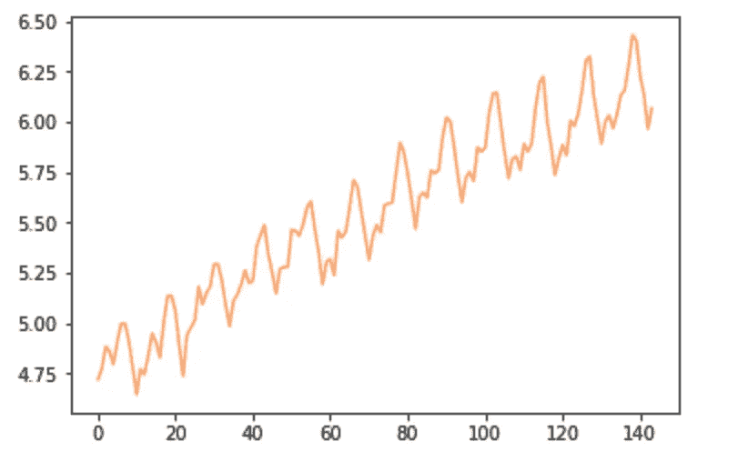
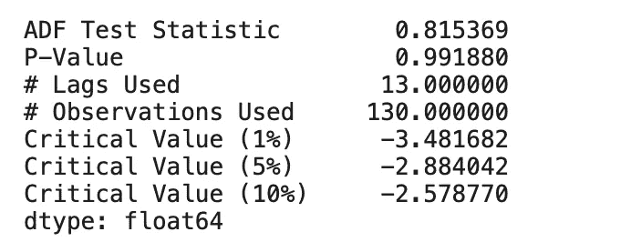
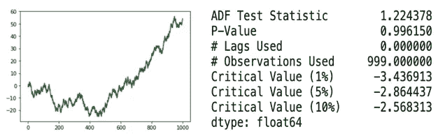
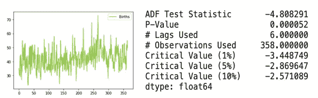

# 时间序列分析的平稳性

> 原文：<https://medium.com/analytics-vidhya/stationarity-for-timeseries-analysis-51b1f5d9749e?source=collection_archive---------10----------------------->

如果时间序列没有趋势或任何季节效应，那么它就是平稳的。



[图片由](https://moyhu.blogspot.com/2011/06/time-series-plots-using-animation.html)提供

平稳性是执行时间序列分析或时间序列预测的基本构件之一。

> 为什么我们这么在意时间序列是否平稳？

因为统计建模方法假设或要求时间序列是平稳的才有效。因此，为了有效地使用任何统计建模技术，必须检查其中是否存在任何趋势或季节性。

> 我们如何用统计学术语定义平稳性？

平稳时间序列的汇总统计数据将保持不变或随时间变化很小。例如均值和方差。

> 检验数列平稳性的方法有哪些？

1.  视觉上——最简单
2.  统计测量——平均值、方差等。
3.  统计测试-被认为是最有效的。

让我们用两个非常流行的数据集来深入研究它们。数据集的链接将在文章末尾提供。

```
**#DATA 1: 
import** pandas **as** pd
**import** numpy **as** np
**import** matplotlib.pyplot **as** plt
data = pd.read_csv(**"daily-total-female-births.csv"**)data.plot(color=**"yellowgreen"**)
data.hist(color=**"yellowgreen"**)
plt.show()
```



**目测:**没有上升和下降的趋势。因此，它是静止的。

**统计度量:**均值和方差只有在数据符合高斯分布的情况下才有意义。直方图显示数据遵循正态分布，右侧几乎没有偏斜。

现在，我们将数据分成三份(连续序列),并比较它们的均值和方差。然后，如果每次分割的均值和方差大致保持不变，则时间序列是平稳的。

```
*#split the data into three* split = round(len(data) / 3)
data1, data2, data3 = data[0:split], data[split:(2 *split)], data[(2 *split):]
mean1,mean2,mean3 = data1[**"Births"**].mean(), data2[**"Births"**].mean(),data3[**"Births"**].mean()
var1, var2,var3 =  data1[**"Births"**].var(), data2[**"Births"**].var(),data3[**"Births"**].var()print(**"The means are :"**, str(round(mean1,2))+**","**,str(round(mean2,2))+**","**,round(mean3,2))
print(**"The variances are :"**, str(round(var1,2))+**","**,str(round(var2,2))+**","**,round(var3,2))
```

结果是:均值和方差不同，但非常接近。

```
The means are : 39.68, 41.33, 44.96
The variances are : 54.35, 38.75, 55.16
```

现在，让我们用另一个数据集来尝试一下:

```
**#DATA 2****import** pandas **as** pd
**import** matplotlib.pyplot **as** plt
data = pd.read_csv(**"airline-passengers.csv"**)data.plot(color=**"sandybrown"**)
data.hist(color =**"sandybrown"**)
plt.show()
```



**目测:**明显的上升趋势。因此，它是不稳定的。



直方图突出显示了对数变换后的分布变化

**统计测量:**直方图清楚地显示数据没有遵循高斯趋势。但是，如果我们尝试一些转换，使数据遵循高斯分布呢？一种流行的方法是使用 **log** 转换。

现在，让我们像以前一样尝试计算平均值和方差。

数据 2 的结果将是:

```
Without log transformationThe means are : 158.38, 269.04, 413.48
The variances are : 1094.66, 3106.0, 6162.0With log transformationThe means are : 5.04, 5.57, 6.01
The variances are : 0.04, 0.04, 0.03
```

所以，均值和方差都差不多。这可能表明，变换后的序列遵循平稳性，这必须从线图明显。所以，我们来画一下。

```
np.log(data[**"Passengers"**]).plot(color =**"sandybrown"**)
plt.show()
```



哇哦。刚刚发生了什么？线条图似乎完全不遵循平稳性。因此，仅仅依靠均值和方差进行平稳性检查是不够的。我们需要一个更强大的方法来检查。

这就是另一个统计测试发挥作用的方式，通常被称为**增强的 Dickey-Fuller 测试**。

> 什么是**增强迪基-富勒测试？**

它也被称为 ADF 测试，一种单位根测试。单位根是非平稳性背后的原因。根据单位根，我们可以将平稳时间序列定义为:

*时间序列是平稳的，如果时间上的单个移动不改变时间序列的统计特性，在这种情况下单位根不存在。*

扩充的 Dickey-Fuller 检验的无效假设和替代假设定义如下:

**零假设** =非平稳(单位根存在)
**交替假设** =平稳

让我们编写一个执行测试的类，这样将来测试一个时间序列就更容易了。

```
**class** StationaryCheck:
    **def** __init__(self, significance=0.05):
        self.SignificanceLevel = significance
        self.pvalue = **None** self.isStationary = **None** **def** ADF(self, data):
        *# Do the test* adf = adfuller(data, autolag=**'AIC'**) *# format the result* adf_result = pd.Series(adf[0:4], index=[**'ADF Test Statistic'**, **'P-Value'**, **'# Lags Used'**, **'# Observations Used'**]) *# also add critical values* **for** key, value **in** adf[4].items():
            adf_result[**"Critical Value (%s)"** % key] = value print(adf_result)
```

让我们通过将它应用于我们的非平稳数据来测试这一点。

```
test = StationaryCheck()
print(**"Result Check : "**)
print(**""**)
test.ADF(data[**"Passengers"**].values)
```

结果是:



在这种情况下，很容易看出数列不是平稳的。p 值 0.99 大于我们 5%的显著性水平，因此我们**无法拒绝**单位根确实存在的无效假设。

我们也可以，测试这一个随机产生的新潮数据:

```
*#Not statiopnary* **from** random **import** random
**import** pandas **as** pd
**import** matplotlib.pyplot **as** pltrandom_walk = list()
random_walk.append(-1 **if** random() < 0.5 **else** 1)
**for** i **in** range(1, 1000):
    movement = -1 **if** random() < 0.5 **else** 1
    value = random_walk[i-1] + movement
    random_walk.append(value)
pd.Series(random_walk).plot(color = **"green"**)
plt.show()
```



即使在这里，级数也不是静止的。p 值 0.99 大于我们 5%的显著性水平，因此我们**无法拒绝**单位根确实存在的无效假设。

但是，如果我们对静态数据进行同样的测试，结果将是:



在这种情况下，数列是平稳的。p 值 0.000052 小于我们的 5%显著性水平，因此我们**拒绝**单位根存在的无效假设。

我希望你喜欢这篇文章。感谢您抽出时间阅读这篇文章。请留下反馈或任何您想分享的与时间序列或平稳性特别相关的内容。

*参考文献*:

1.  [*https://machinelingmastery . com/gentle-introduction-random-walk-times-series-forecasting-python/*](https://machinelearningmastery.com/gentle-introduction-random-walk-times-series-forecasting-python/)
2.  [*https://www . hack deploy . com/augmented-dickey-fuller-test-in-python/*](https://www.hackdeploy.com/augmented-dickey-fuller-test-in-python/)
3.  [*https://medium . com/@ kang eugine/time-series-check-stationary-1 bee 9085 da 05*](/@kangeugine/time-series-check-stationarity-1bee9085da05)

*数据集:*

*数据 1:*

[*https://raw . githubusercontent . com/jbrownlee/Datasets/master/daily-total-female-births . CSV*](https://raw.githubusercontent.com/jbrownlee/Datasets/master/daily-total-female-births.csv)

*数据二:*

[*https://raw . githubusercontent . com/jbrownlee/Datasets/master/airline-passengers . CSV*](https://raw.githubusercontent.com/jbrownlee/Datasets/master/airline-passengers.csv)时间序列分析的平稳性