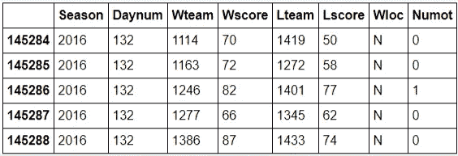

# 使用 Pandas 在 Python 中进行统计分析

> 原文：<https://medium.com/analytics-vidhya/statistical-analysis-in-python-using-pandas-27c6a4209de2?source=collection_archive---------0----------------------->

*在接下来的几分钟里，我们将介绍'* ***【熊猫】****——这是一个非常受欢迎的 Python 库，附带了* ***高级数据结构*** *和各种用于* ***数据分析的工具*** *，每个机器学习从业者都必须熟悉这些工具！*


图片来源:Pinterest

*“Pandas 的目标是成为用 Python 进行实际的、真实世界的数据分析的高级基础构件”——*[***Pandas 的使命陈述***](https://pandas.pydata.org/about/)

## ***库的显著特征—***

*   *快速高效* ***数据操作*** *配合* ***综合索引***
*   ***集成工具*** *用于各种格式的读写——CSV、文本文件、MS Excel、SQL、HDF5 等。*
*   *智能* ***数据对齐*** *，综合* ***缺失值处理***
*   ***灵活*** *就* ***而言重塑/旋转*** *数据集*
*   *支持* ***切片，花式索引*******子集化*** *海量数据集**
*   ****大小可变性****
*   **高性能在* ***合并/连接数据****
*   ****分级轴分度****
*   ****时间序列*** *功能**
*   ****优化性能****
*   **最后，这是一个* ***开源的*** *Python 库**

> **关于*常见问题*关于* **熊猫** *请参考* [**熊猫文档**](https://pandas.pydata.org/docs/getting_started/index.html)*

# *熊猫入门*

## ***熊猫装置***

```
*pip install pandas 
conda install pandas *#for Anaconda** 
```

**参考* [***熊猫 PyPI***](https://pypi.org/project/pandas/)**进行故障排除***

## ****进口熊猫****

```
**import pandas as pd** 
```

## ****加载数据****

```
**df = pd.read_csv('Data.csv') *#Any local folder/link***
```

***找到数据集* [***这里***](https://www.kaggle.com/c/march-machine-learning-mania-2016/data?select=march-machine-learning-mania-2016-v2.zip)——*来源:****Kaggle****(预测 2016 NCAA 篮球赛)***

## **有用的操作**

*   *****头()/尾()*****

```
**df.head() *#returns the first 5 rows of the dataset***Out:****
```

****

```
**df.tails() *#returns the last 5 rows of the dataset***Out:****
```

****

*   *****形状()*****

```
**df.shape *#returns the dimensions of the dataframe***Out:** (145289, 8)**
```

*   *****tolist()*****

```
**df.columns.tolist() *#extract all the column names as a list***Out:**
['Season', 'Daynum', 'Wteam', 'Wscore', 'Lteam', 'Lscore', 'Wloc', 'Numot']**
```

*   *****形容()*****

```
**df.describe() *#shows count, mean, std etc. for each column***Out:****
```

****

*   *****max()*****

```
**df.max() *#returns max value for all columns***Out:**
Season    2016
Daynum     132
Wteam     1464
Wscore     186
Lteam     1464
Lscore     150
Wloc         N
Numot        6
dtype: objectdf['Wscore'].max() *#returns max value for that column***Out:** 186**
```

*   *****的意思是()*****

```
**df['Lscore'].mean() *#returns the mean of that column***Out:**
64.49700940883343**
```

*   *****argmax()*****

```
**df['Wscore'].argmax() *#to identify the row index***Out:** 24970**
```

*   *****value _ counts()*****

```
**df['Season'].value_counts() *#shows how many times each item appears in the column***Out:**
2016    5369
2014    5362
2015    5354
2013    5320
2010    5263
2012    5253
2009    5249
2011    5246
2008    5163
2007    5043
2006    4757
2005    4675
2003    4616
2004    4571
2002    4555
2000    4519
2001    4467
1999    4222
1998    4167
1997    4155
1992    4127
1991    4123
1996    4122
1995    4077
1994    4060
1990    4045
1989    4037
1993    3982
1988    3955
1987    3915
1986    3783
1985    3737
Name: Season, dtype: int64**
```

## ****访问数值****

**根据 [***Pandas 文档***](https://pandas.pydata.org/docs/) ， ***iloc*** 是一个*“基于整数位置的按位置选择索引”***

```
**df.iloc[[df['Wscore'].argmax()]]
*#to get attributes about the game, we need to use the* ***iloc[]*** *function***Out:****
```

****

> **让我们更进一步。假设您想知道得分最高的获胜队的比赛(这是我们刚刚计算的)，但您又想知道失败队得了多少分。**

```
**df.iloc[[df['Wscore'].argmax()]]['Lscore']**Out:** 24970    140
Name: Lscore, dtype: int64**
```

**当您看到以上述格式显示的数据时，您正在处理一个 ***熊猫系列*** 对象，而不是一个 dataframe 对象。**

```
**type(df.iloc[[df['Wscore'].argmax()]]['Lscore'])**Out:**
pandas.core.series.Seriestype(df.iloc[[df['Wscore'].argmax()]])**Out:** pandas.core.frame.DataFrame**
```

**以下是 Pandas 中 3 种数据结构的总结:**

> **还没真正用过面板！**

****

**熊猫中使用的数据结构**

> **当您想访问一个序列中的值时，您会想把这个序列当作一个 Python 字典，所以您会根据它的键(通常是一个整数索引)来访问这个值**

```
**df.iloc[[df['Wscore'].argmax()]]['Lscore'][24970]**Out:**
140df.iloc[:3]**Out:****
```

****

```
**df.loc[:3]**
```

****

**注意细微的区别在于 ***iloc*** 不包含第二个数字，而 ***loc*** 包含第二个数字。**

**下面是一个例子，说明如何使用 ***loc*** 完成与我们之前使用 ***iloc*** *相同的任务。***

```
**df.loc[df['Wscore'].argmax(), 'Lscore']**Out:**
140df.at[df['Wscore'].argmax(), 'Lscore']**Out:**
140**
```

## **整理**

> **假设我们希望对数据帧进行排序，按照输队得分的升序排列。**

```
**df.sort_values('Lscore').head()**Out:****
```

****

```
**df.groupby('Lscore')**Out:**
<pandas.core.groupby.DataFrameGroupBy object at 0x106828650>**
```

## **有条件地筛选行**

**现在，假设我们想要找到满足特定条件的所有行。**

> **例如，我想找到获胜队得分超过 150 分的所有游戏。**
> 
> **这个命令背后的思想是，您想要访问 dataframe**df(df[' ws core '])**的列‘ws core’，找到哪些条目大于 150**(df[' ws core ']>150)**，然后以 data frame 格式**(df[' ws core ']>150】)**只返回那些特定的行。**

```
**df[df['Wscore'] > 150]**Out:****
```

****

> **如果你有多种情况，这也是可行的。假设我们想知道获胜的团队何时得分**超过 150 分**以及失败的团队何时得分**低于 100 分。****

```
**df[(df['Wscore'] > 150) & (df['Lscore'] < 100)]**Out:****
```

****

## **分组**

**熊猫中的另一个重要功能是 ***groupby()*** 。该功能允许您*根据某些属性*对条目进行分组(如根据 Wteam 编号对条目进行分组)，然后*对其进行操作。***

**下一个命令将所有具有相同 Wteam 号码的游戏分组，并查找特定团队在主场、客场或中立场地赢了多少次。**

```
**df.groupby('Wteam')['Wscore'].mean().head()**Out:**
Wteam
1101    78.111111
1102    69.893204
1103    75.839768
1104    75.825944
1105    74.960894
Name: Wscore, dtype: float64df.groupby('Wteam')['Wloc'].value_counts().head(9)**Out:** Wteam  Wloc
1101   H        12
       A         3
       N         3
1102   H       204
       A        73
       N        32
1103   H       324
       A       153
       N        41
Name: Wloc, dtype: int64df.values**Out:** array([[1985, 20, 1228, ..., 64, 'N', 0],
       [1985, 25, 1106, ..., 70, 'H', 0],
       [1985, 25, 1112, ..., 56, 'H', 0],
       ..., 
       [2016, 132, 1246, ..., 77, 'N', 1],
       [2016, 132, 1277, ..., 62, 'N', 0],
       [2016, 132, 1386, ..., 74, 'N', 0]], dtype=object)
*"""Now, you can simply just access elements like you would in an array"""*df.values[0][0]**Out:**
1985**
```

## **数据帧迭代**

**为了通过 dataframes 对**进行迭代，我们可以使用 ***iterrows()*** 函数。下面是前两行的示例。****

> ***iterrows** 中的每一行都是一个**系列对象。***

```
***for** index, row **in** df.iterrows():
    print row
    **if** index == 1:
        **break****Out:**
Season    1985
Daynum      20
Wteam     1228
Wscore      81
Lteam     1328
Lscore      64
Wloc         N
Numot        0
Name: 0, dtype: object
Season    1985
Daynum      25
Wteam     1106
Wscore      77
Lteam     1354
Lscore      70
Wloc         H
Numot        0
Name: 1, dtype: object*
```

## *提取行和列*

*括号索引操作符是从数据帧中提取某些列的一种方式。*

```
*df[['Wscore', 'Lscore']].head()
*"""The bracket indexing operator is one way to extract certain columns from a dataframe"""***Out:***
```

**

```
*df.loc[:, ['Wscore', 'Lscore']].head()
*#you can acheive the same result by using the loc function***Out:***
```

**

```
*type(df['Wscore']) *#difference between both operations***Out:**
pandas.core.series.Seriestype(df[['Wscore']])**Out:**
pandas.core.frame.DataFrame*#only difference is the brackets around*df[0:3]**Out:***
```

**

> *您之前已经看到，您可以通过**df[‘col name’]**来访问列。您可以通过使用**切片操作**来访问行。*

```
*df.iloc[0:3,:] *#Here's an equivalent using iloc***Out:***
```

**

## *数据清理*

*下面的 ***isnull*** 函数将计算出数据帧中是否有任何*缺失值，然后*将对每列*的总数求和。**

> *在这种情况下，我们有一个非常干净的数据集。*

```
*df.isnull().sum()**Out:**
Season    0
Daynum    0
Wteam     0
Wscore    0
Lteam     0
Lscore    0
Wloc      0
Numot     0
dtype: int64*
```

*   ****dropna()****—*此功能允许您*删除*缺失值*的所有(或部分)*行。*
*   ****fillna()****—*此函数允许您用您传入的值来替换*缺失值*的*行**。**

## ***可视化数据***

> ***显示数据帧**的一种有趣方式是通过 **matplotlib** 。*

```
***import** **matplotlib.pyplot** **as** **plt**
%matplotlib inline 
*#import matplotlib, a popular library for Data Visualization*ax = df['Wscore'].plot.hist(bins=20)
ax.set_xlabel('Points for Winning Team')**Out:** <matplotlib.text.Text at 0x113ca8ed0>*
```

**

## *创建 Kaggle 提交 CSV*

> *这与熊猫没有直接关系，但我认为大多数使用熊猫的人可能也参加了很多 Kaggle 比赛。*

*你可能知道，Kaggle 竞赛要求你创建一个 CSV 格式的预测。下面是一些可以帮助您创建 csv 文件的起始代码。*

```
***import** **numpy** **as** **np** 
**import** **csv**
results = [[0,10],[1,15],[2,20]]
results = pd.np.array(results)
print results**Out:**
[[ 0 10]
 [ 1 15]
 [ 2 20]]firstRow = [['id', 'pred']] 
**with** open("result.csv", "wb") **as** f:   
    writer = csv.writer(f)
    writer.writerows(firstRow)
    writer.writerows(results)*
```

## *其他有用的功能*

*   ****drop()*** —此函数*删除您传入的列或行*(您也有指定轴)。*
*   ****agg()***—***聚合函数*** 让您计算每个组的*汇总统计数据*。*
*   ****apply()****—*用于将*特定函数*应用于数据帧或系列中的任何/所有元素。*
*   ****get _ dummies()****—有助于将*分类数据转化为一个热点向量。***
*   *****drop _ duplicates()***—让您*移除相同的行*。**

## **额外资源**

> **Pandas 已经存在了一段时间，如果你仍然有兴趣充分利用这个图书馆，还有很多其他的好资源。**

*   **[*http://pandas.pydata.org/pandas-docs/stable/10min.html*](http://pandas.pydata.org/pandas-docs/stable/10min.html)**
*   **[*https://www . data camp . com/community/tutorials/pandas-tutorial-data frame-python*](https://www.datacamp.com/community/tutorials/pandas-tutorial-dataframe-python)**
*   **[*http://www . Greg reda . com/2013/10/26/intro-to-pandas-data-structures/*](http://www.gregreda.com/2013/10/26/intro-to-pandas-data-structures/)**
*   **[*https://www.dataquest.io/blog/pandas-python-tutorial/*](https://www.dataquest.io/blog/pandas-python-tutorial/)**
*   **[*https://drive . Google . com/file/d/0 byirjae 4kmtttutivexiugvkrke/view*](https://drive.google.com/file/d/0ByIrJAE4KMTtTUtiVExiUGVkRkE/view)**
*   **[*https://www.youtube.com/playlist?list = PL5-da 3 qgb 5 ICCs GW 1 mxlz 0 HQ 8 ll 5 u 3u 9y*](https://www.youtube.com/playlist?list=PL5-da3qGB5ICCsgW1MxlZ0Hq8LL5U3u9y)**

*****请查看我的 GitHub 库，了解更多使用 Pandas 的实现—*****

*   **[*统计分析使用熊猫 Part-1*](https://github.com/tanvipenumudy/Deep-Learning-Labs/blob/master/Lab-2%20Statistical%20Analysis%20Using%20Pandas%20Part-1.ipynb)**

**[](https://github.com/tanvipenumudy/Winter-Internship-Internity/blob/main/Day%2003/Day-3%20Notebook-1.ipynb) [## tanvipenumudy/Winter-实习-实习

### 存储库跟踪每天分配的工作-tanvipenumudy/Winter-实习-实习

github.com](https://github.com/tanvipenumudy/Winter-Internship-Internity/blob/main/Day%2003/Day-3%20Notebook-1.ipynb) 

*   [*统计分析使用熊猫 Part-2*](https://github.com/tanvipenumudy/Deep-Learning-Labs/blob/master/Lab-2%20Statistical%20Analysis%20Using%20Pandas%20Part-2.ipynb)

[](https://github.com/tanvipenumudy/Winter-Internship-Internity/blob/main/Day%2003/Day-3%20Notebook-2.ipynb) [## tanvipenumudy/Winter-实习-实习

### 存储库跟踪每天分配的工作-tanvipenumudy/Winter-实习-实习

github.com](https://github.com/tanvipenumudy/Winter-Internship-Internity/blob/main/Day%2003/Day-3%20Notebook-2.ipynb) 

*还有，别忘了通过****——***[***熊猫文档***](https://pandas.pydata.org/docs/)**