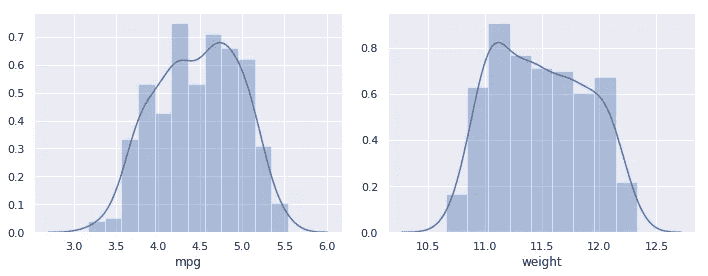

# 使用 Python 进行统计分析

> 原文：<https://medium.com/analytics-vidhya/statistical-analysis-using-python-e83f10ca3c82?source=collection_archive---------1----------------------->

如果你已经访问过 [**Part1-EDA**](/@greatsharma04/eda-for-beginners-using-python-4fcd2b57d1f7) 那么你可以直接跳转到[这个](/@greatsharma04/statistical-analysis-using-python-e83f10ca3c82#0e8a) ( **统计分析**部分)。

这是一个 **3 部分系列**，其中我将遍历一个数据集并对其进行分析，然后在最后进行预测建模。我强烈建议按照下面给出的顺序阅读这个系列，但是你也可以跳到任何部分。

[**第 1 部分，探索性数据分析(EDA)**](/@greatsharma04/eda-for-beginners-using-python-4fcd2b57d1f7) **:**
这一部分包括数据的汇总统计，但主要重点将放在 EDA 上，我们使用图从数据中提取意义/信息，并报告关于数据的重要见解。这部分更多的是关于**数据分析**和**商业智能(BI)** 。

**第二部分，统计分析:**
在这一部分我们会做很多统计假设检验，应用估计统计，解释我们得到的结果。我们也将通过第一部分的发现来验证这一点。我们将应用参数和非参数测试。我们将在这一部分报告我们得到的所有重要见解。这部分都是关于**数据科学**需要统计学背景。

[**第 3 部分，预测建模:**](https://github.com/greatsharma/MPG/tree/master/Modelling)
在这一部分中，我们将使用给定的预测因子来预测反应。这部分都是关于**机器学习**的。

## 元数据，关于数据的数据

我正在使用来自 [UCI 库](https://archive.ics.uci.edu/ml/index.php)的[自动 mpg](https://archive.ics.uci.edu/ml/datasets/auto+mpg)EDA 数据。

**标题:** Auto-Mpg 数据
**实例数:** 398
**属性数:** 9 包括类属性
**属性信息:**

```
1\. mpg — continuous
2\. cylinders — multi-valued discrete
3\. displacement — continuous
4\. horsepower — continuous
5\. weight — continuous
6\. acceleration — continuous
7\. model year — multi-valued discrete
8\. origin — multi-valued discrete
9\. car name — string (unique for each instance)
```

这个数据并不复杂，而且很适合分析，因为它很好地融合了分类属性和数字属性。

这是**第二部分**即统计分析。我不会把这一部分拉得太长，而是按顺序做下面的事情。

1.  **数据**的一些预处理，与 [**Part1-EDA**](/@greatsharma04/eda-for-beginners-using-python-4fcd2b57d1f7) 完全相同。
2.  **测试两个分类属性之间的独立性**
3.  **数值属性的正态性检验**
4.  **数值属性之间的相关性**
5.  **样本的参数和非参数检验**

> 我将在整个笔记本中大量使用**假设检验**，因此对于那些正在寻找如何在数据科学和机器学习中应用假设检验的人来说，这也是一个不错的笔记本。

首先，导入所有必需的库。

> 接下来的几个单元格涉及**数据清理**，这包括处理缺失值、重复数据(如果有的话)以及对齐数据。我已经在[第一部分](/@greatsharma04/eda-for-beginners-using-python-4fcd2b57d1f7)中提到了这一点。因此，如果您已经访问了第 1 部分，您可以跳到[这个](/@greatsharma04/statistical-analysis-using-python-e83f10ca3c82#0e8a)单元格。

我们首先将数据导入到 pandas 数据框中，并检查它的属性。


数据是矩形(表格)形式，有 398 个条目，每个条目有 9 个不同的属性。

为了检查元数据(即关于数据的数据)，我们可以使用内置的 pandas 函数。

`df.info()`，描述了数据的很多东西，比如每一列的数据类型，内存使用情况等等。

现在，我将为分类和数字列名制作两个不同的列表，因为对这两种类型的分析是不同的。为此，我将内省每一列的数据类型，如果它是类型`object`，那么它是分类的，否则是数字的。

我将在整个分析中大量使用这两个列表。

因为`cylinders`和`model_year`只有很少的唯一值，所以让它们成为分类的而不是数字的是安全的。*这个转换在分析过程中会很有帮助，因为我会在其他*的基础上分叉一些属性。

名单应该更新，

现在，检查数据中的`nans`。我将逐列检查`nans`。


数据中的纳米比例为`6 / len(df) = 0.01507`。因此，`horsepower`包含所有 6 个 nan 行，包括大约`1.5%`个数据。因为这个分数非常低，所以现在删除 nan 行是安全的。

> **注意:**如果 nan 比例很大(超过 5%)，那么我们不会删除它，而是估算缺失值，甚至可以将缺失视为另一个属性。

现在删除所有 nan 行，因为它们只有 1.5%。

让我们看看有多少重复条目，如果有，就删除它们。

因此，没有重复的行。

即将到来的代码单元已经在 [**Part1-EDA**](/@greatsharma04/eda-for-beginners-using-python-4fcd2b57d1f7) 中做了深入的解释，所以如果你觉得不舒服请参考。

在我们继续之前，最好将所有类型相同的变量组合在一起。


# 统计分析

在开始之前，我们应该先对统计学中使用的各种术语有一个很好的理解。否则，当我们移动时，我们肯定会在解释结果时丢失。

*   总体:全部数据或全部可能的观察值。
*   **样本:**从总体中抽取的观察值子集。随着样本量的增加，样本将更接近总体(**大数定律**)。
*   **参数:**这是我们感兴趣的总体属性，除非我们对整个总体进行分析(这是不可能的),否则我们永远不会知道确切的值，例如均值(mu)。
*   **估计:**关于总体参数的样本概念/值。统计学的全部目标是使这些样本估计值尽可能接近总体参数，例如，average(x bar)是平均值的最佳样本估计值。
*   **描述性统计:**用于汇总数据。
*   **推断统计:**用于从样本中得出关于总体的结论，例如，使用样本平均值估计总体均值。
*   **参数统计:**假设数据为高斯分布的统计方法。
*   **非参数统计:**不假设数据分布的统计方法，即无分布。
*   **统计假设检验:**在给定对结果的假设或预期的情况下，对观察结果的可能性进行量化的方法。我们稍后会详细讨论这一点。
*   **估计统计:**使用置信区间量化结果不确定性的方法。

## 统计假设检验

统计假设检验的想法非常简单直接。我们首先假设一些关于数据的东西，比如两个样本具有相同的均值等。然后我们找到观察给定数据的可能性，假设这个假设为真。如果可能性接近于零，那么我们**拒绝假设**，如果可能性的值大于某个阈值(由我们设定)，那么我们**无法拒绝假设**。

在统计学术语中，假设被称为**假设**，我们得到的可能性被称为 **p 值**，我们设置的阈值有两种类型，要么是**显著性水平**要么是**临界值**，我们使用的测试被称为**统计假设测试**。

因此，如果我们得到的可能性非常接近于零，那么这意味着**假设该假设为真，观察/出现该数据的可能性非常小**因此，这表明我们的假设有问题。因此，在两个样本均值的示例中，如果得出的 p 值非常接近于零，那么我们可以说**假设两个样本具有相同的均值，我们手头的数据不太可能生成，因此我们的假设有问题，因此我们拒绝接受它。**

> **注意:**所有这些都是概率性的，我们有时会犯错误，这些错误有已知的名称，即假阳性和假阴性。

## 假设

有两种类型的假设，即-

**零假设，*h0***——零假设，提出在一组给定的观测值中不存在显著差异。
**交替假设，***—一种交替假设，提出在一组给定的观测值中存在显著差异。*

*为了这些测试的目的，*

****H_0*** :变量 A 和变量 B 独立
***H_1*** :变量 A 和变量 B 不独立。*

> ***注:**h0 和 h1 互为补码。*

## *p 值*

*它是在统计测试中给定假设的数据的概率。*

**

*任何发现的**统计显著性**都是通过解释 p 值来完成的。p 值告诉我们，这些发现是由于相同的真实变化，还是仅仅是随机波动。*

*   ***p 值≤ alpha** :显著结果，拒绝零假设。*
*   ***p 值>α**:无显著结果，无法拒绝零假设。*

*通过从检验统计累积密度函数(CDF)中检索概率，可以从检验统计中计算出 p 值。*

*一些测试从特定的数据分布中返回一个测试统计值，该值可以在临界值的上下文中进行解释。**临界值**是来自检验统计分布的值，在该点之后，结果是显著的，并且可以拒绝零假设。*

*   ***检验统计量<临界值**:无显著结果，无法拒绝零假设。*
*   ***检验统计量≥临界值**:显著结果，拒绝零假设。*

***注意:**数据科学和 ML 中最常用的显著性水平值是 5%，即 alpha=0.05，我们将在本笔记本中使用相同的值。*

*[参考此决策树](https://qphs.fs.quoracdn.net/main-qimg-0138e6d464b3ff6320971528e4e72c04)*

*在整个博客中，我假设 alpha 值为 0.05*

```
*ALPHA = 0.05*
```

## *两个分类变量之间的独立性检验*

## *皮尔逊卡方检验*

*卡方统计是一种**非参数统计**工具，用于在因变量以名义水平测量时分析组差异(也可使用序数数据)。它通常用于将观察到的数据与我们根据特定假设期望获得的数据进行比较。*

**

*其中，
O:观察值(表中每个单元格的实际病例数)
E:期望值(下面计算)
卡方^{2}:该单元格的卡方值*

***假设**
**1。**如果任何预期值低于 5
**2，测试无效。**计算出的 p 值不是精确的，而是近似的，并且随着数据的增加而收敛到精确值(对于小样本量来说不太好)
**3。**观察次数必须为 20 次以上*

*因此，如果预期的细胞数很小，最好使用精确检验，因为卡方检验在这种情况下不再是一个很好的近似值。为了克服这一点，我们将使用费雪精确测试。*

## *费希尔精确试验*

*Fisher 精确检验用于确定列联表中两个分类变量之间是否存在显著关联。Fisher 精确检验是 Pearson 独立性卡方检验的替代方法。虽然实际上对所有样本量都有效，但 Fisher 精确检验实际上适用于样本量较小的情况。一般建议使用 Fisher 精确检验——而不是卡方检验——只要列联表中超过 20 %的单元的预期频率< 5。*

**

*所以`chi2`假设对每一对都失败了，但这并不是说我们不能应用，我们可以，但结果不可靠。但是`origin`和`model_year`的列联表仍然值得一试，因为大多数值都是> = 5。*

****H_0*** :原点是型号 _ 年份是独立的，alpha=0.05*

*我们将使用 scipy 的`chi2_contingency`功能，*

*更多信息请执行`help(stats.chi2_contingency)`。*

*scikit-learn 也有 chi2 测试，让我们用它来测试所有分类属性与`mpg_level`的相关性。*

****

## *数字属性的统计检验*

*以下是我们数据集中的数字/连续属性。*

```
*nums = ['mpg', 'displacement', 'horsepower', 'weight', 'acceleration']*
```

## *正规性检验*

*我把正态性测试分为两部分-*

## *1.视觉正常性检查*

*我们会用肉眼检查是否正常*

1.  *柱状图*
2.  *分位数-分位数图*

## *2.统计正态性检验*

*有三种统计测试来检查数据的正态性*

1.  *夏皮罗-维尔克检验(仅适用于高斯分布)*
2.  *达戈斯蒂诺的 K 2 检验(仅适用于高斯分布)*
3.  *Anderson-Darling 测试(对于许多其他分布也是如此)*

*我会使用`Shapiro-Wilk Test`，但你也可以尝试其他的。*

## *视觉正常性检查*

*从 [**Part1-EDA**](/@greatsharma04/eda-for-beginners-using-python-4fcd2b57d1f7) 中生成的这些分布中，我们可以清楚地看到`acceleration`是高斯分布，`mpg`和`weight`是右偏的或者可能是对数正态分布。*

**

***对数正态分布**是对数正态分布的随机变量的分布。因此，如果随机变量 X 是对数正态分布，那么 Y = ln(X)具有正态分布。*

*我们将检查 mpg 和体重是否符合对数正态分布。*

**

*因此，在应用对数变换后，我们发现体重不是对数正态，但 mpg 在视觉上**看起来像对数正态**。*

*让我们用分位数-分位数图来检查正态性。下面是原始数据的`quantile-quantile`图。*

**

*所以`acceleration`的 histplot 和 qqplot 都表明它确实接近高斯。*

## *统计正态性检验*

*我们将使用`shapiro wilk test`对数字属性的正态性进行假设检验。*

****H_0*** :数据取自正态分布，alpha=0.05*

*让我们定义一个函数，在显著性水平`alpha`下测试数据帧列的零假设。*

*哎呀，我们期望加速度是正态分布的，但是被测试拒绝了。p 值是 0.03，所以我们在 5%的显著性水平下拒绝了它，但是如果它是 2.5%，那么我们将无法拒绝零假设。我们现在不会改变 p 值，否则它将成为 **p-hacking** 。拒绝 h0 的一个可能原因是我们的数据没有被缩放，我认为缩放会有帮助。*

*我们现在将把`power transform`应用到**中，使数据更像**中的高斯分布。然后检查转换数据的正态性。*

***Power Transform** :对数据进行特征转换，使其更像高斯分布。幂变换是一系列参数化的单调变换，用于使数据更接近高斯分布。这对于建模与异方差(非恒定方差)相关的问题，或者像这里一样需要正态性的其他情况非常有用。*

**

> ***注意**:从数据框中移除`nans`时，电力变压器使整个重量栏为 0。我找不到原因，问了 sklearn 社区，并在我找到原因后更新了笔记本。如果你发现了原因，请评论。*

*现在我们将离开`weight`。*

**

*Power transforms 做了两件事，首先，它缩放了数据，即现在数据以 0 为中心，并且还使分布更像高斯分布，同时保留了原始结构。这是通过应用平方根、对数等变换来实现的。*

*`acceleration`仍然是高斯型，从`mpg` & `weight`中去掉偏斜度，使得 mpg 类似高斯型。`displacement`的分布也有所改善，现在是双峰分布，这符合观察结果。*

> *有一点你已经注意到，在应用幂变换后，`mpg` & `weight`的分布与我们在应用对数变换时得到的分布非常相似。事实上，sklearn 的功率变换确实应用了对数变换，参考[这个](https://scikit-learn.org/stable/modules/preprocessing.html#preprocessing-transformer)。*

*现在让我们使用分位数-分位数图来检查正态性。下面是转换数据的`quantile-quantile`图。*

**

*事实上，在标准化数据时，与之前相比，假设数据正常，观察到`acceleration`的可能性非常高。*

> *所以，`acceleration`在视觉上和统计上都是正态分布。*

*未标准化的数据有时也会导致一些错误的见解。例如，*

*在 [**Part1-EDA**](/@greatsharma04/eda-for-beginners-using-python-4fcd2b57d1f7) 中，我们绘制了关系图，从这些图中可以看出，虽然所有属性都与`mpg`有单调关系，但这些关系看起来并不完全是线性的。*

**

*但是在转换后的数据中，所有的关系都是纯线性的。*

**

***注意:**几乎每个人都是**同方差**但是加速度看起来更**异方差**。*

## *测试两个连续变量之间的相关性*

## *协方差*

**

*在计算中使用平均值表明每个数据样本需要具有高斯或类高斯分布，因此其**参数统计**。也很难解释，因为它可以取任何值。*

## *线性关联(皮尔逊相关)*

**

*皮尔逊相关系数只是两个变量之间的**归一化协方差**以给出可解释的分数，*

**

*它可用于总结两个数据样本之间线性关系的强度。在计算中使用平均值和标准偏差表明需要两个数据样本具有高斯或类高斯分布，因此这是一个**参数统计**。*

*作为统计假设检验，该方法假设样本是不相关的(拒绝 h0 失败)。*

***皮尔逊相关的假设** :
**1。**两个变量都应该具有高斯或类高斯分布。
2。变量之间的关系应该是线性的。
**3。**同方差，即所有随机变量具有相同有限方差的随机变量序列。*

*此外，皮尔森对异常值非常敏感。*

*两个变量可以通过非线性关系相关，使得该关系在变量的分布上更强或更弱。在这些情况下，即使变量之间有很强的相关性，皮尔逊相关系数也很低。此外，所考虑的两个变量可能具有非高斯分布。为了正确识别具有非线性关系的变量之间的关联，我们可以使用基于等级的相关方法。*

## *有序关联(等级相关)*

*等级相关是指使用值之间的顺序关系而不是特定值来量化变量之间的关联的方法。在这种情况下，我们首先按升序对数据进行排序，然后给它们分配整数等级，然后用它来查找相关的黑白变量。因为没有假设值的分布，所以等级相关方法被称为无分布相关或非参数相关。*

*四种等级相关方法如下:*

## *1.斯皮尔曼等级相关*

**

*斯皮尔曼相关性是一种**非参数等级相关性**并且也是可解释的，*

**

*在这种情况下，不是使用样本本身的协方差和标准偏差来计算系数，而是通过将原始数据转换成秩数据来计算这些统计数据，因此是非参数的。**这是非参数统计中常用的方法。***

*作为统计假设检验，该方法假设样本是不相关的(拒绝 h0 失败)。*

## *2.肯德尔等级相关*

*测试的直觉是，它计算两个样本之间匹配或一致等级的标准化分数。因此，该测试也被称为肯德尔的一致性测试。*

*作为统计假设检验，该方法假设样本是不相关的(拒绝 h0 失败)。*

## *3.古德曼和克鲁斯卡尔的秩相关*

## *4.萨默斯等级相关*

***相关类型** :
**正:**两个变量同向变化。
**中性:**变量的变化没有关系。
**负:**变量反方向变化。*

*统计测试只告诉效果的可能性。它没有告诉我们效果的大小。一个实验的结果可能是重要的，但影响很小，没有什么后果，或者结果可能是微不足道的，但影响很大。*

***效应大小:**是预期在人群中发生的效应或结果的大小或幅度。不像**显著性测试**仅仅告诉我们影响的可能性，**影响大小**实际上告诉我们影响发生的数值。所以它给了我们更多的力量。*

***我们将对** `**mpg**` **与其他数值特征**的关系进行效果检验。也就是说，我们将获得一个绝对值，而不是量化 b/w `mpg`和其他数字特征之间相关性的可能性。*

*但是以上所有的关联测试不仅给出了效应大小，而且给出了 p 值。所以可以同时看这两个值。我们将使用`spearman`,但你可以使用任何其他接受`pearson`,因为所有数值变量不满足皮尔逊的假设。*

*所以对于所有相关测试 b/w mpg 和其他属性，我们的零假设将是，*

****h0***:`mpg`和`other attribute`不相关，alpha=0.05*

> *因此，在 5%的显著性水平下，所有的 h0 都被剔除。接受“加速度”,所有其他相关性都非常高，这一点在我们之前的图中也很明显。*

*我们现在为每一对的相关性创建一个数据帧。*

**

> *对(mpg，加速度)，(位移，加速度)和(重量，加速度)的相关性中等，而其余所有对之间的相关性非常高。*

*我们现在将检验两个样本是否具有相同的均值。为此，我们对两种不同的条件进行了两种类型的显著性检验。*

## *参数统计显著性检验*

1.  ***学生 t 检验** —检验两个独立的正态分布样本是否具有相同的均值。*
2.  ***方差分析检验(ANOVA)** —检验两个或两个以上独立的正态分布样本是否具有相同的均值。*

> *方差分析与 t 检验相同，但用于 2 个以上的变量。因此，我们要么成对地应用 t 检验，要么应用一次方差分析。此外，ANOVA 仅说明所有样本是否相同，它不会量化哪些样本不同或不同多少。*

## *非参数统计显著性检验*

1.  ***曼-惠特尼 U 检验** —学生 t 检验的非参数等效物。*
2.  ***Kruskal-Wallis H** —方差分析的非参数等值(用于中位数)。*

*我们将根据样本进行适当的检验，即如果样本呈正态分布，则进行参数检验，否则进行非参数检验。*

*让我们测试一下`japan`和`usa`中的加速度是否具有相同的含义。首先，我们检查日本和美国的加速度是否正态分布，然后应用适用的测试。*

```
*So both are normally distributed so we can apply parametric test.*
```

****H_0*** : *日本*加速度和*美国*加速度样本均值相同，α= 0.05*

*因为两个分布的方差不同，因此`equal_var=False`*

*让我们测试一下所有地区的马力分布是否相同。*

> *所以它们都不是正态分布的，所以我们将应用非参数检验。*

****H_0*** :样本分布在整个区域马力相等，α= 0.05*

*测试 mpg_level 高和中的样品的加速度是否具有相同的分布。*

*测试多年来的 mpg 分布情况。*

## *分类属性和连续属性之间的关系*

*为此我们将使用 sklearn 的`feature_selection` api。*

****

*所以我们暂时结束了。我们做了一些很好的统计分析，也研究了 scipy 和 scikit-learn 提供给我们的各种统计测试。我们做了很多，并可以进一步扩展，但你得到的想法。*

*接下来的部分是 [**预测建模**](https://github.com/greatsharma/MPG/tree/master/Modelling) 主要是关于机器学习的。由于机器学习本身是一件大事，所以很难将其纳入一个单独的博客。你可以参考我的 [**这个**](https://github.com/greatsharma/MPG/tree/master/Modelling) 资源库，它是这个系列的延续，包括**特征 _ 工程**，**交叉验证**，**损失**，**度量**，**测试不同的流水线**，**超参数调优**和 **auto-ml** 。在这个知识库中有很多东西需要学习。*

> *你可以从[这里](https://www.kaggle.com/gauravsharma99/statistical-analysis-on-mpg-data)获得这个博客的**完整文档 jupyter 笔记本**，你只需要叉它。此外，如果你喜欢这款笔记本，那么**投票支持**，这将激励我创造更多高质量的内容。*

*如果你喜欢这个故事，请为它鼓掌，并与他人分享。*

*此外，请阅读我的其他故事，其中包括各种主题，*

*   *[**多重共线性对线性回归的影响**，](/analytics-vidhya/effect-of-multicollinearity-on-linear-regression-1cf7cfc5e8eb)你一定会学到多重共线性和线性回归的实质细节。*
*   *[**面部情感识别**](/@greatsharma04/facial-emotion-recognition-fer-using-keras-763df7946a64) 使用 keras。*

*还有[更多](/@greatsharma04)。*

## *参考*

*以下材料被用作来源和指导-*

*   *数据来源:[https://archive.ics.uci.edu/ml/datasets/auto+mpg](https://archive.ics.uci.edu/ml/datasets/auto+mpg)*
*   *最大似然的统计方法。大部分的定义都来自这本很棒的书。*
*   *[https://cyfar.org/what-data-analysis](https://cyfar.org/what-data-analysis)*

***再次感谢朋友们阅读我的故事:***