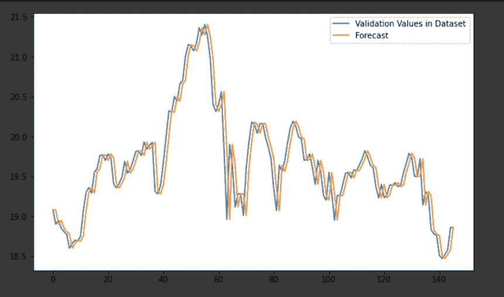
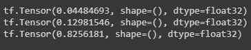
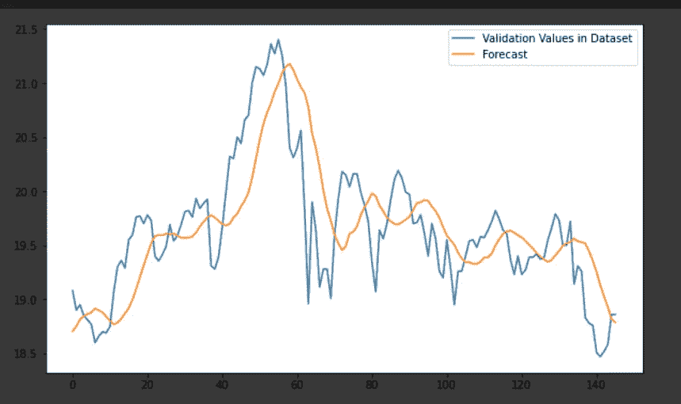
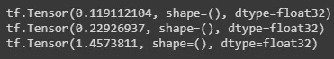

# 股价预测的统计方法:简单预测、移动平均线

> 原文：<https://medium.com/analytics-vidhya/statistical-approach-to-stock-price-prediction-naive-forecast-moving-average-40f93e221e06?source=collection_archive---------9----------------------->

让我们用一些基本的统计方法来预测股票价格。我们将首先学习这些方法的含义，然后快速实现代码。你会惊讶地发现这些简单的方法有很高的精确度！

这是我们在股价预测下的第二篇博客。我们本系列的第一篇博客提供了一个简单易懂的脸书预言家指南，这是一个预测时间序列的预训练模型。


# **天真的预测**

朴素预测是预测股票价格的最基本方法。这种方法宣扬预测只不过是前一个时间戳的变量值。
例如，在时间戳是一天的数据集中，明天的预测开盘股价就是今天的开盘价。虽然简单，但它产生了惊人的结果！自己试试！

天真预测如此有效的原因是因为像股票价格这样的变量高度依赖于它们过去的价值。因为股票价格不可能突然变化。前一天的值通常非常接近第二天的值。

然而，这种方法没有被广泛使用的原因是，大多数时候，我们希望预测未来几天而不是某一天的股票价格。这种方法不能用于这种情况。

# **实施天真预测**

如上所述，天真预测只是指预测前一天的价值。下面是实现它的代码。

```
def lag_features(df , N , col , col_index):
"adds lag features of the given columnb for previous N days"
series = df[col]
for i in range(N):
shifted_rows = np.zeros(len(df))
shifted_rows[:] = np.nan
array_index = i+1
for j in range(len(df)-(i+1)):
shifted_rows[array_index] = df.iloc[j,col_index]
array_index = array_index + 1
df[col+'_lag_'+str(i+1)] = shifted_rows
return df
```

上面的代码片段向数据集中添加了一个“滞后要素”。滞后特征是前几天的值。例如，lag_1 表示前一天的值。类似地，lag_2 表示两天前股票的价值。诸如此类。在上面的代码中，N 代表滞后特性的数量。对于简单预测方法，N=1。

```
stock_prices_w_lag = lag_features(stock_prices,1,'OPEN',0)
```

在应用该函数时，会创建一个名为“ <col_name>_lag_1”的新列(其中 col_name 是您要预测的值:open、close 等)。</col_name>

让我们看看通过简单方法预测的值与实际值有多接近:



我们可以通过这些流行的方法来量化精度:均方误差、平均绝对误差、平均绝对百分比误差。

```
#Naive forecast is OPEN_lag_1print(mean_squared_error(np.array(stock_prices.iloc[1:, 0]) , np.array(stock_prices.iloc[1:,-1])))print(mean_absolute_error(np.array(stock_prices.iloc[1:, 0]) , np.array(stock_prices.iloc[1:,-1])))print(mean_absolute_percentage_error(np.array(stock_prices.iloc[1:, 0]) , np.array(stock_prices.iloc[1:,-1])))
```

计算指标时，记得删除数据帧的第一行。为什么？因为你不能用简单的预测来预测第一天的价值！



天真预测的结果。

# **移动平均预测**

我们知道股票的未来价值取决于股票的过去价值。简单预测只考虑一个过去的值。如果我们可以使用一种不是一个，而是最后 10、12、15 或 20 个值的方法会怎么样！？
均线预测才是出路！第二天的股票价格被预测为股票价格的 N 个过去值的平均值。

n 是我们考虑的先前值的数量，更好的说法是移动窗口的大小。我们通过计算各种滞后特征(滞后 _1、滞后 _ 2…滞后 _25 等)来决定这个值。).然后，我们选择与实际值列高度相关(通常在 99%以上)的滞后特性。

*使用相同的方法，我们为数据集选择 N=7。*

# **实施移动平均预测**

求移动平均预测相当于求最后 N 个值的平均值。

```
def moving_avg_std(df ,col ,N ,col_index):
moving_mean = df[col].rolling(window = N, min_periods=1).mean()
moving_mean = np.concatenate((np.array([np.nan]), np.array(moving_mean[:-1])))
df[col + '_mean'] = moving_mean
```

在上面的代码中，df[col]。rolling()从该列的第一个条目创建一个大小为 N 的窗口。该窗口返回时间戳 t 的 *t，t -1 …，
t-(N-1)* 行(如果 N 行不可能，则给出最大可能值)。这解决了我们创建窗口的问题。

但是有一个问题！因为我们要预测时间戳‘t’处的值，所以我们需要 *t-1，t-2，..t-N* 而不是 *t，t-2，…时间+1。*这意味着我们只需要将我们的值移动一行。为此，我们在开头附加 NaN。这是合乎逻辑的，因为在 t=0 时，我们不能有任何移动平均预测，因为我们不知道 t=-1 时的值。

让我们看看移动平均预测值与实际值有多接近:



我们使用之前讨论的指标评估上述预测:

```
#Moving Average Forecast is OPEN_meanprint(mean_squared_error(np.array(stock_prices.iloc[1:, 0]) , np.array(stock_prices.iloc[1:,-1])))print(mean_absolute_error(np.array(stock_prices.iloc[1:, 0]) , np.array(stock_prices.iloc[1:,-1])))print(mean_absolute_percentage_error(np.array(stock_prices.iloc[1:, 0]) , np.array(stock_prices.iloc[1:,-1])))
```



移动平均预测的结果。

# 结论

然而，简单，移动平均线和天真的预测给出了非常好的结果！出人意料的是，甚至比[先知](/analytics-vidhya/stock-price-prediction-facebook-prophet-34c385ff05a9?source=your_stories_page---------------------------)还要厉害！

该博客由奈蒂克·汉德尔瓦尔和尼基塔·萨克塞纳撰写和编辑。你可以在这里查看我们的 Github 代码！:[尼基塔](https://github.com/nikita-0209/stock_price_detection/blob/master/Stock_Prediction%3ANaive%20Forecast%2C%20Moving%20Averages.ipynb)，[奈提克](https://github.com/Naitik1502/Statistical-Approach-to-Stock-Price-Prediction-Naive-Forecast-Moving-Average/blob/master/Moving_Avg_Stock_Prices.ipynb)。