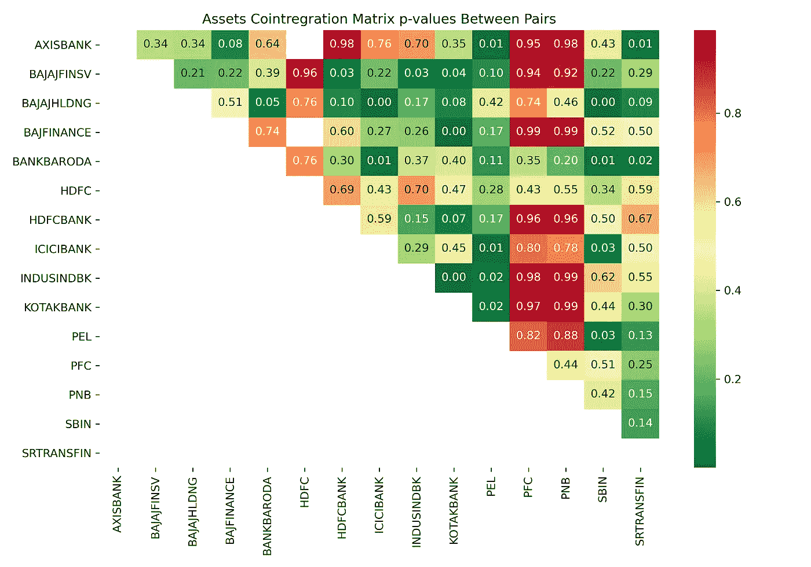

# 具有配对交易和回溯测试的统计套利

> 原文：<https://medium.com/analytics-vidhya/statistical-arbitrage-with-pairs-trading-and-backtesting-ec657b25a368?source=collection_archive---------0----------------------->

统计套利(Stat Arb)是一种交易策略，通常利用股价的均值回归或市场微观结构异常创造的机会。这是一种高度量化的分析方法，涉及非常多样化的证券投资组合。然而，为了说明这个概念，我将以仅涉及两个共同整合证券的配对交易为例。

配对交易是一种市场中立的策略，我们使用统计技术来识别两只历史上高度相关的股票。当这些股票的价格关系出现偏差时，我们预计这是均值回归，买入表现不佳的股票，同时卖出表现优异的股票。如果我们的均值回归假设是有效的，那么价格应该收敛到长期平均水平，贸易应该受益。然而，如果价格差异不是暂时的，而是由于结构性原因，那么亏损的风险就很高。你可以在我的 [**Github**](https://github.com/sabirjana/blog/tree/master/Pair_Trading) 页面找到本文用到的 Python 笔记本和数据。本文遵循的总体方法如下所述:

1.  股票论域和股票协整对的识别。
2.  对选定的线对进行静态测试。
3.  使用 z 值生成交易信号。
4.  投资组合损益计算。

**股票领域和股票协整对的识别**

我们的第一步是确定股票领域，并确定具有高相关性的股票对。这是非常重要的，这是基于经济关系，如具有类似业务的公司，否则它可能是虚假的。我已经将 NSE-100 的所有成分归类为“金融服务”公司。这给了我们一份 25 家公司的名单。然而，我们过滤掉日定价数据少于 10 年的公司，只剩下最后 15 只股票。我们取这 15 只股票的每日收盘价，并将数据框架分成测试集和训练集。这是为了确保我们选择协整对的决定是基于训练数据集，并且回测是使用样本外测试数据集完成的。作为第一步，我们将使用[皮尔逊相关系数](https://en.wikipedia.org/wiki/Pearson_correlation_coefficient)来获得这些股票之间关系的基本概念，然后使用函数`coint` form `statsmodels.tsa.stattools` 来识别协整股票。函数`coint,`将返回每一对的协整检验的 p 值。我们将这些 p 值存储在一个数组中，并将其可视化为热图。如果 p 值低于 0.05，这意味着我们可以拒绝零假设，不同符号的两个时间序列可以进行协整。

让我们直接跳到代码:

```
# make the necessary imports
import pandas as pd
import numpy as np
import matplotlib.pyplot as plt
import seaborn as sns
import datetime
idx = pd.IndexSlice
import statsmodels.api as smfrom statsmodels.regression.linear_model import OLS
from statsmodels.tsa.stattools import adfuller
from statsmodels.tsa.stattools import coint
from sklearn.model_selection import train_test_split%matplotlib inline
%config InlineBackend.figure_format = ‘retina’# read the matadata csv
nifty_meta = pd.read_csv('data/nifty_meta.csv')
nifty_meta.head(2)# get the ticker list with industry is equal to FINANCIAL SERVICES
tickers = list(nifty_meta[nifty_meta.Industry=='FINANCIAL SERVICES'].Symbol)
print(tickers)
print(len(tickers))# start and end dates for backtesting
fromdate = datetime.datetime(2010, 1, 1)
todate = datetime.datetime(2020, 6, 15)# read back the pricing data
prices = pd.read_csv('data/prices.csv', index_col=['ticker','date'], parse_dates=True)
prices.head(2)# remove tickers where we have less than 10 years of data.
min_obs = 2520
nobs = prices.groupby(level='ticker').size()
keep = nobs[nobs>min_obs].indexprices = prices.loc[idx[keep,:], :]
prices.info()# final tickers list
TICKERS = list(prices.index.get_level_values('ticker').unique())
print(len(TICKERS))
print(TICKERS)# unstack and take close price
close = prices.unstack('ticker')['close'].sort_index()
close = close.dropna()
close.head(2)# train test split 
train_close, test_close = train_test_split(close, test_size=0.5, shuffle=False)# quick view of head and tail of train set
train_close.head(2).append(train_close.tail(2))# Pearson correlation to get the basic idea about the relationship
fig, ax = plt.subplots(figsize=(10,7))
sns.heatmap(train_close.pct_change().corr(method ='pearson'), ax=ax, cmap='coolwarm', annot=True, fmt=".2f") #spearman
ax.set_title('Assets Correlation Matrix')
plt.savefig('images/chart1', dpi=300)# function to find cointegrated pairs
def find_cointegrated_pairs(data):
    n = data.shape[1]
    pvalue_matrix = np.ones((n, n))
    keys = data.keys()
    pairs = []
    for i in range(n):
        for j in range(i+1, n):
            result = coint(data[keys[i]], data[keys[j]])
            pvalue_matrix[i, j] = result[1]
            if result[1] < 0.05:
                pairs.append((keys[i], keys[j]))
    return pvalue_matrix, pairs# calculate p-values and plot as a heatmap
pvalues, pairs = find_cointegrated_pairs(train_close)
print(pairs)
fig, ax = plt.subplots(figsize=(10,7))
sns.heatmap(pvalues, xticklabels = train_close.columns,
                yticklabels = train_close.columns, cmap = 'RdYlGn_r', annot = True, fmt=".2f",
                mask = (pvalues >= 0.99))
ax.set_title('Assets Cointregration Matrix p-values Between Pairs')
plt.tight_layout()
plt.savefig('images/chart2', dpi=300)
```

代码注释:

1.  我们对 python 库进行必要的导入。
2.  接下来，我们阅读`nifty_meta.csv`并创建一个行业为“金融服务”的报价机列表，并设置开始和结束日期。
3.  从`prices.csv`读取每日价格数据，并删除我们不到 10 年的数据。
4.  拆分定价数据框架，使其仅包含每日收盘数据，并将其分成 50%的训练和测试数据集。
5.  画出每日收益的皮尔逊相关图，以获得关系的基本概念。
6.  定义一个函数`find_cointegrated_pairs`来寻找协整对和相应的 p 值。
7.  绘制 p 值的热图。


每日收益的皮尔逊相关性

皮尔逊相关系数在+1 到-1 之间变化，是两个变量之间关系的线性度量。值+1 表示强正相关，0 表示没有关系，而-1 表示强负相关。我们可以在上面的热图中看到，有多对具有很强的正相关性。



资产对之间的协整矩阵 p 值

我们也来分析一下协整检验的结果。我们可以在上面的热图中看到，有很多 p 值小于 0.05 的对。这意味着，对于这些对，我们可以拒绝零假设，他们可以协整。

**对所选对进行静态测试**

现在，对于 p 值小于 0.05 的策略，我们有许多候选对。选择正确的组合至关重要，因为如果价格完全一致，这种策略就不会奏效。他们需要分化和均值回归，我们的战略才能盈利。

让我们来看看 BANKBARODA 和 SBIN，并使用扩展的 Dickey-Fuller 测试进一步测试利差的平稳性。重要的是传播是稳定的。如果均值和方差等参数不随时间变化，并且没有[单位根](https://en.wikipedia.org/wiki/Unit_root)，则认为时间序列是平稳的。我们将首先使用 OLS 回归计算这两个报价机之间的套期保值比率。然后，使用套期保值比率，我们将计算利差，并运行扩展的 Dickey-Fuller 测试。

让我们看一下代码:

```
# final pair to test strategy
asset1 = ‘BANKBARODA’
asset2 = ‘SBIN’# create a train dataframe of 2 assets
train = pd.DataFrame()
train['asset1'] = train_close[asset1]
train['asset2'] = train_close[asset2]# visualize closing prices
ax = train[['asset1','asset2']].plot(figsize=(12, 6), title = 'Daily Closing Prices for {} and {}'.format(asset1,asset2))
ax.set_ylabel("Closing Price")
ax.grid(True);
plt.savefig('images/chart3', dpi=300)# run OLS regression
model=sm.OLS(train.asset2, train.asset1).fit()# print regression summary results
plt.rc('figure', figsize=(12, 7))
plt.text(0.01, 0.05, str(model.summary()), {'fontsize': 16}, fontproperties = 'monospace')
plt.axis('off')
plt.tight_layout()
plt.subplots_adjust(left=0.2, right=0.8, top=0.7, bottom=0.1)
plt.savefig('images/chart4', dpi=300);print('Hedge Ratio = ', model.params[0])# calculate spread
spread = train.asset2 - model.params[0] * train.asset1# Plot the spread
ax = spread.plot(figsize=(12, 6), title = "Pair's Spread")
ax.set_ylabel("Spread")
ax.grid(True);# conduct Augmented Dickey-Fuller test
adf = adfuller(spread, maxlag = 1)
print('Critical Value = ', adf[0])# probablity critical values
print(adf[4])
```

代码注释:

1.  选择资产 1 作为 BANKBARODA，资产 2 作为 SBIN。
2.  使用训练数据集创建上述两只股票收盘价的数据框架，并将其可视化。
3.  运行 OLS 回归，得到斜率，这也是我们的对冲比率。
4.  计算传播，并绘制可视化。
5.  运行扩展的 Dickey-Fuller 测试来检查单位根的分布和存在的平稳性。


该货币对的每日收盘价

从上面的图中我们可以看出，这两只股票的收盘价变动相当一致。


OLS 回归结果


一对的传播

来自 OLS 回归的高 R 平方值和接近零的 p 值表明这两只股票之间的相关性非常高。传播看起来是稳定的，并且来自扩充的 Dickey-Fuller 检验的临界值是-3.459，其小于在 1% (-3.435)显著性水平的值。因此，我们能够拒绝零假设，传播有一个单位根，并可以得出结论，它是平稳的性质。

**使用 z 值生成交易信号**

到目前为止，我们一直使用训练数据集来最终确定我们策略的股票对。从现在开始，我们将使用测试数据集来确保交易信号的生成，并使用样本数据集进行回溯测试。我们将使用两个股票价格之间的比率的 z 分数来生成交易信号，并设置上限和下限。这将告诉我们一个价格离总体均值有多远。如果它是正数，并且值高于上限，那么股票价格高于平均价格值。因此，它的价格预计会下跌，因此我们想卖空这只股票，做多另一只股票。

让我们看一下代码:

```
# calculate z-score
def zscore(series):
 return (series — series.mean()) / np.std(series)# create a dataframe for trading signals
signals = pd.DataFrame()
signals['asset1'] = test_close[asset1] 
signals['asset2'] = test_close[asset2]
ratios = signals.asset1 / signals.asset2# calculate z-score and define upper and lower thresholds
signals['z'] = zscore(ratios)
signals['z upper limit'] = np.mean(signals['z']) + np.std(signals['z'])
signals['z lower limit'] = np.mean(signals['z']) - np.std(signals['z'])# create signal - short if z-score is greater than upper limit else long
signals['signals1'] = 0
signals['signals1'] = np.select([signals['z'] > \
                                 signals['z upper limit'], signals['z'] < signals['z lower limit']], [-1, 1], default=0)# we take the first order difference to obtain portfolio position in that stock
signals['positions1'] = signals['signals1'].diff()
signals['signals2'] = -signals['signals1']
signals['positions2'] = signals['signals2'].diff()# verify datafame head and tail
signals.head(3).append(signals.tail(3))# visualize trading signals and position
fig=plt.figure(figsize=(14,6))
bx = fig.add_subplot(111)   
bx2 = bx.twinx()#plot two different assets
l1, = bx.plot(signals['asset1'], c='#4abdac')
l2, = bx2.plot(signals['asset2'], c='#907163')u1, = bx.plot(signals['asset1'][signals['positions1'] == 1], lw=0, marker='^', markersize=8, c='g',alpha=0.7)
```

代码注释:

1.  定义函数`zscore` 来计算 z 分数。
2.  用测试数据集中的收盘价创建我们两只股票的信号数据框架，并计算它们的价格比。
3.  计算比率的 z 得分，并用正负一个标准差定义阈值上限和下限。
4.  使用以下逻辑创建信号列—如果 z 得分大于上限阈值，则我们将得到-1(短信号),但是如果 z 得分小于下限阈值，则得到+1(长信号),对于无信号，默认值为零。
5.  取信号柱的一阶差分，得到股票仓位。如果是+1，那么我们做多，-1，那么做空，0，如果没有头寸。
6.  第二个信号将正好与第一个相反，这意味着我们做多一只股票，同时做空另一只股票。同样，对第二个信号取一阶差分，计算第二个位置列。
7.  接下来，我们将股票价格及其在投资组合中的多头和空头头寸可视化。


配对交易——交易信号和头寸

**投资组合损益计算**

我们将从初始资本 100，000 开始，并使用初始资本计算每只股票的最大股票头寸数。在任何给定的一天，第一只股票的总损益将是该股票的总持有量和该股票的现金头寸。类似地，第二支股票的损益将是该股票的总持有量和该股票的现金。你需要记住，我们持有市场中性头寸，这意味着我们用大约相同的资金同时做多和做空。最后，为了得到总的利润和损失，我们必须合计这两个。基于股票 1 和 2 的头寸，我们计算它们各自的日收益。我们还将在最终的投资组合数据框架中添加一个带有上限和下限阈值列的 z 得分列，以实现可视化。

让我们跳到代码:

```
# initial capital to calculate the actual pnl
initial_capital = 100000

# shares to buy for each position
positions1 = initial_capital// max(signals['asset1'])
positions2 = initial_capital// max(signals['asset2'])

# since there are two assets, we calculate each asset Pnl 
# separately and in the end we aggregate them into one portfolio
portfolio = pd.DataFrame()
portfolio['asset1'] = signals['asset1']
portfolio['holdings1'] = signals['positions1'].cumsum() * signals['asset1'] * positions1
portfolio['cash1'] = initial_capital - (signals['positions1'] * signals['asset1'] * positions1).cumsum()
portfolio['total asset1'] = portfolio['holdings1'] + portfolio['cash1']
portfolio['return1'] = portfolio['total asset1'].pct_change()
portfolio['positions1'] = signals['positions1']# pnl for the 2nd asset
portfolio['asset2'] = signals['asset2']
portfolio['holdings2'] = signals['positions2'].cumsum() * signals['asset2'] * positions2
portfolio['cash2'] = initial_capital - (signals['positions2'] * signals['asset2'] * positions2).cumsum()
portfolio['total asset2'] = portfolio['holdings2'] + portfolio['cash2']
portfolio['return2'] = portfolio['total asset2'].pct_change()
portfolio['positions2'] = signals['positions2']

# total pnl and z-score
portfolio['z'] = signals['z']
portfolio['total asset'] = portfolio['total asset1'] + portfolio['total asset2']
portfolio['z upper limit'] = signals['z upper limit']
portfolio['z lower limit'] = signals['z lower limit']
portfolio = portfolio.dropna()

# plot the asset value change of the portfolio and pnl along with z-score
fig = plt.figure(figsize=(14,6),)
ax = fig.add_subplot(111)
ax2 = ax.twinx()
l1, = ax.plot(portfolio['total asset'], c='g')
l2, = ax2.plot(portfolio['z'], c='black', alpha=0.3)
b = ax2.fill_between(portfolio.index,portfolio['z upper limit'],\
                portfolio['z lower limit'], \
                alpha=0.2,color='#ffb48f')
ax.set_ylabel('Asset Value')
ax2.set_ylabel('Z Statistics',rotation=270)
ax.yaxis.labelpad=15
ax2.yaxis.labelpad=15
ax.set_xlabel('Date')
ax.xaxis.labelpad=15
plt.title('Portfolio Performance with Profit and Loss')
plt.legend([l2,b,l1],['Z Statistics',
                      'Z Statistics +-1 Sigma',
                      'Total Portfolio Value'],loc='upper left');
plt.savefig('images/chart8', dpi=300);

# calculate CAGR
final_portfolio = portfolio['total asset'].iloc[-1]
delta = (portfolio.index[-1] - portfolio.index[0]).days
print('Number of days = ', delta)
YEAR_DAYS = 365
returns = (final_portfolio/initial_capital) ** (YEAR_DAYS/delta) - 1print('CAGR = {:.3f}%' .format(returns * 100))
```

代码注释:

1.  我们从初始资金 10 万开始，计算每只股票的买入股数。
2.  接下来，我们通过将第一只股票的持仓量乘以股价和总股数来计算其持股量。
3.  然后，我们通过从初始现金头寸中减去持有量来计算现金头寸。投资组合中股票的总头寸是现金加持股的总和。
4.  使用总股票头寸计算每日回报。
5.  接下来，我们对第二只股票执行步骤 1 到 4，并对总投资组合价值的两项资产头寸求和。
6.  添加带有上限和下限阈值的 z 得分以进行可视化。
7.  可视化投资组合表现以及 z 值、上限和下限。
8.  计算投资组合 CAGR。


损益情况下的投资组合绩效

该战略的复合年增长率(CAGR)为 16.5%，这看起来很有希望，但在我们得出任何结论之前，还有许多事情要考虑。需要考虑的几个重要因素如下:

1.  由于这是一种市场中性的方法，很大程度上取决于我们卖空的能力，这种能力可能由于各种原因(包括监管)而受到限制。
2.  我们没有考虑与交易、市场下滑和证券借贷相关的成本。通常，市场中性策略会导致大量交易。
3.  使用历史数据预测未来总是有局限性的。

让我们记住，任何实施策略的决策都应该基于对所有关键性能参数的考虑，包括可行性和扣除费用和收费后的回报。

祝投资愉快，请在文章中留下您的评论！

请注意:此分析仅用于教育目的，作者不对您的任何投资决策负责。

参考资料:

1.  [学习算法交易:使用 Python 和高级数据分析构建和部署算法交易系统和策略](https://www.amazon.com/Learn-Algorithmic-Trading-algorithmic-strategies/dp/178934834X)。
2.  【https://je-suis-tm.github.io/quant-trading/】T4。
3.  请在我的 [Linkedin](https://www.linkedin.com/in/sabirjana/detail/recent-activity/shares/) 页面或 [Medium](/@sabirh.jana) 查看我关于量化金融的其他文章/帖子。