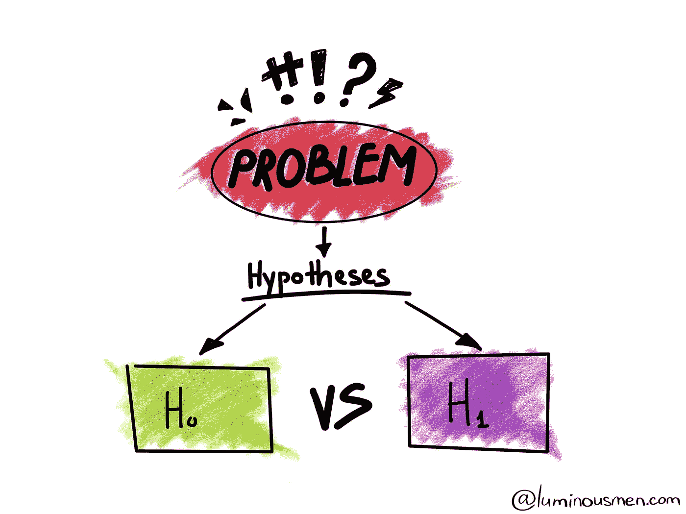

# 统计假设检验-一个简短的演练。

> 原文：<https://medium.com/analytics-vidhya/statistical-hypothesis-testing-a-brief-walk-through-338939505ef0?source=collection_archive---------35----------------------->

你好，初露头角的数据科学家们，这个话题来自一个对这个广阔的数据科学领域完全陌生的人。我从事统计假设检验已经有一段时间了，有机会探索这个领域的这一部分，因此写了这篇文章。

统计假设检验是一个非常重要且“必备”的概念。
这篇文章讨论了各种假设检验备忘单及其各自的 python APIs，你肯定可以在你即将到来的机器学习项目中使用它们来让你的数据更多地说话……虽然不是字面上的意思。

我将从简单的假设检验的旧定义开始，然后是进行某个测试的步骤😅。

声明:这篇文章只是一个简短的演练，正如标题所示，期望是误导。但是我的下一篇文章肯定会深入分析每一个假设检验。

# 什么是假设检验

*假设检验是统计学中的一种行为，分析师用它来检验关于总体参数的假设。它广泛用于通过使用样本数据来评估假设的合理性。所做的假设可能正确，也可能不正确。光有数据是不够有趣的。这是我们真正感兴趣的解释。*

# 假设检验的类型

1.  零假设:零假设，用 Ho 表示，通常是样本观察值纯粹是随机产生的假设。
2.  备择假设:备择假设，用或哈表示，纯属你的选择，是样本观测值受某种非随机原因影响的假设。
    下面提到的每一项测试都是以一种组合的方式呈现的。最重要的是，拒绝一个无效假设并不意味着我们应该接受另一个假设。在这种情况下，我们需要检查为什么我们的零假设被拒绝，事后分析需要做，Tukey 的测试是其中最受欢迎的。未能拒绝零假设仅仅意味着数据没有足够的说服力让我们选择替代假设而不是零假设。

**统计假设检验的类型**
正态性检验。
相关性检验。
参数统计假设检验。
非参数统计假设检验。
静态测试。

# 正规性检验

无论是方差分析、方差分析、T 检验还是任何其他参数检验，都假设数据是独立的且呈正态分布，因此在进行任何假设检验之前，这种检验非常重要。

# 夏皮罗-维尔克试验:

## 假设:每个样本中的数据需要独立且同分布。

## 假设:

H0-样本具有高斯分布。

HA-样本不符合高斯分布。

夏皮罗测试给我们一个值，然后与 p 值比较，它帮助我们确定你的结果的意义。一般取 0.05。

推论:

1.  较小的 p 值(通常≤ 0.05)表明有强有力的证据反对零假设，因此您拒绝零假设。
2.  大的 p 值(> 0.05)表明反对零假设的证据很弱，因此您无法拒绝零假设。

## 其他重要的正态性检验有:

卡方正态性检验。达戈斯蒂诺-皮尔逊试验。(检查分布的偏斜度和峰度系数)
Kolmogorov-Smirnov 拟合优度检验。
Jarque-Bera 试验。
安德森达令测试。

如果数据不是正态分布的呢？？
在这种情况下，需要进行转换。Box Cox 变换

# 相关性测试

# 皮尔逊相关系数。

假设:
每个样本中的观测值是独立同分布的(iid)。
每个样本中的观测值呈正态分布。
每个样本中的观测值具有相同的方差。

为了检查每个样本中的观察值是否具有相同的方差，我们进行了同方差检验(Flinger 检验和 Bartlet 检验)。

## 解释

H0:这两个样本是独立的。H1:样本之间存在相关性。

# 斯皮尔曼等级相关

假设:
每个样本中的观测值是独立同分布的(iid)。
可以对每个样本中的观察值进行排序。

## 解释

H0:这两个样本是独立的。H1:样本之间存在相关性。

肯德尔的秩相关检验、卡方检验是其他此类相关检验。

# 静态测试

# 扩充的迪基-富勒单位根检验

测试一个时间序列是否有单位根，例如，有一个趋势或更普遍的是自回归。

中的假设
观察值是按时间顺序排列的。

## 解释

H0:单位根存在(数列是非平稳的)。
H1:单位根不存在(数列是平稳的)。

# 科维亚特科夫斯基-菲利普斯-施密特-申

测试时间序列是否是趋势平稳的。

中的假设
观察值是按时间顺序排列的。

## 解释

H0:时间序列不是趋势稳定的。
H1:时间序列是趋势平稳的。

# 参数统计假设检验

# “学生”t 检验

检验两个独立样本的均值是否显著不同。

假设
每个样本中的观测值是独立同分布的(iid)。
每个样本中的观测值呈正态分布。
每个样本中的观测值具有相同的方差。

## 解释

H0:样本的平均值是相等的。H1:样本的平均值不相等。

# 配对学生 t 检验

检验两个配对样本的平均值是否显著不同。

**假设**
每个样本中的观测值是独立同分布的(iid)。
每个样本中的观测值呈正态分布。
每个样本中的观测值具有相同的方差。
每个样本的观察值都是成对的。

## 解释

H0:样本的平均值是相等的。H1:样本的平均值是不相等的。

其他这样的参数测试是 ANOVA，我将发布一篇完全致力于这一特定测试的不同文章以及代码片段。
继续，我们进行非参数测试。

# 非参数测试。

# 曼-惠特尼 U 检验

检验两个独立样本的分布是否相等。

假设
每个样本中的观测值是独立同分布的(iid)。
可以对每个样本中的观察值进行排序。

## 解释

H0:两个样本的分布是相等的。
H1:两个样本的分布不相等。

# Wilcoxon 符号秩检验

检验两个配对样本的分布是否相等。

假设
每个样本中的观测值是独立同分布的(iid)。
可以对每个样本中的观察值进行排序。
每个样本的观察值是成对的。

## 解释

H0:两个样本的分布是相等的。
H1:两个样本的分布不相等。

其他这样的非参数检验是克鲁斯卡尔沃利斯检验，弗里德曼检验。

这是所有的乡亲。一定要写下你的想法。
谢谢。