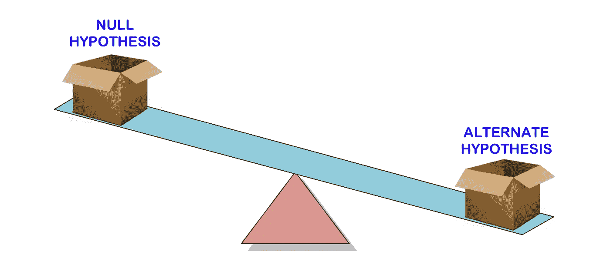
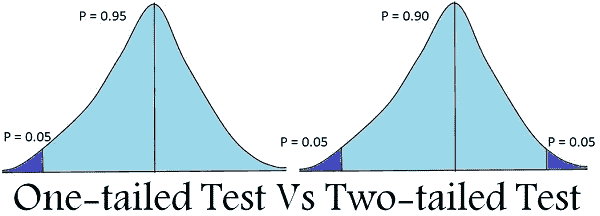

# 统计假设检验:它是什么？为什么？

> 原文：<https://medium.com/analytics-vidhya/statistical-hypothesis-testing-what-it-is-and-why-it-is-1f26c627b426?source=collection_archive---------38----------------------->

# 介绍

假设检验是一种统计检验，用于从数据中得出推论。通常，它用于比较两个统计数据集，或者将通过采样获得的数据集与来自理想化模型的合成数据集进行比较。或者将通过采样获得的数据集与来自理想化模型的合成数据集进行比较。这也是机器学习领域中最重要的预处理步骤之一。在进行各种测试之前，让我们先来谈谈一些统计术语:

# 虚假设

**零假设**是指两组观察值之间不存在显著差异的假设。这意味着给定的两个样本均值在零假设下是相等的。

# 替代假设

当零假设为假时，使用**替代假设**。这意味着当两个样本均值之间存在显著差异时，将会考虑这一点。

# 显著水平

显著性水平是指我们倾向于接受假设的程度。我们不可能每次都获得 100%的测试统计准确性。因此，有必要定义一些余量。通常，我们定义 5%的显著性水平。这意味着，如果我们得到了 95%以上的准确性，我们可以接受假设。

# 临界值

临界值告诉我们，两个样本均值属于同一分布的概率是多少。临界值越高，意味着两个样本属于同一分布*的概率越低。*双尾检验的一般临界值是 **1.96，**是基于正态分布区域的 **95%** 在均值的 1.96 个标准偏差以内。

# p 值

p 值是一个概率度量，它是在我们测试零假设时计算的。如果 p 值大于选定的显著性水平，那么我们接受零假设，否则，我们拒绝零假设。

# 第一类错误

第一类错误发生在我们拒绝零假设的时候，尽管它是真的。它也被称为假阳性。

# 第二类错误

第二类错误发生在当我们不能拒绝零假设时，尽管它是假的。它也被称为假阴性

# 统计测试

现在让我们来看看假设检验中的不同检验。

# 单尾检验

单尾检验是指感兴趣区域位于抽样分布一侧的检验。比如——班里学生的实力≥ 100。

# 双尾检验

双尾检验是指感兴趣区域位于抽样分布两侧的检验。比如——班里学生的实力> 100 或者< 100。

# t 检验

假设两个样本均值服从正态分布，当我们想要比较它们时，就要进行 t 检验。

如果两个样本均值相同，我们接受**零假设**。

如果两个样本均值不同，我们接受**替代假设**。

> **t = (x1 — x2) / (σ / √n1 + σ / √n2)**
> 
> 在哪里？
> 
> x1 =样本 1 的平均值
> 
> x2 =样本 2 的平均值
> 
> n1 =样本 1 的大小
> 
> n2 =样本 2 的大小

# z 检验

假设总体均值和样本均值服从正态分布，当我们想要比较它们时，就要进行 Z 检验。

如果样本均值与总体均值相同，我们接受**零假设**。

如果样本均值不同于总体均值，我们接受**替代假设**

> **z = (x — μ) / (σ / √n)**
> 
> 在哪里，
> 
> x=样本平均值
> 
> μ =总体平均值
> 
> σ / √n =总体标准差

# 方差分析

当我们在一次测试中比较两个以上的样本时，使用 ANOVA 测试。基本上，方差分析有两种变体

1.  **单向 ANOVA -** 当我们比较一个独立变量的两个以上样本均值时使用。
2.  **双向 ANOVA -** 当我们比较一个以上自变量的两个以上样本均值时使用。

当所有样本均值相同时，我们接受**零假设**，否则我们接受**备择假设。**

> **F =((SSE1—SSE2)/m)/SSE2/n-k**，其中
> 
> SSE =剩余平方和
> 
> m =限制数量
> 
> k =独立变量的数量

# 独立性卡方检验

当一个总体中有两个分类值时，应用卡方检验。它用于确定这两个变量之间是否有显著的关联。

例如，在一个机构中，学生可以按性别(男性或女性)和学科偏好(学科 A、学科 B、学科 C)分类。这里可以进行卡方检验来确定这种关系。

如果这两个变量是独立的，那么我们接受**零假设**，否则我们接受**交替假设。**

> **χ2 =σ[(Or，c — Er，c)2 / Er，c ]** 其中
> 
> 或者，c =在变量 A 的级别 *r* 和变量 B 的级别 *c* 观察到的频率计数
> 
> Er，c =变量 A 的级别 *r* 和变量 B 的级别 *c* 的预期频率计数

这次都是我这边的。希望我能恰当地解释这些事情。