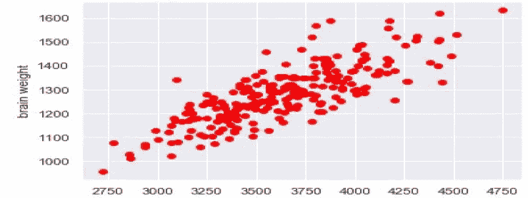
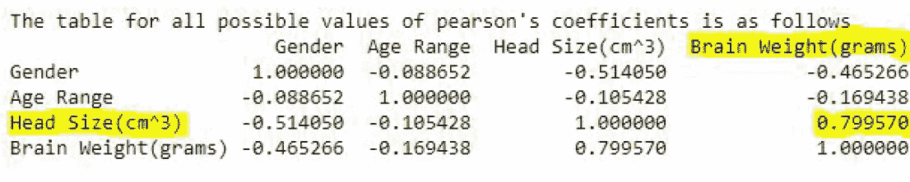
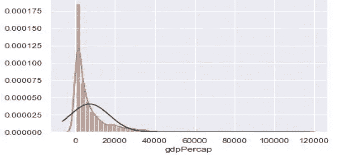
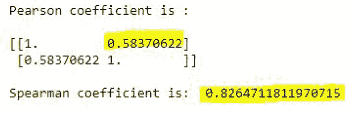
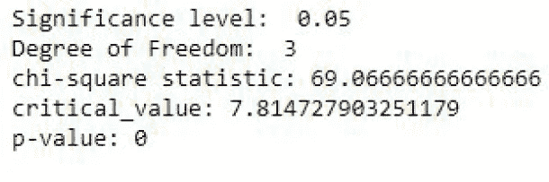
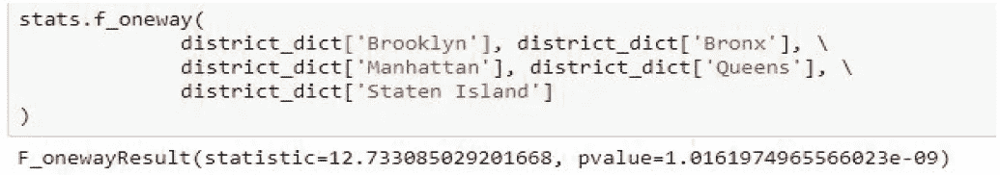
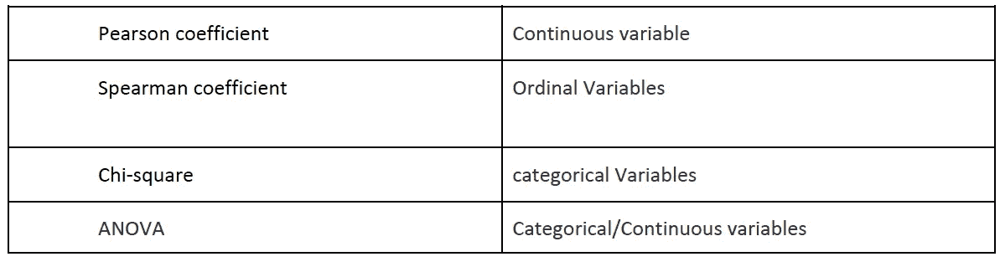

# 从数据集中寻找相关性和推论的统计方法

> 原文：<https://medium.com/analytics-vidhya/statistical-methods-for-finding-correlation-and-inference-from-the-data-set-d5cfc1f5914a?source=collection_archive---------5----------------------->

**简介**

哇！数据科学家，听起来很神奇，是最流行的词，对吗？

数据科学家的任务是用一些被认为是不真实的真实的东西让人们吃惊，这并不容易。作为数据科学家，最重要的任务是验证我们收到的总体样本是否正确，是否适合使用 ML 完成我们的任务。

现在的问题是我们如何做到这一点？

上述问题的答案是传统的统计推断方法。这些统计方法的发现可以帮助您更好、更自信地展示您的实验结果，并为您的预测建模问题选择正确的
算法和配置。

在这篇博客中，我们将讨论几种主要的统计方法:

●皮尔逊系数
●斯皮尔曼系数
●卡方
●方差分析

在深入其中每一个的细节之前，我假设你知道均值、标准差、零假设和[正态/高斯分布。](/ai-techsystems/gaussian-distribution-why-is-it-important-in-data-science-and-mac hine-learning-9adbe0e5f8ac)

**皮尔逊系数:**

相关系数在统计学中用于衡量两个变量之间的关系有多强。在统计学中，如果说一般情况下两个变量之间存在相关性，我们实际上是
参考皮尔逊系数的相关结果。

皮尔逊系数适用于连续和正态分布的数据。我的意思是，皮尔逊系数适用于具有单一均值、单峰、无显著异常值且
具有较小标准差的定量数据。

让我们以一个**头部大脑**数据集为例，我们需要发现头部大小是否与大脑重量相关。

> H0(零假设):头部大小与大脑重量无关。
> Ha(交替假说):头部大小与大脑重量有关。

**头部尺寸**

上图显示，头部大小与大脑重量呈正相关，相关系数为 0.799570
详见笔记本[https://github.com/AayushiG28/Correlation_Methods.git](https://github.com/AayushiG28/Correlation_Methods.git)

**斯皮尔曼系数:**

比较几对数据的最佳方法是使用统计测试——这可以确定相关性是否真的显著。Spearman 等级相关系数是一种技术，可用于总结两个变量之间关系的强度和方向(负或正)。

结果总是在 1 和负 1 之间。

**Spearman** 也适用于**连续数据**，但它不同于 Pearson，因为**它可以应用于不具有正态或高斯分布的数据集**。

我们将举一个例子，当一个国家的人均 GDP 增加时，预期寿命会增加。

数据集:[http://bit.ly/2cLzoxH](http://bit.ly/2cLzoxH)

从上面的图表中，我们可以发现数据是正偏的，并且有峰度(尾部或异常值)。

在这里，我们可以看到，如果我们应用皮尔逊系数，它将假设数据是正态分布的，皮尔逊计算的相关值仅反映真实的关联，而斯皮尔曼并不假设数据是正态分布的，并根据数据的等级值计算相关系数。

参考笔记本:[https://github.com/AayushiG28/Correlation_Methods.git](https://github.com/AayushiG28/Correlation_Methods.git)

**卡方检验:**

卡方检验有两种类型:

1)卡方拟合优度检验，确定样本数据是否与总体匹配。
2)独立性卡方检验，有助于比较列联表中的两个变量，看它们是否相关。该测试主要用于识别两个分类变量的相关性。(较小的卡方值表示数据集中的两个分类变量之间存在关系，而较大的卡方值表示不存在关系)。

我们将在此测试数据集中两个分类变量的独立性。

数据集:[http://www . stats tutor . AC . uk/types/teach-yourself/statistical-analyses-using-SPSS/](http://www.statstutor.ac.uk/types/teach-yourself/statistical-analyses-using-spss/)

> H0:性格和颜色偏好之间没有联系哈:性格和颜色偏好之间有联系

应用卡方检验后，我们发现:

由于我们得到的数据的 p 值为 0，自由度为**3**，α为 **0.05** ，因此我们拒绝[零假设](https://en.wikipedia.org/wiki/Null_hypothesis)并接受另一个假设，即颜色偏好取决于个性

更多细节请参考我的笔记本[https://github.com/AayushiG28/Correlation_Methods.git](https://github.com/AayushiG28/Correlation_Methods.git)

**方差分析:**

方差分析(ANOVA)是一种使用观察样本来比较平均数的技术。ANOVA 是 t-test 的扩展，因为就像 t-test 一样，它也比较组的平均值，但是 ANOVA 可以比较 2 个以上组的平均值。

所以给定 k 个不同的组(标签)和相关的定量数据。方差分析可以告诉你“来自任何一个组的平均值在统计学上是否不同”。

在对数据集进行方差分析之前有几个假设:
●正态性
●方差齐性
●独立观察

让我们看一些例子:

我们将关注纽约市五个不同地区的 SAT 成绩。

> H0:各组的 SAT 平均成绩没有显著差异。
> Ha:各组的 SAT 平均成绩有显著差异

在 ANOVA 中，我们计算两个主要方差，即
●组间估计方差
●组内估计方差

在对数据进行单因素方差分析后，我们看到得到的 **p 值小于 0.05** 。我们可以拒绝零假设，并得出结论，每个地区的 SAT 成绩之间存在显著差异。

参赛作品:[https://github.com/AayushiG28/Correlation_Methods.git](https://github.com/AayushiG28/Correlation_Methods.git)

结论:

我们了解了可以在数据集上执行的不同类型的相关性测试，这些测试给出了数据集的推断，以及哪些类型的推断相关性方法适用于不同的数据集

