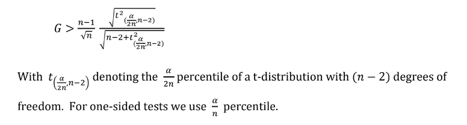
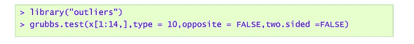
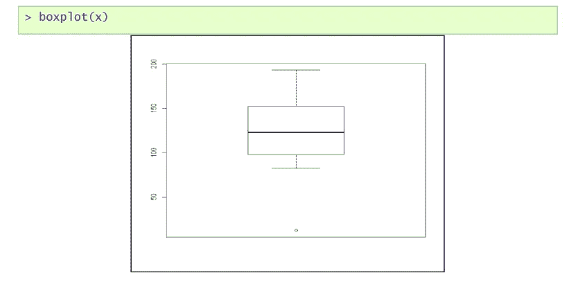

# 识别异常值的统计方法(单变量数据)(第一部分)

> 原文：<https://medium.com/analytics-vidhya/statistical-methods-for-identifying-outliers-for-univariate-data-part-i-6b4764079cb0?source=collection_archive---------8----------------------->

**定义离群值:**

异常值是一个与
其他观察值偏离太多或太远的观察值。离群点检测在数据分析中非常重要。本研究的目的是研究小样本或非正态数据集中的异常值，但关于它们的特征是有问题的。因此，我们通过删除异常值将数据转换为正常数据。

**统计技术和工具**

**1.1** *格拉布检验*
**1.2** *四分位距(IQR)*
**1.3***狄克逊检验*
**1.4** *箱线图*

***1.1 格拉布斯检验:***
格拉布斯(1969)检测单变量数据集中的单个异常值。它是一个近似服从正态分布的数据集，样本量小于 30。格拉布检验由以下两个假设定义。
*Ho* :数据集中没有离群点。
*H1* :数据集中有一个异常值。
如果最小值或最大值是异常值，格拉布斯检验有几个[统计量](https://en.wikipedia.org/wiki/Statistic)。

其中是数据集的元素， ***X*** 和 ***S*** 分别表示样本均值和标准差，检验统计量是以样本标准差为单位的样本均值的最大绝对偏差。
将参数 **G** 的计算值与 Grubb 试验的临界值进行比较。当计算值高于或低于选择统计显著性的临界值时，那么计算值可以被接受为异常值。
***标准:***

***1.2 四分位数范围(IQR)***
这是用于从单变量数据集中检测异常值的分位数方法。在统计表中没有必要使用分位数法。在该方法中使用了以下步骤。
i)首先，我们找到 ***Q1*** 和****Q3****我们找到第一和第三个分位数。
ii)然后找出它们之间的差异，即***H = Q3-Q1***
***标准:***
低于***Q1-1.5H****并且高于 ***Q1+1.5H*** 的值被认为是轻度异常值。低于***Q1–3H***而高于 ***Q1+3H*** 的值被认为是极端异常值。***

*****1.3 狄克逊检验:*** 此检验由“W.Dixon 9 0”开发并用于小样本量的检验是合适的。该测试对 *n≤ 30* 有一定的限制。
Dixon 定义的检测异常值的检验统计量是**

****

*****1.4 箱线图:***
箱线图是一个检测异常值的图形化工具。在箱线图中，我们给出了用于检测异常值的不同
参数。它产生给定的数据观察框和绘图。在箱线图中，观察是不符合常规的，它们是异常值。**

*****断裂强度数据:***
在该数据中，总共给出了 14 个观察值，这些观察值是关于断裂强度的。**

****

**断裂强度数据**

**这里我们首先对给定的数据进行常规检查。以便我们可以应用适当的测试来识别数据中出现的异常值。**

***何*:数据分布正常 vs
*:数据分布不正常***

******

*****结论:**
此处 [*p 值*](https://www.investopedia.com/terms/p/p-value.asp)*>α(0.05)*因此我们未能剔除 5% l.o.s .的 *Ho* 因此我们得出结论，给定数据是正常的。***

***既然给定的数据是正常的，那么我们可以使用* ***Grubb 的& Dixon 检验*** *来识别数据中出现的异常值。***

********

*****结论:***
这里我们用的是 *grubbs.test* 中 type=10 的选项，它给出的数据集的最低观测值是一个离群值。即 12.38(观察值 10)是异常值。**

****

*****结论:***
这里我们得到 12.38(第 10 号观察值)给出一个离群值。**

*****IQR*****

****

****结论:**
这里我们得到的 10 个观测值小于***Q1-1.5 iqr***，因此 12.38(第 10 个观测值)是一个异常值。**

*****方框图:*****

****

**图:制动强度数据的箱线图**

*****结论:***
从箱线图中，我们还从数据中得到了一个异常值，即 12.38(观察值 10)。**

********

*****结论:***
这里我们直接得到 12.38(第 10 号观测值)是一个异常值。**

****# #以上测试总结:****

****