# 识别异常值的统计方法(回归分析法)(第二部分)

> 原文：<https://medium.com/analytics-vidhya/statistical-methods-for-identifying-outliers-regression-analysis-approach-partii-977b035b65a0?source=collection_archive---------11----------------------->

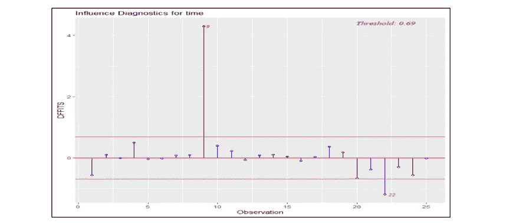

在我的[上一篇文章](/@borsechetan800/statistical-methods-for-identifying-outliers-for-univariate-data-part-i-6b4764079cb0)中，我们看到了异常值检测技术单变量方法，让我们进一步看看

**统计技术和工具**

**2.1** 标准化残差
**2.2** 学生化残差
**2.3** 库克距离
**2.4** 杠杆
**2.5**DFBETAS
**2.6**DFFITS

***2.1 标准化残差***

由于残差的近似平均方差是由 MSRes 估计的，因此残差的
逻辑缩放将是标准化残差。标准化残差具有均值零和近似单位方差。

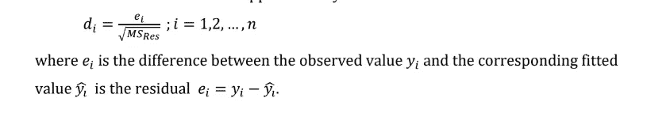

**标准:**

大的标准化残差(di > 3)可能表示异常值。

***2.2 学生化残差***

学生化残差(有时称为“外部**学生化
残差**或“**删除 t 残差**”)是:

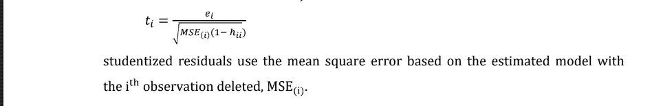

**标准:**

学生化残差将比标准化残差更有效地检测异常
观测值。如果观察值的学生化残差大于 3(绝对值),我们可以称之为异常值。

***2.3 厨师的距离***

其公式如下所示:

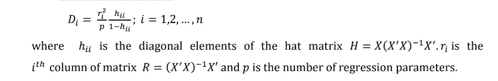

**标准:**

我们通常认为 Di>1 的点可以称之为异常值。

***2.4 杠杆***

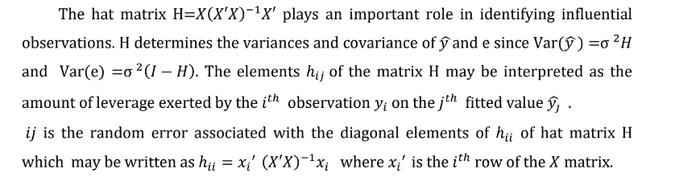

**标准:**

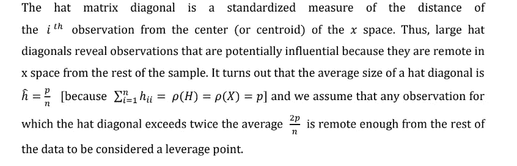

***2.5 dfbeta***

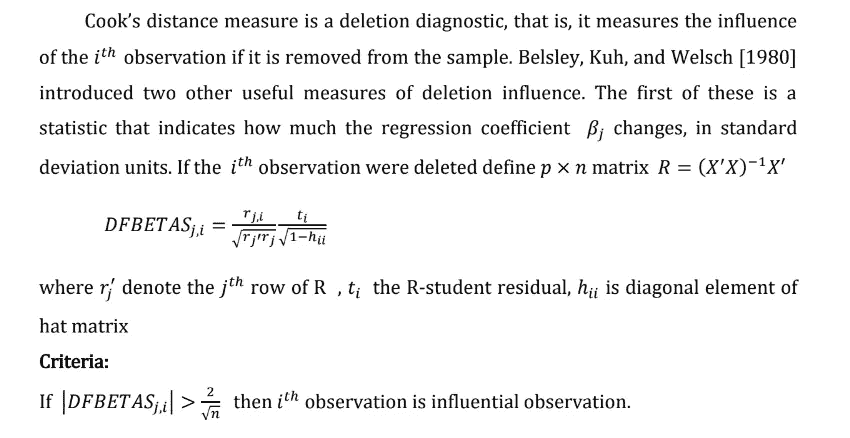

***2.6 DFT ifts***

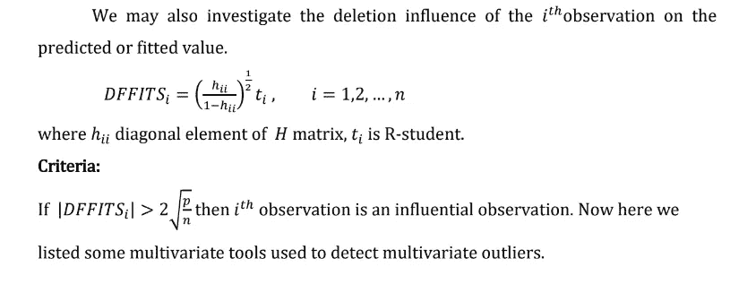

**交货时间数据描述:**
一名软饮料装瓶商正在分析他的分销系统中的自动售货机服务路线。他对预测路线驾驶员维修商店中的自动售货机所需的时间感兴趣。该服务活动包括为机器储备饮料产品和小的维护或内务管理。负责这项研究的工业工程师提出，影响交付时间的两个最重要的变量 *(y)* 是库存产品的箱数 *(x1)* 和路线司机行走的距离 *(x2)* 。工程师收集了 25 条关于交货时间的观察结果。

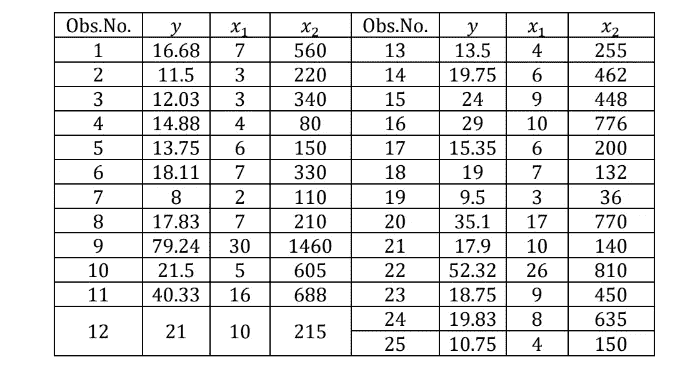

表:交货时间数据

输出:
9
4.31078

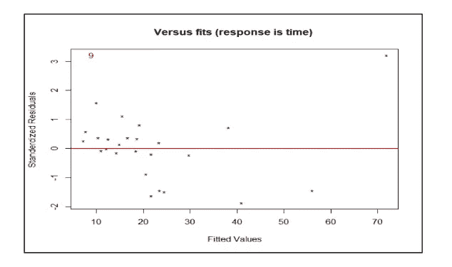

图 2:拟合值与标准化残差的关系图

**结论:**

这里使用**学生化残差**我们观察到第 9 个观察值是异常值。

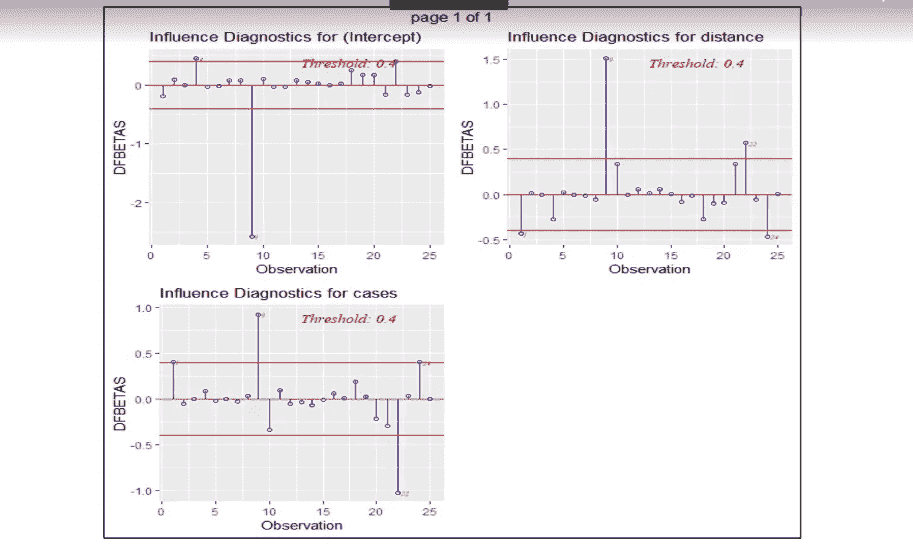

图:数据图表

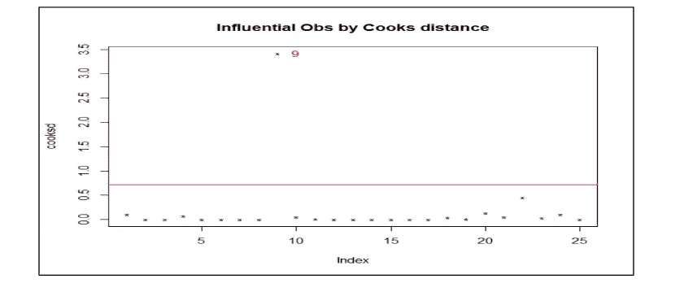

图:库克距离的有影响力 obs 图

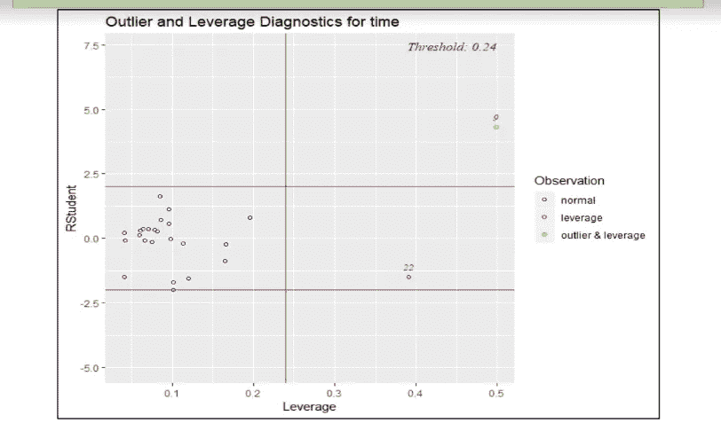

*图:*杠杆*的*图

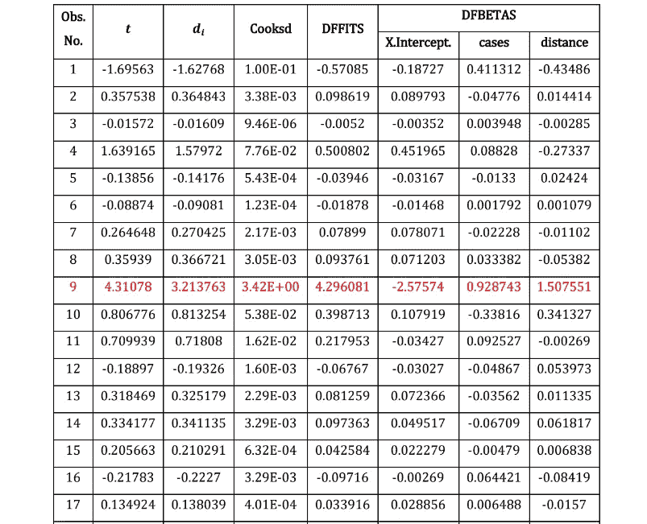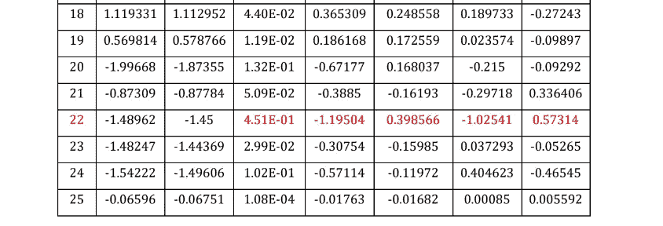

**交付时间数据的总体结论:** 我们计算了交付时间数据的比例残差。表 2.1 包含学生化残差和标准化残差..然而，点 9 的两个缩放残差都相当大，表明这一观察结果可能对模型有中等影响。为了说明这两点对模型的影响，进行了三个额外的分析:
一个删除观察 9，第二个删除观察 22，第三个
删除 9 和 22。这些额外运行的结果如下所示:

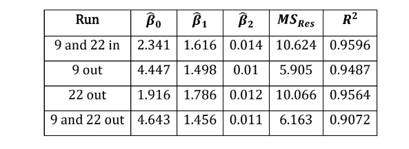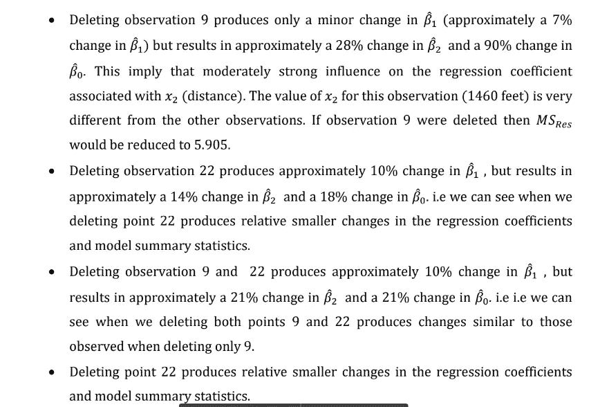

该表包含软饮料
配送时间数据的厨师距离测量值。统计的最大值是 D9= 3.41835，这表明观察 9 是有影响的。