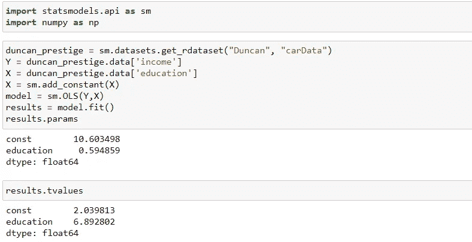
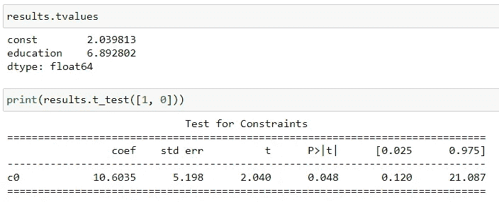
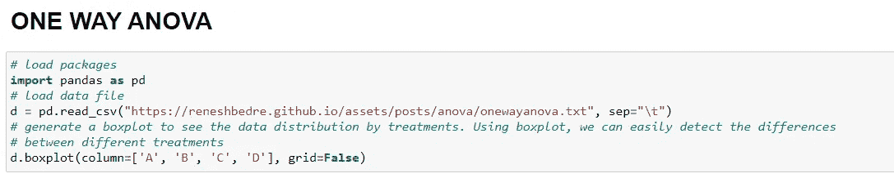
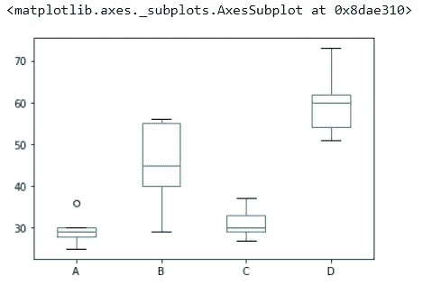
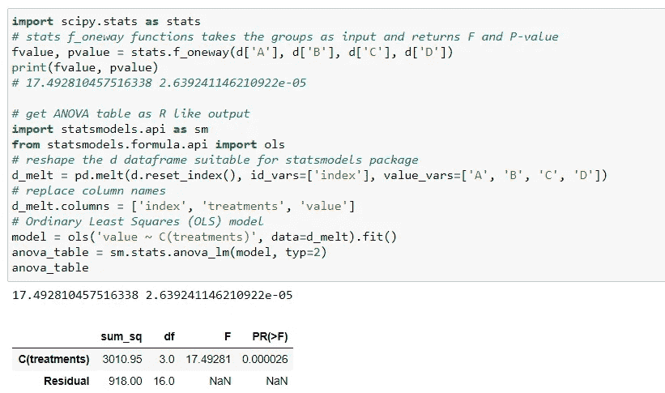
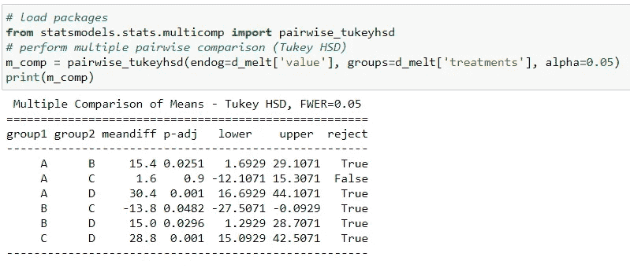
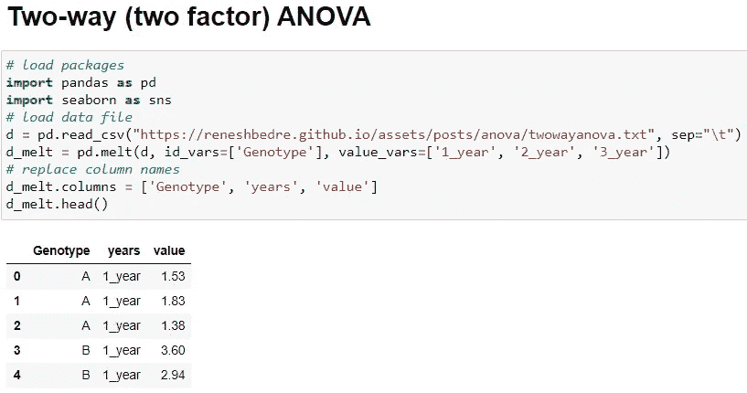
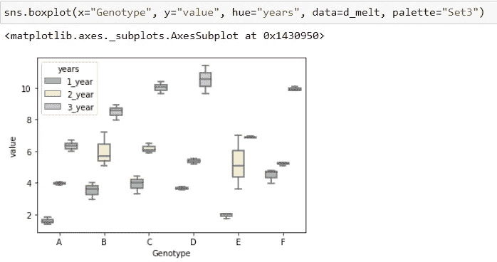
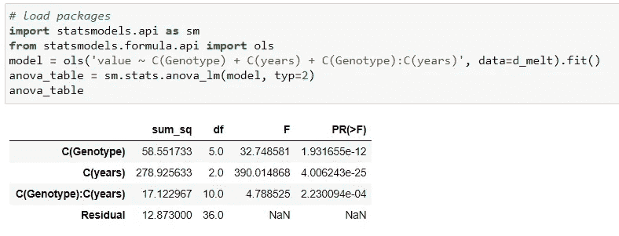

# Python 中的统计建模

> 原文：<https://medium.com/analytics-vidhya/statistical-modelling-in-python-74f33999d447?source=collection_archive---------19----------------------->

**大家好，**

在我的上一篇文章中，我已经用 Python 解释了**时间序列建模**。

让我们来看看 Python 中的另一个重要建模，即**统计建模**。

# 统计建模——概述

> 统计建模让你能够评估、理解和预测数据。

在各种工程领域(机械工程、核工程)、自然灾害管理、质量控制和金融中，统计建模是风险分析和安全的重要组成部分。

在这篇博客中，我将解释统计建模的两个重要主题，即使用统计模型的**线性回归**和 **ANOVA** 。

## 那么，让我们开始吧:

# 使用 Statsmodel 的 1-线性回归→

首先，取一个数据集:

现在，让我们打印值**教育**和**收入**的结果，以获得期望的输出。

# 使用 Statsmodel 的 2-ANOVA→

加载数据集以生成箱线图:

输出:

进行单因素方差分析:

让我们看看双向方差分析:

绘制箱线图:

最终输出:

> 因此，通过这种方式，我们可以使用 statsmodel 在 python 中执行统计建模。

# 谢谢大家！！

# 不断学习😊✌