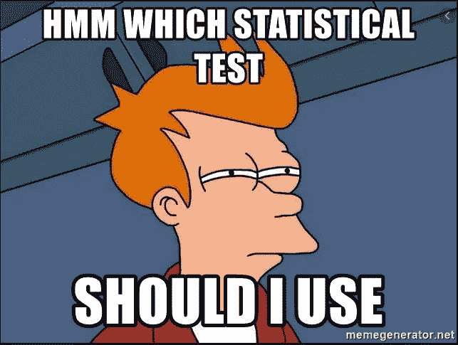

# 统计测试

> 原文：<https://medium.com/analytics-vidhya/statistical-tests-f43663b1a4d4?source=collection_archive---------2----------------------->

最常见的统计测试概述

图片来源:memegenerator.net

# **简介**

在进入统计测试之前，让我们理解一下统计的含义。为此，我们需要理解人口和样本意味着什么。

**人口**:包括所有感兴趣的元素

**样本**:来自总体的观察值子集

来自总体的可测量结果称为**参数**，来自总体样本的可测量结果称为**统计量**。

例如，如果你想知道美国所有男人的平均身高。如果你对美国的每一个男人进行调查，并取所有身高的平均值，那么这就是所谓的参数。因为这实际上很难，你从美国男性中随机收集数据，计算样本的平均身高，然后称之为统计。

统计检验是利用总体中的数据子集来决定总体参数。这是通过假设检验完成的。你可以从下面的文章中回顾假设检验。

 [## 假设检验

### 什么是假设检验，它有什么用途？

medium.com](/analytics-vidhya/hypothesis-testing-33928b0af1cf) 

# **统计测试**

在这一部分，我们将回顾最常用的统计测试。这篇文章只是给出一个概述，而不是深入所有这些测试背后的数学细节。

## **关联测试:**

他们衡量两个变量之间的关联。

衡量变量之间的关联程度。它的范围从-1 到 1。相关性为 1 表示非常强的关联，相关性为 0 表示非常弱的关联，相关性为-1 表示存在负关联。

**皮尔逊相关:**检验两个连续变量之间的相关性。

**Spearman 相关性:**检验两个有序变量之间的相关性。

**卡方:**检验两个分类变量之间的相关性。

## **对比测试:**

他们测量两个变量之间的差异。

**单样本 t 检验:**当您想要比较样本的平均值或样本平均值与总体平均值时，会执行此检验。

**双样本 t 检验:**当您想要比较两个独立变量的平均值时，可以执行此检验。

**成对样本 t 检验:**当您想要比较两个相关变量的平均值时，会执行此检验。相关组可以是跨组的相似对，或者是测量两次的同一组，如变化前一次和变化后一次。这是做前后分析的好测试。

**方差分析(ANOVA)** :当您想要同时比较两个以上独立组的平均值时，执行此测试。

## **预测测试:**

他们测量一个变量的变化是否预示着另一个变量的变化。

**线性回归:**这个测试评估因果关系。在这个测试中，你要从一个或多个预测因子(“自变量”——原因)中预测一个结果(“因变量”——效果)。如果只有一个预测变量，则称为**简单线性回归**，如果有两个或更多预测变量，则称为**多元线性回归。**

## **非参数测试:**

当数据不满足参数检验的假设时，如数据必须是正态分布时，使用这些检验。这些是免费发布的需求测试。参数检验评估一组平均值，非参数检验评估一组中位数。

**Wilcoxon 秩和检验:**当您想要检验两个自变量之间的差异时，会执行此检验。该测试考虑了差异的大小和方向。

**Wilcoxon 符号秩检验:**当您想要检验两个相关变量之间的差异时，执行此检验。该测试考虑了差异的大小和方向。

**符号测试:**当您想要测试两个相关变量之间的差异时，执行该测试。该测试只考虑方向，不考虑大小差异。

# **结论:**

在本文中，我们回顾了

1.  什么是统计测试？
2.  不同类型的统计检验概述。