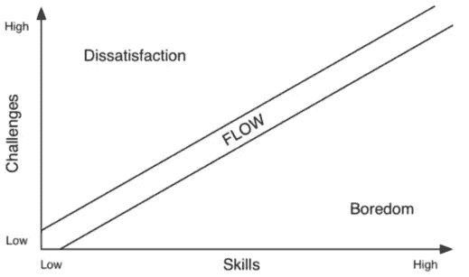
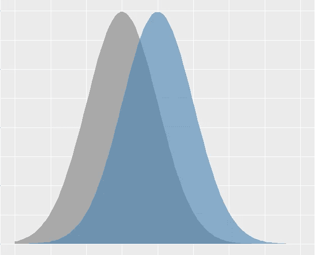

# 竞技游戏及其他领域的统计思维

> 原文：<https://medium.com/analytics-vidhya/statistical-thinking-for-competitive-gaming-and-beyond-b8d7e017950b?source=collection_archive---------29----------------------->

如果你曾经玩过在线竞技游戏，你很可能参与了一个配对系统，在这个系统中，你与个人评分相当的玩家进行竞争，希望能获得令人满意的游戏效果。关于这些 MMR 系统，我不会讲太多细节，对于本文来说，它只是一个系统，试图根据你的历史数据——你玩过的游戏——来访问你当前的表现。

如果这个系统运行良好，并且正确地安排人员，所有参与的玩家都有希望进入米哈里·契克森米哈创造的“心流状态”。这应该是任何配对系统的目标。



让我们假设这个系统工作得相对较好，并且在一些游戏之后，它已经把你放在某个分数:1500。

进入一场游戏，你可以合理地期待 50-50。如果你输了你的游戏，你将失去评分，在你的下一场游戏中，理论上你将有更高的胜算，假设你的实际技能保持不变。连续输很多次会让你有更高的胜算——记住这一点总是好的。

当我们在竞技水平(或任何水平)上玩游戏或运动时，我们都感觉到自己的表现有一定的差异，有时你击球完美，有时不太好。这种差异可能有点令人困惑，并给人一种个人技能贬值的感觉——自从两周前那场完美的比赛以来，你真的变得更差了吗？

现在是统计思维部分:这种问题可以在头脑中被框定为我们个人技能差异的展示。如果一个人可以接受我们的技术可能会因投篮而异，那么也许他可以更进一步，把我们的个人技术想象成一种统计分布。我发现接受一些个人表现的差异有助于在竞争激烈的环境中生存。它通过以下方式改变思维模式:

1.  如果你有一个非常糟糕的表现，你可以认为它是一个不太可能再次发生的异常值。
2.  在一次完美的表演之后，人们很容易认为这是你的新标准，但这很快就会变成一种令人失望的情绪。把这看作一个积极的异常值，会更容易处理和享受。

也就是说，重要的当然不仅仅是取消糟糕的表现，还应该关注如何改进。

```
player1_100_games = rnorm(100,1500,50)
player2_100_games = rnorm(100,1450,50)
sum(player1_100_games > player2_100_games)
```

运行上面的代码片段得到 78，意味着玩家 1 赢了玩家 2 78/100 次。我认为这很好地给出了不同水平的玩家之间互动的直觉——你赢了一些，你输了一些，但更好的玩家平均会领先。基本上，这意味着仅仅因为你比别人强一点，你就不能指望每次都赢，但从长远来看，你会在与比你水平低一点的玩家的比赛中胜出。



均值不同方差相等的重叠正态分布。

虽然对一些人来说这可能是显而易见的，但在我看来，许多人会以一种更二元的方式来考虑这些结果。许多设计良好的游戏会考虑到这一点，通过在竞争对手之间进行更多基于技能的互动来玩更多的回合，随机性将达到平均水平。

感谢阅读！