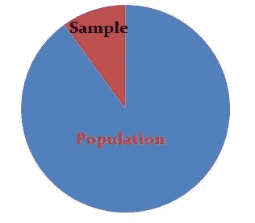
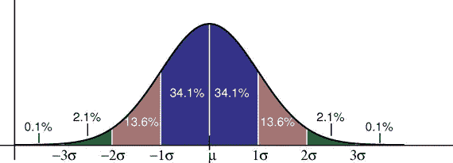
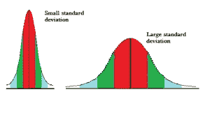
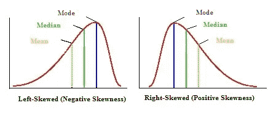
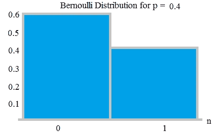
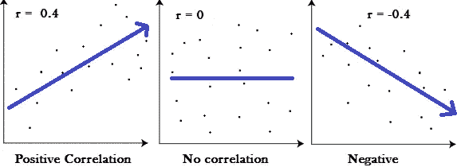

# 统计学蓬勃发展:-每个数据科学家都必须知道

> 原文：<https://medium.com/analytics-vidhya/statistical-thrives-every-data-scientist-must-know-af794c32a97f?source=collection_archive---------22----------------------->

在我的日常工作中，我经常建立统计模型和所需的统计知识。我并不孤单，每个数据科学家都有意或无意地面对统计术语。无论是数据科学专业人士还是爱好者，每个人都必须具备统计技能。这就是为什么他们说 ***“没有统计技能的数据科学家就像没有羽毛的鸟”。*** 在这篇博文中，我将带你浏览一些非常有用的基本统计术语。

# 样品

样本只是整体的一小部分。样本是总体的一部分。例如，您可能有 20，000 人(“总体”)中的 200 人(“样本”)的信息列表。您可以使用该列表对整个群体的行为做出一些假设。

人口样本

# **统计**

统计数据是来自一部分人口的一段数据，其类型如下

**描述性统计** :-描述和汇总数据。你只是在描述数据显示的东西:一个趋势，一个特定的特征，或者像平均值或中值这样的统计数据。描述性统计是任何数据集的基本“必备知识”之一。描述性统计很有用，因为它允许你获取大量数据并对其进行总结。它让您大致了解数据的趋势，包括:-

均值、众数、中位数、范围
方差、标准差、偏斜度
计数、最大值和最小值*。*

**推断统计** :-推断统计意味着你可以从数据*中推断(做出预测)。*

# 抽样误差

当您从总体中抽取样本而不是使用整个总体时，就会发生错误。当你随机抽样时，你估计误差，称之为误差幅度。抽样误差是统计数据不完全符合总体的趋势。误差并不一定意味着你的取样出现了错误；抽样可变性可能是一个更准确的名称。

# **正态分布**

将许多随机变量的分布表示为对称钟形图形的函数。正常曲线下的面积等于 1.0。正态分布在中心密度较大，在尾部密度较小。正常曲线是对称的。一半的数据将落在平均值的左边；一半会倒向右边。

许多团体遵循这种模式。这就是为什么它被广泛应用于商业、统计和政府机构，如 [FDA](https://www.fda.gov/default.htm) :

人的高度。
测量误差。
血压。测试中的分数。
智商得分。薪水

经验法则告诉你，你的数据有多少百分比落在均值的一定数量的标准差内:
68%的数据落在均值的一个标准差内。
95%的数据落在平均值的两个标准偏差内。
99.7%的数据在平均值的三个标准差范围内。

正态分布

标准差控制着分布的范围。较小的标准差表示数据紧密地聚集在平均值周围；正态分布会高一些。较大的标准差表明数据围绕平均值展开；正态分布会更平更宽。

正态分布的性质:
均值、众数、中位数都相等。
曲线在中心对称(即围绕平均值μ)。
·正好一半的值在中间的左边，正好一半的值在右边。
曲线下的总面积为 1。

# **标准正态分布**

标准正态模型是平均值为 0、标准差为 1 的正态分布。

# **标准差**

标准差是统计中支出的一种度量。“支出”告诉你有多少你的数据被分散。具体来说，它显示了您的数据有多少分布在平均值周围。

**标准偏差**

# **偏态分布**

如果一条尾巴比另一条长，分布就是偏斜的。这些分布有时被称为不对称或不对称分布，因为它们不显示任何类型的对称性。

偏斜分布的类型

**左偏态分布**:-左偏态分布有一个长的左尾巴。左偏分布也称为负偏分布。那是因为数轴上有一条负向的长尾。平均值也在峰值的左侧。

**右偏分布** :-右偏分布有一个长的右尾。右偏分布也称为正偏分布。那是因为数轴上正方向有一条长尾。平均值也在峰值的右侧。

# 中心极限定理

中心极限定理说，如果我取许多随机样本的平均值，并把它们画在一个分布上，那么这个分布就是正态分布。
中心极限定理的一个重要组成部分是你的样本均值将是总体均值。类似地，如果你找到样本中所有标准差的平均值，你就会找到总体的实际标准差。
这是一个非常有用的现象，可以帮助准确预测人口特征。

# 变异系数

变异系数(CV)是相对可变性的度量。它是标准偏差与平均值的比率。例如，表达式“标准偏差是平均值的 15%”是一个 CV。当你想比较两个不同测量或数值的不同调查或测试的结果时，CV 特别有用。例如，如果您正在比较两个具有不同评分机制的测试的结果。如果样本 A 的变异系数为 12%,样本 B 的变异系数为 25%,那么相对于平均值，样本 B 的变异系数更大。

# 四分位数和四分位数间距

统计学中的四分位数是将数据分成四份的值。四分位距是衡量“中间 50”在数据集中的位置。四分位范围是对大部分值所在位置的度量。
IQR = Q3 — Q1
其中 Q3 是上四分位数，Q1 是下四分位数

# 极端值

异常值是指与其他点相距异常远的一段数据。换句话说，它是位于集合中其他值之外的**数据。离群值是离群值——极高或极低的值**——在数据集中会影响你的统计数据。离群值定义为数据集中第一个四分位数(Q1)以下或第三个四分位数(Q3)以上超过 1.5 IQRs 的任何数据点。
高= (Q3) + 1.5 IQR
低= (Q1) — 1.5 IQR

# **均值、中位数&统计中的众数**

平均值是数据集的平均值。
众数是数据集中最常见的数字。
中位数是一组数字的中间值。

# **置信区间和置信水平**

统计学中的置信区间是基于一个或多个样本的总体参数的一种范围估计。置信区间是你的结果…通常是数字。例如，如果我们想从 100 名 15 岁的青少年样本中估计所有 15 岁的印度男孩的平均身高。
置信水平以百分比表示(例如，95%的置信水平)。这意味着，如果你一遍又一遍地重复一个实验或调查，95%的情况下你的结果会与你从人群中得到的结果相匹配(换句话说，你的统计数据是合理的！)
你愿意接受的置信区间越宽，你就越能确定整个群体的答案会在这个区间内。假设在一次考试后，这是你和你父亲之间的一段对话。儿子，考试怎么样？你期望多少？你:我一定会通过的。会得到大约 45-50。T21:你确定吗？你:我有 90%的把握。

# 二项式定理

二项式定理公式用于计算二项式实验(有两个选项的事件，如正面或反面)的概率。二项式实验条件:
你必须有固定的试验次数。
·每个试验都是独立的事件。
只有两种结果。

# **什么是伯努利分布？**

伯努利分布是伯努利试验的离散概率分布，伯努利试验是只有两种结果(通常称为“成功”或“失败”)的随机实验。这是 n = 1 的二项式分布的特殊情况。换句话说，它是一个二项分布，只有一次尝试(例如，一次抛硬币)。

# 什么是假设和假设检验？

假设是对你周围世界的有根据的猜测。它应该是可测试的，无论是通过实验还是观察。统计学中的假设检验是一种检验调查或实验结果的方法，以查看我们是否有有意义的结果。我们基本上是在测试我们的结果是否有效，通过检查我们的结果是偶然发生的。如果我们的结果可能是偶然发生的，那么这个实验就不会是可重复的，所以用处不大。
在假设检验中，我们遵循以下步骤:
o 陈述我们的零假设，
o 选择我们需要执行哪种检验，
o 支持或拒绝零假设。

# 什么是零假设？

零假设总是公认的事实。这是一种假设。
举例。一位研究人员认为，如果膝盖手术患者每周进行两次物理治疗(而不是 3 次)，他们的恢复期会更长。膝盖手术患者的平均恢复时间为 8.2 周。
这个问题中的假设陈述是研究者认为平均恢复时间超过 8.2 周。它可以用数学术语写成:
H1: μ > 8.2
接下来，你需要陈述零假设(参见:如何陈述零假设)。如果研究人员错了，就会发生这种情况。在上面的例子中，如果研究人员错了，那么恢复时间小于或等于 8.2 周。在数学上，那就是:
H0 μ ≤ 8.2

# **统计学中的 p 值是什么？**

p 值用于假设检验，帮助您支持或拒绝零假设。p 值是反对零假设的证据。p 值越小，您应该拒绝零假设的证据就越强。让人们知道你的研究结果是可靠的，还是偶然发生的，这是一种很好的科学。通常的做法是用 p 值测试您的结果。p 值是通过对数据进行假设检验得到的数字。0.05 (5%)或更小的 P 值通常足以表明您的结果是可重复的。

# 泊松分布

当你知道某个事件发生的频率时，这个工具可以帮助你预测该事件发生的概率。它给出了给定数量的事件在固定时间间隔内发生的概率。

# 什么是方差分析？

方差分析(ANOVA)是一种统计技术，用于检查两个或多个组的平均值是否存在显著差异。
方差分析(ANOVA)检验均值之间的差异。方差分析检验是一种发现调查或实验结果是否有意义的方法。换句话说，它们帮助你确定你是需要拒绝零假设还是接受替代假设。基本上，你是在测试不同的群体，看看他们之间是否有区别。
*“单向方差分析”或“双向方差分析”是什么意思？*
单向或双向是指在你的方差分析检验中自变量(iv)的个数。单向有一个自变量(有 2 个水平)，双向有两个自变量(可以有多个水平)。例如，单向方差分析可能有一个 IV，而双向方差分析可能有两个 IV。

# **什么是相关系数？**

相关系数在统计学中用于衡量两个变量之间的关系有多强。相关系数公式用于确定数据之间的关系有多强。这些公式返回一个介于-1 和 1 之间的值，其中:
。1 表示强正相关。
-1 表示强烈的负面关系。
结果为零表示完全没有关系。

# **决定系数(R 平方)**

r 平方给出了用 x 变量解释的 y 的百分比变化。范围是 0 到 1，即 y 的 0%到 100%的变化可以用 x 变量来解释。为了前任。如果 R 平方值为 85%，则 85%的数据点落在回归线上。所以 R 给出了落在回归线上的数据点的百分比。较高的系数表示观察值的拟合优度较高。R 平方是相关系数 R 的平方(因此称为 R 平方)。决定系数可以是负的，尽管这通常意味着您的模型不适合您的数据。如果你没有设置截距，它也可能变成负数。

R2 的用处在于它能够发现未来事件落入预测结果的可能性。其想法是，如果添加更多的[样本](https://www.statisticshowto.datasciencecentral.com/sample/)，系数将显示新点落在线上的概率。

# **调整后的 R 平方？为什么使用它？**

R2 显示了项(数据点)与曲线或直线的拟合程度。调整后的 R2 也表示术语拟合曲线或直线的程度，但会根据模型中的变量数量进行调整。如果你在一个模型中加入越来越多无用或无关紧要的变量，调整后的 R 平方将会减少。如果你增加更多有用的变量，调整后的 r 平方将会增加。调整后的 R2 将始终小于或等于 R2。R2 和调整后的 R2 有一个主要区别，R2 假设每个变量都会影响因变量。调整后的 R2 告诉你仅由实际影响因变量的自变量解释的变化的百分比

# 统计上显著的

简单地说，如果你有重要的结果，这意味着你的结果可能不是偶然发生的。如果你没有统计上显著的结果，你就扔掉你的测试数据(因为它什么也没有显示！).

# 结论

统计知识是数据科学家的必备技能，这种技能可用于帮助调查现实世界的环境和人道主义挑战。我希望这篇文章能给你一个开始，让你更深入地探索统计领域，进行一些更有价值的分析。