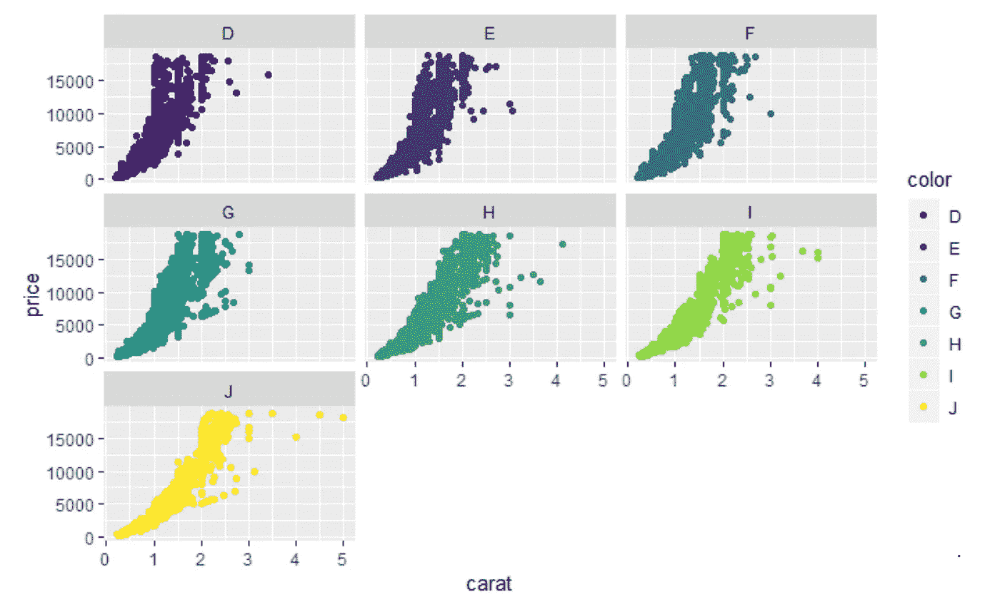

# R — 2 中的统计可视化

> 原文：<https://medium.com/analytics-vidhya/statistical-visualization-in-r-2-9e9070bcdecf?source=collection_archive---------11----------------------->

> 如果您还没有阅读 R 数据分析系列的第 1 部分，请仔细阅读下面的文章，其中我们讨论了将数据读入 R -1 的许多方法。
> 
> 这篇文章的内容是我在 IIM-B 时代得到的几本书的要点。
> 
> 人人为我——贾里德·p·兰德
> 
> 实用数据科学与 R — Nina Zumel 和 John Mount
> 
> 文中讨论的所有代码块都以 R markdown 的形式出现在 [Github 链接](https://github.com/viveksrinivasanss/Data_Science_Using_R)中。


分析中最困难的部分之一是制作高质量的支持图形。相反，一个好的图表是展示发现的最佳方式之一。幸运的是，R 提供了优秀的绘图能力，无论是在基础安装中还是在像`lattice`和`ggplot2`这样的包中添加广告。在这篇文章中，我们将简要介绍一些使用基本图形的简单图形，然后展示它们在`ggplot2`中的对应部分。

统计中使用图形主要有两个原因:`Exploratory Data Analysis(EDA)`和呈现结果。两者都非常重要，但必须针对不同的受众。

# 基础图形

当第一次用 R 绘图时，大多数人使用基本图形，然后当他们的需求变得更复杂时，再转向`ggplot2`。本节是为了完整性，因为基本图形是必需的，特别是在修改由其他函数生成的图时。

在我们继续之前，我们需要一些数据。即使按照十年前的标准，R 中内置的大多数数据集都很小。具有讽刺意味的是，一个好的数据集(例如图表)包含在`ggplot2`中。为了访问它，必须首先安装并加载`ggplot2`。本文的目的是向您介绍一些使用`base graphics`和`ggplot2`的基本统计图。因此，我们将使用一个简单的数据集，更多地关注图表概念。

```
require(ggplot2)
data(diamonds)
head(diamonds)
```


# 基本直方图

最常见的单变量数据图表是`histogram`。这显示了该变量的值的分布。创建`histogram`非常简单，如下图所示为`diamonds`中的克拉列。

```
hist(diamonds$carat, main="Carat Histogram", xlab="Carat")
```


这显示了`carat`大小的分布。注意标题是用`main`参数和带`xlab`参数的 x 轴标签设置的。直方图将数据分成多个桶，柱的高度代表落入每个桶的观察值的数量。

# 基础散点图

经常看到两个变量相互比较是好的；这就是使用`scatterplot`的地方。我们将使用`formula`符号绘制钻石的`price`与`carat`的关系。

```
plot(price ~ carat, data = diamonds)
```


分隔`price`和`carat`的`~`表示我们正在对照`carat`查看`price`，其中`price`是`y`值，`carat`是`x`值。也可以通过简单地指定`x`和`y`变量而不用`formula`接口来构建散点图。

```
plot(diamonds$carat, diamonds$price)
```

# 箱线图

`Boxplots`通常是最先教给统计学学生的图表。它通常被用作一种统计机制来发现数据中的异常值。鉴于它们无处不在，了解它们是很重要的，谢天谢地 R 有盒图函数来帮助我们构建一个。

```
boxplot(diamonds$carat)
```


`boxplot`背后的想法是，中间的粗线代表中间值，盒子由第一个和第三个`quartiles`界定。这是中间 50%的数据——四分位数范围或 IQR 位于盒子中。线向两个方向延伸到 1.5*IQR。然后，在此之外绘制异常点。

# ggplot2

虽然 R 的基本图形非常强大和灵活，并且可以在很大程度上进行定制，但使用它们在大多数时候可能是劳动密集型的。构建了两个包- `ggplot2` 和`lattice`来简化绘图。现在，我们将重新创建之前的所有图表，并使用更多高级功能扩展示例。

起初,`ggplot2`语法更难掌握，但是努力是值得的。`ggplot2`的基本结构从`ggplot`函数开始，它最基本的应该是把数据作为它的第一个参数。初始化对象后，我们使用`+`符号添加图层。首先，我们只讨论`geometric`层，如`points`、`lines`和`histograms`。此外，层可以有不同的`aesthetic`映射，甚至不同的数据。

# ggplot2 直方图和密度

正如我们在上面使用`base`图形所做的那样，让我们使用`ggplot2`来绘制`diamonds`克拉的分布。这是使用如下所示的`ggplot`和`geom_histogram`构建的。

```
ggplot(data = diamonds) + geom_histogram(aes(x=carat))
```


类似的显示是`density`图，通过将`geom_histogram`更改为`geom_density`来完成。我们还使用`fill`参数指定填充图形的颜色。

```
ggplot(data=diamonds) + geom_density(aes(x=carat) + fill="grey50")
```


`histogram`显示桶中的数据计数，而`density`图显示观察值落入滑动窗口的概率以及感兴趣的变量。两者之间的差别很微妙但很重要，因为`histograms`更多的是离散测量，而`density`图更多的是连续测量。

# ggplot2 散点图

在这里，我们不仅看到了制作`scatterplot`的`ggplot2`方法，还展示了 ggplot2 的一些功能。在接下来的几个例子中，我们将重复使用`ggplot(diamonds, aes(x=carat.y=price))`，这通常需要大量的冗余输入。幸运的是，我们可以将`ggplot` 对象保存到变量中，稍后再添加图层。这里我们使用`color`列向`scatterplot`添加第三维。

```
g <- ggplot(diamonds, aes(x=carat,y=price))
g + geom_point(aes(color=color))
```


注意，我们在`aes`中设置了`color=color`。这是因为指定的颜色将由数据决定。另外，请注意，图例是自动生成的。

`ggplot2` 有能力制作刻面图，或小倍数，这是使用`facet_wrap`或`facet_grid`完成的。`facet_wrap`获取一个变量的级别，根据这些级别分割底层数据，为每组数据创建一个单独的窗格，并将其排列在图中。在这里，行和列的位置没有实际意义。

```
g + geom_point(aes(color=color)) + facet_wrap(~color)
```



另一方面，`facet_grid`的行为类似，但是将变量的所有级别分配给行或列，如下所示。

```
g + geom_point(aes(color=color)) + facet_grid(cut~clarity)
```


在理解了如何阅读该图中的一个窗格后，我们可以很容易地理解所有的窗格并进行快速比较。

# ggplot2 盒图和小提琴图

作为一个完整的图形包`ggplot2`提供`geom_boxplot`。即使它是一维的，使用一个`y`美学，也需要有一些`x`美学，所以我们将使用 1。

```
ggplot(diamonds,aes(y=carat,x=1)) + geom_boxplot()
```


这可以灵活地扩展到绘制多个`boxplots`，如下所示，一个变量对应一个级别。

```
ggplot(diamonds,aes(y=carat,x=cut)) + geom_boxplot()
```


我们可以用`geom_violin`把`boxplots`换成`violin`图。`Violin`图与`boxplots`相似，除了方框是弯曲的，给人数据密度的感觉。

我们可以在同一个地块上添加多个图层(geoms ),如下所示。请注意，层的顺序很重要。在左边的图中，点在小提琴的下面，而在右边的图中，点在小提琴的上面。注意`gridExtra`包帮助你按行和列排列多个图形。

```
require(gridExtra)
p1 <- ggplot(diamonds,aes(y=carat,x=cut)) + geom_point() + geom_violin()
p2 <- ggplot(diamonds,aes(y=carat,x=cut)) + geom_violin() + geom_point()
grid.arrange(p1, p2, ncol=2)
```


# ggplot2 线图

`Line`当一个变量具有一定的连续性时，通常使用图表，但这并不总是必要的，因为通常有一个很好的理由使用带有`categorical`数据的线。

让我们使用来自`ggplot2`包的`economics`数据创建一个简单的`line`图。

```
data(economics)
head(economics)
ggplot(economics, aes(x=date,y=pop)) + geom_line()
```


折线图的一个常见任务是显示一年中多年的指标。为了准备`economics`数据，我们将使用`lubridate`包，它提供了操作日期的便利函数。我们需要创建两个新变量 year 和 month。为了简化起见，我们将对数据进行子集划分，只包括从 2000 年开始的年份。

```
require(lubridate)## Create month and year columns
economics$year <- year(economics$date)
economics$month <- month(economics$date)## Subset the data
econ2000 <- economics[which(economics$year>=2000),]
head(econ2000)
```


现在，让我们创建描绘多年的折线图，如下所示。代码块的第一行创建了折线图，其中每一年都有单独的线条和颜色。请注意，我们将`year`转换为`factor`，这样它将获得一个离散的色标，然后该色标通过使用`scale_color_discrete(name=”Year”)`来命名。最后用`labs`设置`title`、`x-label`和`y-label`。所有这些部分放在一起，构建了一个专业外观、出版物质量的图表，如下所示。

```
g <- ggplot(econ2000,aes(x=month,y=pop))
g <- g + geom_line(aes(color=factor(year), group=year))
g <- g + scale_color_discrete(name=”Year”)
g <- g + labs(title="Population Growth", x="Month",y="Population")
g
```


# 主题

一个伟大的`ggplot2`是能够使用主题来轻松地改变情节的方式。虽然从头开始构建主题可能是一项艰巨的任务，但`ggthemes` package 已经将主题放在一起，以重新创建常用的图形样式。下面是几款`The Economist`、`Excel`、`Edward Tufte`和`The Wall Street Journal`。

```
require(ggthemes)
g2 <- ggplot(diamonds, aes(x=carat,y=price)) + geom_point(aes(color=color))## Lets apply few themes
p1 <- g2 + theme_economist() + scale_color_economist()
p2 <- g2 + theme_excel() + scale_color_excel()
p3 <- g2 + theme_tufte()
p4 <- g2 + theme_wsj()grid.arrange(p1, p2, p3, p4, nrow=2, ncol=2)
```


在本文中，我们看到了更好、更容易创建的基本图形和`ggplot2`。我们已经介绍了`histograms`、`scatterplots`、`boxplots`、`violinplots`、`line plots`和`density`图表。我们还研究了使用颜色和小倍数来区分数据。这只是对 r 中的`ggplot2` 和`base`绘图的简单介绍。在`ggplot2`中还有许多其他特性，如`jittering`、`stacking`、`dodging`和`alpha`，我们将在需要时在下面的文章中介绍。

在下一篇文章中，我们将看到 R

[*组操纵在 R —*](/@viveksrinivasan/group-manipulation-in-r-3-5554a0c1b544) *3*

> 一定要通过评论和分享文章来分享你的想法和支持。