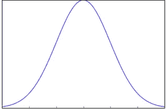
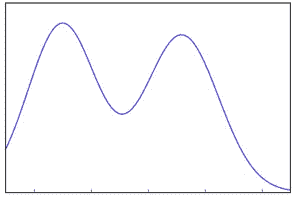
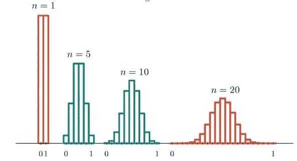
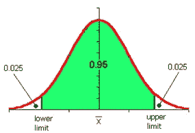
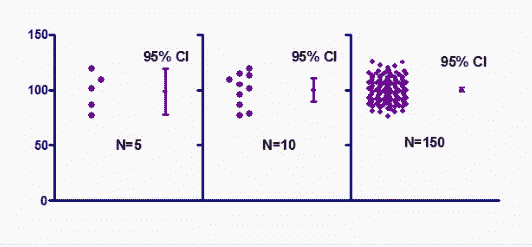

# 统计学 1。数据科学中统计思维的要点

> 原文：<https://medium.com/analytics-vidhya/statistics-1-the-most-important-points-of-statistical-thinking-in-data-science-55aed66a7f9e?source=collection_archive---------35----------------------->

[https://wallpapermemory.com/283973](https://wallpapermemory.com/283973)

**统计学是一门关于数据收集、分析、组织和解释的数学科学。**

**正如乔希·威尔斯曾经说过的；**

“数据科学家是比任何程序员都更擅长统计，比任何统计学家都更擅长编程的人。”

数据科学的数学和统计学是必不可少的，因为统计学是数据科学的基础。

在开始之前，我不会在我将要分享的主题中谈论公式。此外，我可能会用不同的句子写相同的意思来重复自己。我的目的是向您展示您在学习 Stats 的过程中可能遇到的任何情况的统计数据。

**统计中的类别**

统计学中有两个主要类别，即:

1.  描述统计学
2.  推断统计学

我想谈谈推断统计学。

推断统计用于从样本中推断总体。当我们考虑到寻找一个公司中员工的平均身高和体重的同一个例子时，为了进行推断统计，你会抓住一个样本，这是该公司的几个员工。所以我们可以通过划分高、矮、胖或瘦来分组。在这种方法中，可以构建一种统计方法，并用于公司中的所有员工(人口)。

你基本上可以建立一个统计模型，并扩展到整个班级。

**先决条件**

当我们开始讨论推断统计学时，我们应该知道下面的概念；

1.可能性

2.概率分布的基本知识

3.描述统计学

如果你不擅长上面提到的概念，那么在深入学习推断统计学之前，你一定要先过一遍。好的，我想谈谈几个在推断统计学中最常用的术语。

**统计量> >** 对总体样本某些属性的单一度量，如均值、中值和众数。

**人口统计> >** 所有人口的统计。

**样本统计> >** 人口中某一群体的统计。例如，公司员工所有成本的平均值。

**标准差> >** 它是一组数据与其均值的离差的度量。

# **采样分布**

假设我们从给定的总体中抽取所有可能的样本，样本大小为 n。进一步假设我们计算每个样本的统计量(平均值、比例、标准偏差)。这种统计的概率分布称为抽样分布。

抽样分布的形状并不能揭示总体的形状。抽样分布有助于估计总体统计量。

图 1。样本分布

图 2。人口

为了解释这一点，我们将应用统计中非常重要的中心极限定理。

# **中心极限定理**

中心极限定理指出，随着样本量的增加，均值的抽样分布接近正态分布。这一事实对于样本量超过 30 的情况尤其如此。中心极限定理成立需要样本量等于或大于 30。

因此，随着样本量的增加，样本均值和标准差的值将更接近总体均值和标准差。

**抽样分布均值=总体均值**

图 3。抽样平均数的分布(出版商:塞勒研究院)

*如上面所理解的；*

*随着样本量的增加，频率分布接近钟形曲线(即正态分布曲线)。*

*中心极限定理成立需要样本量等于或大于 30。*

*足够大的样本可以预测总体的参数，如均值和标准差。*

***样本量上升，标准差下降。***

***样本量上升，来自总体均值的准确性增加。***

现在我们应该谈谈置信区间，它对于计算出样本均值的总体均值在哪里以及我们有多大的信心是非常重要的，因为我们已经收集了样本并绘制了它们的均值。

# **置信区间**

置信区间是抽样分布的一种区间估计，它给出了总体的一系列值。

图片:伍斯特·edu

例如，在样本平均值的-1.96 和+1.96 标准偏差(z 得分)之间的总体平均值的概率为 95%。

因此，总体平均值有 5%的机会位于上下置信区间之外(如 1.96 z 得分两侧的 2.5%异常值所示)。

注意:研究一个群体中的每个人几乎是不可能的。所以我们从人群中选择样本。

要开始计算置信区间，首先要计算样本的平均值和标准误差。

不要忘记，您必须使用所选置信水平的 Z 分数来计算置信区间的上限和下限分数。

从我们的结果来看是有把握的(总体均值类似于样本均值)；

图 4。样品

**1。间隔越短，我们的估计就越精确。**

**2。通常，随着样本量的增加，置信区间应该变得更窄。**

# **结论**

与较小的样本相比，使用较大的样本可以更精确地估计总体均值。为了确定我们的样本结果，我们必须增加样本量。

我欢迎反馈，如果您有问题，请告诉我。你可以通过 [LinkedIn](https://www.linkedin.com/in/nurullah-sirca-2125ba62/) 联系我。

# **参考文献**

 [## 数据科学基础数学和统计教程| Edureka

### 正如乔希·威尔斯曾经说过的，数据科学的数学和统计学是必不可少的，因为这些学科构成了基础…

www.edureka.co](https://www.edureka.co/blog/math-and-statistics-for-data-science/) 

[https://www . khanacademy . org/math/statistics-probability/sampling-distributions-library](https://www.khanacademy.org/math/statistics-probability/sampling-distributions-library)

 [## 抽样分布

### t 分布和正态分布都可以用于具有钟形分布的统计数据…

stattrek.com](https://stattrek.com/sampling/sampling-distribution.aspx) 

[https://www.simplypsychology.org/sampling-distribution.html](https://www.simplypsychology.org/sampling-distribution.html)