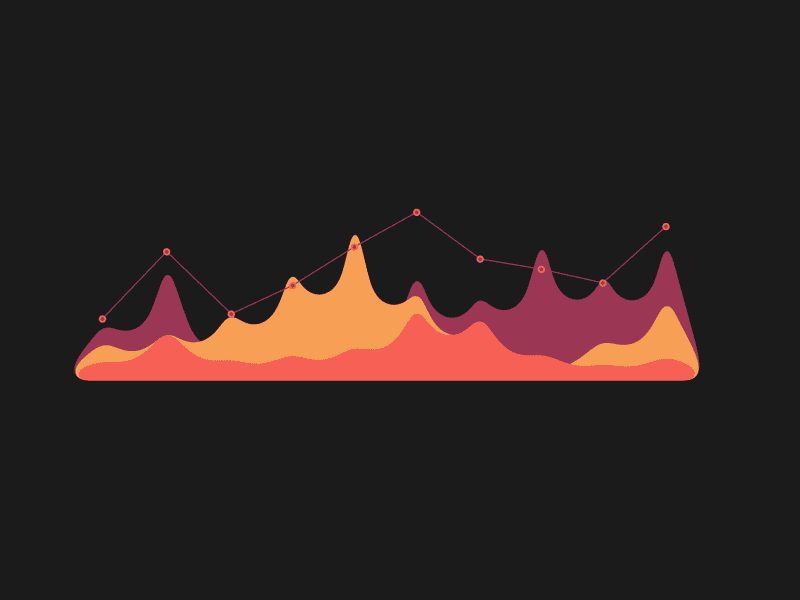
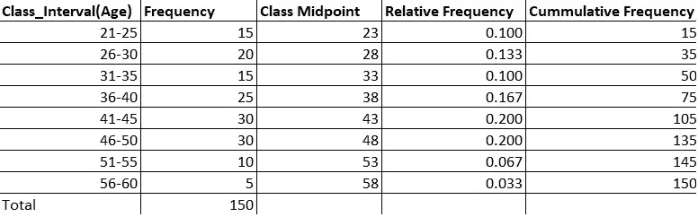
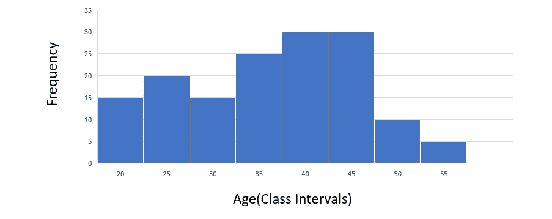
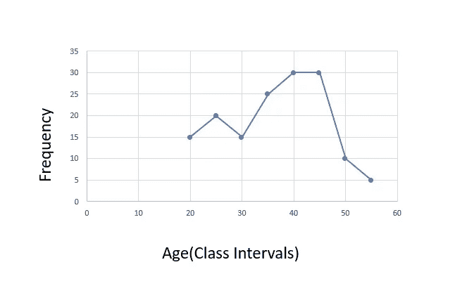
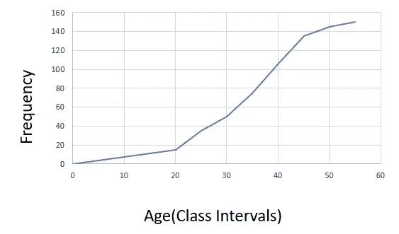
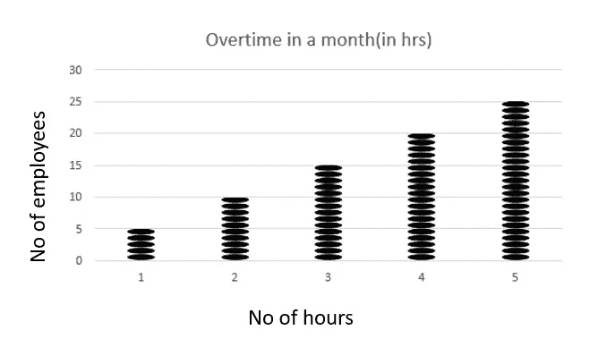
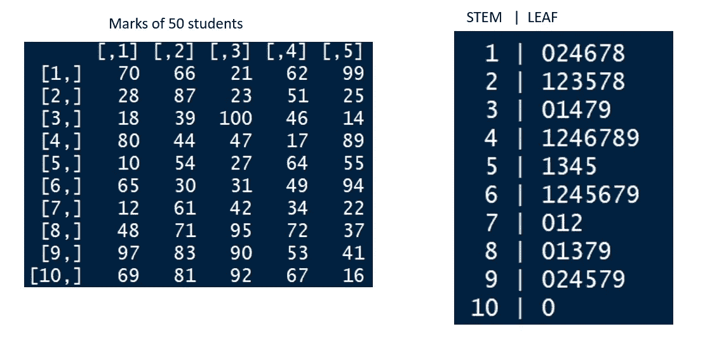
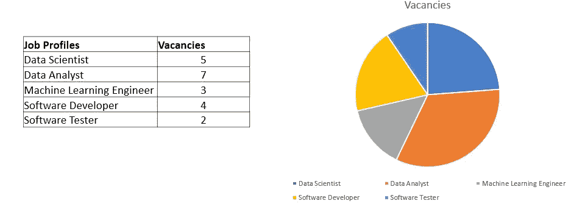
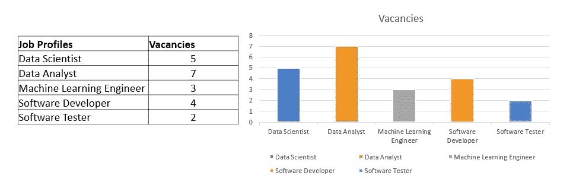
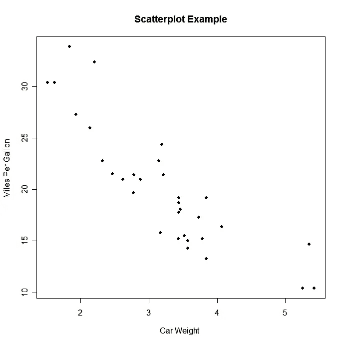

# 统计学 101:基础视觉化——被“看见”很好！

> 原文：<https://medium.com/analytics-vidhya/statistics-101-basics-visualization-its-good-to-be-seen-820c821d753b?source=collection_archive---------15----------------------->

欢迎来到统计学系列的第二篇博客！

在我们深入研究可视化图形/图表和技术之前，让我们思考一下可视化的重要性！

众所周知，图像在人脑中的保存时间比一些普通文本要长。当一些数据以图形或图表的形式呈现时，我们说这些数据是可视化的。数据可视化的重要性非常关键，尤其是对于从事数据科学领域工作的人来说。视觉辅助帮助我们识别:-

㈠数据的趋势和模式。

(ii) [数据中存在的异常值](https://en.wikipedia.org/wiki/Outlier)。

㈢确定人口多样性。

㈣数据中不同变量之间的相关程度。

(五)更多[..](https://www.slideshare.net/Centerline_Digital/the-importance-of-data-visualization)

图表看起来很酷！！

所以，现在让我们在开始制作超级棒的图形和图表之前，先了解一些基本术语。

以下是我们绘制数据时将使用的一些术语的非常基本的正式定义。[这些太简单了！].我们开始吧。

**(一)频率分布:**一个图最基本的需求就是数据在各自频率下的分布。例如，我们有一个员工数据库，根据员工的年龄(21-25 岁、26-30 岁、31-35 岁……)我们有不同的班级间隔..).在这种情况下，每个间隔中的人数。

**(ii)范围:**顾名思义，特定数据的范围是数据中最大值和最小值之间的差值。例如，员工的年龄范围是从最年轻的员工到最年长的员工。

**(三)级中点:**又称级标。它是音程之间的中心位置(中点)。例如，员工“21-25”、“26-30”和“31-35”的年龄区间的班级中点分别为 23、28 和 33。

再来两个，坐稳了！

**(四)相对频率:**是整体的一部分！特定类间隔相对于数据中总频率的频率称为该类间隔的相对频率。例如，假设在“21–25”的年龄层区间中的雇员人数是 15，公司的雇员总数是 100。那么，类间隔“21–26”的相对频率将是 15/100 = 0.15。

**(v)累计频率:**表示到当前区间为止所有区间的运行频率。

下面就让上面的更简单更实用吧！

注意:总频率将始终等于最后一个课间隔的累积频率

现在，让我们来看看一些基本但非常有用的图表！

**(i)直方图:**它们是一系列连续的矩形。每个矩形代表其各自的类间隔的频率。

**(二)频率多边形:**与直方图类似，它们也表示类间隔的频率，然而，它们不使用矩形，它们使用每个类间隔的点来表示频率。

**(三)卵形线:**是频率多边形的延伸。累积频率用于表示数据。这个图表使我们能够直观地看到所有班级间隔的频率增长。

注意:与频率多边形不同，在 ogives 中，图形从原点开始。

**(iv)点阵图:**点阵图使用属性的每个值，并将其绘制在水平轴上。它表示该属性的计数。这对理解数据的整体形状非常有用。当我们有多个相同值的条目时，它们会互相攻击。

**(五)茎叶:**这是一个很有意思的情节。两组形成了代表的茎和叶。最左边的是拥有更高值的词干。最右边的是价值较低的叶子。例如，如果我们有一个数据点(比如 34)，那么，3 将是茎，4 将是叶。下面是一个班 50 名学生的分数。

它有助于可视化数据的整体分布

因此，茎和叶表示中的第一个条目是(1| 024678)。这代表以下标记(10，12，14，16，17，18)。

**(六)饼图:**是给定数据的圆形描绘。单个属性的不同类别显示在圆形图上，其中每个类别以其各自的频率共享空间。每个条目的圆形空间的划分以百分比或度数的形式出现。

**(vii)条形图:**表示数据频率的水平或垂直条形图。与直方图不同，它们在本质上不是连续的。

**(viii)帕累托图:**与条形图相同，但有一个额外的特征。从图中的第一个柱到最后一个图绘制一条累积频率线。条形排列在帕累托图中。最长的条形在左侧，最短的条形在表示空间的右侧。

**(ix)散点图:**用于研究给定数据中两个变量之间的关系。这些在我们处理相关性和回归时非常有用(将在以后的博客中讨论)。

点状图仅代表一个变量，而散点图代表两个变量。

以上用汽车重量表示汽车的平均重量。我们可以理解，随着重量的增加，每加仑行驶的英里数减少。

所以，就这样吧！

接下来的统计 101:分组和未分组的数据-让我们用数据说话！

上一篇博客:[统计 101:让我们不要总是‘刻薄’！](/@balirohan7/statistics-101-lets-not-be-mean-always-4673d12c4d6d)