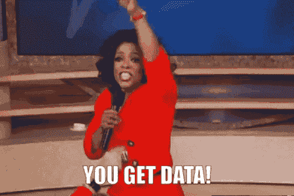
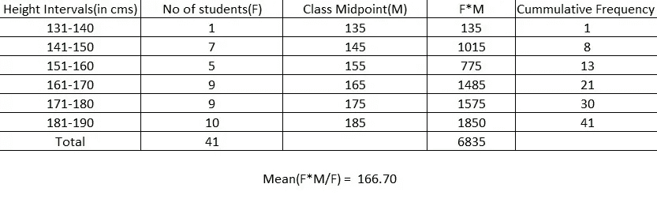
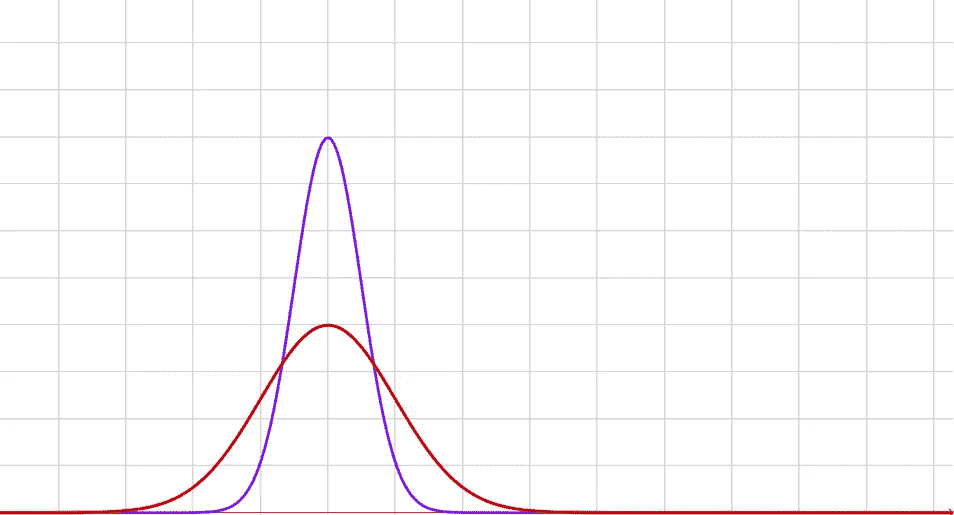
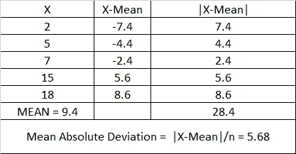
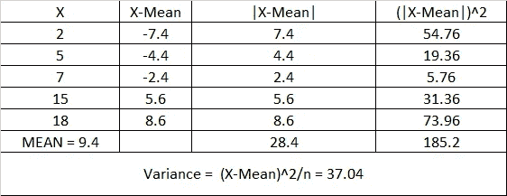
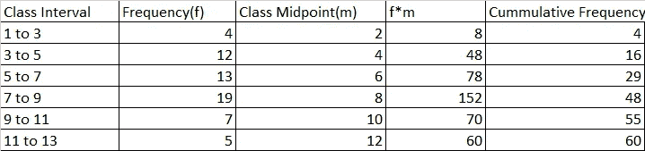

# 统计学 101:分组与不分组的数据——用数据说话吧！

> 原文：<https://medium.com/analytics-vidhya/statistics-101-grouped-and-ungrouped-data-lets-talk-with-data-5cbf18c2feb9?source=collection_archive---------1----------------------->

数据可以以各种形式分类。区分数据的一种方法是分组数据和未分组数据。

大家都拿到数据了！

**什么是未分组数据？**

当数据未被归入任何类别，且未对数据进行汇总/总结时，则称之为未分组数据。未分组的数据也称为原始数据。

**什么是分组数据？**

当原始数据被分组到不同的类中时，就称之为分组数据。

例如，考虑以下情况:

学生身高:(171，161，155，155，183，191，185，170，172，177，183，190，139，149，150，150，152，158，159，174，178，179，190，170，143，165，167，187，169，182，166

下表显示了来自上述原始数据的分组数据

注意:分组数据的含义将在本博客后面解释。[点击此处阅读更多关于累计频率的信息](/@balirohan7/statistics-101-basics-visualization-its-good-to-be-seen-820c821d753b)

在我们进一步研究分组和未分组数据之前，理解我们所说的“**集中趋势**”是什么意思是很重要的？

顾名思义，中心倾向与中心有关。集中趋势是概率分布中的中心位置。有许多衡量集中趋势的方法，如平均值、众数、中位数、四分位范围、百分位数、几何平均值、调和平均值等。下面讨论最常用的集中趋势测量。

**了解未分组数据的集中趋势的度量。**

**(一)模式:**一个数据集中出现频率最高的项/值称为模式。双峰用于 b/w 两个值相等的情况。多模态是指给定的数据集有两个以上的值具有相同的出现频率。

例如 7，11，14.25，15，15，15，15，19，19，29.81。模式是 15

**(ii)中位数:**数据集的中位数被描述为数据集中值的有序排列中最中间的值。

注意:对于奇数个数据集，中位数是中间值。对于偶数个数据集，中位数是两个中间值的平均值。

例如 15，11，14，3，21，17，22，16，19，16，5，7，9，20，4

让我们按升序排列这些数据

3,4,5,7,8,9,11,14,15,16,16,17,19,19,20,22,22.中位数是 n+1/2 = 17+1/2 = 18/2 = 9

中位数的优点:不受较大数值的影响。它仍然不受[异常值影响。](https://en.wikipedia.org/wiki/Outlier)

"数据必须至少是有序的，中位数才有意义"

**(iii)平均值:**又称算术平均值。它是通过所有值的总和除以值的个数来计算的。

比如“15，11，14，3，21，17，22，16，19，16，5，7，9，20，4”的平均数是 13.26667。

**(四)百分位数:**这种形式的集中趋势将一组数据分成 100 个部分。数据集的第 n 个百分位数被描述为低于“第 n 个值”的 n 个值和高于“第 n 个值”的(100-n)个值。

现在，让我们看看如何计算百分位数。

第一步:按升序排列数据。

第二步:第 I 个百分位的位置是:

i = (P/100)*N

I:百分位

n:数据集中的总数量

p:利息的百分位数。

步骤:通过(a)或(b)确定位置

(a)如果‘I’是一个整数，那么百分位数是‘I’和‘I+1’位置的平均值。

(b)如果“I”不是一个整数，那么百分位值在“i+1”位置。

假设我们想确定 1450 个数的第 70 个百分位数。

i = (70/100)*1450

i = 1015

P =第 1015 个数+第 1016 个数/2

**(v)四分位数:**这种形式的集中趋势将一个群体分成四个子部分。

第一个四分位数=第 25 个百分位数

第二个四分位数=第 50 个百分位数

第三个四分位数=第 75 个百分位数

第四个四分位数=第 100 个百分位数。

注:第二个四分位数等于数据的中位数。

**了解未分组数据可变性的度量。**

可变性的度量描述了数据集的分布或分散。

注:任何数据的可变性使我们能够更好地描述数据。

两条曲线具有相同的平均值，但它们的分散程度不同。

**(一)值域:**一个数据集中的最大值和最小值之差称为数据集的值域。该范围也是端值/极值的表示。

范围有助于数据控制图的构建。

**(二)四分位距:**四分位距是第一和第三个四分位的差值。

这很方便，因为用户对中间值比对极端值更感兴趣。

**(iii)平均绝对偏差:**是数据集均值周围偏差绝对值的平均值。

**(iv)方差:**是一组数关于算术平均值的偏差的平方。

注:最终结果以测量单位的平方表示。

**(五)标准差:**是方差的平方根。

例如，上例中数据的标准偏差是 6.086

注:标准差用于计算置信区间和假设检验。标准差的单位与原始数据相同。

“标准差的真正用法可以通过经验法则和切比雪夫定理来理解。两者都将在接下来的博客中详细讨论

**(vi)变异系数:**是数据的标准差与均值的比值。

上面例子中的变异系数是(6.086/9.4)*100=64.7。

**分组数据集中趋势的计算方法。**

考虑以下数据:

平均值= ∑fx/n = 6.93

中位数= i+(N/2 — C.W)/MED = 7.105

Mode =组数据的模式是模态类的频率。上例中的最大频率是间隔 7 到 9，即 19。因此，模式是 8

缩写:

女:频率

n:总频率

CW:班级宽度

I:初始点(N/2 将给出中间值的位置，即上面例子中的 30)。29 个条目将适合“7 到 9”的课程间隔。因此,“I”的值是 7。

MED:中位数所在类的频率。对于上面的例子，MED 的值=19。

这个博客到此为止。

接下来:统计学 101:假设检验和 p 值——这有什么大惊小怪的！

上一篇博客:[统计学 101:基础知识可视化——被‘看见’很好！](/analytics-vidhya/statistics-101-basics-visualization-its-good-to-be-seen-820c821d753b)