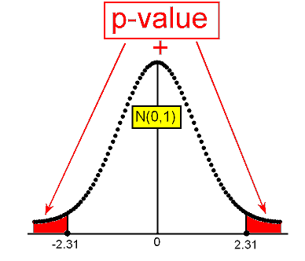

# 统计学 101:假设检验和 p 值——这有什么大惊小怪的！

> 原文：<https://medium.com/analytics-vidhya/statistics-101-hypothesis-testing-and-p-value-whats-the-fuss-about-that-d94b9118f217?source=collection_archive---------16----------------------->

在回答什么是假设检验之前，我们先来回答为什么要假设检验！

假设 Jack 拥有一个购物网站，当他试图在自己的网站上进行一些图形增强时，他需要看看这对他的网站有什么影响。现在，他怎么能测试这个呢？假设检验将拯救杰克于此。

假设检验允许我们找到一条结构性的途径，通过统计证据做出商业决策，对商业的各个方面进行实验/检验。

假设检验为我们的发现增添了意义。我们首先创建两个假设，称为零假设和替代假设。现在，如何定义以上两个假设？很简单；考虑你工作的环境是完全好的，没有任何改变，所有旧的标准都被应用，因此它是非常稳定的。这是无效假设。在 Jack 的例子中，无效假设是图形增强对他的网站没有影响(他付给 UI 设计师的所有钱都浪费了！可怜的杰克)。现在，另一个假设说，所做的改变产生了一些影响，事情和以前不一样了。对于杰克来说，这可能是一个好消息，如果替代假设是真的，那么这将证明对网站的改变确实对流量有影响，现在这是积极或消极的变化是一个不同的讨论(然而，即使是这样，杰克可以进行假设测试！).

现在，我们知道为什么要进行假设检验，它是什么，以及如何确定无效假设和替代假设。接下来的部分是如何评价上面的。哪个假设是真的，哪个是假的。对于这一点，我们有有用的显著性检验。

p 值(概率值)用于告诉我们假设的重要性。基于 p 值，我们要么接受要么拒绝一个假设。

但是，什么是 p 值呢？为了理解 p 值，我们需要理解[正态分布](https://www.analyticsvidhya.com/blog/2017/09/6-probability-distributions-data-science/?utm_source=blog&utm_medium=everything-know-about-p-value-from-scratch-data-science)。我会单独写一篇博客。给你们简单介绍一下正常化。正态分布是数据的一种分布，其平均值、中间值和众数是一致的。一半的值在平均值的右边，一半在左边。它形成一个钟形曲线。

p 值是红色阴影区域覆盖的总概率。

在建立了无效假设和替代假设之后，我们需要设置一个显著性水平。显著性水平用 alpha(希腊符号)表示。通常，设置 5%的显著性水平。显著性水平为我们提供了支持或拒绝假设的证据。如果 p 值大于 0.05，我们不能拒绝零假设，否则我们可以。

p 值基本上是一个条件概率。条件概率是在已知事件“X”已经发生的情况下，“Y”事件发生的概率。点击阅读更多关于[的条件概率。](https://www.statisticshowto.com/probability-and-statistics/statistics-definitions/conditional-probability-definition-examples/)

现在让我们帮助杰克解决他的问题。

**零假设:**图形增强后，他的网站流量没有变化。

**另一种假设:**他的网站在图像增强后流量增加了。

**显著性水平:**设置为 5%(0.05)。

现在，杰克需要计算 p 值。

杰克现在将从人群中抽取样本。获得样本后，我们需要找到样本的平均值，在这种情况下，它将是人们在他的网站上花费的平均时间。

p(均值大于样本均值|零假设为真):如果这是**大于** 0.05，我们就不能拒绝零假设。

p(均值大于样本均值|零假设为真):如果这是**小于** 0.05，我们必须拒绝零假设。

现在，这将为杰克提供足够的证据来解决他的网站上的流量变化是由于图形的变化还是没有的问题！

只是为了给你提供更多的理论方面的假设，主要有三种类型的假设。上面解释的一种被称为统计假设。另外两个是研究和实质性假设。

**研究假设**是研究人员对研究结果做出的断言。这是由研究人员在开始实验之前确定的。

实质性假设告诉我们变化本身的影响。它不需要使用 p 值。它用于确定估计的效果大小变化。它告诉我们正在处理的变化的程度。点击阅读更多关于实质性结果的信息[。](https://effectsizefaq.com/2010/05/30/what-is-the-difference-between-statistical-and-substantive-significance/)

嗯，就这样吧！

接下来:

统计学 101:抽样技术-这将是一个真实的表现！

以前的博客:

[统计学 101:分组与不分组的数据——用数据说话吧！](/analytics-vidhya/statistics-101-grouped-and-ungrouped-data-lets-talk-with-data-5cbf18c2feb9)