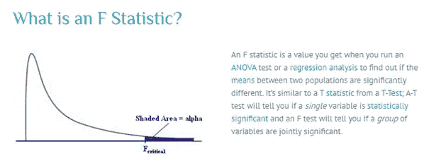
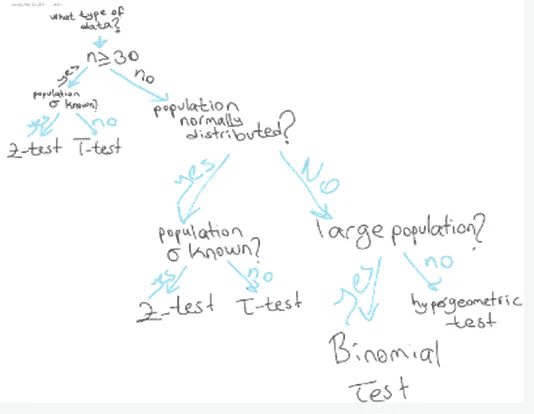

# 统计学 2。数据科学中统计思维最重要的几点:假设检验和其他检验

> 原文：<https://medium.com/analytics-vidhya/statistics-2-d6bedf224c08?source=collection_archive---------32----------------------->

图片:[https://wallpapersafari.com/w/scoAOv](https://wallpapersafari.com/w/scoAOv)

***我将强调假设和其他检验(单样本 T 检验、单样本 Z 检验、单因素方差分析、卡方拟合优度检验)***

假设检验是指统计学家用来接受或拒绝统计假设的正式程序。

统计学家遵循一个正式的流程，根据样本数据决定是否拒绝零假设。这个过程称为假设检验，由四个步骤组成。

1.  分析师的第一步是陈述两个假设，这样只有一个是正确的。
2.  制定分析计划。分析计划描述了如何使用样本数据来评估零假设。评估通常集中在单个测试统计上。
3.  分析样本数据。找出测试统计值(平均分数、比例、t 统计值、z 分数等)。)在分析计划中描述。
4.  解释结果。应用分析计划中描述的决策规则。如果检验统计值不太可能，基于零假设，拒绝零假设。

# **决策规则**

分析计划包括拒绝零假设的决策规则。在实践中，统计学家以两种方式描述这些决策规则——参考 P 值或参考接受区域。

1.p 值。支持零假设的证据强度通过 **P 值**来衡量。如果 P 值小于显著性水平，我们拒绝零假设。

假设零假设中的值为真，获得样本均值的概率由 p 值表示。p 值是一个概率:它在 0 和 1 之间变化，并且永远不会为负。

**显著性，或统计显著性**，描述了关于零假设中所述值的决策。当零假设被拒绝时，我们就达到了显著性。当保留无效假设时，我们就不能达到显著性

当 p 值小于 5% (p <0.05), we reject the null hypothesis. We will refer to p < 0.05 as the criterion for deciding to reject the null hypothesis, although note that when p = 0.05, the decision is also to reject the null hypothesis. When the p-value is greater than 5% (p > 0.05)时，我们保留原假设。拒绝或保留零假设的决定称为**显著性**。当 p 值小于 0.05 时，我们达到显著性；决定是拒绝零假设。当 p 值大于 0.05 时，我们无法达到显著性；决定是保留原假设。

2.接受区域。接受区域是一个数值范围。如果检验统计量在可接受的范围内，则不拒绝零假设。

3.接受区域之外的一组值被称为拒绝的**区域**。如果检验统计量落在拒绝区域内，则拒绝零假设。

现在我要谈谈我在这篇文章中想要强调的测试。让我们从 T 检验开始。我认为大多数对数据科学感兴趣的学习者都有统计学知识，尤其是关于测试的知识。这就是为什么，我将重点放在测试的关键因素上，以便很好地理解。

# **一个样本的 T 检验**

t 检验是一种推断统计，用于确定两组的均值之间是否存在显著差异，这两组的均值在某些特征上可能是相关的。t 检验用作假设检验工具，它允许检验适用于总体的假设。t 检验是统计学中用于假设检验的众多检验之一。

样本必须是随机的、独立选择的以及从正态分布中抽取的。这些值也应该是连续的数字。样本量不一定要大。

***使用 T 检验的条件；***

总体的标准差应该是未知的。

样本量< 30

***注:我们关注的是样本*** 的标准差

# **一个样本 Z 测试**

z 检验是统计计算，可用于比较总体均值和样本均值。z 得分告诉您一个数据点距离数据集的平均值或均值有多远，以标准差表示。当我们想要检验一个假设时，z 检验也是有帮助的。通常，当标准偏差已知时，它们最有用。

***使用 Z 检验的条件；***

应该知道总体的标准差。

样本量> 30

# 基本上，这取决于四件事:

1.  我们是否在用一种手段。
2.  我们是否知道*总体*标准差(σ)。
3.  人口是否正态分布。这在处理小样本时非常重要。
4.  *样本大小*。这个神奇的数字通常是 30——低于 30 被认为是“小”样本，高于 30 被认为是“大”样本。当样本量较大时，中心极限定理告诉我们，不需要担心总体是否正态分布。

# **单因素方差分析**

ANOVA 代表方差分析，是一种统计测试，用于分析两个以上组的平均值之间的差异。

单向方差分析使用一个自变量，而双向方差分析使用两个自变量。

单向 ANOVA 用于使用 f 分布比较两个独立(不相关)组的两个平均值。检验的无效假设是两个平均值相等。因此，一个显著的结果意味着两个均值不相等。

单向方差分析会告诉你至少有两组是不同的。但是它不会告诉你哪些组是不同的。如果您的测试返回显著的 f 统计，您可能需要运行一个特别的测试(如最小显著性差异测试)来告诉您哪些组的均值有差异。

***何时使用单因素方差分析***

当您收集了关于一个分类自变量和一个数量因变量的数据时，请使用单向 ANOVA。自变量应至少有三个级别(即至少三个不同的组或类别)。

方差分析告诉你因变量是否根据自变量的水平而变化。例如:

*   你的独立变量是一个品牌的苏打水，你收集可口可乐、百事可乐、雪碧和芬达的数据，找出每 100 毫升的价格是否有差异。
*   你的独立变量是肥料的类型，你用混合物 1、2 和 3 处理作物田，以发现作物产量是否有差异。

方差分析的零假设(H0)是组间均值没有差异。

替代假设(Ha)是至少有一组显著不同于因变量的总体均值。

如果任何一组平均值与总体平均值有显著差异，则零假设被拒绝。

ANOVA 使用 **F 检验**进行统计显著性检验。这允许一次比较多个平均值，因为误差是为整个比较集计算的，而不是为每个单独的双向比较计算的(t-检验会发生这种情况)。

***为什么我们需要另一个检验来检查独立组之间的均值差异？***

***为什么不能用多重 t 检验来检验均值的差异？***

***回答；***

***答案很简单。多重 t 检验将对结果的误差率产生复合影响。进行三次 t-检验将给出约 15%的错误率，这太高了，而 ANOVA 将其保持在 95%置信区间的 5%。***

**执行 ANOVA 的步骤**

1.假设生成

零假设:所有组的平均值相同

替代假设:至少一组的平均值不同

2.计算组内和组间的可变性

3.计算光圈系数

4.使用 F 表计算概率

5.拒绝/未能拒绝零假设

图片:密歇根大学。

# **卡方拟合优度检验**

卡方检验旨在检验观察到的分布由偶然因素引起的可能性有多大。它也被称为“拟合优度”统计，因为它衡量观察到的数据分布与变量独立时的预期分布的拟合程度。

卡方统计通常用于检验分类变量(非连续变量)之间的关系。卡方检验的无效假设是总体中的分类变量之间不存在关系；他们是独立的。

卡方统计比较两个(或多个)独立组之间分类反应的计数或计数。(注:卡方检验只能用于实际数字，而不能用于百分比、比例、平均值等。)

卡方检验检查两个分类变量之间的相关性

例如，如果存在显著差异，我们会考虑将这些变量放入模型或分析中。

注意:在构建你的类别时要非常小心！卡方检验可以告诉你基于你如何划分数据的信息。然而，它不能告诉你你构建的类别是否有意义。基于期望值和观察值，我们可以计算卡方值。

执行卡方检验的步骤:

1.  定义假设。
2.  建立一个应急表。
3.  求期望值。
4.  计算卡方统计量。
5.  接受或拒绝零假设。

注意:卡方对表格单元格中的小频率很敏感。通常，当表的某个单元格中的期望值小于 5 时，卡方检验会导致结论错误。

# **结论**

***p 值解释***

**t 检验**，如果 p < 0.05，我们拒绝零假设，这意味着均值(x1)不等于均值(x2)

**f 检验**，如果 p < 0.05，我们拒绝零假设，这意味着方差(x1)不等于方差(x2)

**卡方检验**，如果 p < 0.05，我们拒绝零假设(x1 独立于 x2)，这意味着两个变量是相关的。

***另一个重要公式为何时使用 T-检验或 Z-检验***

***什么类型的数据？n > =30，是或否……***

为了了解何时使用 T 或 Z 测试，我们应该经常检查下面的公式表。它将是我们的指南针……

图:何时使用 T 检验和 Z 检验的最重要公式

我欢迎反馈，如果您有问题，请告诉我。你可以在 LinkedIn 上找到我。

# **参考**

 [## 假设检验

### 基本图表和图形回归分类数据调查实验概率随机变量离散…

stattrek.com](https://stattrek.com/hypothesis-test/hypothesis-testing.aspx)  [## z 检验和 T 检验:相同点和不同点-视频和课文录音| Study.com

### z 检验和 t 检验是涉及数据分析的统计方法](https://study.com/academy/lesson/z-test-t-test-similarities-differences.html)  [## 单因素方差分析|何时及如何使用(附例子)

### ANOVA 是方差分析的缩写，是一种统计测试，用于分析平均数之间的差异

www.scribbr.com](https://www.scribbr.com/statistics/one-way-anova/)  [## F 统计/ F 值:定义和如何运行 F 检验

### 内容(单击跳到第节):另请参见:什么是 F-Test？F 统计量是当你运行一个…

www.statisticshowto.com](https://www.statisticshowto.com/probability-and-statistics/f-statistic-value-test/)