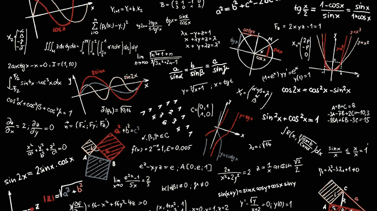
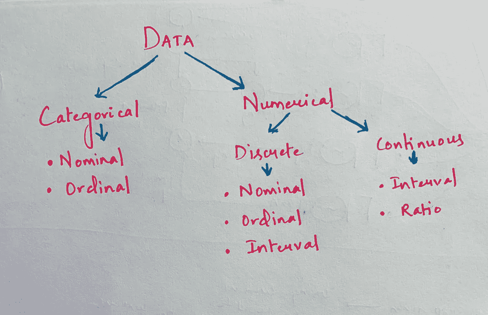
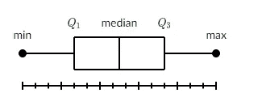

# 第 1 部分:数据科学中的统计和概率|数据科学 2020

> 原文：<https://medium.com/analytics-vidhya/statistics-and-probability-in-data-science-data-science-2020-5cbd41856cd3?source=collection_archive---------10----------------------->

图片来源:谷歌|数据科学中的统计学和概率

**机器学习中的统计学**

*这篇文章的主要思想是呈现我们在机器学习中使用的统计和概率的所有重要概念、术语和术语。*

当涉及到理解我们在 ML 问题上所做的操作时，统计和概率是机器学习的一个重要方面。

让我们考虑几个简单的例子来说明为什么统计和概率对 ML 是必要的。

如果在一个数据集中，有一个数字属性并且其中很少的值丢失，那么我们可以用该属性的平均值或中值来估算那些丢失的值。要完成这个任务，我们必须知道什么是均值/中值/众数。

如果我们正在处理分类问题，我们需要对邮件是否是垃圾邮件进行分类，划分类别的主要标准是该类别出现的概率。在这里，我们必须了解概率的基础知识，以及条件/联合概率是如何工作的。

在解决日常的 ML 问题中，我们使用统计和概率的场景还有很多。

现在，让我们从统计学和概率中的基本概念开始。

**什么是统计？**

统计学只不过是对过去的数据进行分析，对给定的一组实验数据或现实生活研究使用量化的模型、表示和概要。统计学研究收集、审查、分析数据并从中得出结论的方法。

**什么是测量？**

数据可以根据测量来定义。度量是一种分配数字的方法。有四种可能的方式来做这件事，被称为衡量尺度。

1. ***名义上:*** 分配的数字没有任何意义。它可以是任何顺序的任何数字。

例如男-1，女-2，跨性别-3…
数学-1，物理-2，化学-3…

2. ***序数:*** 指定的数字有意义但按顺序排列。

例如，1 月 1 日、2 月 2 日、3 月 3 日、4 月 4 日…

星期一至一，星期二至二，星期三至三…

3. ***区间:*** 分配的数字之差有意义。

例如日历、时间、温度等

零没有任何特定的意义。

4. ***比:*** 数字本身就带有意义。

例如，质量/距离、利润/损失、重量…

绝对零度的定义。

需要记住的要点:

*标称数据*可以用条形图/饼图表示。它主要是分类数据，我们无法计算其平均值。我们在这种情况下计算模式。百分比可以用来分析数据。

*序数数据*可以用条形图表示，但不能用饼图表示。计算平均值在这种类型的数据中也没有任何意义，因此我们计算模式。百分比可以用来分析数据。

区间/比率:可以计算均值、中值、众数。它可以用条形图/直方图来表示。可以使用箱线图来测量数据的分布。

**数据类型**

数据大致可以分为两种类型，即*分类数据和*数字数据。

数据类型

**基本统计术语**

**总体:**被分析的整个数据被认为是总体。
**样本**:总体的子集/部分。

**人口普查:**从全部人口中收集数据。
**调查:**从样本中收集数据以便对总体做出结论。

**参数:**对总体的描述性度量。(总体均值、总体标准差等。)
**统计量:**样本的描述性度量。(样本均值、样本标准差等。)

变量:变量是一个物体、事件、想法、感觉、时间段或任何其他你试图测量的范畴。变量有两种类型- ***自变量和*** *。*

**自变量:**它们是独立变量，不依赖于任何其他变量。

它们也被称为分类器(在机器学习上下文中)。

在二维图形表示中，独立变量表示在 X 轴上。

**因变量:**顾名思义，这类变量依赖于其他变量。

它也被称为目标变量。

在二维图形表示中，因变量在 Y 轴上表示。

**描述性统计:**从一个群体中收集的数据，以得出关于同一群体的结论。

**推断/归纳统计:**从样本中收集的数据，经过分析得出关于总体的结论。

# **集中趋势**

集中趋势是通过反映数据分布中心的单个值对数据集进行的描述性汇总。

***测度中枢倾向***

一般来说，数据集的集中趋势可以使用以下度量来描述:

*   **Mean (Average):** 表示数据集中所有值的总和除以值的总数。
*   **中值:**按升序排列(从最小值到最大值)的数据集中的中间值。如果数据集包含偶数个值，则数据集的中位数是两个中间值的平均值。
*   **模式:**定义数据集中出现频率最高的值。在某些情况下，一个数据集可能包含多个模式，而有些数据集可能根本没有任何模式。

需要记住的要点:

均值和中值不需要出现在数据集中，但模式必须出现在数据集中。

**模式**是唯一处理分类数据的集中趋势统计。

**Median** 最适合序数数据。

尽管**均值**被认为是定量数据集中趋势的最佳衡量标准，但情况并非总是如此。例如，均值可能不适用于包含极大或极小值的定量数据集。

极值可能会扭曲平均值。因此，你可以考虑集中趋势的其他选项。

**方框和胡须图**

盒须图让我们可以直观地看到数据的分布。

这是在一个**五位数**汇总、**最小值、第一个四分位数、中值、第三个四分位数和最大值上显示数据分布的标准方式。**

箱线图摘要

注意:

将数据分成 4 组，每组包含相同比例(25%)的数据，称为**四分位数**。

将数据分成 100 组，每组包含相同比例(1%)的数据，称为**分位数**或**百分位**。

Q3 — Q1 被称为**四分位数间距(IQR)** ，它包含大约 50%的数据。

最小值= Q1–1.5 * IQR，最大值= Q3 + 1.5*IQR

在接下来的文章中，我会把我们在统计和概率中用到的其他话题贴出来。

感谢阅读！

请注意，本文的目的只是将所有重要的主题合并到一个地方。

***信息来源:Google，Medium***