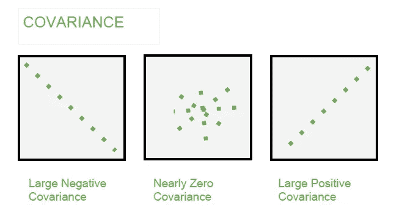
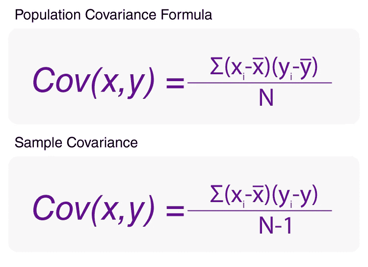
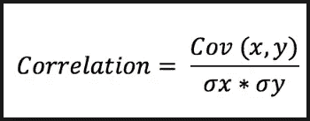

# 统计学，在开始机器学习之旅之前——协方差和相关性

> 原文：<https://medium.com/analytics-vidhya/statistics-before-starting-machine-learning-journey-covariance-correlation-7f3d385aaff2?source=collection_archive---------17----------------------->

在机器学习中，一个主要的活动是发现不同特征之间的关系。这可以是自变量与因变量之间的关系，也可以是不同自变量之间的关系。当我们谈论关系时，最常用的词是协方差和相关性。

协方差计算出 3 种类型的关系-积极的，消极的和没有关系。

正关系表明，如果 X 增加，Y 也会增加，负关系表明，如果 X 增加，Y 会减少。计算协方差的公式是:

协方差

但是我们不能使用协方差来找出点是靠近线还是远离线，因为这将只显示关系趋势。协方差也取决于数据的规模。在许多例子中，我们可以看到，即使关系没有因为数据的尺度变化而改变，协方差也会改变。

因此，相关性进入解决上述差距。相关性用于找出关系中的强度。如果数据接近直线，则关系足够强，如果数据远离直线，则关系弱。通过使用协方差来计算相关值。

由于协方差受数据规模的影响，在相关计算时，协方差除以 x 和 y 的方差，以消除数据规模的这种影响。

相关值的范围在 1 和-1 之间。如果相关值为 1，则数据具有很强的正相关关系，并且直线将穿过每个点的中心。很可能，与-1 的相关性表明数据有很强的负相关关系，并通过每个数据点传递。当该值接近零时，强度会降低。而如果该值接近于零，则数据之间没有关系。

根据相关值，如果给定 x 值，我们可以说 y 值，但是该预测的可信度取决于数据集的大小和 p 值。如果数据集很大，而 p 值很小，那么在与大值相关的情况下，我们可以肯定地说 y 预测是正确的。如果相关值较小，即使数据集大小和 p 值在阈值范围内，也无助于预测 y 值，因为关系之间的强度不好。

如果你在我的文章中发现任何错误，请批评我并帮助我提高我的相关知识。

参考:[https://www.youtube.com/watch?v=xZ_z8KWkhXE&feature = youtu . be](https://www.youtube.com/watch?v=xZ_z8KWkhXE&feature=youtu.be)