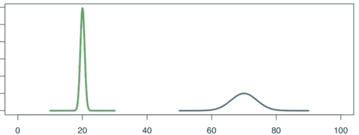
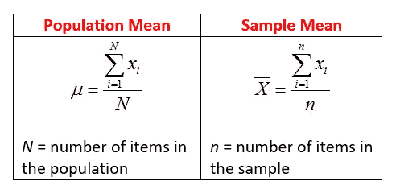
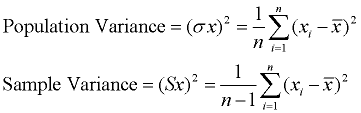
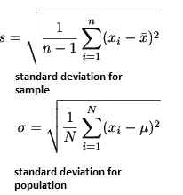

# 统计，在开始机器学习之旅之前-正态分布和参数

> 原文：<https://medium.com/analytics-vidhya/statistics-before-starting-machine-learning-journey-normal-distribution-aaf9b28132a1?source=collection_archive---------17----------------------->

正态分布是统计学中最基本也是最重要的课题。在定义之前，我们将了解一些关于正态分布的基础知识。我们可以说正态分布是均值和标准差的组合。

从上图中，我们可以看到两种不同的正态分布，都是钟形，清楚地解释了数据的分布。从第一幅图中，我们可以看出大多数数据都在 10-30 的范围内，但是第二幅图中的数据分布在 10-80 之间。

查看正态分布图时，需要考虑的要点是平均值和标准差。

从图表的中心点，我们可以找出这些值的平均值。图形的宽度表示标准偏差。由于第一幅图具有窄曲线，我们得到的结论是这些分布具有较低的标准偏差，而不像第二幅图具有宽曲线，代表大的标准偏差。

绘制正态曲线，使得 95%的测量值落在平均值的+/- 2 个标准偏差之内。是的，为了获得清晰的图片，我们可以回到图片。其中第一幅图像的平均值=20，SD=0.6，而第二幅图像的平均值=70，SD=4。对于前者，95%的测量值在 20 或+/- 1.2 英寸以下，而对于后者，95%的测量值在 70 或+/-8 英寸以下。

由于正态分布中的数据是统计学中的总体，我们可以说 Mean 是总体均值，SD 是总体标准差。这些是正态分布的总体参数，帮助我们找到概率和统计。在真实世界场景中，考虑用于机器学习实验的群体是一项艰巨的任务，这导致了从群体中选择样本。因此，理想情况下，将从总体中抽取一个样本，用于模型的训练。

所以对于样本数据，我们会估计均值、方差和标准差。这被称为估计/样本均值、方差和标准偏差。

平均计算

差异

南达科他州

除了正态分布，统计学还有欧几里德分布和高斯分布。欧几里得分布的人口参数是人口比率，而高斯分布的人口参数是人口比率和人口形状。

请在我的学习中提出您的意见和支持，以提高我的理解。

参考:[https://www.youtube.com/watch?v=rzFX5NWojp0&feature = youtu . be](https://www.youtube.com/watch?v=rzFX5NWojp0&feature=youtu.be)